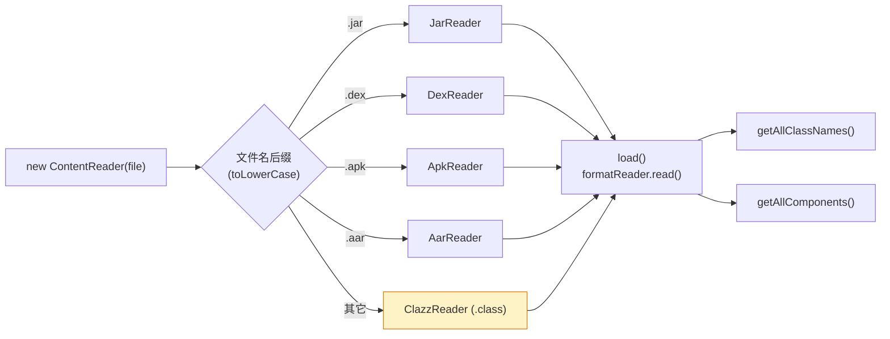

# 📦 ContentReader SPI · 自定义归档读取

<Badge type="tip" text="ContentReader 扩展点" /> <Badge type="info" text="silverghost SPI" />

> ClassyShark 把「二进制归档 → 类名与组件清单」的能力抽象成 `BinaryContentReader` 策略接口：一个函数 `(archive file) → {classnames, components}`。实现这个接口并按扩展名注册到 `ContentReader`，就能让 ClassyShark 识别任意新归档格式（如 `.aab`、`.apks`、自研二进制包）。

📁 接口源码：`ClassySharkWS/src/com/google/classyshark/silverghost/contentreader/BinaryContentReader.java`
📁 路由源码：`ClassySharkWS/src/com/google/classyshark/silverghost/contentreader/ContentReader.java`
📦 包：`com.google.classyshark.silverghost.contentreader`
🔗 接口参考：[BinaryContentReader](/reference/modules/BinaryContentReader) · 路由参考：[ContentReader](/reference/modules/ContentReader)

## 策略接口契约

`BinaryContentReader` 是**有状态的读取器**：构造时存 `File`，`read()` 执行解析、填两个字段，再由 `getClassNames()` / `getComponents()` 取结果。

| 方法 | 返回类型 | 调用时机 / 语义 |
|------|----------|----------------|
| `read()` | `void` | **执行解析**：扫描归档、填充类名与组件列表。重且只应调一次 |
| `getClassNames()` | `List<String>` | 返回归档内**全限定类名清单**（`.class` 路径转点号；dex 类去掉 `L;/` 包裹） |
| `getComponents()` | `List<ContentReader.Component>` | 返回归档内**非类组件**，如 `AndroidManifest.xml`、native `.so` |

```java
package com.google.classyshark.silverghost.contentreader;

import java.util.List;

public interface BinaryContentReader {

    void read();

    List<String> getClassNames();

    List<ContentReader.Component> getComponents();
}
```

> 💡 与 [Translator SPI](/api/translator-spi) 对偶：`Translator` 负责「单个条目 → 可读文本」，`BinaryContentReader` 负责「整个归档 → 条目清单」。前者翻译内容，后者负责发现有什么。

## Component 与 ARCHIVE_COMPONENT 🧩

`ContentReader` 是路由器，同时承载两类**非类组件**的描述结构。`Component` 是 `ContentReader` 的内部静态类，`ARCHIVE_COMPONENT` 是其内部枚举：

```java
public class ContentReader {

    /** jar & apk 中除类以外的组件类型 */
    public enum ARCHIVE_COMPONENT {
        ANDROID_MANIFEST, NATIVE_LIBRARY
    }

    public static class Component {
        public Component(String name, ARCHIVE_COMPONENT component) {
            this.name = name;
            this.component = component;
        }
        public String name;            // 条目名，如 "lib/armeabi-v7a/libfoo.so"
        public ARCHIVE_COMPONENT component;  // 语义类别
    }
}
```

| `ARCHIVE_COMPONENT` | 语义 | 收集者 | 用途 |
|---------------------|------|--------|------|
| `ANDROID_MANIFEST` | Android 清单文件 | `ApkReader`（经 `MultidexReader`）/`AarReader` | 文件树里以 `AndroidManifest.xml` 名义展示 |
| `NATIVE_LIBRARY` | native 共享库 `.so` | `JarReader`、`MultidexReader` | 文件树「Native Libs」分组 |

> 🔍 `FilesTree` 据此分组渲染：`comp.component.equals(NATIVE_LIBRARY)` 的条目归入「Native Libs」节点（[FilesTree](/reference/modules/FilesTree)）；`ANDROID_MANIFEST` 走 [SilverGhost](/reference/modules/SilverGhost) 的 `AndroidManifest.xml` 翻译链。

## ContentReader：按扩展名路由 🧭

[`ContentReader`](/reference/modules/ContentReader) 是静态分发器，构造时按文件名小写后缀选 `BinaryContentReader` 实现，**无匹配时回退到 `ClazzReader`**（裸 `.class`）：



路由表（源码 `ContentReader` 构造器）：

| 扩展名 | 路由到 | 解析手段 |
|--------|--------|----------|
| `.jar` | `JarReader` | `JarInputStream` 遍历 `.class` 条目，路径 `/` 转 `.` |
| `.dex` | `DexReader` | `dexlib2` 加载，`ClassDef.getType()` 去 `L;` 包裹 |
| `.apk` | `ApkReader` | 委托 `MultidexReader`：含 multidex、native `lib/`、内嵌 zip |
| `.aar` | `AarReader` | `ZipInputStream` 解出内嵌 `classes.jar`，复用 `JarReader` |
| 其它 | `ClazzReader` | ASM `ClassReader` + `ClassNameVisitor`，单类 |

`ContentReader` 暴露三方法，是 [SilverGhost](/reference/modules/SilverGhost) 门面的数据源：

| 方法 | 行为 |
|------|------|
| `load()` | 调 `formatReader.read()`，结果缓存到 `allClassNames`；`read()` 抛异常则清空 |
| `getAllClassNames()` | 返回 `unmodifiableList(allClassNames)` |
| `getAllComponents()` | 直接转发 `formatReader.getComponents()` |

## Shark API 入口

`SilverGhost` 把 `ContentReader` 包成门面，[Shark API](/api/index) 的 `with(File)` 链由此打通：

```java
// SilverGhost.java
contentReader = new ContentReader(getBinaryArchive());
reducer = new Reducer(contentReader.getAllClassNames());

public List<String> getAllClassNames()      { return contentReader.getAllClassNames(); }
public List<ContentReader.Component> getComponents() { return contentReader.getAllComponents(); }
```

`getAllClassNames()` 既驱动 GUI 文件树（经 `Reducer` 过滤），也用于 `isMultiDex`/`isCustomMultiDex` 判定（见 [SilverGhost Facade](/api/silverghost-facade)）。

## 内置实现一览

| 读取器 | 扩展名 | read() 行为 | getComponents() |
|--------|--------|------------|-----------------|
| [JarReader](/reference/modules/JarReader) | `.jar` | `JarInputStream` 收 `.class`，排序 | `lib/` 起头且 `.so` → `NATIVE_LIBRARY` |
| [DexReader](/reference/modules/DexReader) | `.dex` | `DexlibLoader` + `dexlib2`，排序 | 空 `ArrayList` |
| [ApkReader](/reference/modules/ApkReader) | `.apk` | `MultidexReader.readClassNamesFromMultidex` | 含 multidex、`lib/*.so` |
| [AarReader](/reference/modules/AarReader) | `.aar` | 解内嵌 `classes.jar` 复用 `JarReader` | 同 JarReader |
| [ClazzReader](/reference/modules/ClazzReader) | `.class` | ASM `ClassReader` 单类 | 空 `ArrayList` |

## 自定义 Reader 骨架 🧩

下面实现一个读取 Android App Bundle `.aab` 的示例：解包 `base.apk` 内的 dex、收 native lib 与 manifest，演示三个方法的典型写法。

```java
package com.example;

import com.google.classyshark.silverghost.contentreader.BinaryContentReader;
import com.google.classyshark.silverghost.contentreader.ContentReader;
import com.google.classyshark.silverghost.contentreader.dex.DexReader;

import java.io.*;
import java.util.ArrayList;
import java.util.List;
import java.util.zip.ZipEntry;
import java.util.zip.ZipInputStream;

/**
 * 读取 .aab（本质是 zip）：扫描 .dex 转交 DexReader，
 * lib/*.so 归入 NATIVE_LIBRARY，AndroidManifest.xml 归入 ANDROID_MANIFEST。
 */
public class AabReader implements BinaryContentReader {

    private final File binaryArchive;
    private final List<String> allClassNames = new ArrayList<>();
    private final List<ContentReader.Component> components = new ArrayList<>();

    public AabReader(File binaryArchive) {
        this.binaryArchive = binaryArchive;
    }

    @Override
    public void read() {
        try (ZipInputStream zin = new ZipInputStream(
                new BufferedInputStream(new FileInputStream(binaryArchive)))) {
            ZipEntry ze;
            while ((ze = zin.getNextEntry()) != null) {
                String name = ze.getName();

                // 1) dex 条目：解出临时文件转交 DexReader
                if (name.endsWith(".dex")) {
                    File tmp = dumpToTemp(zin, "aab-dex", ".dex");
                    allClassNames.addAll(DexReader.readClassNamesFromDex(tmp));
                }

                // 2) native 库
                if (name.startsWith("lib/") && name.endsWith(".so")) {
                    components.add(new ContentReader.Component(
                            name, ContentReader.ARCHIVE_COMPONENT.NATIVE_LIBRARY));
                }

                // 3) 清单
                if (name.equals("AndroidManifest.xml")) {
                    components.add(new ContentReader.Component(
                            name, ContentReader.ARCHIVE_COMPONENT.ANDROID_MANIFEST));
                    allClassNames.add("AndroidManifest.xml");
                }
            }
        } catch (Exception e) {
            e.printStackTrace();
        }
    }

    @Override
    public List<String> getClassNames() {
        return allClassNames;
    }

    @Override
    public List<ContentReader.Component> getComponents() {
        return components;
    }

    private static File dumpToTemp(ZipInputStream zin, String pfx, String sfx) throws IOException {
        File f = File.createTempFile(pfx, sfx);
        f.deleteOnExit();
        try (OutputStream out = new FileOutputStream(f)) {
            byte[] buf = new byte[8192];
            int n;
            while ((n = zin.read(buf)) != -1) out.write(buf, 0, n);
        }
        return f;
    }
}
```

### 接入：在 ContentReader 追加路由分支

`ContentReader` 构造器按后缀 `new`，仿照现有分支追加：

```java
// ContentReader.java —— 追加自定义扩展名
} else if (archiveName.endsWith(".aab")) {
    formatReader = new AabReader(binaryArchive);
}
```

注册后即可走通整条链：

```java
SilverGhost sg = new SilverGhost();
sg.with(new File("app.aab"));   // ← 触发 ContentReader → AabReader
sg.getManifest();               // AndroidManifest 经 getComponents 暴露
sg.getAllClassNames();           // 含 multidex 类名
```

> ⚠️ 当前 `ContentReader` 路由分支**硬编码在源码**，无运行时 SPI 注册表（对比 [TranslatorFactory](/reference/modules/TranslatorFactory) 的 `FullArchiveReader` 兜底）。新格式需改源码随发布分发；若需运行时插件，应通过 `SilverGhost.setBinaryArchive` 前预读，或扩展 `FullArchiveReader.readAsyncArchive`。

## 实现规范

- 🗂️ **构造仅存 `File`** — 不在构造器里打开流；解析推迟到 `read()`，与内置 Reader 一致。
- 🔁 **read 幂等友好** — `ContentReader.load()` 会判 `allClassNames.isEmpty()` 再调 `read()`，重入安全。
- 🧱 **类名规范化** — `.class` 条目路径 `/` 转 `.`（参考 `JarReader`）；dex 类名去 `L;` 包裹（参考 `DexReader`）。
- 📦 **组件勿漏** — `lib/*.so` 归 `NATIVE_LIBRARY`，manifest 归 `ANDROID_MANIFEST`，否则文件树分组缺项。
- 🛡️ **异常吞而非抛** — `read()` 内部 try/catch 打印栈，`ContentReader.load()` 也会兜底清空，避免拖垮 GUI。
- 🚫 **getComponents 勿返回 null** — 无组件时返回 `new ArrayList<>()`（参考 `DexReader`），不返回 `null`。

## 相关文档

- 接口参考：[BinaryContentReader](/reference/modules/BinaryContentReader) · [ContentReader](/reference/modules/ContentReader)
- 门面：[SilverGhost Facade · API 入口](/api/silverghost-facade) · [SilverGhost](/reference/modules/SilverGhost)
- 配套 SPI：[Translator SPI · 自定义翻译器](/api/translator-spi) · [TokensMapper SPI](/api/tokensmapper)
- 内置 Reader：[ApkReader](/reference/modules/ApkReader) · [DexReader](/reference/modules/DexReader) · [JarReader](/reference/modules/JarReader) · [AarReader](/reference/modules/AarReader) · [ClazzReader](/reference/modules/ClazzReader)
- 编程 API 总览：[API](/api/index)
