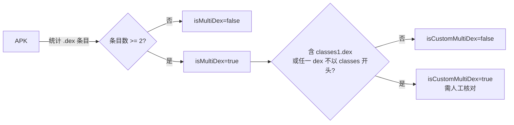

# 🧪 Shark API 示例集

<Badge type="tip" text="Shark API" />
<Badge type="info" text="可运行示例" />

> 本页给出 7 个基于 [`Shark`](/reference/modules/Shark) 的完整可运行 Java 示例，覆盖类名清单、反编译、Manifest、方法、MultiDex、字符串池与 Gradle 集成。所有代码都依赖 ClassyShark 作为库引入，参照仓库 `Samples/SampleGradle`。

## 前置准备 📦

`Shark` 的全部读取都委托给 [`SilverGhostFacade`](/reference/modules/SilverGhostFacade)，所以仅需把 ClassyShark 作为本地库依赖即可：

```groovy
// build.gradle —— 对应 Samples/SampleGradle/build.gradle
plugins { id 'application' }

repositories {
    flatDir { dirs 'libs' }
}

dependencies {
    // 把构建产物 ClassyShark.jar 放进 libs/
    implementation name: 'ClassyShark'
}

application {
    mainClass = 'Main'
}
```

> 💡 `Shark.with(File)` 只接收一个 `File`，无其它可变状态，构造器私有、线程安全只读，详见 [Shark 类详解](/api/shark-class)。

## 示例 1 — 列出所有类名 📋

```java
import com.google.classyshark.Shark;
import java.io.File;

public class ListClasses {
    public static void main(String[] args) {
        File apk = new File(args[0]);
        Shark shark = Shark.with(apk);

        // getAllClassNames() 返回含 .dex 条目的全量类名清单
        for (String name : shark.getAllClassNames()) {
            System.out.println(name);
        }
        System.out.println("Total classes = " + shark.getAllClassNames().size());
    }
}
```

运行：

```bash
./gradlew run --args="/path/to/app.apk"
```

> 📌 `getAllClassNames()` 内部走 `new ContentReader(file).load(); loader.getAllClassNames()`，含 `.dex` 条目，可用于遍历，见 [ContentReader](/reference/modules/ContentReader)。

## 示例 2 — 反编译指定类 🔍

```java
import com.google.classyshark.Shark;
import java.io.File;

public class DecompileClass {
    public static void main(String[] args) {
        // args[0] = apk, args[1] = 全限定类名，如 com.bumptech.glide.request.target.BaseTarget
        File apk = new File(args[0]);
        String className = args[1];
        Shark shark = Shark.with(apk);

        // 返回伪 Java 源码字符串
        String source = shark.getGeneratedClass(className);
        System.out.println(source);
    }
}
```

```bash
./gradlew run --args="/path/to/app.apk com.bumptech.glide.request.target.BaseTarget"
```

> ⚠️ 类不存在时 `SilverGhostFacade` 捕获 `NullPointerException`，打印 `Class doesn't exist in the writeArchive` 并返回空串 `""`，不会抛到调用方。内部经 [`TranslatorFactory`](/reference/modules/TranslatorFactory) 选派翻译器并 `translator.apply()`。

## 示例 3 — 取 AndroidManifest 📄

```java
import com.google.classyshark.Shark;
import java.io.File;

public class PrintManifest {
    public static void main(String[] args) {
        File apk = new File(args[0]);
        Shark shark = Shark.with(apk);

        // 仅当文件名以 .apk 结尾时翻译 AndroidManifest.xml，否则返回 ""
        String manifest = shark.getManifest();
        System.out.println(manifest);
    }
}
```

> 📌 `getManifest()` 调 [`AndroidXmlTranslator`](/reference/modules/AndroidXmlTranslator) 把二进制 XML 还原为文本。对 `.jar` / `.aar` / `.dex` 调用会返回空串。

## 示例 4 — 取所有方法签名 🧬

```java
import com.google.classyshark.Shark;
import java.io.File;
import java.util.List;

public class ListMethods {
    public static void main(String[] args) {
        File apk = new File(args[0]);
        Shark shark = Shark.with(apk);

        List<String> methods = shark.getAllMethods();
        for (String m : methods) {
            System.out.println(m);
        }
        System.out.println("Total methods = " + methods.size());
    }
}
```

> 📌 `getAllMethods()` 非 APK 返回空 `LinkedList`，否则委托 [`DexMethodsDumper.dumpMethods`](/reference/modules/DexMethodsDumper)。常用于核对方法数是否逼近 65k 上限。

## 示例 5 — 检测 MultiDex 🧩

```java
import com.google.classyshark.Shark;
import java.io.File;

public class CheckMultiDex {
    public static void main(String[] args) {
        File apk = new File(args[0]);
        Shark shark = Shark.with(apk);

        // isMultiDex(): 统计 .dex 结尾条目，>=2 即 true
        // isCustomMultiDex(): 多 DEX 前提下，含 classes1.dex 或任一 dex 不以 classes 开头即 true
        System.out.println("isMultiDex       = " + shark.isMultiDex());
        System.out.println("isCustomMultiDex = " + shark.isCustomMultiDex());

        if (shark.isCustomMultiDex()) {
            System.err.println("⚠️ 检测到自定义 DEX 加载，需人工核对 Application 逻辑");
            System.exit(1);
        }
    }
}
```



## 示例 6 — 取所有字符串池 🔤

```java
import com.google.classyshark.Shark;
import java.io.File;
import java.util.List;

public class ScanStrings {
    public static void main(String[] args) {
        File apk = new File(args[0]);
        Shark shark = Shark.with(apk);

        // getAllStrings(): 非 APK 返回空 LinkedList，否则 DexStringsDumper.dumpStrings
        List<String> strings = shark.getAllStrings();
        System.out.println("Total strings = " + strings.size());

        // 硬编码密钥扫描：匹配常见密钥前缀
        for (String s : strings) {
            if (s.startsWith("AKIA") && s.length() >= 16) {
                System.err.println("疑似 AWS Access Key: " + s);
            }
            if (s.matches("(?i).*bearer [A-Za-z0-9._-]{20,}.*")) {
                System.err.println("疑似 Bearer Token: " + s);
            }
        }
    }
}
```

> ⚠️ 字符串池数据量通常很大，全量打印会刷屏；建议先 `size()` 再按关键字过滤。`getAllStrings()` 内部走 [`DexStringsDumper`](/reference/modules/DexStringsDumper)。

## 示例 7 — 集成到 Gradle 任务 🏗️

下面是一个完整的 Gradle 插件式任务：APK 产物一就绪就自动跑 ClassyShark 分析并输出报告。基于 `Samples/SampleGradle` 扩展。

`build.gradle`：

```groovy
plugins {
    id 'java'
    id 'application'
}

repositories {
    flatDir { dirs 'libs' }
}

dependencies {
    implementation name: 'ClassyShark'
}

application {
    mainClass = 'com.example.ApkAudit'
}

// 分析任务：产物 APK 一就绪就跑
task auditApk(type: JavaExec) {
    group = 'verification'
    description = 'Runs ClassyShark Shark API audit on the release APK'
    classpath = sourceSets.main.runtimeClasspath
    mainClass = 'com.example.ApkAudit'
    def apkPath = layout.buildDirectory.file(
        'outputs/apk/release/app-release.apk').get().asFile.path
    args = [apkPath]
}
// 让构建结束后自动审计
build.finalizedBy auditApk
```

`src/main/java/com/example/ApkAudit.java`：

```java
package com.example;

import com.google.classyshark.Shark;
import java.io.File;
import java.util.List;

public class ApkAudit {
    public static void main(String[] args) {
        File apk = new File(args[0]);
        Shark shark = Shark.with(apk);

        StringBuilder report = new StringBuilder();
        report.append("=== ClassyShark APK 审计报告 ===\n");
        report.append("File: ").append(apk.getName()).append('\n');

        List<String> classes = shark.getAllClassNames();
        List<String> methods = shark.getAllMethods();
        report.append("Classes: ").append(classes.size()).append('\n');
        report.append("Methods: ").append(methods.size()).append('\n');
        report.append("isMultiDex:      ").append(shark.isMultiDex()).append('\n');
        report.append("isCustomMultiDex: ").append(shark.isCustomMultiDex()).append('\n');

        // 黑名单类扫描
        String[] blacklist = { "dalvik.system.DexClassLoader",
                               "android.webkit.WebView" };
        for (String b : blacklist) {
            if (classes.contains(b)) {
                report.append("⚠️ Blacklisted class present: ").append(b).append('\n');
            }
        }

        // 方法数阈值告警
        if (methods.size() > 60000) {
            report.append("⚠️ 方法数逼近 65k 上限: ").append(methods.size()).append('\n');
        }

        System.out.println(report);

        // 写入报告文件，供 CI 归档
        try {
            java.nio.file.Files.writeString(
                java.nio.file.Path.of("classyshark-audit-report.txt"),
                report.toString());
        } catch (Exception e) {
            e.printStackTrace();
        }
    }
}
```

```bash
# 触发：构建 + 自动审计
./gradlew build
# 或单独跑审计
./gradlew auditApk
```

## CI 场景速查 📊

| 场景 | 用到的 API | 对应示例 |
|------|-----------|----------|
| 确认未引入禁用类 | `getAllClassNames()` 过滤黑名单 | 示例 1、7 |
| 核对方法数是否逼近 65k | `getAllMethods().size()` | 示例 4、7 |
| 校验 MultiDex 配置 | `isMultiDex()` / `isCustomMultiDex()` | 示例 5 |
| 自动审计 Manifest 权限 | `getManifest()` 解析 XML | 示例 3 |
| 关键类源码快照归档 | `getGeneratedClass(className)` | 示例 2 |
| 硬编码密钥扫描 | `getAllStrings()` 关键字匹配 | 示例 6 |

## API 与 CLI 对照 🔗

`Shark` 的读取能力与 CLI 的 `-export` / `-inspect` / `-methodcounts` 同源，都走 [`SilverGhostFacade`](/reference/modules/SilverGhostFacade)。差别只在入口：

| 需求 | CLI 一行命令 | Shark API 等价 |
|------|------------|----------------|
| 全量类名 | `-export app.apk` | `getAllClassNames()` |
| 单类反编译 | `-export app.apk com.x.Y` | `getGeneratedClass("com.x.Y")` |
| 方法数仪表盘 | `-inspect app.apk` | `getAllMethods().size()` |
| 按包方法计数 | `-methodcounts app.apk` | `getAllMethods()` 自行聚合 |
| 多 DEX 检测 | `-inspect` 输出含 DEX 列表 | `isMultiDex()` / `isCustomMultiDex()` |

> 💡 当你需要**嵌入到 Gradle/Jenkins 脚本**里以编程方式取数据时用 `Shark`；需要**一行命令快速看结果**时用 CLI，见 [CLI 参考](/cli/index)。

## 进一步阅读 📚

- 🦈 [Shark 类详解](/api/shark-class) — API 设计与方法签名全表
- 🏗️ [SilverGhostFacade 模块](/reference/modules/SilverGhostFacade) — 委托实现细节
- 🧰 [TranslatorFactory](/reference/modules/TranslatorFactory) — 翻译器分发机制
- 📦 [ContentReader](/reference/modules/ContentReader) — 归档解析入口
- 🛠️ [CLI 参考](/cli/index) — 命令行等价能力
