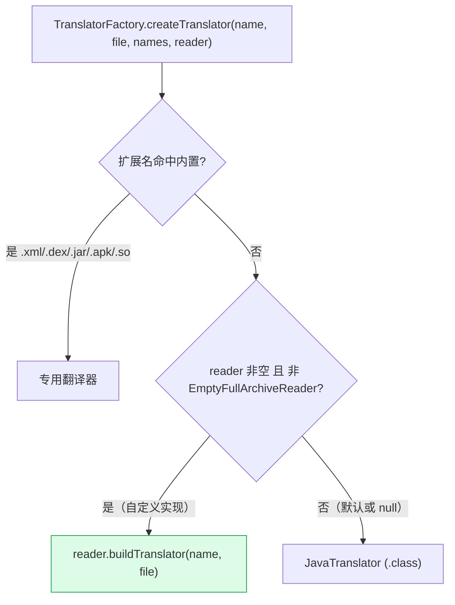
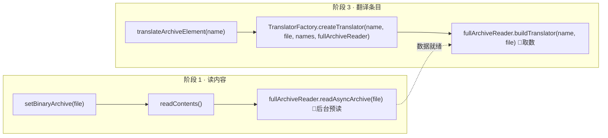

# 🧩 FullArchiveReader SPI · 自定义归档读取扩展点

<Badge type="tip" text="silverghost 扩展点" />
<Badge type="info" text="SPI · Null Object" />

> ClassyShark 内置翻译器按扩展名（`.xml`/`.dex`/`.jar`/`.apk`/`.so`/`.class`）路由。当条目扩展名**无法匹配**任何内置翻译器时，[`TranslatorFactory`](/reference/modules/TranslatorFactory) 会回退调用 `FullArchiveReader.buildTranslator(...)`——这就是你接入**自定义归档格式**的扩展点。

📁 接口源码：`ClassySharkWS/src/com/google/classyshark/silverghost/FullArchiveReader.java`
📦 默认实现：[`EmptyFullArchiveReader`](/reference/modules/EmptyFullArchiveReader) · 回退调度：[`TranslatorFactory`](/reference/modules/TranslatorFactory) · 持有插槽：[`SilverGhost`](/reference/modules/SilverGhost)

## 接口契约 📜

接口只声明两个方法，职责极简：

| 方法 | 返回类型 | 语义 |
|------|----------|------|
| `readAsyncArchive(File file)` | `void` | 异步预读整个归档，为后续 `buildTranslator` 做数据准备 |
| `buildTranslator(String className, File archiveFile)` | [`Translator`](/reference/modules/Translator) | 按条目名从全量归档构建一个翻译器实例 |

```java
package com.google.classyshark.silverghost;

import com.google.classyshark.silverghost.translator.Translator;
import java.io.File;

public interface FullArchiveReader {
    void readAsyncArchive(File file);
    Translator buildTranslator(String className, File archiveFile);
}
```

> 🔍 **两阶段语义**：`readAsyncArchive` 在「读内容」阶段触发，`buildTranslator` 在「翻译单条目」阶段触发——前者预热、后者取数，分离让自定义实现有机会把耗时解析提前到后台。

## 回退调度：TranslatorFactory

[`TranslatorFactory.createTranslator`](/reference/modules/TranslatorFactory) 的回退条件是**双重判断**——`fullArchiveReader` 非空 **且** 不是 `EmptyFullArchiveReader`：

```java
if (fullArchiveReader != null &&
        !(fullArchiveReader instanceof EmptyFullArchiveReader)) {
    return fullArchiveReader.buildTranslator(className, archiveFile);
}
return new JavaTranslator(className, archiveFile); // 最终兜底
```

| 条件 | 走向 |
|------|------|
| 扩展名命中 `.xml/.dex/.jar/.apk/.so` | 专用翻译器，**不**触发回退 |
| 未命中 + `fullArchiveReader == null` | `JavaTranslator`（按 `.class` 处理） |
| 未命中 + 是 `EmptyFullArchiveReader`（默认） | `JavaTranslator`，回退路径**空操作** |
| 未命中 + 是**真实自定义实现** | `fullArchiveReader.buildTranslator(name, file)` ✅ |



> ⚠️ **必须替换 `EmptyFullArchiveReader` 才会生效**：`instanceof` 检查把默认空实现显式排除，因此仅 `null` 判断不够——你必须注入一个**非** `EmptyFullArchiveReader` 的实例。

## 默认实现 EmptyFullArchiveReader（Null Object）

[`SilverGhost`](/reference/modules/SilverGhost) 静态块默认注入空实现，使默认场景下回退路径安全无副作用：

```java
// SilverGhost.java
private static FullArchiveReader fullArchiveReader;

static {
    tokensMapper = new IdentityMapper();
    fullArchiveReader = new EmptyFullArchiveReader(); // 默认空操作
}
```

[`EmptyFullArchiveReader`](/reference/modules/EmptyFullArchiveReader) 是 Null Object：`readAsyncArchive` 空操作，`buildTranslator` 返回一个所有方法都空操作的匿名 `Translator`（类名恒为 `"Empty"`，元素/依赖列表返回空 `LinkedList`）。它存在的意义是**避免 NPE**——没有它，`SilverGhost.readContents` 里的 `fullArchiveReader.readAsyncArchive(...)` 在未配置时会崩溃。

| 行为 | EmptyFullArchiveReader | 自定义 FullArchiveReader |
|------|------------------------|--------------------------|
| `readAsyncArchive(file)` | 空操作 | 后台预读归档、缓存解析结果 |
| `buildTranslator(name, file)` | 返回空 Translator | 返回能产出真实元素的 Translator |
| 是否触发回退 | ❌ 被 `instanceof` 排除 | ✅ 被 `TranslatorFactory` 调用 |
| 呈现效果 | 走 `JavaTranslator` 兜底 | 按自定义格式翻译条目 |

## 调用时机：SilverGhost 的两个阶段

[`SilverGhost`](/reference/modules/SilverGhost) 是 `fullArchiveReader` 插槽的持有者，在两个阶段调用它：



关键代码：

```java
// 阶段 1：readContents() 末尾触发预读
fullArchiveReader.readAsyncArchive(binaryArchive);

// 阶段 3：translateArchiveElement() 把 reader 透传给工厂
translator = TranslatorFactory.createTranslator(
        elementName, getBinaryArchive(),
        reducer.getAllClassNames(), fullArchiveReader);
```

> 🎯 **设计巧思**：`readAsyncArchive` 名字暗示**后台预热**——阶段 1 末尾触发，到阶段 3 翻译时数据可能已就绪。自定义实现可借此把重解析挪出 UI 关键路径。

## 自定义实现示例 🧪

假设你要支持一种自定义归档格式 `.pkg`（内部含若干伪类条目）。实现一个 `FullArchiveReader`，在 `readAsyncArchive` 解析整个归档缓存类表，在 `buildTranslator` 按条目名返回翻译器：

```java
package com.example;

import com.google.classyshark.silverghost.FullArchiveReader;
import com.google.classyshark.silverghost.TokensMapper;
import com.google.classyshark.silverghost.translator.Translator;
import java.io.*;
import java.util.*;

public class PkgArchiveReader implements FullArchiveReader {

    // 预读阶段缓存：条目名 → 字节码内容
    private final Map<String, byte[]> classBytes = new HashMap<>();

    @Override
    public void readAsyncArchive(File file) {
        // 解析 .pkg 归档，把所有条目读入内存缓存
        try (InputStream in = new FileInputStream(file)) {
            // 伪代码：按自定义格式解析条目
            PkgParser parser = new PkgParser(in);
            PkgParser.Entry e;
            while ((e = parser.nextEntry()) != null) {
                classBytes.put(e.getName(), e.getBytes());
            }
        } catch (IOException ex) {
            throw new RuntimeException("read pkg failed", ex);
        }
    }

    @Override
    public Translator buildTranslator(String className, File archiveFile) {
        byte[] bytes = classBytes.get(className);
        if (bytes == null) {
            // 未命中：返回空翻译器，避免下游 NPE
            return new EmptyFullArchiveReader().buildTranslator(className, archiveFile);
        }
        return new PkgTranslator(className, bytes); // 自定义 Translator
    }
}
```

接入流程——把 `SilverGhost` 的默认空实现替换为真实实现：

```java
SilverGhost sg = new SilverGhost();
sg.setBinaryArchive(new File("app.pkg"));

// 注入自定义归档读取器（替换默认 EmptyFullArchiveReader）
// 注意：SilverGhost 暴露的 fullArchiveReader 是 static 私有字段，
//       需通过反射注入，或自行扩展 SilverGhost 暴露 setter
setFullArchiveReader(sg, new PkgArchiveReader());

sg.readContents();            // 触发 readAsyncArchive 预读 .pkg
sg.translateArchiveElement("com.example.Foo"); // 触发 buildTranslator
```

> 💡 **接入约束**：`SilverGhost.fullArchiveReader` 是 `private static` 字段，无公开 setter。要在标准发行版接入自定义实现，需通过反射写入，或 fork 后添加 `setFullArchiveReader(FullArchiveReader)` 方法。注入后务必在 `readContents()` **之前**完成，否则预读阶段仍走默认空实现。

## 设计要点 🏗️

- 🧩 **纯 SPI 接口** — 仅两个方法，无字段无默认逻辑，把「如何全量读取归档」完全留给实现方。
- 🔌 **回退兜底语义** — 仅在扩展名无法匹配内置翻译器时被 [`TranslatorFactory`](/reference/modules/TranslatorFactory) 调用，`buildTranslator` 即兜底翻译入口。
- 🧱 **默认 Null Object 解耦** — [`EmptyFullArchiveReader`](/reference/modules/EmptyFullArchiveReader) 使核心流程不依赖任何具体全量读取实现，第三方按需替换。
- 🎨 **两阶段异步预读** — `readAsyncArchive` 在阶段 1 末尾触发，给实现方后台预热的机会，使阶段 3 翻译时数据可能已就绪。
- 🛡️ **双重排除默认实现** — `instanceof EmptyFullArchiveReader` 检查确保默认空实现不会意外拦截回退路径，强制第三方提供真实实现才生效。

## 相关文档 🔗

- 接口参考：[FullArchiveReader](/reference/modules/FullArchiveReader)
- 默认空实现：[EmptyFullArchiveReader](/reference/modules/EmptyFullArchiveReader)
- 回退调度：[TranslatorFactory](/reference/modules/TranslatorFactory)
- 插槽持有者：[SilverGhost](/reference/modules/SilverGhost)
- 配套 SPI（符号重映射）：[TokensMapper SPI](/api/tokensmapper)
