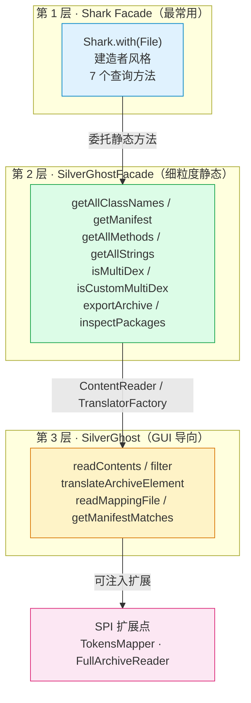

# 📚 编程 API 总览

<Badge type="tip" text="API" /> <Badge type="info" text="库嵌入 / CI 集成" />

> ClassyShark 不只是 GUI 与 CLI，更可作为**库**嵌入构建与 CI 工具链，在编译期、打包期、流水线里对产物做自动化检查。

::: tip Agent API
如果你需要让 AI Agent 调用 ClassyShark，请查看 [Agent API：无头分析与 GUI 自动化](/api/agent)。它提供两类明确隔离的接口：无需启动 GUI 的无头 API，以及可与人类共存的 GUI 控制 API。
:::

## 为什么用 API？

GUI 适合人工排查，CLI 适合一次性脚本。当你要把「分析 APK」做成**可重复、可断言、可联动**的一环时，编程 API 才是正解：

| 场景 | CLI 能做 | API 能做 | 优势 |
|------|---------|---------|------|
| 阻断违规三方库入库 | ❌ | ✅ 解析类名白名单 | 构建期 fail-fast |
| 65k 方法数红线卡控 | 部分 | ✅ `getAllMethods().size()` | 直接断言 |
| 自动比对两次构建产物差异 | ❌ | ✅ 类名集合 diff | CI 报告 |
| 自定义 multidex 检测 | ❌ | ✅ `isCustomMultiDex()` | 脚本化 |

## 三层 API

ClassyShark 的对外能力按**粒度从粗到细**分三层，越下层越贴近内部引擎、自由度越高：



### 1️⃣ Shark —— 建造者门面（最常用）

[Shark](/reference/modules/Shark) 是首选入口。类注释明说它是「The ClassyShark API usually used by build & continues integration toolchains」。`with(File)` 把归档文件绑定到实例，之后所有查询都不必再传文件参数——状态被收敛进 Shark 实例，CI 脚本可链式调用。

| 方法 | 返回 | 说明 |
|------|------|------|
| `with(File)` | `Shark` | 建造者入口，绑定归档 |
| `getGeneratedClass(String)` | `String` | 反编译单个类为源码存根 |
| `getAllClassNames()` | `List<String>` | 归档内全部类名 |
| `getManifest()` | `String` | 二进制 `AndroidManifest.xml` 还原文本 |
| `getAllMethods()` | `List<String>` | 所有 DEX 方法签名 |
| `getAllStrings()` | `List<String>` | 所有字符串常量池字符串 |
| `isMultiDex()` | `boolean` | 是否多 dex |
| `isCustomMultiDex()` | `boolean` | 是否自定义 multidex 加载 |

```java
import com.google.classyshark.Shark;
import java.io.File;

File apk = new File("app-release.apk");
Shark shark = Shark.with(apk);

// 1. 方法数红线
int methodCount = shark.getAllMethods().size();
if (methodCount > 60_000) {
    throw new GradleException("方法数 " + methodCount + " 逼近 65k 上限！");
}

// 2. 阻断违规三方库
if (shark.getAllClassNames().stream().anyMatch(n -> n.startsWith("com.bad.analytics"))) {
    throw new GradleException("检测到违规 SDK 入包");
}

// 3. 自定义 multidex 告警
if (shark.isCustomMultiDex()) {
    System.err.println("⚠️ 自定义 multidex，需检查启动初始化");
}
```

### 2️⃣ SilverGhostFacade —— 细粒度静态方法

[SilverGhostFacade](/reference/modules/SilverGhostFacade) 是无状态的全静态方法集合，类注释自称「Basic API class with small independent scenarios」。Shark 的每个查询方法都委托给它。当你**不想要 Shark 实例的状态**、或要用 Shark 没暴露的能力（如 `exportArchive`、`inspectPackages`）时，直接用 Facade。

```java
import com.google.classyshark.silverghost.SilverGhostFacade;
import java.io.File;

File apk = new File("app-release.apk");

// Shark 没有的能力：把整个归档导出为源码存根
SilverGhostFacade.exportArchive(List.of("-export", apk.getAbsolutePath()));

// 反编译单个类，拿到字符串（不写文件）
String src = SilverGhostFacade.getGeneratedClassString(
    "com.bumptech.glide.request.target.BaseTarget", apk);
```

> Facade 也承载 CLI 的具体实现：`-inspect` → `inspectApk`、`-methodcounts` → `inspectPackages`，详见 [CLI 参考](/cli/index)。

### 3️⃣ SilverGhost —— GUI 导向引擎

[SilverGhost](/reference/modules/SilverGhost) 是带状态的「引擎」，类注释提醒「never call readXXX method from UI thread」。它面向 GUI：先 `readContents()` 加载（含异步预读全归档），再用 `Reducer` 做类名过滤、用 `Translator` 翻译单个元素、支持 mapping 文件与 manifest 搜索。

GUI 的每个交互（输入过滤、选中类、搜 manifest）背后都是 SilverGhost 的一次方法调用。普通脚本场景用前两层即可；只有当你需要**复刻 GUI 的过滤/搜索行为**时才下沉到这一层。

```java
SilverGhost ghost = new SilverGhost();
ghost.setBinaryArchive(apk);          // 绑定归档，重置 TokensMapper
ghost.readContents();                  // 加载，勿在 UI 线程调用
ghost.filter("Glide");                // Reducer 模糊匹配类名
ghost.translateArchiveElement(cls);   // 翻译元素，注入 tokensMapper
List<Translator.ELEMENT> tokens = ghost.getArchiveElementTokens();
```

## 两个 SPI 扩展点

SilverGhost 持有两个**可替换**的静态字段，在 `static` 块里给默认实现：

```java
private static TokensMapper tokensMapper = new IdentityMapper();
private static FullArchiveReader fullArchiveReader = new EmptyFullArchiveReader();
```

| SPI | 默认实现 | 作用 | 链接 |
|-----|---------|------|------|
| [TokensMapper](/reference/modules/TokensMapper) | `IdentityMapper` | 符号重映射：读 mapping 文件、提供 `getReverseClasses()` 反查表，把混淆名还原 | 模块文档 |
| [FullArchiveReader](/reference/modules/FullArchiveReader) | `EmptyFullArchiveReader` | 自定义归档异步预读：`readAsyncArchive` 后台加载、`buildTranslator` 构造翻译器 | 模块文档 |

- **TokensMapper** —— 默认的 `IdentityMapper` 是空映射（`getReverseClasses()` 返回空 `TreeMap`），即不做任何混淆还原。要支持 ProGuard/R8 mapping？实现该接口，在 `readMappings(File)` 里解析 `mapping.txt`，再把实例交给 `SilverGhost.addMappings(...)`。
- **FullArchiveReader** —— 默认 `EmptyFullArchiveReader` 是空操作：`readAsyncArchive` 啥也不干，`buildTranslator` 返回一个返回空列表的桩 `Translator`。要支持自定义归档格式或做后台预读？实现该接口。

> 两者都遵循「默认无副作用、可被替换」的 SPI 风格，让 ClassyShark 在不动核心翻译流水线的前提下，可被定制符号还原策略与归档读取策略。

## 选型速查

| 你要做的事 | 用谁 |
|-----------|------|
| CI 里查方法数 / 类名 / multidex | [Shark](/reference/modules/Shark) |
| 反编译单个类拿字符串 | Shark 或 [SilverGhostFacade](/reference/modules/SilverGhostFacade) |
| 导出整个归档为存根 | [SilverGhostFacade](/reference/modules/SilverGhostFacade) `exportArchive` |
| 复刻 GUI 的类名过滤 / manifest 搜索 | [SilverGhost](/reference/modules/SilverGhost) |
| 接 ProGuard/R8 mapping 还原混淆 | 实现 [TokensMapper](/reference/modules/TokensMapper) |
| 自定义归档格式后台预读 | 实现 [FullArchiveReader](/reference/modules/FullArchiveReader) |

## 进一步阅读

- 🦈 [什么是 ClassyShark](/guide/what-is-classyshark) — 三种入口定位
- 🏗️ [架构总览](/guide/architecture-overview) — 分层翻译架构
- 🛠️ [CLI 参考](/cli/index) — `-inspect` / `-methodcounts` 等价入口
- 🧩 [TranslatorFactory](/reference/modules/TranslatorFactory) — 翻译器分发，API 的底层引擎
