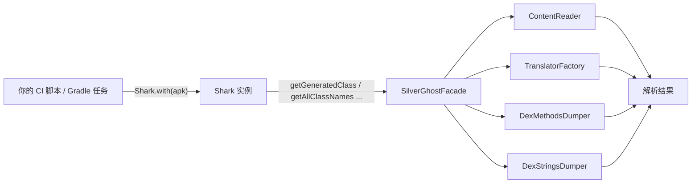

# 🦈 Shark 类详解

<Badge type="tip" text="Shark API" />
<Badge type="info" text="构建 / CI 工具链" />

> `Shark` 是 ClassyShark 面向**构建与持续集成（CI）工具链**的对外 API。它以建造者风格绑定一个归档文件（APK / JAR / AAR / DEX），再把所有读取请求委托给 [`SilverGhostFacade`](/reference/modules/SilverGhostFacade)。

源码位置：`ClassySharkWS/src/com/google/classyshark/Shark.java`，模块参考见 [Shark](/reference/modules/Shark)。

## 设计要点 🏗️



| 特性 | 说明 |
|------|------|
| 入口 | `Shark.with(File archiveFile)` 静态工厂，返回 `Shark` 实例 |
| 状态 | 仅持有一个 `File archiveFile` 字段，无其它可变状态 |
| 委托 | 所有方法都转发到 [`SilverGhostFacade`](/reference/modules/SilverGhostFacade) 的静态方法 |
| 不可变 | 构造器私有，只能通过 `with(...)` 创建，线程安全只读 |
| 包 | `com.google.classyshark` |

## API 速查 📚

| 方法 | 返回值 | 委托目标 | 用途 |
|------|--------|----------|------|
| `with(File)` | `Shark` | — | 建造者入口，绑定归档文件 |
| `getGeneratedClass(String className)` | `String` | `SilverGhostFacade.getGeneratedClassString` | 反编译单个类的伪源码 |
| `getAllClassNames()` | `List<String>` | `SilverGhostFacade.getAllClassNames` | 全量类名清单 |
| `getManifest()` | `String` | `SilverGhostFacade.getManifest` | AndroidManifest 文本（仅 APK） |
| `getAllMethods()` | `List<String>` | `SilverGhostFacade.getAllMethods` | 所有 DEX 方法签名 |
| `getAllStrings()` | `List<String>` | `SilverGhostFacade.getAllStrings` | 所有字符串池内容 |
| `isMultiDex()` | `boolean` | `SilverGhostFacade.isMultiDex` | 是否多 DEX |
| `isCustomMultiDex()` | `boolean` | `SilverGhostFacade.isCustomMultiDex` | 是否自定义 DEX 加载 |

## 方法详解 🔍

### with(File archiveFile)

静态工厂，私有构造器的唯一入口。

```java
public static Shark with(File archiveFile) {
    return new Shark(archiveFile);
}
```

> 💡 调用后即可链式或顺序访问所有读取方法，无需关心 `ContentReader`、`Translator` 的初始化。

### getGeneratedClass(String className)

反编译单个类并返回伪 Java 源码字符串。委托 `SilverGhostFacade.getGeneratedClassString(className, archiveFile)`，内部经 [`TranslatorFactory`](/reference/modules/TranslatorFactory) 选派翻译器并 `translator.apply()`。

```java
/**
 * @param className class name to generate such as
 *                  "com.bumptech.glide.request.target.BaseTarget"
 */
public String getGeneratedClass(String className) {
    return getGeneratedClassString(className, archiveFile);
}
```

> ⚠️ 类不存在时，`Facade` 捕获 `NullPointerException` 并打印 `Class doesn't exist in the writeArchive`，返回空串 `""`。

### getAllClassNames() / getManifest() / getAllMethods() / getAllStrings()

| 方法 | 实现 | 备注 |
|------|------|------|
| `getAllClassNames()` | `new ContentReader(file).load(); loader.getAllClassNames()` | 含 `.dex` 条目，可用于遍历 |
| `getManifest()` | 仅当文件名以 `.apk` 结尾时翻译 `AndroidManifest.xml`，否则返回 `""` | 非 APK 永远空串 |
| `getAllMethods()` | 非 APK 返回空 `LinkedList`，否则 `DexMethodsDumper.dumpMethods` | 见 [DexMethodsDumper](/reference/modules/DexMethodsDumper) |
| `getAllStrings()` | 非 APK 返回空 `LinkedList`，否则 `DexStringsDumper.dumpStrings` | 见 [DexStringsDumper](/reference/modules/DexStringsDumper) |

### isMultiDex() / isCustomMultiDex()

`isMultiDex()` 统计以 `.dex` 结尾的条目，达到 2 个即返回 `true`。`isCustomMultiDex()` 在多 DEX 前提下进一步判断：

- 条目中包含 `classes1.dex` → `true`
- 任一 dex 条目不以 `classes` 开头 → `true`（自定义加载）

## 完整示例 🧪

参照 `Samples/SampleGradle/src/main/java/Main.java`，下面是一个可运行的 CI 检查任务：

```java
import com.google.classyshark.Shark;
import java.io.File;

public class Main {
    public static void main(String[] args) {
        // 1. 绑定归档（示例路径请替换为产物路径）
        File apk = new File(args[0]);
        Shark shark = Shark.with(apk);

        // 2. 反编译指定类
        System.out.println(
                shark.getGeneratedClass("com.bumptech.glide.request.target.BaseTarget"));

        // 3. 全量类名
        System.out.println(shark.getAllClassNames());

        // 4. AndroidManifest
        System.out.println(shark.getManifest());

        // 5. 所有方法签名
        System.out.println(shark.getAllMethods());

        // 6. 统计汇总
        System.out.println("\n\nAll Classes " + shark.getAllClassNames().size() +
                "\nAll Methods " + shark.getAllMethods().size());

        // 7. 多 DEX 检测
        System.out.println("isMultiDex        = " + shark.isMultiDex());
        System.out.println("isCustomMultiDex  = " + shark.isCustomMultiDex());

        // 8. 字符串池（数据量大，按需开启）
        // System.out.println(shark.getAllStrings());
    }
}
```

Gradle 集成示意：

```groovy
plugins { id 'application' }

application {
    mainClass = 'Main'
}

dependencies {
    // 把 ClassyShark 作为库依赖引入
    implementation files('libs/ClassyShark.jar')
}

// CI 钩子：产物 APK 一就绪就跑分析
task analyzeApk(type: JavaExec) {
    classpath = sourceSets.main.runtimeClasspath
    mainClass = 'Main'
    args = [layout.buildDirectory.file("outputs/apk/release/app-release.apk").get().asFile.path]
}
build.finalizedBy analyzeApk
```

## CI 场景建议 ✅

| 场景 | 用到的 API |
|------|-----------|
| 确认没有引入禁用类 | `getAllClassNames()` 过滤黑名单 |
| 核对方法数是否逼近 65k 上限 | `getAllMethods().size()` |
| 校验 MultiDex 配置 | `isMultiDex()` / `isCustomMultiDex()` |
| 自动审计 Manifest 权限 | `getManifest()` 解析 XML |
| 关键类源码快照归档 | `getGeneratedClass(className)` |
| 硬编码密钥扫描 | `getAllStrings()` 关键字匹配 |

## 与 CLI 的关系 🔗

CLI 的 `-inspect`、`-methodcounts`、`-export` 等命令同样走 [`SilverGhostFacade`](/reference/modules/SilverGhostFacade)，差别只在 CLI 用 `CliMode` 分发参数、Shark 用建造者绑定 `File`。当你需要**嵌入到 Gradle/Jenkins 脚本**里以编程方式取数据时，用 `Shark`；需要**一行命令快速看结果**时，用 CLI（见 [CLI 参考](/cli/index)）。

> 📌 进阶模块参考：[Shark](/reference/modules/Shark)、[SilverGhostFacade](/reference/modules/SilverGhostFacade)、[TranslatorFactory](/reference/modules/TranslatorFactory)、[ContentReader](/reference/modules/ContentReader)。
