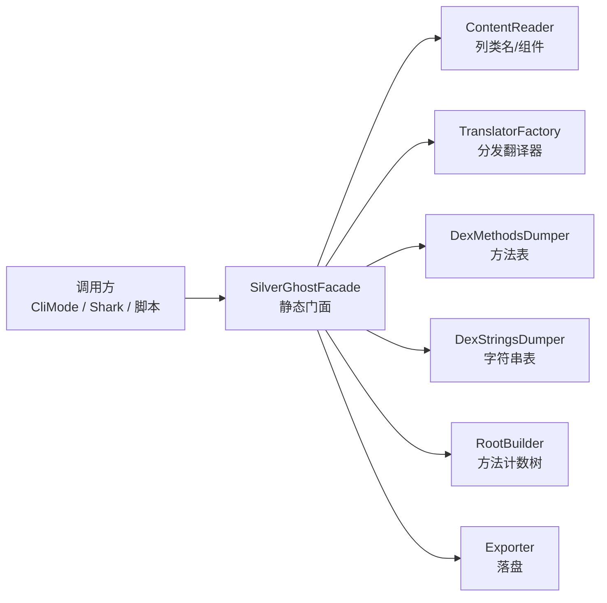

# 🧩 SilverGhostFacade 详解

<Badge type="tip" text="silverghost 核心" /> <Badge type="info" text="静态工具门面" />

> 面向**小而独立场景**的基础 API 类，以一组无状态静态方法暴露 ClassyShark 的常用分析能力——调用方无需自行组装 `ContentReader`、`TranslatorFactory` 等组件。

📁 源码：`ClassySharkWS/src/com/google/classyshark/silverghost/SilverGhostFacade.java` &nbsp; 📦 包：`com.google.classyshark.silverghost`

## 设计定位

`SilverGhostFacade` 类注释自称「Basic API class with small independent scenarios」。它把对归档的常用操作（列类名、导出类、看 Manifest、列方法/字符串、统计包、判 multidex 等）封装成纯静态方法，私有构造函数禁止实例化。CLI 入口 [`CliMode`](/reference/modules/CliMode) 与编程 API [`Shark`](/reference/modules/Shark) 都直接复用这些方法。



完整模块说明见 [SilverGhostFacade 模块文档](/reference/modules/SilverGhostFacade)。

## 方法速查

| 方法 | 返回 | 依赖组件 | 入口守卫 | 适用场景 |
|------|------|----------|----------|----------|
| `getAllClassNames(File)` | `List<String>` | ContentReader | 无 | 任意归档列类名 |
| `exportClassFromApk(List<String>)` | void | TranslatorFactory + Exporter | 取 `args[1..2]` | 导出单个类到磁盘 |
| `getGeneratedClassString(String, File)` | `String` | TranslatorFactory | 无 | 取单个类反编译文本 |
| `inspectApk(List<String>)` | void | ApkTranslator | 必须 `.apk` | 打印 APK 仪表盘 |
| `getManifest(File)` | `String` | TranslatorFactory | 必须 `.apk` | 取 AndroidManifest.xml 文本 |
| `getAllMethods(File)` | `List<String>` | DexMethodsDumper | 必须 `.apk` | 列出全部方法签名 |
| `inspectPackages(List<String>)` | void | RootBuilder + MethodCountExporter | 文件须存在 | 包方法计数（树/扁平） |
| `getAllStrings(File)` | `List<String>` | DexStringsDumper | 必须 `.apk` | 列出 dex 字符串表 |
| `exportArchive(List<String>)` | void | Exporter.writeArchive | 取 `args[1]` | 导出整个归档 |
| `isMultiDex(File)` | boolean | ContentReader | 无 | 判定是否 multidex |
| `isCustomMultiDex(File)` | boolean | ContentReader | 先过 isMultiDex | 判定自定义 dex 加载 |

## 1. getAllClassNames(File) — 列出全部类名

最基础的能力：用 [`ContentReader`](/reference/modules/ContentReader) 载入归档并返回全部类名列表，自动按 `.apk`/`.dex`/`.jar`/`.aar`/`.class` 路由。

```java
import com.google.classyshark.silverghost.SilverGhostFacade;
import java.io.File;
import java.util.List;

File apk = new File("app.apk");
List<String> classes = SilverGhostFacade.getAllClassNames(apk);
System.out.println("类总数: " + classes.size());
classes.stream().limit(5).forEach(System.out::println);
// 含 dex 条目本身（如 classes.dex / classes2.dex），可据此判 multidex
```

> 💡 该方法被 [`Shark.getAllClassNames()`](/reference/modules/Shark) 直接委托，也被 `exportClassFromApk`、`getGeneratedClassString`、`exportArchive` 内部复用。

## 2. exportClassFromApk(List&lt;String&gt;) — 导出单个类

从命令行参数取 `args[1]=apk`、`args[2]=className`，经 `TranslatorFactory` 翻译后由 `Exporter.writeCurrentClass` 落盘。类不存在时吞掉 `NullPointerException` 并打印 `Class doesn't exist in the writeArchive`。

```java
// 等价 CLI：java -jar ClassyShark.jar -export app.apk com.bumptech.glide.RequestManager
List<String> args = Arrays.asList("-export",
        "app.apk",
        "com.bumptech.glide.RequestManager");
SilverGhostFacade.exportClassFromApk(args);
// 生成 com/bumptech/glide/RequestManager.txt
```

> ⚠️ 错误信息中「writeArchive」疑为「archive」拼写错误（源码原样保留）。

## 3. getGeneratedClassString(String, File) — 取反编译文本

与 `exportClassFromApk` 不同：不落盘，直接返回翻译后的字符串。类不存在时返回空串 `""`。[`Shark`](/reference/modules/Shark) 通过 `static import` 直接复用此方法实现 `getGeneratedClass`。

```java
File apk = new File("app.apk");
String smali = SilverGhostFacade.getGeneratedClassString(
        "com.bumptech.glide.RequestManager", apk);
if (smali.isEmpty()) {
    System.err.println("类不存在");
} else {
    System.out.println(smali); // 反编译存根文本
}
```

## 4. inspectApk(List&lt;String&gt;) — 校验并打印 APK 仪表盘

入口处校验 `args[1]` 必须以 `.apk` 结尾，否则打印 `Not an apk file` 提示并返回；通过后用 [`ApkTranslator`](/reference/modules/ApkTranslator) 翻译并直接 `System.out.print` 输出。这是 CLI `-inspect` 的实现。

```java
// 等价 CLI：java -jar ClassyShark.jar -inspect app.apk
List<String> args = Arrays.asList("-inspect", "app.apk");
SilverGhostFacade.inspectApk(args);
// 输出 dex 数、类数、方法数、manifest 摘要等仪表盘信息

// 非 apk 直接拒绝
SilverGhostFacade.inspectApk(Arrays.asList("-inspect", "lib.jar"));
// stderr: Not an apk file ==> java -jar ClassyShark.jar -inspect APK_FILE
```

## 5. getManifest(File) — 取 AndroidManifest.xml

仅对 `.apk` 返回 `AndroidManifest.xml` 的反编译文本（经 `TranslatorFactory` 分发到二进制 XML 翻译器），否则返回空串。也被 `ManifestInspector` 用于仪表盘渲染。

```java
File apk = new File("app.apk");
String manifest = SilverGhostFacade.getManifest(apk);
System.out.println(manifest); // 可读的 AndroidManifest.xml

SilverGhostFacade.getManifest(new File("lib.jar")); // → ""（非 apk 直接返回空）
```

## 6. getAllMethods(File) — 列出全部方法签名

仅对 `.apk` 调用 [`DexMethodsDumper.dumpMethods`](/reference/modules/DexMethodsDumper) 遍历 dex 字节码收集方法签名，非 APK 返回空 `LinkedList`。

```java
File apk = new File("app.apk");
List<String> methods = SilverGhostFacade.getAllMethods(apk);
System.out.printf("共 %d 个方法%n", methods.size());
methods.stream()
       .filter(m -> m.contains("onCreate"))
       .forEach(System.out::println);
```

## 7. inspectPackages(List&lt;String&gt;) — 包方法计数

用 [`RootBuilder.fillClassesWithMethods`](/reference/modules/RootBuilder) 构建方法计数树，再由 `MethodCountExporter` 输出。扫描 `args[2..]` 中是否含 `-flat` 切换导出形态：

- 默认 → `TreeMethodCountExporter`（树形，按包嵌套）
- `-flat` → `FlatMethodCountExporter`（扁平，一行一包）

```java
// 树形（默认）
SilverGhostFacade.inspectPackages(Arrays.asList("-methodcounts", "app.apk"));
// 输出示例：
// com.bumptech.glide
//   com.bumptech.glide.request  120
//   com.bumptech.glide.load      85

// 扁平
SilverGhostFacade.inspectPackages(
        Arrays.asList("-methodcounts", "app.apk", "-flat"));
// 输出示例：
// com.bumptech.glide.request  120
// com.bumptech.glide.load      85
```

> 📊 `MethodCountExporter` 是接口，`Tree/FlatMethodCountExporter` 是其两种实现，构造时注入 `PrintWriter`（默认 `System.out`）。

## 8. getAllStrings(File) — 列出 dex 字符串表

仅对 `.apk` 调用 [`DexStringsDumper.dumpStrings`](/reference/modules/DexStringsDumper) 提取 dex 字符串常量池，常用于排查硬编码密钥、URL、权限名。

```java
File apk = new File("app.apk");
List<String> strings = SilverGhostFacade.getAllStrings(apk);
strings.stream()
       .filter(s -> s.contains("http") || s.contains("api_key"))
       .forEach(System.out::println);
```

## 9. exportArchive(List&lt;String&gt;) — 导出整个归档

取 `args[1]` 为归档路径，调用 [`Exporter.writeArchive`](/reference/modules/Exporter)（传入 `getAllClassNames(apk)`）把全部类逐个翻译并落盘。

```java
// 等价 CLI：java -jar ClassyShark.jar -export app.apk
SilverGhostFacade.exportArchive(Arrays.asList("-export", "app.apk"));
// 在当前目录生成每个类的 .txt 存根
// 异常时 stderr: Internal error - couldn't write file
```

## 10. isMultiDex(File) — 判定 multidex

新建 `ContentReader` 载入后统计 `.dex` 条目，**命中第 2 个即提前 `return true`**（源码注释「2 dexes or more + optimization」），避免遍历全部条目。

```java
File apk = new File("app.apk");
boolean multi = SilverGhostFacade.isMultiDex(apk);
System.out.println(multi ? "是多 dex 包" : "单 dex 包");
```

## 11. isCustomMultiDex(File) — 判定自定义 dex 加载

在 `isMultiDex` 为真基础上，进一步判两类「自定义」形态：

1. 类名列表中含 `classes1.dex`（标准 multidex 命名续号）
2. 存在**非 `classes` 前缀**的 dex（自定义 dex 加载方案，如 `secondary.dex`）

```java
File apk = new File("app.apk");
if (SilverGhostFacade.isMultiDex(apk)) {
    boolean custom = SilverGhostFacade.isCustomMultiDex(apk);
    System.out.println(custom
        ? "自定义 dex 加载（非标准 classesN）"
        : "标准 multidex（classes2.dex 等）");
}
```

> ⚠️ `isCustomMultiDex` 内部会再调一次 `isMultiDex`，即重复解压一次归档，存在开销冗余。

## 端到端示例：脚本化审计 APK

```java
import com.google.classyshark.silverghost.SilverGhostFacade;
import java.io.File;
import java.util.List;

public class Audit {
    public static void main(String[] args) {
        File apk = new File(args[0]);

        // 1. multidex 检测
        if (SilverGhostFacade.isMultiDex(apk)) {
            System.out.println("⚠️ multidex，自定义加载: "
                + SilverGhostFacade.isCustomMultiDex(apk));
        }

        // 2. 类规模
        List<String> classes = SilverGhostFacade.getAllClassNames(apk);
        System.out.printf("类数: %d%n", classes.size());

        // 3. 方法数（接近 65k 上限告警）
        int methodCount = SilverGhostFacade.getAllMethods(apk).size();
        if (methodCount > 60000) {
            System.out.printf("⚠️ 方法数 %d 接近 65k 上限%n", methodCount);
        }

        // 4. 字符串扫描硬编码
        SilverGhostFacade.getAllStrings(apk).stream()
            .filter(s -> s.matches("(?i).*(secret|token).*"))
            .forEach(s -> System.out.println("🔍 可疑字符串: " + s));

        // 5. 取单个类反编译
        String src = SilverGhostFacade.getGeneratedClassString(
                "com.example.App", apk);
        System.out.println(src);
    }
}
```

## 设计要点与已知问题

- 🧩 **纯静态 + 私有构造** — `private SilverGhostFacade()` 禁止实例化，全部能力以静态方法提供，是无状态工具门面。
- 🎨 **.apk 后缀守卫** — `inspectApk`/`getManifest`/`getAllMethods`/`getAllStrings` 在入口统一校验 `.apk` 后缀，避免对非 APK 误调 dex dumper。
- 📊 **multidex 提前剪枝** — `isMultiDex` 数到第 2 个 dex 即返回，附带优化注释。
- ⚠️ **异常吞并** — `exportClassFromApk`/`getGeneratedClassString` 捕获 `NullPointerException` 视为「类不存在」，对调用方友好但可能掩盖真实 NPE。
- ⚠️ **重复解压** — `isCustomMultiDex` 内部再调 `isMultiDex`，会重复载入一次归档；高频调用建议在调用方缓存 `getAllClassNames` 结果。
- ⚠️ **拼写** — 多处错误信息为「writeArchive」而非「archive」，源码原样保留。

## 相关文档

- [SilverGhostFacade 模块文档](/reference/modules/SilverGhostFacade) — 完整字段与方法签名
- [Shark 编程 API](/reference/modules/Shark) — 委托本门面的高层 API
- [CliMode](/reference/modules/CliMode) — CLI 入口如何分发到本门面
- [CLI 参考](/cli/index) — `-export`/`-inspect`/`-methodcounts` 命令
