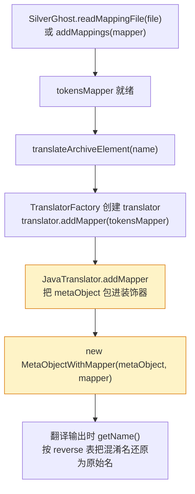

# 🧩 TokensMapper SPI · 符号重映射

<Badge type="tip" text="ProGuard 反混淆" /> <Badge type="info" text="silverghost 扩展点" />

> ProGuard 混淆后的类名（如 `a.b.c`）可读性极差。`TokensMapper` 是 ClassyShark 暴露的**符号重映射 SPI**：读取 mapping 文件、构建「混淆名 → 原始类名」表，再由翻译器把呈现结果还原成原始名。

📁 接口源码：`ClassySharkWS/src/com/google/classyshark/silverghost/TokensMapper.java`
📦 默认实现：[`IdentityMapper`](/reference/modules/IdentityMapper) · 装饰器：[`MetaObjectWithMapper`](/reference/modules/MetaObjectWithMapper) · 注入口：[`SilverGhost`](/reference/modules/SilverGhost)

## 接口契约

`TokensMapper` 只声明两个方法，职责极简：

| 方法 | 返回类型 | 语义 |
|------|----------|------|
| `readMappings(File file)` | `TokensMapper` | 解析 ProGuard mapping 文件，构建内部映射并**返回 `this`**（链式） |
| `getReverseClasses()` | `Map<String,String>` | 返回 **混淆名 → 原始类名** 的映射表 |

```java
package com.google.classyshark.silverghost;

public interface TokensMapper {
    TokensMapper readMappings(File file);
    Map<String, String> getReverseClasses();
}
```

> 🔍 **「reverse」语义**：ProGuard mapping 文件本身是「原始 → 混淆」正向方向；`getReverseClasses` 把它**反向**成「混淆 → 原始」，因为反查时拿到的总是混淆名，要还原出原始名。

## 默认实现 IdentityMapper

[`SilverGhost`](/reference/modules/SilverGhost) 在静态块里注入默认实现 [`IdentityMapper`](/reference/modules/IdentityMapper)——**空映射、无操作**：

| 行为 | IdentityMapper | 自定义 Mapper |
|------|----------------|---------------|
| `readMappings(file)` | 忽略文件，返回 `this` | 解析文件、填充映射表、返回 `this` |
| `getReverseClasses()` | 返回空 `TreeMap` | 返回「混淆→原始」映射表 |
| 呈现效果 | 输出即混淆名（不还原） | 翻译时把混淆名替换成原始名 |

```java
// SilverGhost.java —— 默认恒等映射，无 mapping 时翻译照常进行
static {
    tokensMapper = new IdentityMapper();
    fullArchiveReader = new EmptyFullArchiveReader();
}
```

> ⚠️ `setBinaryArchive` 切换归档时会**重置** `tokensMapper = new IdentityMapper()`，因此每次分析前必须重新注入映射，否则映射丢失。

## 装饰器织入流程

映射器不会侵入翻译器内部，而是通过**装饰器**在翻译阶段织入。调用链如下：



关键代码在 `JavaTranslator.addMapper`：

```java
@Override
public void addMapper(TokensMapper reverseMappings) {
    this.metaObject =
           new MetaObjectWithMapper(this.metaObject, reverseMappings);
}
```

[`MetaObjectWithMapper`](/reference/modules/MetaObjectWithMapper) 是 `MetaObject` 的装饰器，只**覆写 `getName()`**，其余方法（注解、修饰符、父类、接口、字段、构造器、方法）全部透传给被包装的 `metaObject`：

```java
@Override
public String getName() {
    if (reverseMappingClasses == null) {
        reverseMappingClasses = new TreeMap<>();
    }
    if (reverseMappingClasses.containsKey(metaObject.getName())) {
        return reverseMappingClasses.get(metaObject.getName()); // 还原
    }
    return metaObject.getName(); // 未命中则原样返回
}
```

> 🎯 **只装饰 `getName`**：类名是反混淆的主要对象；字段/方法名不在 `TokensMapper` 范围内，故装饰器只拦截 `getName()`，其余保持透明委托。

## 注入口：SilverGhost

[`SilverGhost`](/reference/modules/SilverGhost) 提供两个等价的映射注入入口：

| 方法 | 用途 | 说明 |
|------|------|------|
| `readMappingFile(File mappingFile)` | 读取 ProGuard mapping 文件 | 调用当前 `tokensMapper.readMappings(file)`，返回该 mapper |
| `addMappings(TokensMapper tokensMapper)` | 直接替换整个映射器 | 适合已自行构建好 mapper 的场景 |

```java
// 方式 1：让 SilverGhost 用默认实现读文件
silverGhost.readMappingFile(new File("mapping.txt"));

// 方式 2：自己构建并整体替换（适合自定义 Mapper）
silverGhost.addMappings(myCustomMapper);
```

随后调用 `translateArchiveElement(name)` 时，`SilverGhost` 会自动执行 `translator.addMapper(tokensMapper)`，无需手动传入。

## 自定义 Mapper 示例

下面实现一个读取标准 ProGuard `mapping.txt` 的自定义 `TokensMapper`。ProGuard mapping 形如：

```text
# ProGuard mapping.txt（原始 → 混淆）
com.example.RealClass -> a.b.c:
    1:1 void init() -> <init>
    2:2 doWork() -> a
```

每一行「原始类 → 混淆类」即类映射，需反向存入 `getReverseClasses`：

```java
package com.example;

import com.google.classyshark.silverghost.TokensMapper;
import java.io.*;
import java.util.*;

public class ProGuardMapper implements TokensMapper {

    private final Map<String, String> reverse = new HashMap<>();

    @Override
    public TokensMapper readMappings(File file) {
        try (BufferedReader r = new BufferedReader(new FileReader(file))) {
            String line;
            while ((line = r.readLine()) != null) {
                line = line.trim();
                // 仅处理类映射行：original -> obfuscated:
                int arrow = line.indexOf(" -> ");
                if (arrow < 0 || !line.endsWith(":")) continue;
                String original = line.substring(0, arrow).trim();
                String obfuscated = line.substring(arrow + 4,
                                                    line.length() - 1).trim();
                reverse.put(obfuscated, original); // 反向：混淆 → 原始
            }
        } catch (IOException e) {
            throw new RuntimeException("read mapping failed", e);
        }
        return this; // 链式返回自身
    }

    @Override
    public Map<String, String> getReverseClasses() {
        return reverse;
    }
}
```

接入流程：

```java
SilverGhost sg = new SilverGhost();
sg.setBinaryArchive(new File("app-release.apk"));
sg.readContents();

// 注入自定义映射器（必须 readContents 之后、translateArchiveElement 之前）
sg.addMappings(new ProGuardMapper().readMappings(new File("mapping.txt")));

sg.translateArchiveElement("a.b.c"); // 翻译时自动还原成 com.example.RealClass
```

> 💡 因为 `readMappings` 返回 `this`，可以链式 `new ProGuardMapper().readMappings(file)` 一行完成构建；如直接用默认实现读文件，调 `sg.readMappingFile(file)` 即可，[`IdentityMapper`](/reference/modules/IdentityMapper) 会忽略文件——所以**真实反混淆必须提供自定义实现或可读文件的 Mapper**。

## 设计要点

- 🧩 **SPI + 装饰器**：接口是扩展点，`IdentityMapper` 是空实现，运行时由 [`MetaObjectWithMapper`](/reference/modules/MetaObjectWithMapper) 装饰器把映射织入翻译，**不侵入翻译器内部**。
- 🔗 **链式 `readMappings`**：返回 `TokensMapper` 而非 `void`，便于 `new Xxx().readMappings(file)` 一行构建并直接交给 `addMappings`。
- 🧱 **默认 IdentityMapper 解耦**：无 mapping 文件时翻译照常进行（输出即混淆名），第三方按需替换。
- 🎯 **最小拦截面**：装饰器只覆写 `getName()`，把反混淆限定在类名层面，避免改动字段/方法呈现逻辑。

## 相关文档

- 接口参考：[TokensMapper](/reference/modules/TokensMapper)
- 默认实现：[IdentityMapper](/reference/modules/IdentityMapper)
- 装饰器：[MetaObjectWithMapper](/reference/modules/MetaObjectWithMapper)
- 注入口：[SilverGhost](/reference/modules/SilverGhost)
