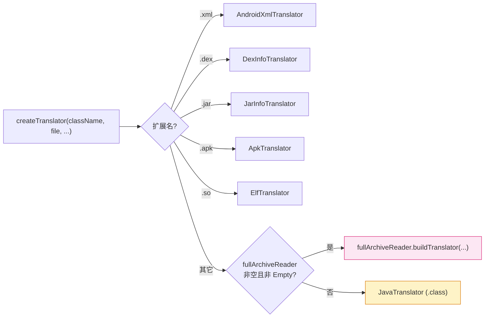

# 🔌 Translator SPI · 自定义翻译器

<Badge type="tip" text="Translator 扩展点" /> <Badge type="info" text="silverghost SPI" />

> ClassyShark 把「二进制 → 可读文本」的能力抽象成 `Translator` 接口：一个函数 `(binary data, name) → List<ELEMENT>`，其中 `ELEMENT` 是带语义标签的「词」。实现这个接口，就能让 ClassyShark 识别任意新格式（如 `.proto`、`.arsc`、自研二进制）。

📁 接口源码：`ClassySharkWS/src/com/google/classyshark/silverghost/translator/Translator.java`
📦 包：`com.google.classyshark.silverghost.translator`
🔗 工厂：[TranslatorFactory](/reference/modules/TranslatorFactory) · 接口参考：[Translator](/reference/modules/Translator)

## 接口契约

`Translator` 是一个**有状态的翻译器**：构造时传入待翻译条目，调用 `apply()` 执行翻译，再用 `getElementsList()` 取结果。

| 方法 | 返回类型 | 调用时机 / 语义 |
|------|----------|----------------|
| `apply()` | `void` | **执行翻译**：解析二进制、产出 `ELEMENT` 序列。重且只应调一次 |
| `getClassName()` | `String` | 返回当前条目名（如 `AndroidManifest.xml`、类全限定名） |
| `addMapper(TokensMapper reverseMappings)` | `void` | 注入 ProGuard 反混淆映射器（见 [TokensMapper SPI](/api/tokensmapper)）。不关心可空实现 |
| `getElementsList()` | `List<ELEMENT>` | 返回翻译后的**带标签词序列**，供 GUI 渲染或 CLI 输出 |
| `getDependencies()` | `List<String>` | 返回依赖列表（如 native `.so` 依赖、jar 引用类） |

```java
package com.google.classyshark.silverghost.translator;

public interface Translator {

    enum TAG {
        MODIFIER, IDENTIFIER, ANNOTATION, DOCUMENT,
        XML_TAG, XML_ATTR_NAME, XML_ATTR_VALUE, XML_CDATA,
        XML_COMMENT, XML_DEFAULT, SELECTION
    }

    class ELEMENT {
        public ELEMENT(String word, TAG tag) { this.text = word; this.tag = tag; }
        public final String text;
        public final TAG tag;
    }

    String getClassName();
    void addMapper(TokensMapper reverseMappings);
    void apply();
    List<ELEMENT> getElementsList();
    List<String> getDependencies();
}
```

## ELEMENT：通用货币 🪙

所有翻译器的产出都汇集成 `ELEMENT`（词 + 标签）这一**通用货币**，GUI 与 CLI 据此统一着色/排版。`ELEMENT` 是 `Translator` 的内部静态类，两个字段均 `final`：

| 字段 | 类型 | 说明 |
|------|------|------|
| `text` | `String` | 原始词文本（关键字、标识符、标点、整段文本皆可） |
| `tag` | `TAG` | 语义标签，决定高亮颜色 |

构造即 `new ELEMENT("\npackage ", TAG.MODIFIER)`。一条 `ELEMENT` 可以是单字符、整行，甚至整段文本——粒度由实现自定。

## TAG 枚举

`TAG` 共 11 个值，分两类：**Java 类语义**与 **XML 语义**。

| TAG | 适用场景 | 典型产出（取自 `JavaTranslator`） |
|-----|----------|-----------------------------------|
| `MODIFIER` | Java 修饰符/关键字 | `new ELEMENT("\npackage ", TAG.MODIFIER)` |
| `IDENTIFIER` | 类名/方法名/字段名 | `new ELEMENT(packageName, TAG.IDENTIFIER)` |
| `ANNOTATION` | 注解、摘要行 | `new ELEMENT("\nclasses: 1024", TAG.ANNOTATION)` |
| `DOCUMENT` | 段落性文本、ELF 描述 | `new ELEMENT("File size - ", TAG.DOCUMENT)` |
| `XML_TAG` | XML 标签名 `<manifest>` | `XmlHighlighter` 正则切分 |
| `XML_ATTR_NAME` | XML 属性名 `android:name` | 属性键 |
| `XML_ATTR_VALUE` | XML 属性值 `"string"` | 属性值 |
| `XML_CDATA` | `<![CDATA[ ... ]]>` | CDATA 块 |
| `XML_COMMENT` | `<!-- ... -->` | XML 注释 |
| `XML_DEFAULT` | XML 默认文本/空白 | 未命中其它标签的片段 |
| `SELECTION` | 用户选中区域 | GUI 高亮联动 |

> 💡 **Java 与 XML 共用一套 `ELEMENT`/`TAG`**：这让 GUI 渲染器（`DisplayArea`）只需识别一种数据结构，即可同时渲染反编译类存根与二进制 XML。

## TranslatorFactory：按扩展名分发 🏭

[TranslatorFactory](/reference/modules/TranslatorFactory) 是静态工厂，按 `className` 扩展名路由到内置翻译器，**无匹配时回退到 `JavaTranslator`**（`.class`）：



内置翻译器要么在工厂里 `new`（按扩展名匹配），要么通过 **`FullArchiveReader.buildTranslator`** 这一插件回退点产出。新格式要接入，两条路：

| 接入方式 | 做法 | 适用 |
|----------|------|------|
| 🅰️ 扩展工厂 | 在 `TranslatorFactory` 追加 `endsWith(".xxx")` 分支 | 改 ClassyShark 源码、随发布分发 |
| 🅱️ FullArchiveReader | 实现 `FullArchiveReader.buildTranslator`，注入 [`SilverGhost`](/reference/modules/SilverGhost) | 不改源码、运行时插件 |

`FullArchiveReader` 接口仅两方法：`readAsyncArchive(File)` 与 `buildTranslator(String, File)`；默认空实现 [`EmptyFullArchiveReader`](/reference/modules/EmptyFullArchiveReader) 的 `buildTranslator` 返回一个**全空匿名 Translator**（`getClassName` 返回 `"Empty"`，列表皆空）。

```java
// FullArchiveReader.java —— 插件式翻译器构建
public interface FullArchiveReader {
    void readAsyncArchive(File file);
    Translator buildTranslator(String className, File archiveFile);
}
```

> ⚠️ 工厂判断回退的条件是 `fullArchiveReader != null && !(fullArchiveReader instanceof EmptyFullArchiveReader)`。注入自定义 reader 后，**所有未匹配扩展名**都会走它的 `buildTranslator`，需自行按扩展名分发。

## 自定义 Translator 骨架 🧩

下面实现一个把 `.txt` 文本文件按行翻译成 `ELEMENT` 序列的示例，演示五个方法的典型写法：

```java
package com.example;

import com.google.classyshark.silverghost.TokensMapper;
import com.google.classyshark.silverghost.translator.Translator;

import java.io.*;
import java.nio.charset.StandardCharsets;
import java.util.ArrayList;
import java.util.List;

/**
 * 把 .txt 按行翻译成带 DOCUMENT 标签的 ELEMENT 序列。
 * 函数语义：(archiveFile, name) → List<ELEMENT>
 */
public class TextTranslator implements Translator {

    private final String className;
    private final File archiveFile;
    private final List<ELEMENT> elements = new ArrayList<>();
    private final List<String> dependencies = new ArrayList<>();

    public TextTranslator(String className, File archiveFile) {
        this.className = className;
        this.archiveFile = archiveFile;
    }

    @Override
    public String getClassName() {
        return className; // 条目名，如 "README.txt"
    }

    @Override
    public void addMapper(TokensMapper reverseMappings) {
        // 纯文本无需反混淆；空实现即可
    }

    @Override
    public void apply() {
        elements.add(new ELEMENT("📄 " + className + "\n", TAG.IDENTIFIER));
        try (BufferedReader r = new BufferedReader(
                new InputStreamReader(new FileInputStream(archiveFile),
                                      StandardCharsets.UTF_8))) {
            String line;
            while ((line = r.readLine()) != null) {
                // 每行一个 ELEMENT；首字符为 # 视作注释
                TAG tag = line.startsWith("#") ? TAG.XML_COMMENT : TAG.DOCUMENT;
                elements.add(new ELEMENT(line + "\n", tag));
            }
        } catch (IOException e) {
            elements.add(new ELEMENT("Error: " + e.getMessage(), TAG.ANNOTATION));
        }
    }

    @Override
    public List<ELEMENT> getElementsList() {
        return elements; // apply() 产出的结果
    }

    @Override
    public List<String> getDependencies() {
        return dependencies; // 无依赖
    }
}
```

### 接入方式一：扩展 TranslatorFactory

直接在工厂追加分支：

```java
// TranslatorFactory.java —— 追加自定义分支
if (className.endsWith(".txt")) {
    return new TextTranslator(className, archiveFile);
}
```

### 接入方式二：用 FullArchiveReader.buildTranslator

不改 ClassyShark 源码，运行时插件注入：

```java
import com.google.classyshark.silverghost.FullArchiveReader;
import com.google.classyshark.silverghost.translator.Translator;
import com.google.classyshark.silverghost.translator.java.JavaTranslator;
import java.io.File;

public class TextArchiveReader implements FullArchiveReader {

    @Override
    public void readAsyncArchive(File file) {
        // 可在此预读归档、缓存索引等
    }

    @Override
    public Translator buildTranslator(String className, File archiveFile) {
        if (className.endsWith(".txt")) {
            return new TextTranslator(className, archiveFile);
        }
        // 未识别的回退到默认 Java 翻译，避免吞掉其它条目
        return new JavaTranslator(className, archiveFile);
    }
}
```

```java
// SilverGhost 注入插件式 reader（替代默认 EmptyFullArchiveReader）
SilverGhost sg = new SilverGhost();
sg.setBinaryArchive(new File("notes.zip"));   // 内含 .txt
sg.readContents();
sg.translateArchiveElement("README.txt");     // 走 TextArchiveReader
```

> 🔑 `buildTranslator` 是**兜底回退点**：仅当内置扩展名都不匹配时才调用，故无需重写内置格式（`.xml`/`.dex`/`.jar`/`.apk`/`.so`）的分发。

## 实现规范

- ⚙️ **构造存状态** — `className`、`archiveFile` 存为字段，`apply()` 前不解析。
- 🔄 **apply 幂等友好** — `apply()` 是重操作，调用方约定只调一次；产出存入字段，`getElementsList()` 直接返回。
- 🪙 **ELEMENT 粒度自定** — 可按词（`JavaTranslator`）或按段（`ElfTranslator` 整段 `TAG.DOCUMENT`）切分，只要 `TAG` 贴切。
- 🔌 **addMapper 可空实现** — 不需要反混淆就留空体（参考 `AndroidXmlTranslator`），不要抛异常。
- 📋 **getDependencies 可空列表** — 无依赖时返回 `new ArrayList<>()`（参考 `AndroidXmlTranslator.getDependencies`），不返回 `null`。
- 🏭 **buildTranslator 必兜底** — 自定义 `FullArchiveReader` 不识别的扩展名应回退到 `new JavaTranslator(...)`，避免吞条目。

## 内置实现一览

| 翻译器 | 扩展名 | apply 行为 | 主要 TAG |
|--------|--------|-----------|----------|
| [AndroidXmlTranslator](/reference/modules/AndroidXmlTranslator) | `.xml` | 解压 + `XmlDecompressor` 还原二进制 XML | `XML_*` |
| [DexInfoTranslator](/reference/modules/DexInfoTranslator) | `.dex` | 摘要：类数、方法数、字符串数 | `ANNOTATION` |
| [JarInfoTranslator](/reference/modules/JarInfoTranslator) | `.jar` | 类数、文件大小摘要 | `ANNOTATION` |
| [ApkTranslator](/reference/modules/ApkTranslator) | `.apk` | 整包 dashboard：dex/manifest/native | 混合 |
| [ElfTranslator](/reference/modules/ElfTranslator) | `.so` | native 依赖 + 动态符号表 | `DOCUMENT`/`IDENTIFIER` |
| [JavaTranslator](/reference/modules/JavaTranslator) | `.class` | 反编译类存根（字段/构造器/方法） | `MODIFIER`/`IDENTIFIER` |

## 相关文档

- 接口参考：[Translator](/reference/modules/Translator)
- 工厂：[TranslatorFactory](/reference/modules/TranslatorFactory)
- 插件回退：[FullArchiveReader](/reference/modules/FullArchiveReader) · [EmptyFullArchiveReader](/reference/modules/EmptyFullArchiveReader)
- 配套 SPI：[TokensMapper SPI · 符号重映射](/api/tokensmapper)
- 编程 API 总览：[API](/api/index)
