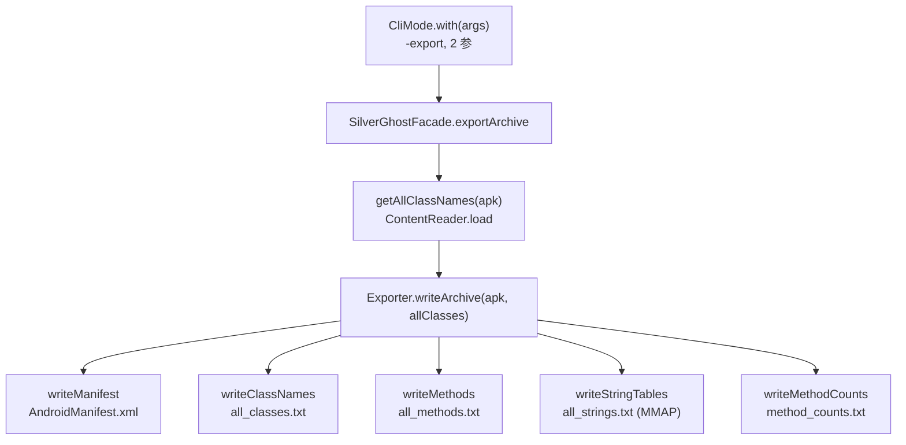
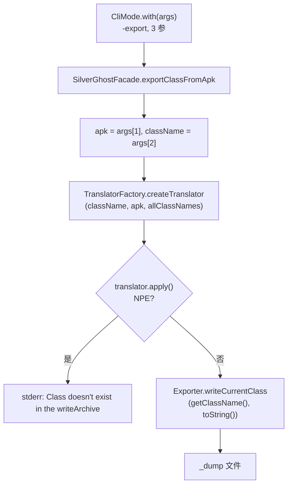

# 📦 -export：导出全量或单个类数据

<Badge type="tip" text="导出" />
<Badge type="info" text="CLI" />

> `-export` 把归档里的元数据与内容拆写成一组文本文件，或把指定类的反编译结果单独落盘。两种用法仅靠**参数个数**区分：2 个参数导出全量，3 个参数导出单类。

## 命令

```bash
# 2 参：导出全量
java -jar ClassyShark.jar -export app.apk

# 3 参：导出单个类反编译结果
java -jar ClassyShark.jar -export app.apk <classname>
```

入口 [`CliMode.with`](/reference/modules/CliMode) 解析首参为操作符，第 2 参为归档文件，按 `args.size()` 分发：

```java
case "-export":
    if (args.size() == 2) {
        exportArchive(args);          // 全量
    } else {
        exportClassFromApk(args);     // 单类
    }
    break;
```

## 用法对照

| 参数个数 | 命令 | 走向 | 产物 |
|---------|------|------|------|
| 2 | `-export app.apk` | `SilverGhostFacade.exportArchive` → [`Exporter.writeArchive`](/reference/modules/Exporter) | 5 个文本文件 |
| 3 | `-export app.apk com.example.Foo` | `SilverGhostFacade.exportClassFromApk` → `TranslatorFactory` → [`Exporter.writeCurrentClass`](/reference/modules/Exporter) | `<classname>_dump` 单文件 |

## 用法一：导出全量

### 调用链



`exportArchive` 在 [`SilverGhostFacade`](/reference/modules/SilverGhostFacade) 里先用 `ContentReader` 装载全量类名，再交给 `Exporter.writeArchive` 串联五个写入步骤：

1. **`writeManifest`** — 仅对 `.apk` 生效，经 [`TranslatorFactory`](/reference/modules/TranslatorFactory) 翻译 `AndroidManifest.xml`，输出 `AndroidManifest.xml_dump`。
2. **`writeClassNames`** — 把 `allClasses` 列表写入 `all_classes.txt`（`FileWriter` 逐行写）。
3. **`writeMethods`** — 仅 `.apk`，委托 [`DexMethodsDumper`](/reference/modules/DexMethodsDumper) dump 全部方法签名到 `all_methods.txt`。
4. **`writeStringTables`** — 仅 `.apk`，委托 [`DexStringsDumper`](/reference/modules/DexStringsDumper) dump 字符串池到 `all_strings.txt`。
5. **`writeMethodCounts`** — 由 [`RootBuilder`](/reference/modules/RootBuilder) 构建方法计数树，`TreeMethodCountExporter` 渲染到 `method_counts.txt`。

### 输出文件

| 文件 | 写入器 | 适用归档 | 内容 |
|------|--------|---------|------|
| `AndroidManifest.xml_dump` | `writeString` | APK | 解码后的 Manifest 文本 |
| `all_classes.txt` | `writeListStrings` | 全部 | 每行一个类全限定名 |
| `all_methods.txt` | `writeListStrings` | APK | 每行一个方法签名 |
| `all_strings.txt` | `writeListStringsChannel` | APK | dex 字符串池 |
| `method_counts.txt` | `TreeMethodCountExporter` | 全部 | 按包/类的树形方法计数 |

::: tip MMAP 写大字符串表
`writeStringTables` 走 `writeListStringsChannel`：先用 `RandomAccessFile` 打开目标，取 `FileChannel`，调 `rwChannel.map(FileChannel.MapMode.READ_WRITE, 0, size)` 一次性映射一块 `ByteBuffer`，再循环 `wrBuf.put(...)` 写入。对超大 dex 字符串池用内存映射避免反复系统调用，但**预分配尺寸按固定行宽估算**，写入异常被静默吞掉（`catch (IOException ioe) {}` 为空），失败时文件可能不完整。
:::

### 示例

```bash
# 导出 APK 全量数据
java -jar ClassyShark.jar -export app.apk

# 导出 dex/jar（manifest/methods/strings 步骤对非 APK 跳过）
java -jar ClassyShark.jar -export classes.dex
```

```bash
$ ls *.txt *_dump
all_classes.txt  all_methods.txt  all_strings.txt  method_counts.txt  AndroidManifest.xml_dump
```

## 用法二：导出单个类

### 调用链



`exportClassFromApk` 取第 3 参为类全限定名，经 [`TranslatorFactory`](/reference/modules/TranslatorFactory) 选匹配的 `Translator`（dex/jar/apk/manifest 等），`apply()` 翻译后把 `translator.toString()` 的反编译结果交给 [`Exporter.writeCurrentClass`](/reference/modules/Exporter)，输出 `<classname>_dump`。

::: warning 异常即静默
`translator.apply()` 抛 `NullPointerException` 时打印 `Class doesn't exist in the writeArchive` 后 `return`（注意文案拼成 "writeArchive"，实为指导上的归档）；写入异常则打印 `Internal error - couldn't write file`。两者都不抛出进程级错误。
:::

### 示例

```bash
# 导出指定类反编译结果
java -jar ClassyShark.jar -export app.apk com.bumptech.glide.request.target.BaseTarget

# 输出文件
$ ls BaseTarget*
BaseTarget_dump
```

## 相关

- 入口分发：[`CliMode`](/reference/modules/CliMode)
- 门面 API：[`SilverGhostFacade`](/reference/modules/SilverGhostFacade)
- 写入逻辑：[`Exporter`](/reference/modules/Exporter)
- 翻译器选择：[`TranslatorFactory`](/reference/modules/TranslatorFactory)
- 方法计数树：[`RootBuilder`](/reference/modules/RootBuilder)
