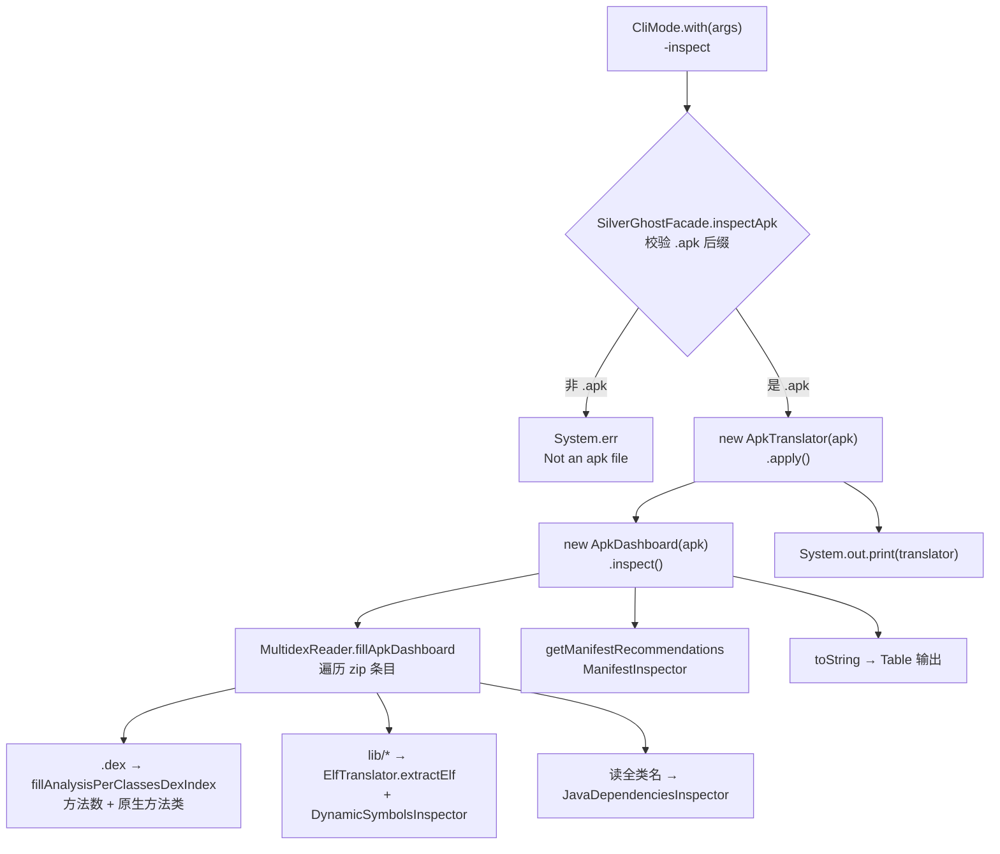

# 🩺 -inspect：APK 分析仪表盘

<Badge type="tip" text="实验性" />
<Badge type="info" text="CLI" />

> `-inspect` 把一个 APK 拆开，逐 dex 统计方法数、标记原生（native）依赖、扫描 Java 库重复/弃用、并给出 Manifest 后台广播建议，最终打印成一张可读的二维表格仪表盘。

## 命令

```bash
java -jar ClassyShark.jar -inspect app.apk
```

入口 [`CliMode.with`](/reference/modules/CliMode) 解析到 `-inspect` 分支，调用 `SilverGhostFacade.inspectApk(args)`：

```java
case "-inspect":
    inspectApk(args);
    break;
```

::: warning 实验性
`CliMode` 的帮助文本里 `-inspect` 标注为 **experimental**，输出格式与检查项可能随版本变化，不建议作为稳定断言依据。
:::

## 调用链



## .apk 校验

`SilverGhostFacade.inspectApk` 在第一行就拦非 `.apk` 文件，避免把 jar/dex/class 误当 APK 解：

```java
if (!new File(args.get(1)).getName().endsWith(".apk")) {
    System.err.println("Not an apk file ==> " +
            "java -jar ClassyShark.jar " + "-inspect APK_FILE");
    return;
}
```

文件存在性由 [`CliMode`](/reference/modules/CliMode) 统一前置校验（`archiveFile.exists()`）。

## 仪表盘生成

通过 [`ApkTranslator.apply()`](/reference/modules/ApkTranslator) 创建 [`ApkDashboard`](/reference/modules/ApkDashboard) 并调 `inspect()`：

```java
apkDashboard = new ApkDashboard(apkFile);
apkDashboard.inspect();          // → MultidexReader.fillApkDashboard
```

`ApkDashboard.inspect()` 委托 [`MultidexReader.fillApkDashboard`](/reference/modules/MultidexReader) 扫描 zip：

- **`classes*.dex`** → `classesDexEntries`，调 `fillAnalysisPerClassesDexIndex`
- **自定义 dex / 内嵌 zip 中的 dex** → `customClassesDexEntries`（index 99 / 999）
- **`lib/` 条目** → `ElfTranslator.extractElf` 抽 ELF，读 `getSharedDependencies`，`DynamicSymbolsInspector` 检查错误
- 调 `readClassNamesFromMultidex` 收集 `allClasses`，供 Java 依赖检查器使用

最终 `ApkDashboard.toString()` 用 `Table` 渲染成 `Recommendation | Description` 两列。

## 输出组成

仪表盘按 `toString()` 顺序输出四段（每段以空行 `NEW_LINE` 分隔）：

| 段 | 行类型 | 说明 |
|----|--------|------|
| 1 | 各 dex 名称 + 方法数 | 遍历 `getAllDexEntries()`，形如 `classes.dex` → `N methods` |
| 2 | `Java ` + 依赖告警 | [`JavaDependenciesInspector`](/reference/modules/JavaDependenciesInspector) 结果 |
| 3 | `System Broadcast ` + 建议 | [`ManifestInspector`](/reference/modules/ManifestInspector) 结果 |
| 4 | `Native Error ` + 库名 | [`PrivateNativeLibsInspector`](/reference/modules/PrivateNativeLibsInspector) 标记的私有库 |

### 每个 dex 的数据

[`ClassesDexDataEntry`](/reference/modules/ClassesDexDataEntry) 持有单个 dex 的分析结果：

| 字段 | 来源 | 含义 |
|------|------|------|
| `index` | 文件名末位数字（classes.dex=0） | 用于排序与命名 |
| `allMethods` | `DexBackedDexFile.getMethodCount()` | 该 dex 方法总数 |
| `classesWithNativeMethods` | `ApkNativeMethodsVisitor`（asmdex） | 含 native 方法的类集合 |
| `nativeMethodsCount` | visitor 累计 | native 方法计数 |

`getName()` 映射 index→名称：0=`classes.dex`，1-9=`classesN.dex`，≥10=`custom - classes.dex`。

### native 库

`MultidexReader` 遍历 `lib/` 开头条目，用 [`ElfTranslator`](/reference/modules/ElfTranslator) 抽出 ELF 文件后：

- `Elf.getSharedDependencies()` → `nativeDependencies`
- [`DynamicSymbolsInspector`](/reference/modules/DynamicSymbolsInspector) → `nativeErrors`（动态符号错误）
- [`PrivateNativeLibsInspector`](/reference/modules/PrivateNativeLibsInspector).isPrivate(lib, names)` 判断是否私有库

`isPrivate` 逻辑：库名既不在 `APIS_LIB_LIST`（libz/libc/liblog/libEGL 等 Android 公共 API 库白名单），也不在 APK 自带库集合中，就标 ` -- private api!`，并在第 4 段输出 `Native Error` 行。

### Java 依赖告警

[`JavaDependenciesInspector`](/reference/modules/JavaDependenciesInspector) 遍历 `allClasses`，按包名子串归类，输出：

| 告警 | 触发条件 |
|------|----------|
| `Duplicate image loading libraries` | glide/picasso/fresco 出现 ≥2 个 |
| `Duplicate async http libraries` | okhttp/volley/loopj 出现 ≥2 个 |
| `Duplicate json parsing` | jackson/gson/moshi 出现 ≥2 个 |
| `Guava (server side library)usage` | 命中 `google.common` |
| `Apache Http is deprecated` | 命中 `apache.http` |
| `ActionBar Sherlock is deprecated` | 命中 `com.actionbarsherlock` |
| `PullToRefresh is deprecated` | 命中 `chrisbanes.pulltorefresh` |
| `ViewPagerIndicator is deprecated - use support library` | 命中 `com.viewpagerindicator` |

### Manifest 建议

[`ManifestInspector`](/reference/modules/ManifestInspector) 调 `SilverGhostFacade.getManifest(apk)` 取出 AndroidManifest.xml 文本，交 `AndroidManifestPlainTextReader` 解析 `<receiver>` 与其 `<action>`，再由 [`ReceiverActionsBL`](/reference/modules/ReceiverActionsBL) 过滤：

- 取 `com.google.*` / `android.*` 开头、且**不在 approved 列表**的系统广播 action
- approved 列表为 Android 官方允许后台接收的安全广播（`BOOT_COMPLETED`、`LOCALE_CHANGED`、`USB_DEVICE_ATTACHED`、`NEW_OUTGOING_CALL` 等，共 26 项）
- 命中的即「后台不安全广播」，按 `action ==> receiver` 输出

## 检查器一览

| 检查器 | 作用 | 输出段 |
|--------|------|--------|
| [`ApkNativeMethodsVisitor`](/reference/modules/ApkNativeMethodsVisitor) | asmdex 遍历，收集含 native 方法的类 | 第 1 段（dex 行） |
| [`JavaDependenciesInspector`](/reference/modules/JavaDependenciesInspector) | 重复/弃用 Java 库 | 第 2 段 `Java` |
| [`ManifestInspector`](/reference/modules/ManifestInspector) | 后台不安全系统广播 | 第 3 段 `System Broadcast` |
| [`PrivateNativeLibsInspector`](/reference/modules/PrivateNativeLibsInspector) | 私有 native 库标记 | 第 4 段 `Native Error` |
| [`DynamicSymbolsInspector`](/reference/modules/DynamicSymbolsInspector) | ELF 动态符号错误 | `nativeErrors`（未直接进 toString） |

## 示例输出（示意）

```text
Recommendation      | Description
--------------------+----------------------------------
classes.dex         | 54231 methods
classes2.dex        | 12890 methods
Java                | Duplicate image loading libraries - picasso glide
System Broadcast   | android.intent.action.SCREEN_ON ==> .ScreenReceiver
Native Error       | libfoo.so  -- private api!
```

## 相关命令

- [-methodcounts](./methodcounts)：仅按包统计方法数，不跑仪表盘
- [-export](./export)：导出类/全量数据到文件
- [CLI 参考](./index)
