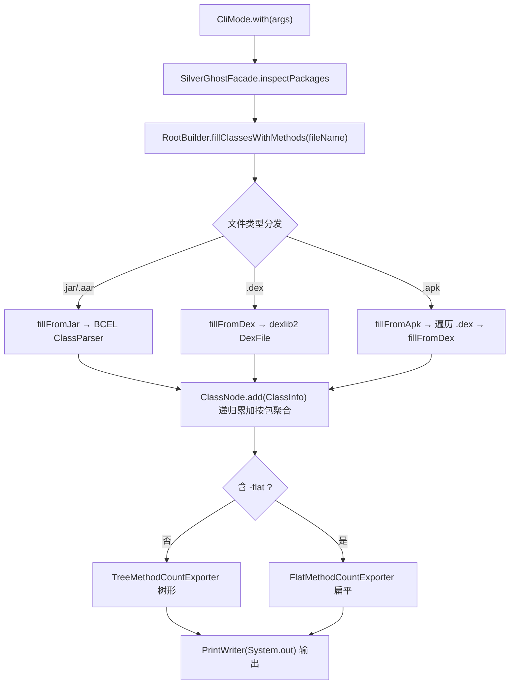

# 🔢 -methodcounts 命令

<Badge type="tip" text="CLI" /> <Badge type="info" text="按包统计方法数" />

> `-methodcounts` 按包（package）维度统计归档内每个类的方法数，递归聚合到包节点，输出树形或扁平清单。常用于排查 65k/64k 方法数上限、定位臃肿依赖。

## 用法

```bash
java -jar ClassyShark.jar -methodcounts <archive> [可选 -flat]
```

| 参数 | 说明 |
|------|------|
| `<archive>` | `.apk` / `.dex` / `.jar` / `.aar` 归档，必填 |
| `-flat` | 可选，输出扁平全限定名清单；缺省走树形 |

需 ≥2 个参数，否则 [`CliMode`](/reference/modules/CliMode) 打印 usage 并返回（非零退出）。详见 [退出码](./exit-codes)。

## 示例

```bash
# 树形（默认）
java -jar ClassyShark.jar -methodcounts app.apk

# 扁平全限定名
java -jar ClassyShark.jar -methodcounts app.apk -flat

# 直接分析单 dex
java -jar ClassyShark.jar -methodcounts classes.dex

# 分析 jar
java -jar ClassyShark.jar -methodcounts library.jar
```

## 调用链

入口 [`CliMode`](/reference/modules/CliMode) `case "-methodcounts"` → [`SilverGhostFacade.inspectPackages(args)`](/reference/modules/SilverGhostFacade)：



`inspectPackages` 默认构造 `TreeMethodCountExporter(new PrintWriter(System.out))`；若 `args.size() > 2` 则扫描后续参数，遇 `-flat` 切换为 `FlatMethodCountExporter`（一次扫描，后写者覆盖前者）。

## 文件类型分发

[`RootBuilder`](/reference/modules/RootBuilder).`fillClassesWithMethods(File)` 按扩展名分发：

| 扩展名 | 方法 | 解析库 | 方法计数来源 |
|--------|------|--------|--------------|
| `.aar` | `fillFromAar` | 先解 zip 取内嵌 `.jar` → `fillFromJar` | BCEL |
| `.jar` | `fillFromJar` | Apache BCEL `ClassParser` | `JavaClass.getMethods().length` |
| `.dex` | `fillFromDex` | dexlib2（`DexlibLoader.loadDexFile`） | 遍历 `ClassDef.getMethods()` 计数 |
| `.apk` | `fillFromApk` | Zip 流遍历每个 `.dex` → `fillFromDex` | dexlib2 |

> 📦 `.apk` 会逐个解出 `.dex` 到临时文件并打印 `Parsing <name>`，多 dex 全部计入同一根。jar 走 BCEL，dex/apk 走 dexlib2——同一套 [`ClassNode`](/reference/modules/ClassNode) 聚合逻辑。

## 聚合逻辑：ClassNode

[`ClassNode`](/reference/modules/ClassNode) 是一棵按包名分段的多叉树，节点持有 `methodCount` 与 `childNodes`：

1. `add(ClassInfo)` 把 `classInfo.getPackageName()` 按 `.` 切段（如 `com.bumptech.glide` → `[com, bumptech, glide]`）。
2. 递归 `add(pos, packages, classInfo)`：**每经过一层都把 `classInfo.methodCount` 累加到当前节点**，缺失子节点则 `new ClassNode()` 并以包段为 `key` 插入。
3. 由此父包节点的方法数 = 其下所有类方法数之和（重复累加到每一层祖先），叶层即是单个类。

> ⚠️ `ClassInfo.packageName` 实际存的是全限定类名（jar 用 `jc.getClassName()`，dex 用 `o.getType()` 去斜杠/首尾字符），切段后最后一段即类名，故树形末端是类而非包。

## 树形输出示例（默认）

`TreeMethodCountExporter` 用 Unicode box-drawing 字符绘制层级：

- `═`（`═`）连节点名前的横线
- `╠`（`╠`）非末尾子节点的分支
- `╚`（`╚`）末尾子节点的分支
- `║`（`║`）纵向延续

```
app.apk - 4231
 ╠ com - 3120
 ║  ╠ google - 1800
 ║  ║  ╚ classyshark - 1800
 ║  ╚ example - 1320
 ║     ╠ ui - 880
 ║     ╚ MainActivity - 440
 ╚ androidx - 1111
```

> 节点格式为 `<key> - <methodCount>`，根节点 key 为文件名，方法数为全量。

## 扁平输出示例（-flat）

`FlatMethodCountExporter` 把祖先路径用 `.` 拼成全限定名前缀，逐行打印 `<全限定路径> - <方法数>`：

```
app.apk - 4231
app.apk.com - 3120
app.apk.com.google - 1800
app.apk.com.google.classyshark - 1800
app.apk.com.example - 1320
app.apk.com.example.ui - 880
app.apk.com.example.MainActivity - 440
app.apk.androidx - 1111
```

> 📝 扁平模式前缀含根文件名（如 `app.apk.com...`），适合管道到 `grep`/`sort` 做自定义排序与 Top-N 分析。

## 相关链接

- 入口：[`CliMode`](/reference/modules/CliMode) · [`SilverGhostFacade`](/reference/modules/SilverGhostFacade)
- 解析与聚合：[`RootBuilder`](/reference/modules/RootBuilder) · [`ClassNode`](/reference/modules/ClassNode)
- 输出器：[`TreeMethodCountExporter`](/reference/modules/TreeMethodCountExporter) · [`FlatMethodCountExporter`](/reference/modules/FlatMethodCountExporter)
- GUI 同源面板：[MethodsCountPanel](/reference/modules/MethodsCountPanel)
- 其他命令：[-inspect](./inspect) · [-export](./export) · [用法示例](./usage-examples)
