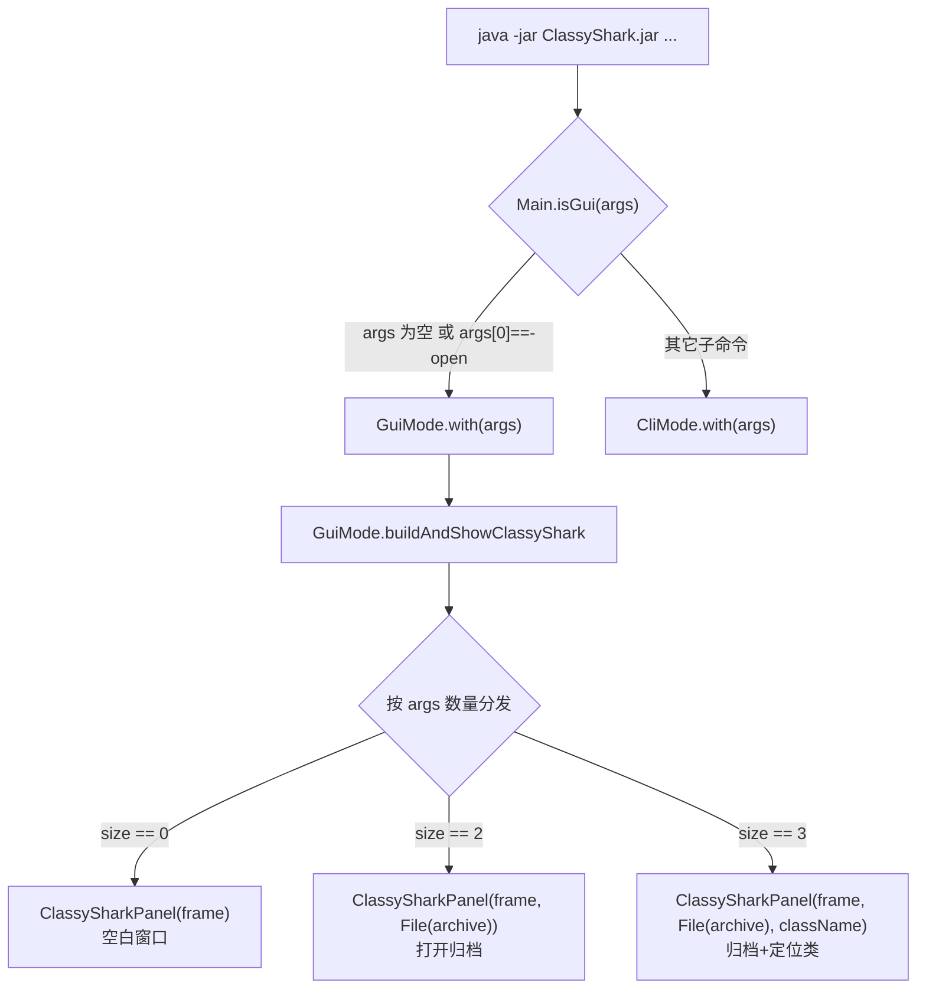

# 📂 -open 命令

<Badge type="tip" text="CLI" /> <Badge type="info" text="GUI 启动" />

> 用 **GUI** 打开一个 Android 二进制归档（APK/JAR/AAR/DEX/SO/CLASS）。无参数启动时也走同一路径，弹出空白窗口等待拖入文件。

## 用法

```bash
# 指定归档直接打开
java -jar ClassyShark.jar -open app.apk

# 无参数等价于 -open（GUI 空白窗口）
java -jar ClassyShark.jar

# 归档 + 类名：打开后直接定位到该类
java -jar ClassyShark.jar -open app.apk com.bumptech.glide.request.target.BaseTarget
```

> 💡 `-open` 是**唯一会拉起 Swing 窗口**的命令。其余子命令（`-export` / `-inspect` / `-methodcounts` / `-update`）都走纯命令行路径，详见 [CLI 参考](/cli/index)。

## 路由判定

入口 [`Main`](/reference/modules/Main) 用 `isGui(args)` 判定是否进 GUI：参数为空 **或** 首参等于 `-open`（忽略大小写）即 GUI，否则交给 [`CliMode`](/reference/modules/CliMode)。



注意 `size` 指整个参数列表长度：`-open` 占 1，归档占 1，类名占 1。

## 参数矩阵

| 参数形式 | `args.size()` | 命中的 `ClassySharkPanel` 重载 | 行为 |
|---------|---------------|-------------------------------|------|
| （无参） | 0 | `ClassySharkPanel(JFrame)` | 空白窗口，等用户拖放或工具栏打开 |
| `-open <archive>` | 2 | `ClassySharkPanel(JFrame, File)` | 启动即载入归档，填充类树 |
| `-open <archive> <class>` | 3 | `ClassySharkPanel(JFrame, File, String)` | 载入归档并跳转到指定全限定类名 |

> ⚠️ `size == 1`（只写 `-open` 没给文件）会落入末尾的空 `return`，框架为空 —— 实际几乎不会出现，因为无参就已经是 0。建议直接省略 `-open` 以打开空白窗口。

## 与其它命令的边界

[`CliMode.with`](/reference/modules/CliMode) 在内部 `switch(operand)` 里**没有** `-open` 分支：

```java
// Main.java
if (isGui(argsAsArray)) {
    GuiMode.with(argsAsArray);   // -open / 无参 走这里
} else {
    CliMode.with(argsAsArray);  // -export/-inspect/-methodcounts/-update 走这里
}
```

`CliMode` 的 `default` 分支会把未知 operand 报为 `wrong operand`，但 `-open` 永远到不了 `CliMode`，因为 `Main` 已在更上层拦截。这也是为什么 `CliMode.ERROR_MESSAGE` 里仍列出 `-open`，但实际处理在 [`GuiMode`](/reference/modules/GuiMode)。

## 启动副作用

[`GuiMode.with`](/reference/modules/GuiMode) 在 EDT 上构建窗口前会先做两件事：

| 时机 | 调用 | 作用 |
|------|------|------|
| 进入 `with` 同步 | `UpdateManager.checkVersionGui()` | 后台异步检查新版本，有更新时在 GUI 内提示 |
| `buildAndShowClassyShark` | `UIManager.setLookAndFeel(系统 LAF)` | 套用系统原生外观，再由 `Theme.applyTo(frame)` 叠加深/浅色主题 |

随后 [`ClassySharkPanel`](/reference/modules/ClassySharkPanel) 作为中介者装配类树、显示区、环形图与工具栏，详见 [GUI 参考](/gui/index)。

## 支持的归档格式

`-open` 本身不校验扩展名，交给 `ContentReader` 在载入时按格式路由：

| 扩展名 | Reader | 说明 |
|--------|--------|------|
| `.apk` | `ApkReader` | 含多 dex、Manifest、资源 |
| `.dex` | `DexReader` | 单独的 Dalvik 字节码 |
| `.jar` | `JarReader` | Java 归档 |
| `.aar` | `AarReader` | Android 库归档 |
| `.class` | `ClazzReader` | 单个类文件 |
| `.so` | — | native 库，走 ELF 翻译器 |

更多见 [支持的格式](/guide/supported-formats)。

## 相关

- 🚪 [GUI 参考](/gui/index) — 面板布局与交互
- 🧩 [Main 模块](/reference/modules/Main) — `isGui` 判定源码
- 🖥️ [GuiMode 模块](/reference/modules/GuiMode) — 窗口构建
- 🎛️ [ClassySharkPanel 模块](/reference/modules/ClassySharkPanel) — 三种构造重载
- 🛠️ [CLI 参考](/cli/index) — 其余子命令
