# 🔄 -update 命令

<Badge type="tip" text="CLI" /> <Badge type="info" text="自更新" />

> `-update` 让 ClassyShark 自我检查 GitHub 最新 release，询问后下载新版 JAR，无需手动跑浏览器。

## 用法

```bash
java -jar ClassyShark.jar -update <任意路径>
```

> ⚠️ **必须传第二个参数做占位**。[`CliMode`](/reference/modules/CliMode) 在 `with(args)` 里硬性要求 `args.size() >= 2`，否则直接打印 `missing command line arguments` 退出。`-update` 分支本身并不读取该参数，但它**必须存在**且能通过 `new File(args.get(1))` 的 `exists()` 校验——所以传一个真实存在的路径（如当前目录 `.` 或一个旧 APK）最稳妥：

```bash
# 推荐写法：占位用当前目录或任一已存在文件
java -jar ClassyShark.jar -update .
java -jar ClassyShark.jar -update old.apk
```

## 调用链

[`CliMode`](/reference/modules/CliMode) 收到 `-update` 后只做一件事——调 `UpdateManager.getInstance().checkVersionConsole()`，后续全部在 `updater` 子包里完成：

```mermaid
flowchart LR
    A["CliMode.with<br/>args[0]==-update"] --> B["UpdateManager<br/>checkVersionConsole"]
    B --> C["CliDownloader<br/>checkNewVersion"]
    C --> D["NetworkManager<br/>Retrofit.create(GitHubApi)"]
    D --> E["GitHubApi<br/>getLatestRelease()"]
    E --> F["GitHub releases/latest<br/>repos/google/android-classyshark"]
    F --> G["AbstractReleaseCallback<br/>onResponse→onReleaseReceived"]
    G --> H{"Release.isNewerThan<br/>当前版本?"}
    H -- 是 --> I["CliDownloader.warnAboutNew<br/>Scanner 问 y/N"]
    I -- y --> J["FileUtils.downloadFileFrom<br/>幂等下载"]
    J --> K["NamingUtils<br/>ClassyShark_<createdAt>.jar"]
    K --> L["CliDownloader.onReleaseDownloaded<br/>打印落盘路径"]
    H -- 否 --> M["静默退出"]
```



## 各环节细节

### CliMode 的占位校验

[`CliMode`](/reference/modules/CliMode) 在进入 `switch` 前会做两道闸门，`-update` 也不例外：

| 检查 | 条件 | 不满足时 |
|------|------|----------|
| 参数数量 | `args.size() < 2` | 打印 `missing command line arguments` 并 return |
| 文件存在 | `new File(args.get(1)).exists()` | 打印 `File doesn't exist ==> <path>` 并 return |

通过后 `operand = args.get(0).toLowerCase()` 命中 `case "-update"`，调用 `UpdateManager.getInstance().checkVersionConsole()`。

### UpdateManager：单例分发

[`UpdateManager`](/reference/modules/UpdateManager) 是饿汉单例，仅做控制台/GUI 分流：

```java
public void checkVersionConsole() { checkVersion(false); }
private void checkVersion(boolean isGui) {
    getDownloaderFrom(isGui).checkNewVersion();
}
```

`isGui=false` 走 [`CliDownloader`](/reference/modules/CliDownloader)，`true` 走 `GuiDownloader`。两者都继承 `AbstractDownloader`，复用核心下载逻辑。

### AbstractDownloader：异步 + 回调骨架

`AbstractDownloader` 持有一个无参 `Release current = new Release()`——它的无参构造用 `Version.MAJOR/MINOR`（当前 `8.2`）拼出当前版本，作为比较基准。核心流程：

```java
public void checkNewVersion() {
    NetworkManager.getGitHubApi().getLatestRelease().enqueue(this); // 异步
}

@Override
public void onReleaseReceived(Release release) {
    if (release.isNewerThan(current)) {            // 远端比本地新？
        new Thread(() -> {
            if (warnAboutNew(release)) obtainNew(release);  // 用户同意才下载
        }).start();
    }
}

private void obtainNew(Release release) {
    try {
        onReleaseDownloaded(FileUtils.downloadFileFrom(release), release);
    } catch (IOException e) {
        System.err.println("ERROR: " + e.getMessage());
    }
}
```

`AbstractReleaseCallback` 实现 Retrofit 的 `Callback<Release>`：`onResponse` 把 `response.body()` 交给 `onReleaseReceived`；`onFailure` 打印 `ERROR: <throwable>`。

### GitHubApi：Retrofit 接口

[`GitHubApi`](/reference/modules/GitHubApi) 用 Retrofit 注解声明调用，端点固定为 `https://api.github.com/`：

```java
@GET("repos/google/android-classyshark/releases/latest")
Call<Release> getLatestRelease();
```

`NetworkManager` 用 `Retrofit.Builder().baseUrl(ENDPOINT).addConverterFactory(GsonConverterFactory.create())` 构建实例，Gson 负责把 JSON 反序列化成 `Release`。

### Release：版本比较与字段映射

[`Release`](/reference/modules/Release) 只映射 GitHub response 里用得到的字段：

| 字段 | Gson 注解 | 用途 |
|------|-----------|------|
| `name` | — | 形如 `"8.3"`，版本号来源 |
| `preRelease` | `prerelease` | 预发布标记（当前未启用过滤） |
| `body` | — | changelog，`warnAboutNew` 打印 |
| `assets` | — | 下载资源数组，取 `assets[0]` |
| `createdAt` | `created_at` | 形如 `2016-01-15T...`，用于命名 |

版本比较在 `isNewerThan`：

```java
public boolean isNewerThan(Release other) {
    return getMajorVersion() > other.getMajorVersion() ||
            getMajorVersion() == other.getMajorVersion() &&
            getMinorVersion() > other.getMinorVersion();
}
```

`getVersionField` 先按空格切（去掉 tag 前缀），再按 `.` 切取 major/minor，`Integer.parseInt` 比较——即 **major.minor 语义版本比较**，不支持 patch 段。下载 URL 从 `assets[0].getURL()`（即 GitHub `browser_download_url`）取。

### CliDownloader：交互与提示

[`CliDownloader`](/reference/modules/CliDownloader) 实现两个抽象回调，把核心逻辑与控制台 I/O 解耦：

- `warnAboutNew(release)` — 打印版本名、changelog，用 `Scanner.next()` 读输入，**仅当输入（忽略大小写）为 `y`** 时返回 `true`；`N` 或任意其它输入即跳过下载。
- `onReleaseDownloaded(file, release)` — 下载完成后打印 `New ClassyShark version available offline!` 及新 release 名与文件绝对路径。

```text
New ClassyShark version available!
8.3
- 修复了二进制 XML 解析
Do you wish to download it? (y/N)
```

### FileUtils：幂等下载

[`FileUtils.downloadFileFrom`](/reference/modules/FileUtils) 是**幂等**的——先按 `NamingUtils.buildNameFrom` 算出目标文件名，若已存在则直接返回，跳过网络下载：

```java
public static File downloadFileFrom(Release release) throws IOException {
    File file = new File(NamingUtils.buildNameFrom(release));
    if (!file.exists()) {
        obtainNewJarFrom(release, file);   // 才真正下载
    }
    return file;
}
```

`obtainNewJarFrom` 用 `URL.openStream()` + `ReadableByteChannel` + `FileOutputStream.getChannel().transferFrom(..., 0, Long.MAX_VALUE)` 流式写入，下载前 `file.getParentFile().mkdirs()` 建好目录。

### NamingUtils：按创建时间命名

[`NamingUtils.buildNameFrom`](/reference/modules/NamingUtils) 把 release 的 `created_at`（形如 `2016-01-15T08:00:00Z`）按 `T` 切开取日期段，拼出 `ClassyShark_<createdAt>.jar`，落在 `Paths.get(".").toAbsolutePath()` 当前工作目录：

```text
ClassyShark_2016-01-15.jar
```

> 💡 这意味着多次 `-update` 同一 release 只会落盘一次；不同日期的 release 共存于当前目录，不会互相覆盖。

## 完整交互示例

```bash
$ java -jar ClassyShark.jar -update .
New ClassyShark version available!
8.3
- 二进制 XML 解析修复
Do you wish to download it? (y/N)
y
New ClassyShark version available offline!
The new release 8.3 has been downloaded to /home/user/ClassyShark_2016-01-15.jar
```

## 已知限制

| 限制 | 说明 |
|------|------|
| 仅 major.minor 比较 | `Release.isNewerThan` 不解析 patch，`8.2.1` 会被 `parseInt("2.1")` 抛异常 |
| 不自动替换旧 JAR | `FileUtils.overwriteOld` 是私有且未被调用，新版仅落盘到当前目录，需手动替换 |
| 无代理/超时配置 | `NetworkManager` 直接走默认 `URL.openStream()`，企业代理环境下可能失败 |
| 无版本回退 | 仅下载新版，不保留/回退到旧版 |

## 相关文档

- 🧩 [CliMode 模块](/reference/modules/CliMode) — 入口与参数校验
- 🧩 [UpdateManager 模块](/reference/modules/UpdateManager) — 单例分发
- 🧩 [CliDownloader 模块](/reference/modules/CliDownloader) — 控制台交互
- 🧩 [Release 模块](/reference/modules/Release) — 版本模型
- 🧩 [GitHubApi 模块](/reference/modules/GitHubApi) — Retrofit 接口
- 🛠️ [CLI 参考](/cli/index) — 所有命令一览
