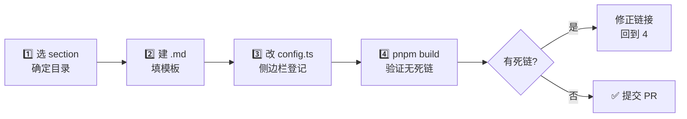

# 📝 如何新增一篇文档

<Badge type="tip" text="贡献指南" /> <Badge type="info" text="VitePress" />

> 本站基于 **VitePress** 构建。新增一篇文档只需三件事：建 `.md` 文件、在侧边栏登记、构建验证无死链。本页给出每一步的精确操作与可直接复制的模板。

## 文档结构总览

全站按内容主题分八个 section，外加贡献区。新文档要先判断它属于哪一类，再落到对应目录：

| Section | 目录 | 内容定位 | 示例页面 |
|--------|------|----------|----------|
| 🧭 指南 | `website/guide/` | 概念、入门、架构总览 | [什么是 ClassyShark](/guide/what-is-classyshark) |
| 📚 教程 | `website/tutorials/` | 端到端实操流程 | [从源码构建](/tutorials/build-from-source) |
| 🛠️ CLI | `website/cli/` | 命令行用法 | [CLI 参考](/cli/index) |
| 🖥️ GUI | `website/gui/` | 图形界面用法 | [GUI 参考](/gui/index) |
| 🔌 API | `website/api/` | Shark 编程接口 | [Shark 类](/api/shark-class) |
| 🧩 模块 | `website/reference/modules/` | 单类源码剖析 | [Main 模块](/reference/modules/Main) |
| 🚀 部署 | `website/deployment/` | 构建发布与上线 | [GitHub Pages](/deployment/github-pages) |
| 📝 贡献 | `website/contributing/` | 协作规范 | 本页 |

::: tip 模块文档单独走标杆
若是**单类模块剖析文档**（落在 `reference/modules/`），请直接参照标杆 [`Main.md`](/reference/modules/Main)：使用 `<div class="module-header">` 包 Badge、列「职责 / 关键方法 / 工作流程 / 设计要点 / 协作关系」五段式。本页模板面向普通 section 文档。
:::

## 新增流程



四步拆解如下。

### 第 1 步：在对应 section 建 `.md`

按上表选目录，建一个 kebab-case 命名的 `.md`，例如 `website/guide/my-topic.md`。文件名即 URL（`cleanUrls: true`，故 `my-topic.md` → `/guide/my-topic`，无 `.html` 后缀）。

### 第 2 步：在 `config.ts` 对应 sidebar 加链接项

打开 `website/.vitepress/config.ts`，当前每个 section 的 `sidebar` 都是空数组 `[]`：

```ts
sidebar: {
  '/guide/': [],
  '/tutorials/': [],
  '/cli/': [],
  '/gui/': [],
  '/api/': [],
  '/reference/': [],
  '/deployment/': [],
  '/contributing/': []
}
```

为新文档登记时，把目标 section 的 `[]` 替换为一个 `SidebarItem[]`，例如给 `contributing/` 增加本页：

```ts
// website/.vitepress/config.ts
sidebar: {
  '/contributing/': [
    { text: '📝 贡献指南', items: [
      { text: '新增文档', link: '/contributing/add-a-doc' },
      { text: 'CLA', link: '/contributing/cla' }
    ]}
  ],
  // 其余 section 保持 ...
}
```

::: warning link 用绝对路径且无扩展名
`link` 必须以 `/` 开头、不含 `.md`，与 `base`（`/android-classyshark-skills/`）和 `cleanUrls` 配合最终生成 `…/add-a-doc`。写错是死链的首要来源。
:::

### 第 3 步：遵循模板（Badge + emoji + 表格 + mermaid）

见下方「文档模板」一节，复制即用。

### 第 4 步：`pnpm build` 验证无死链

```bash
cd website
pnpm install      # 首次或依赖更新时
pnpm build        # vitepress build，会扫描所有内部链接
```

VitePress 构建期会检查页面里所有 Markdown 链接与侧边栏 `link`，找不到目标文件即报 `dead links`。看到形如下面的输出即通过：

```text
building client + server bundles:
✓ building client + server bundles
rendering pages...
✓ 39/39 pages built.
```

若出现 `dead link: /guide/faq`，回到对应文件修正拼写或补建目标页，再 build。

## 文档模板

```markdown
# 🦈 页面标题

<Badge type="tip" text="标签1" /> <Badge type="info" text="标签2" />

> 一句话摘要，点明本页解决什么问题。

## 它解决什么问题？

| 列A | 列B | 列C |
|-----|-----|-----|
| 📦  | 内容 | 痛点 |

## 它如何解决？


## 关键设计

- **要点 1** — 简述，必要时链接到 [TranslatorFactory](/reference/modules/TranslatorFactory)。
- **要点 2** — 简述。

## 示例

```bash
java -jar ClassyShark.jar -inspect app.apk
```

## 进一步阅读

- 🚀 [FAQ](/guide/faq) — 一句引导
- 🧩 [Main 模块](/reference/modules/Main) — 源码剖析
```

### 模板要素清单

- ✅ **顶部双 Badge** — `<Badge type="tip"/>` 与 `<Badge type="info"/>` 至少各一个。
- ✅ **首句引用块** — `>` 摘要，定调本页。
- ✅ **至少一个表格** — 横向对比或矩阵。
- ✅ **至少一个 mermaid 图** — 流程图/时序图，让流程可视化。
- ✅ **代码块** — CLI 命令、配置片段或 API 调用。
- ✅ **绝对路径内链** — 指向其它 section 或模块文档，无 `.md`、无 `.html`。
- ✅ **行数 50–160** — 信息密度高，不灌水。

## 内部链接规范

| 场景 | 写法 | 示例 |
|------|------|------|
| 普通页面 | `[文本](/section/page)` | [快速开始](/guide/quick-start) |
| 模块文档 | `[文本](/reference/modules/ClassName)` | [CliMode](/reference/modules/CliMode) |
| 同 section 相邻页 | 仍用绝对路径 | [退出码](/cli/exit-codes) |
| 外部链接 | 标准 URL | [VitePress](https://vitepress.dev) |

::: tip 链接自检
写完每条内链后，确认目标 `.md` 文件真实存在。`pnpm build` 会兜底捕获漏网之鱼，但手动确认能省一轮迭代。
:::

## 模块文档标杆对照

普通 section 文档与模块文档的差异，下表一图看清：

| 维度 | 普通 section 文档 | 模块文档（`reference/modules/`） |
|------|------------------|----------------------------------|
| 标杆 | [什么是 ClassyShark](/guide/what-is-classyshark) | [Main 模块](/reference/modules/Main) |
| Badge 容器 | 直接放在标题下 | 包在 `<div class="module-header">` 内 |
| 源码信息块 | 无 | `<div class="module-source">` 标注源码路径与包名 |
| 主体结构 | 自由组织 | 固定五段：职责 / 关键方法 / 工作流程 / 设计要点 / 协作关系 |
| mermaid | 流程图为主 | 工作流程图 + 类间调用关系 |
| 协作关系 | 一般用「进一步阅读」 | 用 `[[ClassName]]` 双链记法 |

模块文档务必对照 [`Main.md`](/reference/modules/Main) 抄结构，五段缺一不可。

## 常见坑 🕳️

| 症状 | 原因 | 修法 |
|------|------|------|
| `dead link: /guide/faq` | `link` 写成 `.md` 或拼写错 | 去扩展名、核文件名 |
| 新页不进侧边栏 | 没改 `config.ts` 的 `[]` | 在对应 section 数组追加 `SidebarItem` |
| 图表不渲染 | mermaid 代码块语言写成 `mermaid` 以外 | 必须是 ` ```mermaid ` |
| Badge 不显示 | 标签写成小写 `badge` 或漏 `type` | 用 `<Badge type="tip" text="..."/>` |
| 中文路径 404 | 文件名含空格/中文 | 全用 kebab-case 英文 |

## 验收清单 ✅

提交 PR 前自查：

- [ ] 文件落在正确 section 目录，命名 kebab-case
- [ ] `config.ts` 侧边栏已登记该页
- [ ] 顶部双 Badge + 摘要引用块齐备
- [ ] 至少一个表格 + 一个 mermaid 图
- [ ] 内部链接全为绝对路径、无 `.md`
- [ ] 行数 50–160
- [ ] `pnpm build` 无 `dead links` 报错

## 进一步阅读

- 🧩 [Main 模块](/reference/modules/Main) — 模块文档标杆，写 `reference/modules/` 时对照
- 🛠️ [CLI 参考](/cli/index) — 普通 section 文档风格参考
- 📝 [贡献者许可协议](/contributing/cla) — 提 PR 前需签 CLA
- 🚀 [本地预览](/deployment/local-preview) — `pnpm dev` 本地起站预览
