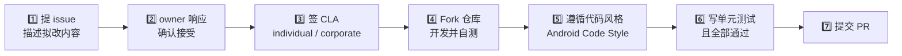

# 📝 贡献者许可协议（CLA）

<Badge type="tip" text="贡献" /> <Badge type="info" text="法律合规" />

> ClassyShark 是 Google 开源项目，任何外部贡献在合并前都需要签署一份 Contributor License Agreement（CLA）。

本页对应仓库根目录的 [`CONTRIB.md`](https://github.com/google/android-classyshark/blob/master/CONTRIB.md)，复述其 CLA 条款并说明为何需要它。

## 为什么要签 CLA 🤔

Google 旗下的开源项目普遍要求贡献者签署 CLA，目的有三：

| 目的 | 说明 |
|------|------|
| 🛡️ 知识产权清晰 | 确认你确实拥有你提交的代码，不会引发后续侵权诉讼 |
| 📜 许可可延续 | 授予 Google 在当前许可证（Apache 2.0）之外再分发、再许可的权利，避免许可证僵局 |
| ⚖️ 合规与维护 | Google 法务团队可统一管理代码资产，让项目长期可持续 |

::: tip 没签 CLA 会怎样？
PR 会在审查阶段被仓库 owner 拦下——`CONTRIB.md` 明确写道："Once we receive it, we'll be able to accept your pull requests." 即在收到并归档 CLA 之前，你的 patch 不会被合并。
:::

## 两类贡献者 👥

CLA 不是一份协议，而是按**贡献主体**分两种。请在提交前确认自己属于哪一类：

| 类型 | 适用对象 | 协议 | 签署链接 |
|------|----------|------|----------|
| 🧑‍💻 **个人 CLA** | 以个人身份写原创代码，且确信自己拥有完整知识产权的独立开发者 | Individual CLA | [Google Individual CLA](https://developers.google.com/open-source/cla/individual) |
| 🏢 **企业 CLA** | 受雇于公司、由公司授权以工作成果贡献的开发者（代码版权可能归属雇主） | Corporate CLA | [Google Corporate CLA](https://developers.google.com/open-source/cla/corporate) |

::: warning 选错类型的风险
若你受雇且代码版权归属雇主，却只签了 individual CLA，日后雇主可能主张版权，导致贡献被追溯撤销。请如实判断——拿不准时先问公司法务/开源合规办公室（OSPO）。
:::

## 签署流程 🚀

`CONTRIB.md` 规定的贡献一条龙流程如下：

要点拆解：

- **先 issue 后 PR** — 不要直接丢 PR，先在 issue 里描述你的提议，等 owner 回复确认方向。
- **CLA 时机** — `CONTRIB.md` 第 3 步：若改动被接受且你尚未签 CLA，此时再签即可。也就是说你可以先讨论、后签协议。
- **代码风格** — 遵循 [Android Code Style Guide](https://source.android.com/source/code-style.html)，与目标 sample 中已有风格保持一致。
- **测试** — 代码需附带"恰当的单元测试集"且全部通过，ClassyShark 的测试基线见 [部署与测试](/deployment/testing)。
- **提交 PR** — 以上齐备后，从你的 fork 向主仓库发起 pull request。

## 常见问题 ❓

### CLA 只签一次吗？

是。同一份 CLA 覆盖你对 Google 旗下所有开源项目的后续贡献，无需每个 PR 重签。但 individual 与 corporate 是两份独立协议，若你的身份从个人转变为公司雇员，需要补签 corporate CLA。

### 签了 CLA 会改变代码的版权归属吗？

不会。你**保留**对你代码的版权，CLA 只是授予 Google 一份**再许可权**（license grant）。代码仍以仓库的 Apache 2.0 许可证对外发布，见 [LICENSE.txt](https://github.com/google/android-classyshark/blob/master/LICENSE.txt)。

### 我只想提个小 bugfix，也要签吗？

是的。`CONTRIB.md` 未设最小门槛，任何被合并的外部 patch 都要求 CLA。这是合规底线，与改动大小无关。

## 相关链接 🔗

- 📄 仓库原始条款：[`CONTRIB.md`](https://github.com/google/android-classyshark/blob/master/CONTRIB.md)
- 🧑‍💻 个人 CLA：<https://developers.google.com/open-source/cla/individual>
- 🏢 企业 CLA：<https://developers.google.com/open-source/cla/corporate>
- 🎨 代码风格：<https://source.android.com/source/code-style.html>
- 📜 项目许可证：[Apache 2.0](/contributing/license) · 原始 [`LICENSE.txt`](https://github.com/google/android-classyshark/blob/master/LICENSE.txt)
