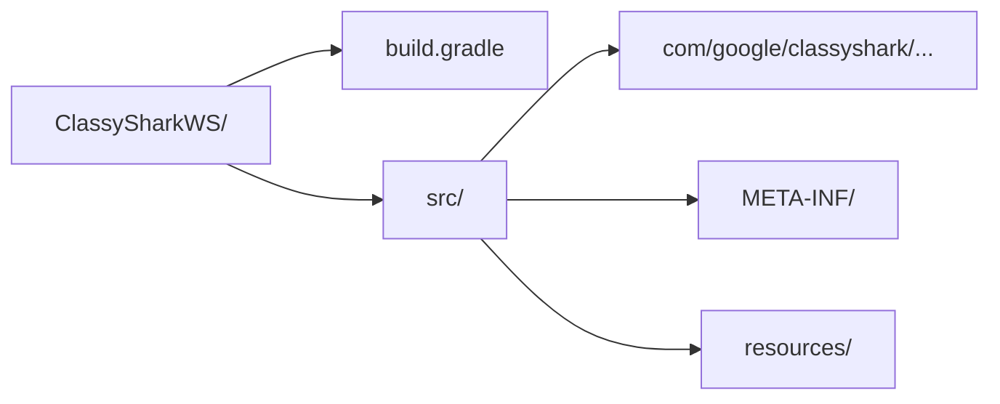

# 📐 代码风格

<Badge type="tip" text="贡献" /> <Badge type="info" text="规范" />

> ClassyShark 遵循 [Android Code Style Guide](https://source.android.com/source/code-style.html)，并保留了若干历史既定风格。提交前请确保你的代码与既有风格一致。

## 核心原则

| 维度 | 既定风格 | 说明 |
|------|----------|------|
| 📦 包名 | `com.google.classyshark` | 根包固定，子包按职责拆分（`silverghost` / `gui` / `cli` / `analytics` / `updater`） |
| 📄 类头注释 | Apache 2.0 license 头 | 每个 `.java` 文件顶部固定 14 行 license 块 |
| 🗂️ 源码布局 | 非 Maven 标准布局 | `ClassySharkWS` 用 `src/` 而非 `src/main/java/` |
| 🔒 单例 | `enum` 模式 | `Analytics` / `SherlockHash` / `CurrentFolderConfig` 均用 `enum INSTANCE` |
| 🧩 策略 + 工厂 | 接口 + 工厂分发 | `BinaryContentReader` / `Translator` / `MethodCountExporter` |
| ⚙️ 后台处理 | `SwingWorker` | 避免阻塞 EDT（Event Dispatch Thread） |

## 📄 License 类头

每个 Java 文件必须以 Apache 2.0 license 块开头，年份与作者固定写法：

```java
/*
 * Copyright 2015 Google, Inc.
 *
 * Licensed under the Apache License, Version 2.0 (the "License");
 * you may not use this file except in compliance with the License.
 * You may obtain a copy of the License at
 *
 *   http://www.apache.org/licenses/LICENSE-2.0
 *
 * Unless required by applicable law or agreed to in writing, software
 * distributed under the License is distributed on an "AS IS" BASIS,
 * WITHOUT WARRANTIES OR CONDITIONS OF ANY KIND, either express or implied.
 * See the License for the specific language governing permissions and
 * limitations under the License.
 */

package com.google.classyshark.silverghost.translator;
```

> 📌 实际年份按文件历史而定（2015 / 2016 / 2017）。新文件统一用提交当年，但不要改动既有文件年份。

## 🗂️ 非标准源码布局

`ClassySharkWS` 采用 **扁平 `src/`** 布局，而非 Android/Maven 的 `src/main/java/`：



对比：

| 模块 | 布局 | 入口 |
|------|------|------|
| `ClassySharkWS` | `src/com/google/classyshark/Main.java` | [`Main`](/reference/modules/Main) |
| `Samples/SampleGradle` | `src/main/java/Main.java` | 标准 Gradle 布局 |
| `ClassySharkAndroid` | `app/src/main/java/...` | 标准 Android 布局 |

> ⚠️ 改动 `ClassySharkWS` 的源码路径会破坏 `build.gradle` 的 sourceSet，保持现状。

## 🔒 单例用 `enum` 模式

ClassyShark 不用 `private constructor + getInstance()`，而是用 **enum 单例**（线程安全、防反射攻击、最简洁）：

```java
// Analytics.java —— 标准写法
public enum Analytics {
    INSTANCE;

    public void addActivation() {
        JGoogleAnalyticsTracker tracker = new JGoogleAnalyticsTracker(
                "ClassyShark-Activation",
                Version.MAJOR + "." + Version.MINOR,
                "UA-91889970-1");
        tracker.trackAsynchronously(new FocusPoint("Activation"));
    }
}
```

调用方直接 `Analytics.INSTANCE.addActivation()`（见 [`Main`](/reference/modules/Main)）。其他 enum 单例：

- [`SherlockHash`](/reference/modules/SherlockHash) — 缓存 zip 内临时文件
- [`CurrentFolderConfig`](/reference/modules/CurrentFolderConfig) — 持久化最近目录到 `classyshark.properties`
- [`RecentArchivesConfig`](/reference/modules/RecentArchivesConfig) — 最近归档历史

> ✅ 新增全局单例时，优先 `enum INSTANCE`，而非手写 double-checked locking。

## 🧩 策略接口 + 工厂

ClassyShark 用 **接口定义策略 + 静态工厂按扩展名分发**，可读性高于 SPI/反射：

```java
// BinaryContentReader.java —— 策略接口
public interface BinaryContentReader {
    void read();
    List<String> getClassNames();
    List<ContentReader.Component> getComponents();
}
```

工厂按扩展名选择实现：

```java
// ContentReader 构造器 —— 工厂分发
if (archiveName.endsWith(".jar"))      formatReader = new JarReader(binaryArchive);
else if (archiveName.endsWith(".dex")) formatReader = new DexReader(binaryArchive);
else if (archiveName.endsWith(".apk")) formatReader = new ApkReader(binaryArchive);
else if (archiveName.endsWith(".aar")) formatReader = new AarReader(binaryArchive);
else                                   formatReader = new ClazzReader(binaryArchive);
```

同样的模式还出现在：

| 接口 | 工厂 | 实现 |
|------|------|------|
| [`Translator`](/reference/modules/Translator) | [`TranslatorFactory`](/reference/modules/TranslatorFactory) | `AndroidXmlTranslator` / `DexInfoTranslator` / `ElfTranslator` / `JavaTranslator` … |
| [`BinaryContentReader`](/reference/modules/BinaryContentReader) | `ContentReader` | `ApkReader` / `DexReader` / `JarReader` / `AarReader` / `ClazzReader` |
| [`MethodCountExporter`](/reference/modules/MethodCountExporter) | 调用方选择 | `TreeMethodCountExporter` / `FlatMethodCountExporter` |

> 📐 新增格式支持时：实现策略接口 → 在工厂的 `if/endsWith` 链中加一分支，无需改调用方。

## ⚙️ SwingWorker 避免阻塞 EDT

GUI 所有耗时操作（读归档、翻译类、导出、读 mapping）都包在 `SwingWorker` 里，`doInBackground()` 跑后台线程，`done()` 回 EDT 刷新 UI：

```java
// ClassySharkPanel.readArchiveAndFillDisplayArea —— 标准范式
SwingWorker<Void, Void> worker = new SwingWorker<Void, Void>() {
    @Override
    protected Void doInBackground() throws Exception {
        silverGhost.readContents();   // 后台：解析归档
        return null;
    }

    @Override
    protected void done() {            // EDT：刷新类树/显示区
        if (silverGhost.isArchiveError()) {
            filesTree.fillArchive(new File("ERROR"), ...);
            displayArea.displayError();
            return;
        }
        filesTree.fillArchive(silverGhost.getBinaryArchive(),
                silverGhost.getAllClassNames(),
                silverGhost.getComponents());
        isDataLoaded = true;
    }
};
worker.execute();
```

> 🚫 切勿在 EDT 直接调 `silverGhost.readContents()`，会冻结 UI。所有 I/O 一律走 `SwingWorker`。

## 📝 其他细节

- **命名** — 类名 UpperCamelCase，方法/字段 lowerCamelCase，常量 `UPPER_SNAKE`（如 `ANDROID_MANIFEST_XML_SEARCH`）。
- **字段** — 优先 `private final`，可变集合用 `new ArrayList<>()` 初始化。
- **4 空格缩进**，无 tab；花括号 K&R 风格。
- **import** — 按包分组顺序排列，无通配符 `*`。
- **注释** — 简洁 Javadoc，类头一行说明职责（如 `/** Creates translators based on class names and archives */`）。

## 进一步阅读

- 📜 [CONTRIB.md](https://github.com/google/android-classyshark/blob/master/CONTRIB.md) — CLA 与提交流程
- 🏗️ [架构总览](/guide/architecture-overview) — 分层架构与策略模式
- 🧩 [TranslatorFactory](/reference/modules/TranslatorFactory) — 工厂分发示例
- 🔒 [SherlockHash](/reference/modules/SherlockHash) — enum 单例示例
