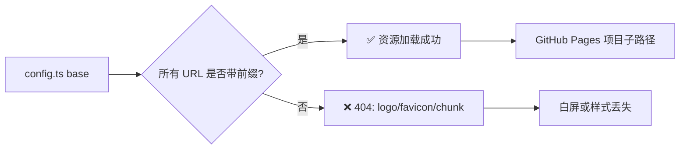

# 🧭 Base Path 配置

<Badge type="tip" text="部署" /> <Badge type="info" text="VitePress" />

> VitePress 的 `base` 决定站点所有静态资源与路由 URL 的公共前缀。本仓库部署到 GitHub Pages 项目子路径，因此 `base` 必须与仓库名严格对齐。

## 🎯 当前配置

仓库根 `website/.vitepress/config.ts` 已设：

```ts
import { defineConfig } from 'vitepress'

export default defineConfig({
  base: '/android-classyshark-skills/', // 👈 公共前缀 = /仓库名/
  cleanUrls: true,
  sitemap: {
    hostname: 'https://android-security-engineer.github.io/android-classyshark-skills/'
  },
  head: [
    ['link', { rel: 'icon', href: '/android-classyshark-skills/logo.svg' }]
  ],
  themeConfig: {
    logo: '/logo.svg' // 👈 相对 base 解析，实际 URL = /android-classyshark-skills/logo.svg
  }
})
```

::: tip 为什么需要 base
GitHub Pages 的项目站点 URL 形如 `https://<user>.github.io/<repo>/`。若 `base` 设为 `/`，浏览器会去 `https://<user>.github.io/logo.svg` 取资源，返回 404，导致 logo、favicon、JS chunk 全部加载失败。`base` 的作用就是把所有 URL 统一加上 `/android-classyshark-skills/` 前缀。
:::

## 📐 前缀作用范围

`base` 会自动注入到下列路径前，无需手动拼接：

| 资源类型 | 配置位置 | 解析后实际 URL |
|----------|----------|----------------|
| 🦈 Logo | `themeConfig.logo: '/logo.svg'` | `/android-classyshark-skills/logo.svg` |
| 🌐 Favicon | `head[].href`（写全前缀） | `/android-classyshark-skills/logo.svg` |
| 📦 JS/CSS chunk | Vite 自动注入 | `/android-classyshark-skills/assets/xxx.js` |
| 📄 页面路由 | `cleanUrls` 路由 | `/android-classyshark-skills/guide/what-is-classyshark` |
| 🗺️ Sitemap 条目 | `sitemap.hostname` 拼接 | `https://android-security-engineer.github.io/android-classyshark-skills/...` |



::: warning favicon 的特殊写法
`head` 里的 `href` 不会自动拼 `base`（VitePress 对 `head` 标签原样输出），所以 favicon 必须手动写完整前缀 `/android-classyshark-skills/logo.svg`，否则会 404。而 `themeConfig.logo` 会自动拼 `base`，写 `/logo.svg` 即可。
:::

## 🚀 部署目标对照

| 部署方式 | Pages URL | base 应设为 |
|----------|-----------|------------|
| 项目子路径（默认） | `https://android-security-engineer.github.io/android-classyshark-skills/` | `/android-classyshark-skills/` |
| 仓库根域（自定义域名） | `https://custom-domain.com/` | `/` |
| 用户站点 | `https://android-security-engineer.github.io/` | `/` |

## 🔄 切换到自定义域名

若改用仓库根域（自定义域名，如 `https://classyshark.dev/`），需同步改三处：

```ts
// website/.vitepress/config.ts
export default defineConfig({
  base: '/',                                              // ① base 改为根
  sitemap: {
    hostname: 'https://classyshark.dev/'                 // ② hostname 改为自定义域
  },
  head: [
    ['link', { rel: 'icon', href: '/logo.svg' }]         // ③ favicon 去掉前缀
  ],
  // themeConfig.logo 无需改，始终写 '/logo.svg'
})
```

::: danger 别忘了 DNS 与 Pages 设置
改完 `config.ts` 后，还需：1）在域名服务商把自定义域 A/CNAME 记录指向 GitHub Pages；2）仓库 Settings → Pages → Custom domain 填入域名并勾选 Enforce HTTPS。否则即使 `base` 正确，站点也无法访问。
:::

## 📝 修改指引清单

切换部署目标时按顺序勾选：

- [ ] 修改 `base`（项目子路径 → `/仓库名/`；自定义域 → `/`）
- [ ] 修改 `sitemap.hostname`（与最终访问 URL 一致，含协议与尾斜杠）
- [ ] 修改 `head` 中 favicon 的 `href`（与 `base` 保持同步带/不带前缀）
- [ ] `themeConfig.logo` 保持 `/logo.svg`（自动拼 `base`，无需改）
- [ ] 自定义域名场景：配置 DNS + Pages Custom domain
- [ ] 本地预览：`pnpm dev` 时 VitePress 会自动应用 `base`，访问 `http://localhost:5173/android-classyshark-skills/`

## 🔗 相关文档

- [本地预览](/deployment/local-preview) — `pnpm dev` 如何处理 `base` 前缀
- [GitHub Pages 部署](/deployment/github-pages) — CI/CD 工作流与 Pages 配置
- 完整配置见仓库根 [`website/.vitepress/config.ts`](https://github.com/android-security-engineer/android-classyshark-skills/blob/master/website/.vitepress/config.ts)
