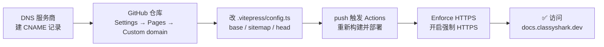

# 🌐 自定义域名

<Badge type="tip" text="部署" /> <Badge type="info" text="自定义域名" />

> 默认站点托管在 `https://android-security-engineer.github.io/android-classyshark-skills/`，路径带仓库名前缀。绑定自定义域名（如 `docs.classyshark.dev`）后可去掉前缀，访问根路径 `https://docs.classyshark.dev/`，更专业、更易传播。

## 前后对比

| 项 | 默认（GitHub Pages 子路径） | 自定义域名 |
|----|-----------------------------|------------|
| 🌍 站点 URL | `…github.io/android-classyshark-skills/` | `https://docs.classyshark.dev/` |
| 📂 `base` | `/android-classyshark-skills/` | `/` |
| 🗺️ sitemap hostname | `…github.io/android-classyshark-skills/` | `https://docs.classyshark.dev` |
| 🖼️ 资源路径 | 带 `/android-classyshark-skills/` 前缀 | 去前缀，根路径 |
| 🔗 DNS | 无 | 需 CNAME 记录 |

## 总流程



## 步骤一：建 CNAME 记录

到你的域名 DNS 服务商（Cloudflare / 阿里云 / DNSPod 等）添加一条 **CNAME** 记录，将自定义域名指向 GitHub Pages 默认地址。

| 记录类型 | 主机记录 | 记录值 |
|----------|----------|--------|
| CNAME | `docs`（或 `@`/`www`） | `android-security-engineer.github.io.` |

::: warning ⚠️ 记录值注意
- 指向的是 **用户/组织级** Pages 地址 `android-security-engineer.github.io`，**不要**带仓库名 `/android-classyshark-skills`
- 末尾的点 `.` 是 DNS 规范的根域标记，多数服务商可省略
- 若用**子域名**（`docs.classyshark.dev`）走 CNAME；若用**顶级域**（`classyshark.dev`）需 A 记录指向 GitHub Pages IP，参考 [GitHub 官方 IP 列表](https://docs.github.com/en/pages/configuring-a-custom-domain-for-your-github-pages-site/managing-a-custom-domain-for-your-github-pages-site)
:::

DNS 生效通常需要几分钟到数小时，可用 `dig` 或 `nslookup` 验证：

```bash
dig docs.classyshark.dev +short
# 期望输出: xxx.xxx.xxx.elb.amazonaws.com 之类 GitHub Pages 的 CNAME 链
```

## 步骤二：仓库 Settings → Pages → Custom domain

1. 打开仓库 `Settings → Pages`
2. 在 **Custom domain** 输入框填入 `docs.classyshark.dev`
3. 点击 **Save**
4. GitHub 会自动在仓库根创建一个 `CNAME` 文件（无扩展名），内容就是该域名

> 📌 该 `CNAME` 文件会被 `actions/deploy-pages` 识别，部署时自动附带，无需手动提交。但若手动部署，则需把 `CNAME` 放到 `dist/` 根目录。

## 步骤三：改 `config.ts`

这是最关键的一步。当前 [`website/.vitepress/config.ts`](https://github.com/android-security-engineer/android-classyshark-skills/blob/master/website/.vitepress/config.ts) 中有三处带 `/android-classyshark-skills/` 前缀的配置需要改。

### 改动前（当前状态）

```ts
export default defineConfig({
  // ...
  base: '/android-classyshark-skills/',          // [!code highlight]
  // ...
  sitemap: {
    hostname: 'https://android-security-engineer.github.io/android-classyshark-skills/'  // [!code highlight]
  },
  head: [
    ['link', { rel: 'icon', href: '/android-classyshark-skills/logo.svg' }],           // [!code highlight]
    ['meta', { name: 'theme-color', content: '#2b5fff' }]
  ],
  themeConfig: {
    logo: '/logo.svg',   // 注意：此项本就无前缀，无需改
    // ...
  }
})
```

### 改动后（自定义域名）

```ts
export default defineConfig({
  // ...
  base: '/',                                                              // [!code ++]
  // ...
  sitemap: {
    hostname: 'https://docs.classyshark.dev'                             // [!code ++]
  },
  head: [
    ['link', { rel: 'icon', href: '/logo.svg' }],                         // [!code ++]
    ['meta', { name: 'theme-color', content: '#2b5fff' }]
  ],
  themeConfig: {
    logo: '/logo.svg',   // 保持不变
    // ...
  }
})
```

### 三处改动说明

| 配置项 | 改动 | 原因 |
|--------|------|------|
| `base` | `/android-classyshark-skills/` → `/` | 自定义域名从根路径提供服务，不再需要仓库名前缀 |
| `sitemap.hostname` | 改为 `https://docs.classyshark.dev` | sitemap.xml 与 canonical URL 指向新域名，利于 SEO |
| `head` favicon `href` | 去 `/android-classyshark-skills` 前缀 | `base` 已改 `/`，favicon 路径须同步去前缀，否则图标 404 |

::: tip `themeConfig.logo` 为什么不用改
当前 `logo: '/logo.svg'` 本身就无前缀。但要注意：当 `base` 非 `/` 时，VitePress 会自动给 `themeConfig.logo` 拼上 `base`；当 `base` 为 `/` 时拼上 `/` 等于不变，故图标仍指向 `/logo.svg`，正确。**只有 `head` 里手写的绝对路径不会自动拼 `base`**，所以必须手动去前缀。
:::

## 步骤四：push 触发重新部署

```bash
cd website/.vitepress
git add config.ts
git commit -m "deploy: 绑定自定义域名 docs.classyshark.dev"
git push origin master
```

push 后会触发 [GitHub Actions 文档工作流](./github-actions) 重新构建并部署。部署完成后访问 `https://docs.classyshark.dev/` 即可看到站点。

## 步骤五：Enforce HTTPS

回到 `Settings → Pages`，勾选 **Enforce HTTPS**。GitHub 会自动为自定义域名签发 Let's Encrypt 证书，开启后所有 HTTP 请求被 301 重定向到 HTTPS。

::: warning DNS 未生效时 Enforce HTTPS 灰显
DNS 尚未完全传播时，该选项不可勾选。等 `dig` 解析到 GitHub Pages 后再刷新页面勾选，通常 10 分钟内即可。
:::

## 校验清单

部署完成后逐项检查：

| ✅ | 检查项 | 命令 / 方法 |
|----|--------|-------------|
| ☐ | DNS 已指向 GitHub | `dig docs.classyshark.dev +short` 非空 |
| ☐ | 根路径可访问 | 浏览器开 `https://docs.classyshark.dev/` |
| ☐ | favicon 正常加载 | DevTools Network 看 `/logo.svg` 200 |
| ☐ | 内部链接无 404 | 点 [CLI 参考](/cli/index)、[GUI 参考](/gui/index) |
| ☐ | sitemap 正确 | 访问 `https://docs.classyshark.dev/sitemap.xml` |
| ☐ | HTTPS 强制跳转 | `curl -I http://docs.classyshark.dev/` 返回 301 |
| ☐ | 旧地址仍可达 | `https://…github.io/android-classyshark-skarks/` 会 301 到新域名 |

## 常见问题

| 现象 | 原因 | 解决 |
|------|------|------|
| 🚫 favicon 404 | `head` 里 favicon 路径未去前缀 | 改 `href: '/logo.svg'` |
| 🚫 资源全 404 / 样式丢失 | `base` 未改 `/` | `base: '/'` |
| 🚫 站点打不开 | DNS 未生效或 CNAME 指错 | 确认指向 `android-security-engineer.github.io`，`dig` 验证 |
| 🚫 HTTPS 证书错误 | 未等证书签发就强开 HTTPS | 等 10 分钟，或在 Pages 取消 Enforce 再重勾 |
| 🚫 sitemap 仍是旧域名 | `sitemap.hostname` 未改 | 改为新域名后重新 `pnpm build` |
| ⚠️ 旧地址 404 而非 301 | 仓库 `CNAME` 文件丢失 | `Settings → Pages` 重新 Save Custom domain |

## 进一步阅读

- 🚀 [GitHub Pages 部署](./github-pages) — 默认部署流程与 Actions 工作流
- ⚙️ [GitHub Actions 详解](./github-actions) — `docs.yml` 完整解读
- 📂 [Base Path 配置](./base-path) — `base` 与 `cleanUrls` 的协作机制
- 🧪 [本地预览](./local-preview) — 改完配置后本地校验再推送
- 📖 [GitHub 自定义域名官方指南](https://docs.github.com/en/pages/configuring-a-custom-domain-for-your-github-pages-site)
