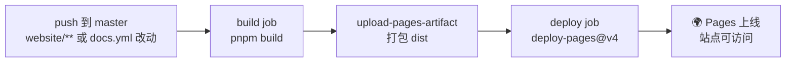

# 🚀 GitHub Pages 部署

<Badge type="tip" text="部署" /> <Badge type="info" text="GitHub Pages" />

> 本仓库通过 **GitHub Actions 构建 VitePress 文档站并部署到 GitHub Pages**，推送即发布，无需手动上传产物。

## 站点地址

| 项 | 值 |
|----|-----|
| 🌍 站点 URL | `https://android-security-engineer.github.io/android-classyshark-skills/` |
| 📂 仓库 | `android-security-engineer/android-classyshark-skills` |
| 🔧 构建工具 | VitePress 1.x + pnpm |
| 🤖 CI/CD | `.github/workflows/docs.yml`（GitHub Actions） |

::: tip 为何是 `/android-classyshark-skills/` 前缀
GitHub Pages 项目站点按 `<user>.github.io/<repo>/` 组织，VitePress 的 `base` 必须设为 `/android-classyshark-skills/` 才能让 logo、JS、路由全部正确加载，详见 [Base Path 配置](./base-path)。
:::

## 部署流程总览



| 环节 | 触发 / 执行 | 说明 |
|------|------------|------|
| 📥 触发 | `push` 到 `master`，且改动在 `website/**` 或 workflow 自身 | 避免改 Java 源码白跑一次 |
| 🏗️ 构建 | `pnpm install --frozen-lockfile && pnpm build` | 产物输出到 `website/.vitepress/dist` |
| 📤 上传 | `actions/upload-pages-artifact@v3` | 把 `dist` 打成 Pages artifact |
| 🚀 部署 | `actions/deploy-pages@v4` | 发布到 Pages 环境 |

## 一次性配置（仅首次）

部署前需要在仓库设置里做**一次**手工配置：

| 配置项 | 位置 | 取值 |
|--------|------|------|
| Pages Source | Settings → Pages → Build and deployment → Source | **`GitHub Actions`** |
| Workflow permissions | Settings → Actions → General → Workflow permissions | **`Read and write permissions`** |

::: danger Source 必须选 GitHub Actions
若 Source 选的是 `Deploy from a branch`，即便 workflow 全绿，Pages 也取不到 CI 产物，站点表现为 404 或空白。切换后首次部署需在 Actions 里手动跑一次或重新 push。
:::

## 部署步骤（日常流程）

```bash
# 1) 改完文档，本地先构建验证
cd website && pnpm build

# 2) 提交并推送 —— 命中 paths 过滤即自动触发 docs.yml
git add website .github/workflows/docs.yml
git commit -m "docs: update ..."
git push origin master

# 3) 到仓库 Actions 页观察 build → deploy 两个 job 依次变绿
```

部署完成后访问 `https://android-security-engineer.github.io/android-classyshark-skills/` 即可看到站点。

## 校验清单

| ✅ | 检查项 | 方法 |
|----|--------|------|
| ☐ | Pages 已启用 | Settings → Pages → Source = `GitHub Actions` |
| ☐ | Actions 运行成功 | 仓库 Actions 页 `build` 与 `deploy` 均绿 |
| ☐ | 站点可访问 | 浏览器打开站点 URL |
| ☐ | 资源不 404 | DevTools Network 看 `/android-classyshark-skills/logo.svg` 返回 200 |
| ☐ | 仓库 homepage 已绑定 | 仓库主页「About」显示站点 URL |

## 常见问题

| 现象 | 原因 | 解决 |
|------|------|------|
| 🚫 站点 404/空白 | Pages Source 仍是 branch 而非 GitHub Actions | Settings → Pages → Source 切到 GitHub Actions |
| 🚫 资源全 404 | `base` 未对齐仓库名 | 确认 `base: '/android-classyshark-skills/'`，见 [base-path](./base-path) |
| 🚫 只改了 Java 没部署 | paths 过滤只响应 `website/**` | 属预期行为；需要时用 `workflow_dispatch` 手动触发 |
| 🚫 deploy 报 403 无权限 | Workflow permissions 被收窄为只读 | 改为 `Read and write permissions`，见 [troubleshooting](./troubleshooting-deploy#_7-deploy-job-无权限) |

## 相关文档

- ⚙️ [GitHub Actions 详解](./github-actions) — `docs.yml` 完整 yaml 与逐行解读
- 🧭 [Base Path 配置](./base-path) — `base` 与资源 URL 的关系
- 🧪 [本地预览](./local-preview) — 本地复现 CI 构建产物
- 🔧 [部署故障排查](./troubleshooting-deploy) — 7 类高频部署失败根因与解决
