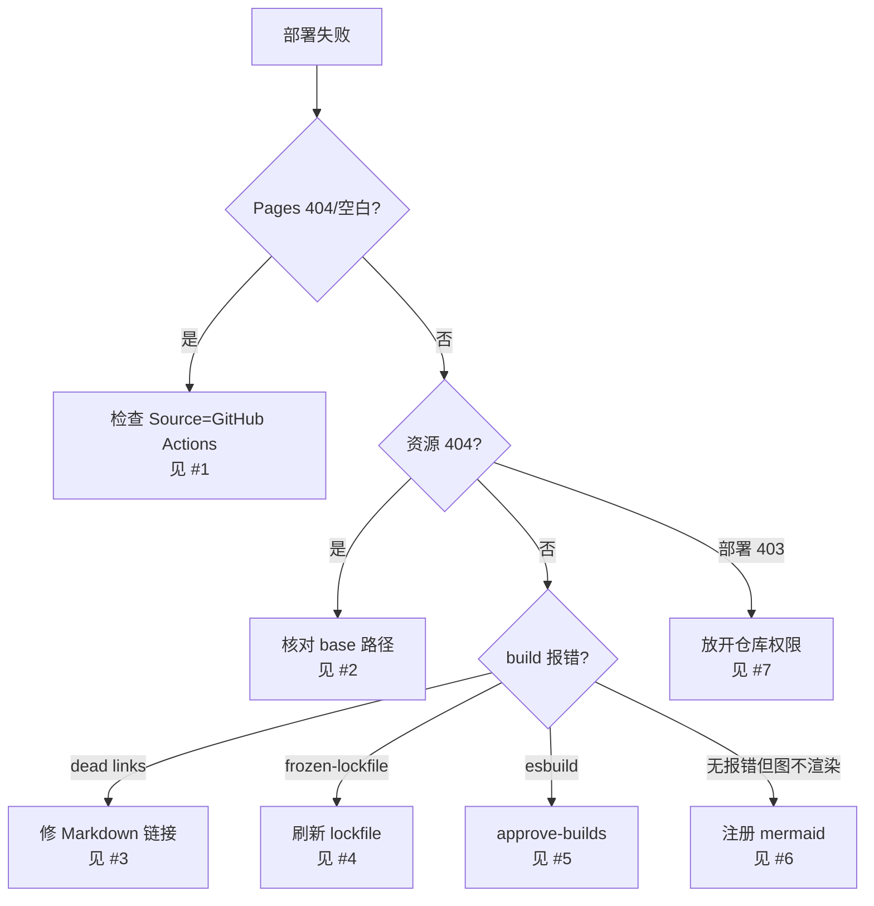

# 🔧 部署故障排查

<Badge type="tip" text="部署" /> <Badge type="info" text="GitHub Pages" />

> 把 ClassyShark 文档站部署到 GitHub Pages 时的高频问题。每条给出**根因**与**解决步骤**，照着改即可。

## 故障速查表

| # | 症状 | 根因关键词 | 跳转 |
|---|------|------------|------|
| 1 | Pages 打开是 404 / 空白 | Source 未选 GitHub Actions | [#1](#_1-pages-打开-404-空白) |
| 2 | JS/CSS/图片 404 | `base` 路径不匹配 | [#2](#_2-静态资源-404) |
| 3 | build 报 dead links | Markdown 内部链接写错 | [#3](#_3-build-失败-dead-links) |
| 4 | CI 在 `pnpm install --frozen-lockfile` 失败 | lock 与 package 不同步 | [#4](#_4-frozen-lockfile-失败) |
| 5 | esbuild 安装被忽略 | pnpm 拦截构建脚本 | [#5](#_5-esbuild-被-pnpm-忽略) |
| 6 | mermaid 图不渲染 | 主题未注册组件 | [#6](#_6-mermaid-不渲染) |
| 7 | deploy job 403 / 没产物 | 仓库权限未放开 | [#7](#_7-deploy-job-无权限) |

---

## #1 Pages 打开 404 / 空白

**原因** 🎯 仓库的 Pages 服务源（Source）仍指向 `gh-pages` 分支或 `/(root)`，而本仓库用 GitHub Actions 把构建产物推到 `gh-pages`。源没切到 Actions 时，Pages 找不到对应产物，返回 404 或站点根空白。

**解决** ✅

1. 进入仓库 **Settings → Pages**。
2. **Build and deployment → Source** 选 `GitHub Actions`（而非 `Deploy from a branch`）。
3. 确认部署 workflow 在 `permissions` 里声明了 `pages: write` 与 `id-token: write`，并用官方 action 上传产物：

```yaml
permissions:
  contents: read
  pages: write
  id-token: write

jobs:
  deploy:
    environment:
      name: github-pages
      url: ${{ steps.deployment.outputs.page_url }}
    steps:
      - uses: actions/deploy-pages@v4
        id: deployment
```

4. 推一次 commit 触发 workflow，回到 Pages 页面应能看到绿色部署记录和站点 URL。

> 💡 切换 Source 后第一条 workflow 跑完前页面可能仍是旧状态，等 Actions 完成再刷新。

## #2 静态资源 404

**原因** 🎯 VitePress 的 `base` 配置与实际部署路径不一致。本仓库 `config.ts` 设的是：

```ts
base: '/android-classyshark-skills/'
```

若部署在用户/组织页（`<user>.github.io/<repo>/`），`base` 必须是 `/<repo>/`；若 `base` 漏写或写错，浏览器会去 `https://...github.io/assets/...` 取资源 → 全部 404，表现为页面打开但样式丢失、白屏。

**解决** ✅

| 部署目标 | 正确 `base` |
|----------|-------------|
| 项目页 `user.github.io/<repo>/` | `/<repo>/`（本仓库即 `/android-classyshark-skills/`） |
| 用户/组织根页 `user.github.io/` | `/` |

- 检查 `.vitepress/config.ts` 的 `base` 是否等于仓库名加前后斜杠。
- 若改了仓库名，记得同步更新 `head` 里 `favicon` 的 `href`（也是 `/android-classyshark-skills/logo.svg`）。
- 本地预览用 `pnpm dev`，浏览器路径前缀会自动带上 `base`，便于复现资源 404。

## #3 build 失败 dead links

**原因** 🎯 Markdown 里写了指向不存在页面的内部链接，VitePress 在 `build` 阶段做死链检查并直接报错中断，典型信息：

```
[missing-inline-code]dead link: /reference/modules/Foo
```

常见写错方式：相对路径多/少一层、`.md` 后缀残留、链接到尚未创建的文档。

**解决** ✅

1. 看报错里列出的目标路径，逐个核对其在 `website/` 下的真实文件位置。
2. 内部链接统一用**绝对路径且不带 `.md`**，例如：

```markdown
正确 ✅  详见 [TranslatorFactory](/reference/modules/TranslatorFactory)
错误 ❌  详见 [TranslatorFactory](../reference/modules/TranslatorFactory.md)
```

3. 启用 `cleanUrls` 时（本仓库已开），URL 不要带 `.html`，也不要带 `.md`。
4. 临时排查可跑 `pnpm build` 看完整死链清单，修完再推。

## #4 frozen-lockfile 失败

**原因** 🎯 CI 用 `pnpm install --frozen-lockfile`，要求 `pnpm-lock.yaml` 与 `package.json` 完全一致。当有人改了 `package.json`（加依赖、升版本）却没重新生成 lock，frozen 模式拒绝写入并失败：

```
ERR_PNPM_OUTDATED_LOCKFILE
```

**解决** ✅

1. 本地先跑一次不带 frozen 的安装，刷新 lock：

```bash
cd website
pnpm install
git add pnpm-lock.yaml package.json
git commit -m "chore(docs): update pnpm lockfile"
```

2. 推送后 CI 的 `--frozen-lockfile` 就能通过。
3. 长期建议：在 PR CI 里加一步校验 `pnpm install --frozen-lockfile`，提前拦住不一致提交。

## #5 esbuild 被 pnpm 忽略

**原因** 🎯 VitePress 依赖 `esbuild`，它带安装期构建脚本。pnpm（v9+ 默认）出于安全会**拦截依赖的构建脚本**，导致 `esbuild` 的 postinstall 没执行，`build` 时报：

```
Error: esbuild ... you installed esbuild on another platform
```

或 `Cannot find module .../esbuild/bin/esbuild`。

**解决** ✅

1. 显式批准构建脚本：

```bash
pnpm approve-builds
# 交互式勾选 esbuild（以及 vitepress 需要的其它包）
pnpm install
```

2. 或在 `website/package.json` 里写明白名单，免去交互：

```json
{
  "pnpm": {
    "onlyBuiltDependencies": ["esbuild"]
  }
}
```

3. CI 里若用 `pnpm install --frozen-lockfile`，确认上述配置已提交，否则 CI 同样会被拦。

## #6 mermaid 不渲染

**原因** 🎯 `package.json` 引了 `mermaid` 依赖，但 VitePress **不会自动识别 `mermaid` 代码块**——必须在主题里注册 `Mermaid` 组件并包裹 Markdown。本仓库当前 `.vitepress/theme/index.ts` 只 `extends DefaultTheme`，没有这一步，所以图块会原样显示成代码而非图形。

**解决** ✅

1. 安装 vitepress 的 mermaid 插件（与已装的 `mermaid` 版本对齐）：

```bash
pnpm add -D vitepress-plugin-mermaid mermaid
```

2. 在 `.vitepress/theme/index.ts` 注册：

```ts
import DefaultTheme from 'vitepress/theme'
import { Mermaid } from 'vitepress-plugin-mermaid'
import type { Theme } from 'vitepress'
import './custom.css'

export default {
  extends: DefaultTheme,
  enhanceApp({ app }) {
    app.component('Mermaid', Mermaid)
  }
} satisfies Theme
```

3. 在 `config.ts` 里给 markdown 配置 mermaid（按插件文档启用 `markdown-it` 钩子）。
4. 本地 `pnpm dev` 验证图块已渲染成图形，再推送。

> ⚠️ mermaid 在 SSR（`build`）阶段偶有报错，若构建挂掉可在主题里用 `if (import.meta.client)` 守卫渲染逻辑。

## #7 deploy job 无权限

**原因** 🎯 `deploy-pages` 需要 `pages: write` + `id-token: write` 两个权限，且 job 必须跑在 `environment: github-pages`。若仓库 Settings 默认收紧了 Actions 权限，或 workflow 缺少 `permissions` 块，部署步骤会 403 或上传空产物：

```
Error: No Pages artifact found
HTTP 403: Resource not accessible by integration
```

**解决** ✅

1. **Settings → Actions → General → Workflow permissions** 选 `Read and write permissions`，并勾选允许 Actions 创建 PR。
2. workflow 顶层声明权限（见 [#1](#_1-pages-打开-404-空白) 的代码块），deploy job 配 `environment: github-pages`。
3. 确认上传产物用 `actions/upload-pages-artifact@v3`，`path` 指向 `website/.vitepress/dist`：

```yaml
- uses: actions/upload-pages-artifact@v3
  with:
    path: website/.vitepress/dist
```

4. 若用第三方 action 推 `gh-pages` 分支而非官方 deploy-pages，则改在 **Settings → Pages → Source** 选该分支并配 `/(root)`，二选一不要混用。

---

## 排查流程总览



## 进一步阅读

- 🚀 [部署到 GitHub Pages](./github-pages) — 完整部署配置
- 📦 [源码构建](/tutorials/build-from-source) — 本地复现 CI 问题
- 🧩 [CliMode 模块文档](/reference/modules/CliMode) — CLI 入口实现
