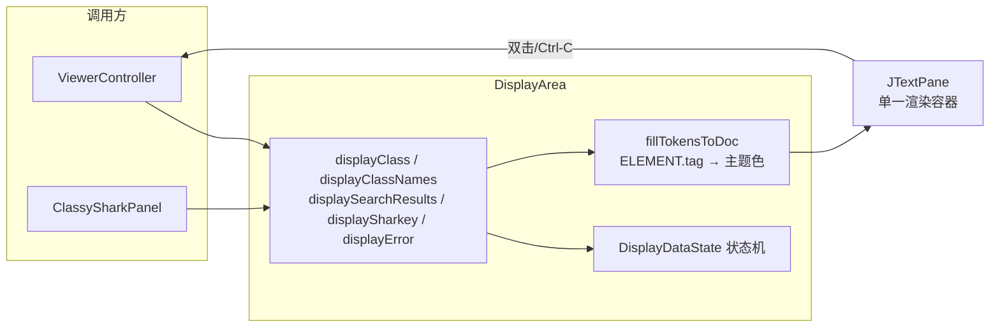
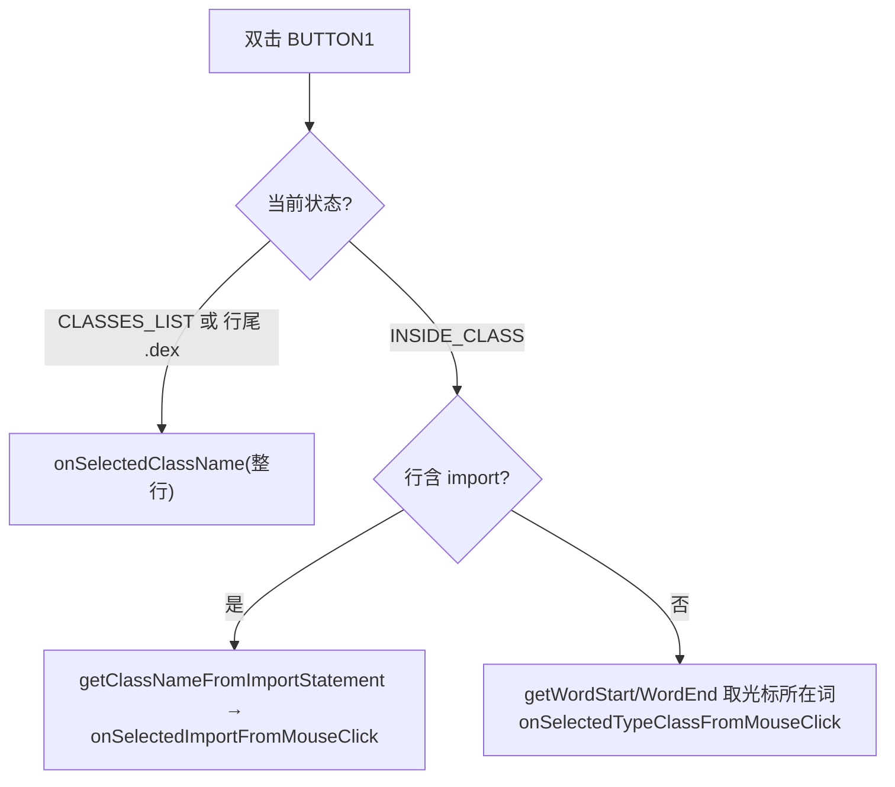

# 📝 显示区 DisplayArea

<Badge type="tip" text="GUI 面板" />
<Badge type="info" text="JTextPane 渲染" />

> 显示区是 GUI 的"主舞台"：一个 [`JTextPane`](https://docs.oracle.com/javase/8/docs/api/javax/swing/JTextPane.html) 同时承载类源存根、类名列表、搜索结果、鲨鱼涂鸦与错误信息——靠状态机切换内容与高亮策略。

实现见 [`DisplayArea`](/reference/modules/DisplayArea)（接口 [`IDisplayArea`](/reference/modules/IDisplayArea)），由 [`ClassySharkPanel`](/reference/modules/ClassySharkPanel) 中介者驱动。

## 🎯 核心定位



关键设计：**所有内容都灌进同一个 `JTextPane`**，不切换组件。当前展示的是"列表"还是"类内"由私有枚举 `DisplayDataState` 记录，决定双击行为。

## 🎨 语法高亮：ELEMENT → 主题色

`fillTokensToDoc(elements, doc, newLine)` 遍历 [`Translator`](/reference/modules/Translator) 产出的 `ELEMENT` 列表，按 `tag` 分支设前景色后插入文档。映射表：

| `Translator.ELEMENT.tag` | 主题取色方法 | 含义 |
|---|---|---|
| `MODIFIER` | `theme.getKeyWordsColor()` | `public`/`static`/`final` 等关键字 |
| `DOCUMENT` | `theme.getDefaultColor()` | 默认正文 |
| `IDENTIFIER` | `theme.getIdentifiersColor()` | 类/方法/字段名 |
| `ANNOTATION` | `theme.getAnnotationsColor()` | `@Override` 等 |
| `XML_TAG` | `theme.getIdentifiersColor()` | `<application>` 等标签名 |
| `XML_ATTR_NAME` | `theme.getKeyWordsColor()` | `android:name` |
| `XML_ATTR_VALUE` | `theme.getDefaultColor()` | 属性值 |
| `SELECTION` | `theme.getSelectionBgColor()` | 搜索命中背景 |
| `default`（含 `XML_CDATA` 等） | `Color.LIGHT_GRAY` | 兜底灰 |

> ⚠️ 源码 TODO 注释标注：高亮逻辑后续可借由给 `Translator.ELEMENT` 加标志位扩展。主题色由 [`Theme`](/reference/modules/Theme) 提供，深/浅色各一套。

## 📋 展示方法一览

| 方法 | 状态置为 | 渲染内容 | 备注 |
|---|---|---|---|
| `displayClass(elements, key)` | `INSIDE_CLASS` | 带 token 高亮的类存根 | 调 `fillTokensToDoc(false)` |
| `displayClass(classString)` | `INSIDE_CLASS` | 单色格式化文本 | 若文本未变则跳过（防重绘） |
| `displayClassNames(list, input)` | `CLASSES_LIST` | 类名列表 + 子串高亮 | >50 类走快速路径 |
| `displayAllClassesNames(list)` | `CLASSES_LIST` | 纯类名列表 | 用 [`BatchDocument`](/reference/modules/BatchDocument) 批量插入 |
| `displaySearchResults(...)` | `CLASSES_LIST` | manifest 命中 token + 类名 | 类名同样限 50 |
| `displaySharkey()` | `SHARKEY` | 鲨鱼 ASCII 涂鸦 | 构造函数末尾即调它当启动页 |
| `displayError()` | `ERROR` | "There was a problem loading the class" + 涂鸦 | 加载失败兜底 |

### 子串高亮（displayClassNames）

```java
// 截取命中前后三段，对 match 段临时把背景切成 selectionBgColor
beforeMatch = className.substring(0, matchIndex);
match       = className.substring(matchIndex, matchIndex + inputText.length());
afterMatch  = className.substring(matchIndex + inputText.length());
// 三段分别 insertString，中段夹一次 setBackground → selectionBg
```

> 未命中子串（`indexOf == -1`）说明是驼峰模糊匹配命中，整行作为 match 高亮。类名超过 50 个时直接转 `displayAllClassesNames`，避免逐条 `insertString` 的 O(n) 重绘卡顿。

### BatchDocument 快速路径

`displayAllClassesNames` 对 >50 类启用 [`BatchDocument`](/reference/modules/BatchDocument)：

| 步骤 | 调用 | 说明 |
|---|---|---|
| 1 | `appendBatchStringNoLineFeed(name, style)` | 类名字符入 ElementSpec 队列 |
| 2 | `appendBatchLineFeed(style)` | 换行符 + 段落 EndTag/StartTag |
| 3 | `processBatchUpdates(0)` | 一次性 `insert(0, inserts)` 灌入 |

底层继承 `DefaultStyledDocument`，把 n 次 `insertString` 合并成 1 次 `ElementSpec` 数组插入——这是 Swing 文档避免"逐字符触发结构性更新"的标准批处理技巧。末尾打印 `UI update X ms` 便于观测性能。

## 🖱️ 双击导航：DisplayDataState 驱动

`MouseAdapter.mouseClicked` 在 **BUTTON1 + 双击** 时，按当前状态分流（`SHARKEY` 直接返回不响应）：



实现细节：

- 行边界用 `Utilities.getRowStart/RowEnd` 取，整行文本来自 `jTextPane.getText().substring(...)`。
- `INSIDE_CLASS` 下若行含 `import `，用 `getClassNameFromImportStatement` 截掉 `import ` 前缀与结尾 `;`，交给 `ViewerController.onSelectedImportFromMouseClick`。
- 否则用 `Utilities.getWordStart/WordEnd` 取光标所在单词，交给 `onSelectedTypeClassClassFromMouseClick`——点类名/类型名即可跳过去反编译。

## ⌨️ Ctrl-C 复制：无选择则复制全文

`KeyListener.keyPressed` 监听 `c` + 平台菜单快捷键修饰（Linux/Win 是 Ctrl，Mac 是 Cmd）：

```java
String copyText = jTextPane.getSelectedText();
if (copyText == null) {            // 无选区
    copyText = jTextPane.getText(); // 复制全文
}
Toolkit.getDefaultToolkit()
        .getSystemClipboard()
        .setContents(new StringSelection(copyText), null);
```

即：选了复制选中，没选复制整页——配合不可编辑（`setEditable(false)`）让显示区兼作只读复制源。

## 🔎 calcScrollingPosition：滚动到搜索键

`displayClass(elements, key)` 末尾调用 `calcScrollingPosition(key)`，把光标定位到类存根中 `key` 首次出现处：

| 步骤 | 行为 |
|---|---|
| trim key | 空串跳过 |
| 越界复位 | `pos + findLength > document.getLength()` 时 `pos = 0` |
| 线性扫描 | 逐字符取子串，`equalsIgnoreCase` 命中即 `found = true` 跳出 |
| 命中 | 返回 `pos` |
| 未命中 | 返回 `1`（页首兜底） |

随后 `jTextPane.setCaretPosition(i)` 视口滚到该处，搜索框输入的类名/方法名即时可见。

## 🦈 鲨鱼涂鸦与错误页

- `displaySharkey()` — 调 [`Doodle.get()`](/reference/modules/Doodle)（实际返回 `SharkBG.SHARKEY`），15px Monospaced、identifiers 色，作为启动欢迎页（构造函数末尾即调）。
- `displayError()` — 同样调 `Doodle.get()`，前面插一句 `"There was a problem loading the class"`，15px Monospaced、default 色。

涂鸦 ASCII 见 [`Doodle`](/reference/modules/Doodle) / [`SharkBG`](/reference/modules/SharkBG)。`SHARKEY` 状态下双击被显式屏蔽。

## 🧩 装配与拖放

```java
// onAddComponentToPane() 返回 jTextPane，被 ClassySharkPanel 装入右侧
jTextPane.setDragEnabled(true);
jTextPane.setTransferHandler(new FileTransferHandler(viewerController));
theme.applyTo(jTextPane);
```

`theme.applyTo` 注入背景/选区色；拖放走 [`FileTransferHandler`](/reference/modules/FileTransferHandler)，把拖入的归档交给 `ViewerController` 打开。详见 [拖拽](./drag-drop) 与 [主题](./themes)。

## 🧪 自测入口

`DisplayArea.main` 提供独立测试桩：用 `JavaTranslator` 反编译 `java.util.StringTokenizer`，调 `displayClass(elements, "")` 后弹 `JFrame` 预览——无需启动完整 GUI 即可验证 token 高亮链路。

## 🔗 相关

- [GUI 参考](./) · [面板布局](./panels) · [类树导航](./tree) · [环形图](./ring-chart)
- 模块：[DisplayArea](/reference/modules/DisplayArea) · [IDisplayArea](/reference/modules/IDisplayArea) · [BatchDocument](/reference/modules/BatchDocument) · [Doodle](/reference/modules/Doodle) · [Translator](/reference/modules/Translator) · [Theme](/reference/modules/Theme)
