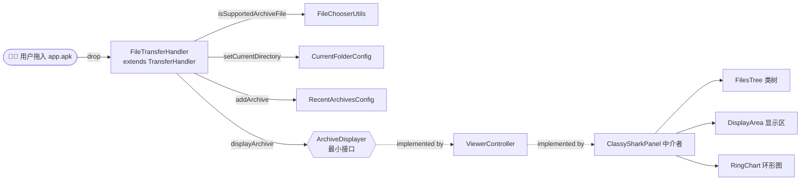

# 🖱️ 拖拽打开

<Badge type="tip" text="GUI" /> <Badge type="info" text="Drag & Drop" />

> 把 `.apk`/`.jar`/`.dex`/`.zip`/`.class`/`.aar` 直接拖进任意面板即可加载归档——无需走工具栏"打开"按钮。实现这一切的是 Swing [`TransferHandler`](https://docs.oracle.com/javase/8/docs/api/javax/swing/TransferHandler.html) 的子类 [`FileTransferHandler`](/reference/modules/FileTransferHandler)。

## 设计要点

[`FileTransferHandler`](/reference/modules/FileTransferHandler) 是一个**纯转发器**：它只负责"接住拖进来的文件 → 过滤 → 委托给显示者"。它持有的依赖是 [`ArchiveDisplayer`](/reference/modules/ArchiveDisplayer)——一个仅含一个方法的最小接口：

```java
public interface ArchiveDisplayer {
    void displayArchive(File file);
}
```



### 为什么拖放能在三处都生效 🎯

关键在于 `FileTransferHandler` 的构造参数类型是 [`ArchiveDisplayer`](/reference/modules/ArchiveDisplayer)（最小接口），**不是**整个 [`ClassySharkPanel`](/reference/modules/ClassySharkPanel)。三处面板各自独立 `new FileTransferHandler(viewerController)`，传入同一个 `viewerController`（即实现了 [`ViewerController`](/reference/modules/ViewerController)——而 `ViewerController extends ArchiveDisplayer`——的中介者 [`ClassySharkPanel`](/reference/modules/ClassySharkPanel)）。这样：

- 类树、显示区、环形图**各自注册**自己的 `TransferHandler`，互不耦合；
- 拖入任意一处，最终都汇聚到 `ClassySharkPanel.displayArchive`，统一刷新三大面板；
- 由于只依赖单方法接口，未来任何实现 `ArchiveDisplayer` 的对象都能复用这套拖放逻辑。

| 注册点 | 组件 | 代码位置 |
|--------|------|----------|
| 🌳 类树 | `JTree` | `FilesTree` 构造时 `jTree.setTransferHandler(...)` |
| 📝 显示区 | `JTextPane` | `DisplayArea` 构造时 `jTextPane.setTransferHandler(...)` |
| 📊 环形图 | `RingChartPanel` 本身 | `RingChartPanel` 构造时 `setTransferHandler(...)` |

## importData 流程

拖放落定时 Swing 调用 `importData(TransferSupport ts)`，按以下步骤处理拖入的 `javaFileListFlavor` 文件列表：

```java
public boolean importData(TransferSupport ts) {
    List data = (List) ts.getTransferable()
            .getTransferData(DataFlavor.javaFileListFlavor);
    for (Object item : data) {
        File file = (File) item;
        if (isSupportedArchiveFile(file)) {
            CurrentFolderConfig.INSTANCE.setCurrentDirectory(file.getParentFile());
            RecentArchivesConfig.INSTANCE.addArchive(file.getName(), file.getParentFile());
            archiveDisplayer.displayArchive(file);
        }
    }
    return true;
}
```

| 步骤 | 动作 | 作用 |
|------|------|------|
| 1️⃣ | `canImport` 检查 `javaFileListFlavor` | 仅接受系统文件拖放，拒绝文本/图片等 |
| 2️⃣ | `isSupportedArchiveFile(file)` | 按扩展名过滤支持类型 |
| 3️⃣ | `CurrentFolderConfig.setCurrentDirectory` | 记住父目录，下次"打开"对话框默认到这里 |
| 4️⃣ | `RecentArchivesConfig.addArchive` | 写入"最近"列表，供工具栏 [`RecentArchivesButton`](/reference/modules/RecentArchivesButton) 读取 |
| 5️⃣ | `archiveDisplayer.displayArchive(file)` | 委托中介者加载归档并刷新所有面板 |

### 支持的文件类型

由 [`FileChooserUtils.isSupportedArchiveFile`](/reference/modules/FileChooserUtils) 统一判定，与"打开"对话框和过滤器共用同一份白名单：

| 扩展名 | 类型 | 说明 |
|--------|------|------|
| `.apk` | Android 应用 | 含 `classes*.dex`，多 dex 自动识别 |
| `.dex` | Dalvik 字节码 | 单 dex |
| `.jar` | Java 归档 | 含 `.class` |
| `.aar` | Android 库 | 含 `classes.jar` |
| `.zip` | 通用压缩 | 按归档展开 |
| `.class` | Java 字节码 | 单类文件 |

> ⚠️ `.so`（原生库）**不在**拖放白名单中——`isSupportedArchiveFile` 仅校验上述六种扩展名。原生库需通过工具栏或 `-open` 打开。

## 静默忽略策略 🤫

对**不支持**的文件类型，`FileTransferHandler` 不弹窗、不报错、不记录——`if (isSupportedArchiveFile(file))` 判定为 `false` 时直接跳过该文件，循环继续处理列表中的下一个文件。这意味着：

- 拖入混合内容（如一堆截图 + 一个 APK）时，只有 APK 被加载；
- 拖入纯不支持的文件（如 `.txt`）时，UI 完全无反应，也不会抛异常；
- `UnsupportedFlavorException` / `IOException` 被捕获并返回 `false`，绝不弹栈。

| 场景 | 结果 |
|------|------|
| 拖入单个 `.apk` | ✅ 立即加载，刷新三面板 |
| 拖入 `.apk` + `.txt` | ✅ 仅加载 APK |
| 拖入纯 `.png` 图片 | ⚪ 无反应（静默） |
| 拖入文本片段（非文件） | ⚪ `canImport` 返回 false，Swing 拒绝 |

## 与其他打开途径的关系

拖放只是 [`ArchiveDisplayer.displayArchive`](/reference/modules/ArchiveDisplayer) 的众多触发源之一，最终汇入同一个中介者方法——这保证了无论从哪里打开，行为完全一致：

| 触发源 | 入口 | → displayArchive |
|--------|------|------------------|
| 🖱️ 拖放 | `FileTransferHandler.importData` | ✅ |
| 📂 工具栏"打开" | [`ToolbarController`](/reference/modules/ToolbarController) → JFileChooser | ✅ |
| 🕘 "最近"按钮 | [`RecentArchivesButton`](/reference/modules/RecentArchivesButton) | ✅ |
| ⌨️ 命令行 `-open` | [`CliMode`](/reference/modules/CliMode) → `GuiMode` | ✅ |
| 👻 启动占位 | `ClassySharkPanel` 银鬼（`silverGhost`） | ✅ |

## 相关链接

- 实现：[`FileTransferHandler`](/reference/modules/FileTransferHandler)
- 最小接口：[`ArchiveDisplayer`](/reference/modules/ArchiveDisplayer)
- 文件过滤：[`FileChooserUtils`](/reference/modules/FileChooserUtils)
- 目录记忆：[`CurrentFolderConfig`](/reference/modules/CurrentFolderConfig)
- 最近列表：[`RecentArchivesConfig`](/reference/modules/RecentArchivesConfig)
- 中介者：[`ClassySharkPanel`](/reference/modules/ClassySharkPanel)、[`ViewerController`](/reference/modules/ViewerController)
