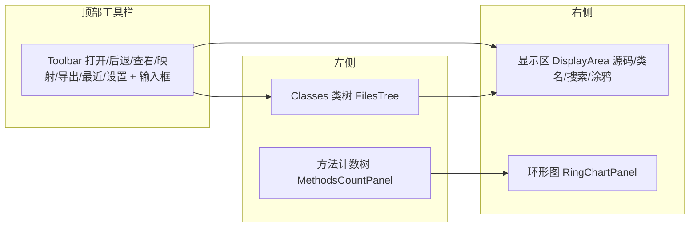

# 🖥️ GUI 参考

<Badge type="tip" text="GUI" />

> ClassyShark 的图形界面基于 Swing，提供类树导航、源码存根浏览与方法数环形图。

## 启动

```bash
java -jar ClassyShark.jar
# 或指定文件
java -jar ClassyShark.jar -open app.apk
```

## 面板布局

启动后主窗口（[`GuiMode`](/reference/modules/GuiMode) 构建 → [`ClassySharkPanel`](/reference/modules/ClassySharkPanel) 中介者）布局如下：



左侧是 `JSplitPane` + `JTabbedPane`（Classes 树 / 方法计数两个标签），右侧显示区，底部环形图。详见 [面板布局](./panels)。

## 主要面板

| 面板 | 文档 | 职责 |
|------|------|------|
| 🌳 类树 | [类树导航](./tree) | [`FilesTree`](/reference/modules/FilesTree) 按包/dex 分组导航 |
| 📝 显示区 | [显示区](./display-area) | [`DisplayArea`](/reference/modules/DisplayArea) 渲染源码存根，语法高亮 |
| 📊 环形图 | [环形图](./ring-chart) | [`RingChart`](/reference/modules/RingChart) 方法数旭日图 |
| 📈 方法计数 | [方法计数](./methods-count) | [`MethodsCountPanel`](/reference/modules/MethodsCountPanel) 按包树 |
| 🔎 过滤器 | — | [`Reducer`](/reference/modules/Reducer) 子串+驼峰模糊匹配 |

## 交互

- **拖放** — 把 APK/JAR/AAR/DEX/SO/CLASS 拖进任意面板即可打开，详见 [拖拽](./drag-drop)。
- **键盘** — 左/右箭头、Cmd、字母数字、Delete 驱动导航与过滤，详见 [快捷键](./shortcuts)。
- **最近文件** — 工具栏"最近"按钮列出历史，详见 [最近归档](./recent-archives)。
- **主题** — 设置→主题切换深色/浅色，详见 [主题](./themes)。

## 主题

ClassyShark 内置深色（`DarkTheme`，默认）与浅色（`LightTheme`）。深色覆盖全部 Swing 组件，浅色让系统原生 LAF 透出——这是刻意的非对称设计。主题在下次启动生效。

详见 [主题](./themes) 与 [Theme 模块](/reference/modules/Theme)。
