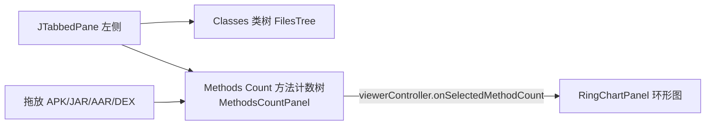
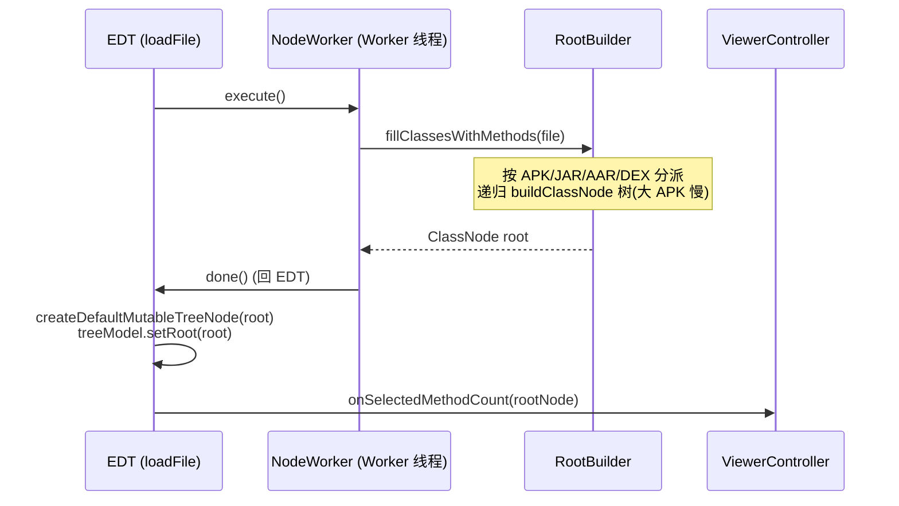

# 📈 方法计数面板 MethodsCountPanel

<Badge type="tip" text="GUI 面板" />
<Badge type="info" text="SwingWorker · 后台解析" />

> [`MethodsCountPanel`](/reference/modules/MethodsCountPanel) 是左侧选项卡中托管的"方法计数"视图：一棵按包名层级聚合方法数的 `JTree`，选择任一节点会**立即**把对应的 [`ClassNode`](/reference/modules/ClassNode) 推到右侧环形图。

## 定位

在 [`ClassySharkPanel`](/reference/modules/ClassySharkPanel) 中介者里，它作为 `JTabbedPane` 的第二个标签页存在，与 [`FilesTree`](/reference/modules/FilesTree) 共享左侧 `JSplitPane`：



## 关键组件

| 字段/组件 | 类型 | 职责 |
|-----------|------|------|
| `treeModel` | `DefaultTreeModel` | 持有 `DefaultMutableTreeNode` 根；EDT 上 `setRoot` 交换 |
| `jTree` | `JTree` | `setRootVisible(false)` 初始隐藏空根，加载后 `true` |
| `viewerController` | [`ViewerController`](/reference/modules/ViewerController) | 推送选中的 `ClassNode` 给环形图 |
| `theme` | [`Theme`](/reference/modules/Theme) | `GuiMode.getTheme()`，`applyTo` 面板/树/滚动条 |
| `NodeWorker` | `SwingWorker` 内部类 | 后台跑 `RootBuilder`，EDT 交换模型 |

## 加载流程：loadFile → NodeWorker

`loadFile(File)` 不直接解析，而是派发一个 `NodeWorker`：

```java
public void loadFile(File file) {
    new NodeWorker(file).execute();   // SwingWorker 起后台线程
}
```

`NodeWorker` 的两段式是经典的 Swing 并发模式——**重活后台做，UI 在 EDT 换**：



### doInBackground — 后台建树

```java
@Override
protected ClassNode doInBackground() throws Exception {
    RootBuilder analyzer = new RootBuilder();
    return analyzer.fillClassesWithMethods(file);
}
```

[`RootBuilder.fillClassesWithMethods`](/reference/modules/RootBuilder) 按扩展名分派：

| 输入 | 路径 | 解析器 |
|------|------|--------|
| `.aar` | 解压取内嵌 `classes.jar` → 转 JAR 流程 | Apache BCEL `ClassParser` |
| `.jar` | 遍历 `JarEntry`，取 `.class` | BCEL `JavaClass.getMethods().length` |
| `.dex` | 直接加载单 dex | `DexlibLoader` + `dexlib2` `ClassDef` |
| `.apk` | `ZipInputStream` 遍历所有 `*.dex` | 逐个 `fillFromDex` 聚合到同一根 |

> ⏳ **大 APK 慢**：APK 多 dex 时会逐 dex 临时落盘再解析，方法数聚合在 [`ClassNode.add`](/reference/modules/ClassNode) 里逐层累加，故 `doInBackground` 可能耗时数秒——这正是必须用 `SwingWorker` 的原因。

### done — EDT 交换模型

```java
@Override
protected void done() {
    try {
        TreeNode root = createDefaultMutableTreeNode(get());
        treeModel.setRoot(root);          // ← EDT 上交换
        jTree.setRootVisible(true);
        viewerController.onSelectedMethodCount(
                (ClassNode)((DefaultMutableTreeNode)root).getUserObject());
    } catch (Exception ex) { /* 静默 */ }
}
```

`get()` 阻塞取回后台结果（已在 EDT，安全），`setRoot` 触发 `JTree` 重绘，并立即把根节点推给环形图，让 [`RingChartPanel`](/reference/modules/RingChartPanel) 第一时间渲染旭日图。

## addNodes — 镜像 ClassNode 树到 JTree

`ClassNode` 是自定义的纯数据树（`Map<String,ClassNode> childNodes`），而 `JTree` 需要 `DefaultMutableTreeNode`。`addNodes` 递归镜像：

```java
private void addNodes(ClassNode parent, DefaultMutableTreeNode jTreeParent) {
    for (ClassNode n : parent.getChildNodes().values()) {
        DefaultMutableTreeNode newJTreeNode = new DefaultMutableTreeNode(n);
        jTreeParent.add(newJTreeNode);
        addNodes(n, newJTreeNode);     // 递归
    }
}
```

`ClassNode.toString()` 返回 `key + ": " + methodCount`（如 `com: 4096`、`google: 2048`），直接被 `CellRenderer` 当作节点文本渲染——包名 + 累计方法数一目了然。

## 选择 → 环形图

选中节点时，`TreeSelectionListener` 取出 `userObject`（`ClassNode`）并推送：

```java
jTree.addTreeSelectionListener(e -> {
    Object selection = jTree.getLastSelectedPathComponent();
    DefaultMutableTreeNode dmtn = (DefaultMutableTreeNode) selection;
    ClassNode node = (ClassNode) dmtn.getUserObject();
    viewerController.onSelectedMethodCount(node);   // ← 立即推送
});
```

[`ViewerController.onSelectedMethodCount(ClassNode)`](/reference/modules/ViewerController) 由 [`ClassySharkPanel`](/reference/modules/ClassySharkPanel) 实现，最终调用 [`RingChartPanel.setRootNode(node)`](/reference/modules/RingChartPanel)，后者 `repaint()` 重画旭日图。反向链路同样存在——在环形图上点击某个扇区，`RingChartPanel` 也会回调 `onSelectedMethodCount`，实现树 ↔ 图双向联动。

## 与主树共享的渲染与拖放

`setup()` 中两处复用主类树（[`FilesTree`](/reference/modules/FilesTree)）的同一套组件，保证视觉与交互一致：

| 复用项 | 来源 | 作用 |
|--------|------|------|
| [`CellRenderer`](/reference/modules/CellRenderer) | `gui.panel.tree` | 主题色 `getSelectionBgColor`/`getDefaultColor`，包节点无背景 |
| [`FileTransferHandler`](/reference/modules/FileTransferHandler) | `gui.panel` | `setDragEnabled(true)` + 拖放 APK/JAR 即触发 `loadFile` |

```java
jTree.setCellRenderer(new CellRenderer());
jTree.setDragEnabled(true);
jTree.setTransferHandler(new FileTransferHandler(viewerController));
```

> 🎨 `CellRenderer` 字体被覆写为 `Monospaced 20`，与方法计数的 `key: count` 等宽对齐更整齐。

## 与环形图的关系

| 方向 | 触发 | 调用 |
|------|------|------|
| 树 → 图 | `TreeSelectionListener` / `done()` | `viewerController.onSelectedMethodCount(node)` |
| 图 → 树 | `RingChartPanel.mouseClicked` 命中扇区 | 同一回调（仅当 `childNodes` 非空时下钻） |

两者通过 [`ViewerController`](/reference/modules/ViewerController) 解耦，互不直接持有引用——典型的中介者模式。

## 命令行等价

不想开 GUI？`-methodcounts` 走 [`CliMode`](/reference/modules/CliMode) 直接打印方法数表：

```bash
# GUI 内加载并交互
java -jar ClassyShark.jar -open app.apk   # 切到"方法计数"标签页

# 纯 CLI 方法数统计
java -jar ClassyShark.jar -methodcounts app.apk
```

## 相关模块

- [`MethodsCountPanel`](/reference/modules/MethodsCountPanel) — 本面板源码
- [`RootBuilder`](/reference/modules/RootBuilder) — APK/JAR/AAR/DEX 分派与解析
- [`ClassNode`](/reference/modules/ClassNode) — 包层级 + 方法数聚合树
- [`RingChartPanel`](/reference/modules/RingChartPanel) — 接收 `ClassNode` 渲染旭日图
- [`ViewerController`](/reference/modules/ViewerController) — 树/图解耦的中介接口
