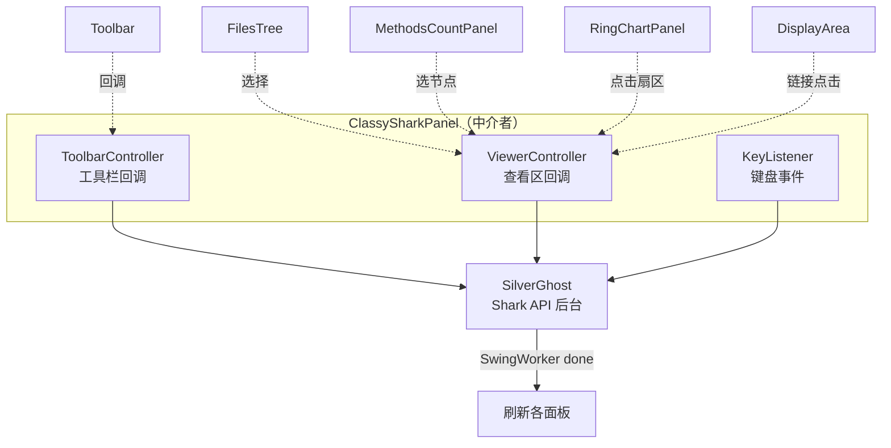
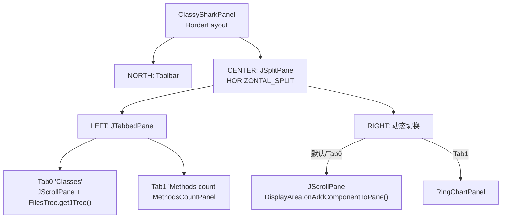
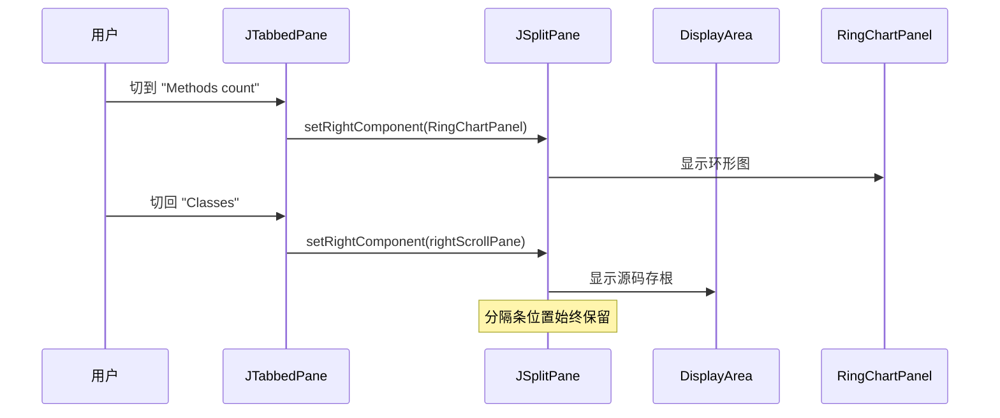
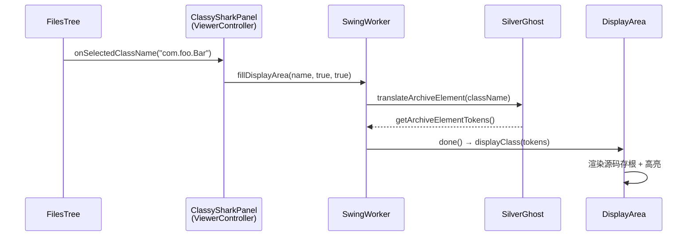

# 🧩 面板布局详解

<Badge type="tip" text="ClassySharkPanel" />
<Badge type="info" text="MVM 中介者" />

> [`ClassySharkPanel`](/reference/modules/ClassySharkPanel) 是 GUI 的中枢，采用 **MVM（Model-View-Mediator）** 模式 —— Model 是 [`SilverGhost`](/reference/modules/SilverGhost) Shark API，View 是各 Swing 面板，**本类同时实现 `ToolbarController` + `ViewerController` + `KeyListener` 三接口充当唯一中介者**，所有事件都汇聚到这里再分发。

## 中介者三重身份



`ClassySharkPanel` 把三个接口都实现到自己身上，意味着 **所有子组件只需持有这一个回调对象**，互相之间不直接通信，彻底解耦。

| 接口 | 来源 | 谁会回调它 | 典型方法 |
|------|------|------------|----------|
| [`ToolbarController`](/reference/modules/ToolbarController) | `extends ArchiveDisplayer` | [`Toolbar`](/reference/modules/Toolbar) | `onGoBackPressed` / `onViewTopClassPressed` / `onExportButtonPressed` |
| [`ViewerController`](/reference/modules/ViewerController) | `extends ArchiveDisplayer` | [`FilesTree`](/reference/modules/FilesTree) / [`RingChartPanel`](/reference/modules/RingChartPanel) / [`DisplayArea`](/reference/modules/DisplayArea) | `onSelectedClassName` / `onSelectedMethodCount` |
| `KeyListener` | `java.awt.event` | Toolbar 输入框 | `keyPressed` → 左/右箭头、Delete、字母数字 |

## buildUI 组装过程

[`buildUI()`](/reference/modules/ClassySharkPanel#buildui) 是布局核心，用 `BorderLayout` + `JSplitPane` + `JTabbedPane` 拼装：



关键代码骨架（简化自源码）：

```java
private void buildUI() {
    setLayout(new BorderLayout());

    ringChartPanel = new RingChartPanel(this);   // 注入 ViewerController
    toolbar        = new Toolbar(this);          // 注入 ToolbarController
    add(toolbar, BorderLayout.NORTH);
    toolbar.addKeyListenerToTypingArea(this);    // 注入 KeyListener

    displayArea = new DisplayArea(this);
    final JScrollPane rightScrollPane =
            new JScrollPane(displayArea.onAddComponentToPane());

    filesTree = new FilesTree(this);
    final JTabbedPane jTabbedPane = new JTabbedPane();
    jTabbedPane.addTab("Classes", new JScrollPane(filesTree.getJTree()));
    methodsCountPanel = new MethodsCountPanel(this);
    jTabbedPane.addTab("Methods count", methodsCountPanel);

    // 切 Tab 切右侧视图
    jTabbedPane.addChangeListener(e -> {
        int loc = jSplitPane.getDividerLocation();
        if (((JTabbedPane) e.getSource()).getSelectedIndex() == 0) {
            jSplitPane.setRightComponent(rightScrollPane);  // 类树 → 显示区
        } else {
            jSplitPane.setRightComponent(ringChartPanel);   // 方法计数 → 环形图
        }
        jSplitPane.setDividerLocation(loc);  // 保持分隔条位置
    });

    jSplitPane = new JSplitPane(JSplitPane.HORIZONTAL_SPLIT);
    jSplitPane.setDividerSize(3);
    jSplitPane.setDividerLocation(300);
    jSplitPane.add(jTabbedPane, JSplitPane.LEFT);
    jSplitPane.add(rightScrollPane, JSplitPane.RIGHT);
    add(jSplitPane, BorderLayout.CENTER);
}
```

## 布局要素一览

| 区域 | 组件 | 角色 | 文档 |
|------|------|------|------|
| 🧭 顶部 | `Toolbar` | 打开/后退/查看/映射/导出/最近/设置 + 输入框 | [工具栏](/reference/modules/Toolbar) |
| 🌳 左侧 Tab0 | `FilesTree` + `JTree` | 按 dex/包分组导航类名 | [类树导航](./tree) |
| 📈 左侧 Tab1 | `MethodsCountPanel` | 按包树展示方法数 | [方法计数](./methods-count) |
| 📝 右侧（Tab0） | `DisplayArea` | 渲染源码存根/搜索/涂鸦 | [显示区](./display-area) |
| 📊 右侧（Tab1） | `RingChartPanel` | 方法数旭日图扇区 | [环形图](./ring-chart) |

### 分隔条与左窗格显隐

`JSplitPane` 分隔条宽度仅 3px，初始位置 300px。`onChangeLeftPaneVisibility(boolean)` 实现左窗格折叠/展开：

```java
public void onChangeLeftPaneVisibility(boolean visible) {
    if (visible) {
        jSplitPane.setDividerLocation(dividerLocation);  // 恢复记忆位置
    } else {
        dividerLocation = jSplitPane.getDividerLocation();  // 记忆当前位置
    }
    jSplitPane.getLeftComponent().setVisible(visible);
    jSplitPane.updateUI();
}
```

工具栏按钮触发此回调，让 Classes 树可临时隐藏以扩大显示区。

## Tab 切换驱动右侧视图

`JTabbedPane` 的 `ChangeListener` 是布局的"活点"：**选 Classes 标签时右侧显示 DisplayArea，选 Methods count 标签时右侧换为 RingChartPanel**。这样左侧树与右侧可视化始终语义对齐，且分隔条位置在切换前后保持不变。



## 重活全交 SwingWorker

EDT（事件分发线程）绝不做解析。ClassySharkPanel 内部所有耗时操作都包进 `SwingWorker`，`doInBackground` 跑解析、`done()` 回 EDT 刷新 UI：

| 方法 | 后台任务 | done() 回调 |
|------|----------|-------------|
| `readArchiveAndFillDisplayArea` | `silverGhost.readContents()` 读档 | 填类树 / 显示 Sharkey 或指定类 / 置 `isDataLoaded` |
| `fillDisplayArea` | `translateArchiveElement` / `filter` / `getManifestMatches` | 显示单类 / 搜索结果 / 错误 |
| `onExportButtonPressed` | `Exporter.writeCurrentClass` + `writeArchive` | 空 done |
| `readMappingFile` | `silverGhost.readMappingFile` | `silverGhost.addMappings` |
| `MethodsCountPanel.NodeWorker` | `RootBuilder.fillClassesWithMethods` | 建树 + `onSelectedMethodCount` 触发环形图 |

> ⚠️ `fillDisplayArea` 是最复杂的 SwingWorker：它根据 `viewTopClass` / `viewMouseClickedClass` 两个布尔分支决定是"自动补全首选类"、"点击某类"还是"边输入边过滤"，并在 `done()` 里再判断零结果/单结果/多结果分别渲染。

## 事件流：从点击到渲染

以"在类树点击一个类"为例，完整链路：



环形图点击扇区走 `onSelectedMethodCount(ClassNode)`，直接 `ringChartPanel.setRootNode(node)` 重新 `paint()`，无需 Worker（已是内存对象）。

## 相关节点

- 🏗️ 中介者与三接口：[`ClassySharkPanel`](/reference/modules/ClassySharkPanel) · [`ViewerController`](/reference/modules/ViewerController) · [`ToolbarController`](/reference/modules/ToolbarController) · [`ArchiveDisplayer`](/reference/modules/ArchiveDisplayer)
- 🧭 顶部工具栏：[`Toolbar`](/reference/modules/Toolbar)
- 🌳 左侧两标签：[类树导航](./tree) · [方法计数](./methods-count)
- 📝 右侧显示区：[显示区](./display-area) · [`DisplayArea`](/reference/modules/DisplayArea)
- 📊 右侧环形图：[环形图](./ring-chart) · [`RingChartPanel`](/reference/modules/RingChartPanel)
- ⌨️ 键盘交互：[快捷键](./shortcuts) · [`KeyUtils`](/reference/modules/KeyUtils)
