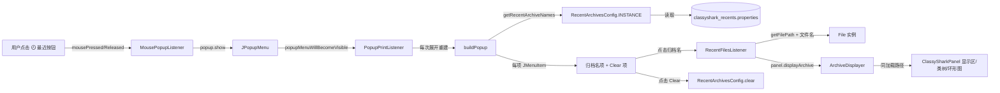
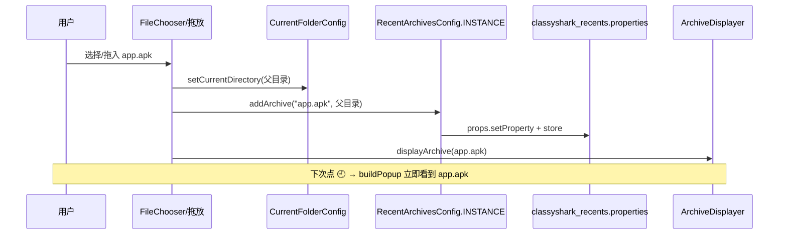

# 🕘 最近归档

<Badge type="tip" text="GUI" />
<Badge type="info" text="RecentArchivesButton + RecentArchivesConfig" />

> 工具栏的"最近"按钮（🕘 历史图标）弹出一个 `JPopupMenu`，列出曾打开过的 APK/JAR/DEX 等存档。点击任意项即重新加载该文件；底部"Clear"项清空全部历史。归档清单在 `classyshark_recents.properties` 中按**存档名→父目录**持久化。

## 设计概览



核心是**每次弹出都重建菜单**：`PopupPrintListener.popupMenuWillBecomeVisible()` 回调 `buildPopup()`，从 [`RecentArchivesConfig`](/reference/modules/RecentArchivesConfig) 现拉当前配置。这意味着**新开存档后无需重启 ClassyShark**，再次展开"最近"菜单就能立即看到刚加入的条目。

## 组件职责

| 组件 | 类型 | 职责 |
|------|------|------|
| [`RecentArchivesButton`](/reference/modules/RecentArchivesButton) | `JButton` | 工具栏按钮，挂 `JPopupMenu`，监听鼠标+弹出事件 |
| [`RecentArchivesConfig`](/reference/modules/RecentArchivesConfig) | 单例 `enum INSTANCE` | 读写 `classyshark_recents.properties`，存档名→父目录 |
| [`CurrentFolderConfig`](/reference/modules/CurrentFolderConfig) | 单例 `enum INSTANCE` | 记忆 `JFileChooser` 当前目录到 `classyshark.properties` |
| [`ArchiveDisplayer`](/reference/modules/ArchiveDisplayer) | 接口 | `displayArchive(File)` 复用同一条加载管线 |

## RecentArchivesButton 构建与重建

构造期一次性创建 `JPopupMenu`（`BoxLayout.Y_AXIS` 纵向），注册两类监听器：

```java
public RecentArchivesButton() {
    setIcon(GuiMode.getTheme().getRecentIcon());   // ic_history.png 🕘
    setToolTipText("History");
    popup = new JPopupMenu();
    theme.applyTo(popup);                          // 深色提深 / 浅色透出
    popup.setLayout(new BoxLayout(popup, BoxLayout.Y_AXIS));
    popup.addPopupMenuListener(new PopupPrintListener()); // 展开即重建
    buildPopup();
    addMouseListener(new MousePopupListener());     // 任意鼠标键触发
}
```

`buildPopup()` 每次先 `popup.removeAll()`，再遍历 [`RecentArchivesConfig.INSTANCE.getRecentArchiveNames()`](/reference/modules/RecentArchivesConfig) 逐项加 `JMenuItem`，最后加分隔线与一个 `Clear` 项：

```java
private void buildPopup() {
    popup.removeAll();
    for (String archiveName : RecentArchivesConfig.INSTANCE.getRecentArchiveNames()) {
        JMenuItem item = new JMenuItem(archiveName);
        theme.applyTo(item);
        popup.add(item);
        item.addActionListener(new RecentFilesListener(archiveName)); // 点击重新加载
    }
    popup.addSeparator();
    final JMenuItem clearRecentArchivesItem = new JMenuItem("Clear");
    clearRecentArchivesItem.addActionListener(e -> {
        RecentArchivesConfig.INSTANCE.clear();    // 清空 properties
        popup.removeAll();
        popup.updateUI();
        popup.add(clearRecentArchivesItem);       // 保留 Clear 项本身
    });
    popup.add(clearRecentArchivesItem);
}
```

| 触发时机 | 调用 | 效果 |
|----------|------|------|
| 鼠标 pressed/clicked/released | `MousePopupListener.checkPopup` | `popup.show(this, x-宽, y)` 在按钮左侧定位弹出 |
| 弹出将可见 | `PopupPrintListener.popupMenuWillBecomeVisible` | 重新 `buildPopup()` 反映最新配置 |
| 点击归档名项 | `RecentFilesListener.actionPerformed` | `panel.displayArchive(new File(getFilePath(name), name))` 后再 `buildPopup()` |
| 点击 Clear 项 | 内联 `ActionListener` | `RecentArchivesConfig.INSTANCE.clear()`，菜单仅留 Clear 自身 |

## 重新加载路径：复用 ArchiveDisplayer

点击历史项时不走单独的加载逻辑，而是把 `File` 拼回完整路径后交给 [`ArchiveDisplayer.displayArchive(File)`](/reference/modules/ArchiveDisplayer)：

```java
// RecentFilesListener
panel.displayArchive(
        new File(RecentArchivesConfig.INSTANCE.getFilePath(archiveName),  // 父目录
                 archiveName));                                          // 存档名
buildPopup();  // 顺手刷新菜单
```

[`ArchiveDisplayer`](/reference/modules/ArchiveDisplayer) 的唯一实现是 [`ClassySharkPanel`](/reference/modules/ClassySharkPanel)，因此"最近"项的加载路径与拖放、`-open` 文件选择器**完全一致**——同一个 `displayArchive` 入口驱动显示区、类树、环形图刷新。详见 [拖拽](./drag-drop) 与 [显示区](./display-area)。

## RecentArchivesConfig 持久化

单例 `enum INSTANCE`，用 `java.util.Properties` 在**工作目录**下读写 `classyshark_recents.properties`。键是存档名（如 `app-release.apk`），值是父目录绝对路径。

| 方法 | 行为 |
|------|------|
| `addArchive(name, currentDirectory)` | 读现有 properties → `setProperty(name, 父目录绝对路径)` → 整体回写，注释 `CURRENT_FOLDERwrote` |
| `getRecentArchiveNames()` | 枚举所有键 → `Collections.sort()` **字典序** 返回 `List<String>` |
| `getFilePath(name)` | `props.getProperty(name)` 返回父目录字符串；异常返回 `""` |
| `clear()` | 写一个空 properties 文件（清空所有历史） |

⚠️ **排序是字典序而非 LRU**：`getRecentArchiveNames()` 末尾 `Collections.sort(result)`，所以菜单顺序按存档名字母序，**不反映打开时间先后**。这是已知行为——最近打开的文件不会自动浮顶。

### 写入流程



归档加入有两个入口，都先记 `CurrentFolderConfig` 再记 `RecentArchivesConfig`，最后 `displayArchive`：

```java
// ClassySharkPanel.onOpenArchive（文件选择器）
fc.setCurrentDirectory(CurrentFolderConfig.INSTANCE.getCurrentDirectory()); // 起始目录
// ...用户选 app.apk...
CurrentFolderConfig.INSTANCE.setCurrentDirectory(fc.getCurrentDirectory());
RecentArchivesConfig.INSTANCE.addArchive(resultFile.getName(), fc.getCurrentDirectory());
displayArchive(resultFile);

// FileTransferHandler（拖放）
CurrentFolderConfig.INSTANCE.setCurrentDirectory(file.getParentFile());
RecentArchivesConfig.INSTANCE.addArchive(file.getName(), file.getParentFile());
archiveDisplayer.displayArchive(file);
```

## CurrentFolderConfig：文件选择器记忆

[`CurrentFolderConfig`](/reference/modules/CurrentFolderConfig) 与 `RecentArchivesConfig` 同为单例 `enum`，但存的是**单值**——`JFileChooser` 的当前目录，落在 `classyshark.properties`（键 `CURRENT_FOLDER`）。

| 方法 | 行为 |
|------|------|
| `setCurrentDirectory(path)` | 写父目录绝对路径到 `classyshark.properties` |
| `getCurrentDirectory()` | 读回；文件缺失/异常回退 `user.home` |

这样下次打开文件选择器时（`fc.setCurrentDirectory(CurrentFolderConfig.INSTANCE.getCurrentDirectory())`）会停在上次浏览的目录，省去重新导航。它独立于最近归档清单，只服务文件对话框的起始位置。

## 速查

- 🕘 "最近"按钮图标：`theme.getRecentIcon()` → `ic_history.png`，tooltip `History`。
- 🔁 **每次展开重建**：`popupMenuWillBecomeVisible` → `buildPopup`，新开存档立即出现，无需重启。
- 📁 持久化文件：工作目录下 `classyshark_recents.properties`，键=存档名，值=父目录绝对路径。
- 🔤 排序为 **`Collections.sort` 字典序**，非 LRU——最近打开不会浮顶。
- ♻️ 重新加载委托 [`ArchiveDisplayer.displayArchive(File)`](/reference/modules/ArchiveDisplayer)，与拖放/`-open` 同路径。
- 🧹 `Clear` 项调 `RecentArchivesConfig.INSTANCE.clear()`，写空 properties 文件。
- 📂 `CurrentFolderConfig` 记忆 `JFileChooser` 起始目录（`classyshark.properties` / 键 `CURRENT_FOLDER`），异常回退 `user.home`。
- 🚫 所有 `RecentArchivesConfig` 方法异常静默吞掉（空 `catch`），`getFilePath` 失败返回 `""`。

## 相关链接

- [`RecentArchivesButton`](/reference/modules/RecentArchivesButton) · [`RecentArchivesConfig`](/reference/modules/RecentArchivesConfig) · [`CurrentFolderConfig`](/reference/modules/CurrentFolderConfig) · [`ArchiveDisplayer`](/reference/modules/ArchiveDisplayer)
- 上层：[GUI 参考](./index) · [拖拽](./drag-drop) · [显示区](./display-area) · [主题](./themes)
