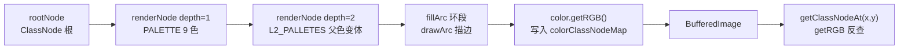
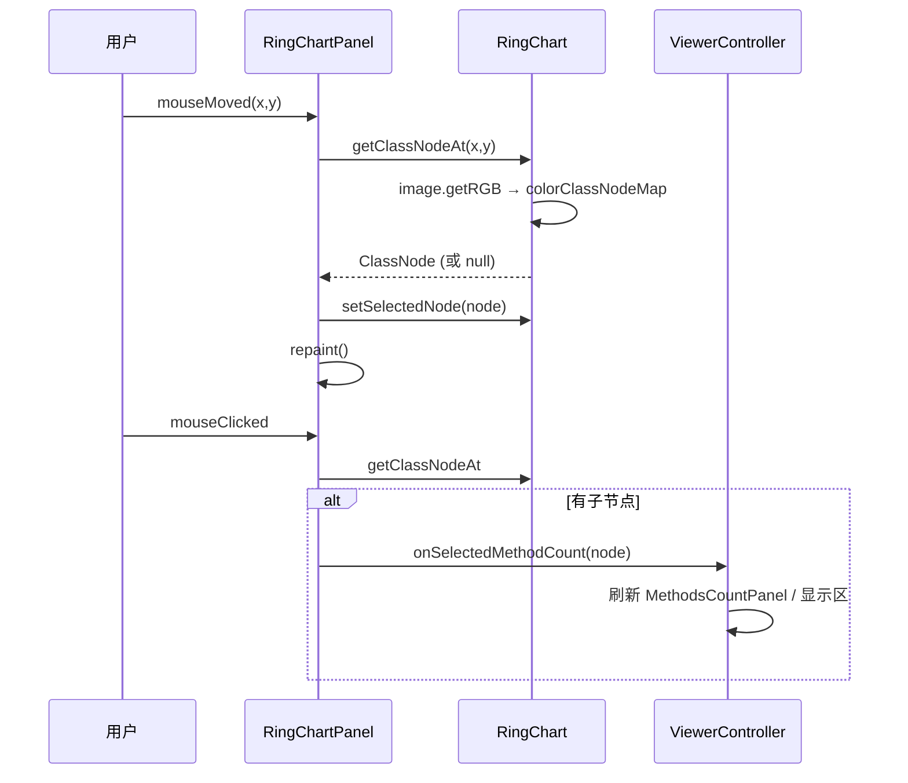

# 🍩 环形图 RingChart

<Badge type="tip" text="GUI" /> <Badge type="info" text="旭日图" />

> `RingChart` 把方法计数树渲染成一张基于 `BufferedImage` 的**多级环形图（旭日图）**：每个环段的大小与子节点相对父节点的方法计数成比例，按方法数降序排列，尾部小段合并为 `Others`。位于主窗口右侧底部，由 [`RingChartPanel`](/reference/modules/RingChartPanel) 桥接交互。

## 渲染模型

整张图绘制到一张 `BufferedImage.TYPE_INT_ARGB`（开启文字抗锯齿、双三次插值、质量优先渲染、`AlphaComposite.Src`），最终 `g.drawImage` 贴回 Swing 画布。绘制并非几何命中，而是**按颜色反查**。



| 参数 | 值 | 说明 |
|------|------|------|
| `DEFAULT_MAX_DEPTH` | `2` | 默认最大深度，无参构造 `RingChart()` 使用 |
| `MARGIN` | `20` | 画布四周留白，`graphWidth/Height = size - MARGIN*2` |
| `OTHERS_COLOR` | `Color.GRAY` | 尾部合并段的固定灰色 |
| 缓存 | `colorClassNodeMap` | `Map<Integer,ClassNode>`，键为 `color.getRGB()` |

## 段大小算法

每段角度按子节点方法计数占父节点的比例分配：

```java
nodeEndAngle = (int)(node.getMethodCount()
        / rootNode.getMethodCount() * angleSize + nodeEndAngle);
```

子节点先按 `getMethodCount()` **降序排序**（`Integer.compare(o2, o1)`），保证大段靠前。三条终止条件控制尾部：

| 条件 | 触发动作 |
|------|----------|
| `currentNode == nodes.size()-1` | 末段直接拉满 `nodeEndAngle = endAngle` |
| `currentColor == palette.length-1` 或 `360 - nodeEndAngle < 5` | 剩余角度 < 5° 时停止分配，合并为 `Others` 段 |
| `Others` 段 | `title="Others"`、`color=OTHERS_COLOR`、**不写入** `colorClassNodeMap`（不可拾取） |

> 💡 设计要点：`Others` 不进映射表，意味着鼠标悬停到灰色尾部时 `getClassNodeAt` 返回 `null`，工具提示为空——尾部是“杂项聚合”，不对应单一可导航节点。

## 两层调色板

### 顶级 PALETTE（depth=1，9 色）

| # | 颜色 | HEX | 用途 |
|---|------|-----|------|
| 0 | 蓝 | `0x5DA5DA` | 第一大包 |
| 1 | 橙 | `0xFAA43A` | 第二大包 |
| 2 | 绿 | `0x60BD68` | … |
| 3 | 粉 | `0xF17CB0` | … |
| 4 | 棕 | `0xB2912F` | … |
| 5 | 紫 | `0xB276B2` | … |
| 6 | 黄 | `0xDECF3F` | … |
| 7 | 红 | `0xF15854` | … |
| 8 | 灰 | `0x4D4D4D` | 末色位（被 `Others` 截断时占位） |

> 这组取自 Tableau 10 配色，色盲友好、感知均匀。

### L2_PALLETES（depth=2，每父色 7 色变体）

`L2_PALLETES` 是 `Color[9][7]` 二维数组：每个顶级色对应一行 7 色渐变变体，递归时按 `L2_PALLETES[currentColor]` 取行下传：

```java
if (depth < maxDepth && currentColor != palette.length-1) {
    Color[] newpallete = L2_PALLETES[currentColor];
    renderNode(width, height, radius,
        nodeStartAngle, nodeEndAngle, node, g2d, depth+1, newpallete);
}
```

每行变体沿色相/明度小幅漂移，让子段视觉上“同族”——蓝色父段下是 7 种蓝、橙色父段下是 7 种橙。递归终止于 `depth >= maxDepth`（默认 2）。

## 颜色拾取：getClassNodeAt

反向查找不存任何几何（不记 `fillArc` 的圆心/半径/角度），而是利用 `BufferedImage` 自带的 `getRGB(x,y)`：

```java
public ClassNode getClassNodeAt(int x, int y) {
    if (image == null) return null;
    int color = image.getRGB(x, y);
    return colorClassNodeMap.get(color);
}
```

| 步骤 | 说明 |
|------|------|
| 1. 命中像素 | `image.getRGB(x,y)` 返回 ARGB 整数 |
| 2. 查表 | `colorClassNodeMap.get(color)` 反查 `ClassNode` |
| 3. 未命中 | 落到背景色 / `Others` 段 / `null` → 返回 `null` |

> ⚠️ 命中窗口仅限最近一次 `render` 绘出的 `image`；面板 `repaint` 会重画并重填映射表。`Others` 段、黑色描边 `drawArc`、放射分割线 `drawLine` 的像素都不在表里，拾取返回 `null`。

## 高亮色 getHighlightColor

选中节点时，其段色经 `getHighlightColor` 调暗：

```java
float[] hsb = Color.RGBtoHSB(r, g, b, null);
return Color.getHSBColor(hsb[0], hsb[1] * 0.7f, hsb[2]);  // 饱和度 ×0.7
```

固定 `×0.7` 倍饱和度（HSB 的 S 通道），色相 H 与明度 B 不变——产生一个“褪色 / 哑光”版本，与周围饱和段形成对比。背景像素颜色随之改变，所以高亮段同样可被 `getClassNodeAt` 正确拾取（映射表存的是**原色**，而 `getRGB` 命中的是**高亮色**——见下方陷阱）。

> 🐛 仔细读源码会发现一个微妙点：`colorClassNodeMap.put(color.getRGB(), node)` 存的是原色 RGB，而 `selectedNode` 命中时 `fillArc` 画的是 `getHighlightColor(color)`。因此鼠标在高亮段上移动时，`getRGB` 取到的是调暗后的颜色，查表会 miss、返回 `null`，触发 `setSelectedNode(null) → repaint`。实际表现是高亮会在悬停保持时不稳定地“闪”。这是历史遗留行为，非特性。

## RingChartPanel 桥接

[`RingChartPanel`](/reference/modules/RingChartPanel) 是 `JPanel`，持有一个 `RingChart` 实例，负责把 Swing 事件翻译成 `RingChart` 操作：

| 事件 | 监听器 | 行为 |
|------|--------|------|
| 🖱️ 鼠标移动 | `MouseMotionListener.mouseMoved` | `getClassNodeAt` → 与 `prevSelectedNode` 比较，变化则 `setSelectedNode` + `repaint`（重绘触发高亮） |
| 🖱️ 鼠标点击 | `MouseListener.mouseClicked` | `getClassNodeAt`；若节点**有子节点**则 `viewerController.onSelectedMethodCount(classNode)` |
| 💬 工具提示 | `getToolTipText(MouseEvent)` | `key + ": " + methodCount`；`ToolTipManager` 注册组件 |
| 🎨 绘制 | `paint(Graphics)` | `ringChart.render(getWidth, getHeight, rootNode, g)` |
| 📥 拖放 | `FileTransferHandler` | 复用面板级拖放打开文件 |



点击有子节点的段会把该节点推给 [`ViewerController`](/reference/modules/ViewerController)，驱动左侧 [`MethodsCountPanel`](/reference/modules/MethodsCountPanel) 以该节点为新根重画树，形成“环形图 ↔ 方法计数树”双向联动。

## 与方法计数树的关系

`RingChart` 与 [`MethodsCountPanel`](/reference/modules/MethodsCountPanel) 共享同一棵 `ClassNode` 方法计数树（包路径为节点键、累积方法数为权重）：

- [`MethodsCountPanel`](/reference/modules/MethodsCountPanel) 用 `JTree` 线性展开树（文本 + 数字）。
- `RingChart` 用旭日图径向展开同一棵树（角度 + 颜色）。
- 二者都通过 `viewerController.onSelectedMethodCount(node)` 通知选中变化，互为视图。

详见 [RingChart 模块](/reference/modules/RingChart)、[RingChartPanel 模块](/reference/modules/RingChartPanel)、[MethodsCountPanel 模块](/reference/modules/MethodsCountPanel)。
