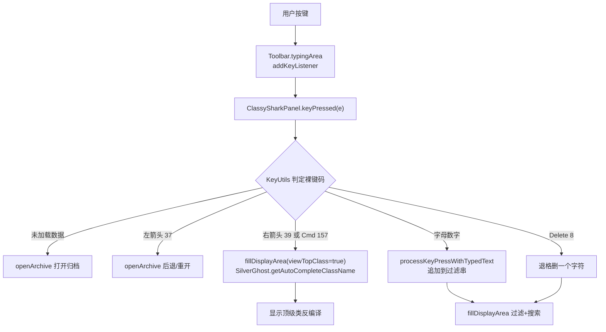

# ⌨️ 快捷键

<Badge type="tip" text="GUI" />
<Badge type="info" text="键盘交互" />

> ClassyShark 的 GUI 不需要菜单——所有导航都靠 [`Toolbar`](/reference/modules/Toolbar) 上的 `typingArea` 输入框接收的几个按键完成。键事件由 [`ClassySharkPanel`](/reference/modules/ClassySharkPanel) 的 `keyPressed` 统一处理，判定逻辑委托给 [`KeyUtils`](/reference/modules/KeyUtils)。

## 总览



## 快捷键一览 ⚡

| 按键 | 裸键码 | 行为 | 触发的方法 |
| :-: | :-: | --- | --- |
| ← 左箭头 | `37` | 后退 / 重新打开归档选择对话框 | `openArchive()` |
| → 右箭头 | `39` | 查看当前过滤串匹配的顶级类 | `fillDisplayArea(viewTopClass=true)` |
| ⌘ Command | `157` | 同右箭头——查看顶级类 | `fillDisplayArea(viewTopClass=true)` |
| Delete / Backspace | `8` | 删除过滤输入框末尾一个字符 | `processKeyPressWithTypedText` 截尾 |
| 字母 / 数字 | — | 追加到 `typingArea` 当前文本，作为过滤串 | `processKeyPressWithTypedText` |
| 任意键（数据未加载时） | — | 触发 `openArchive()`，提示先打开归档 | `openArchive()` |

::: tip 为什么按下字母直接过滤？
`typingArea` 是一个 `JTextField(50)`，但键盘事件并未交给 Swing 默认文本编辑流程，而是被 `ClassySharkPanel` 当作"命令行"接管的：每次字母数字键都把字符拼到 `toolbar.getText()` 末尾，再调用 `fillDisplayArea` 实时过滤类名列表。这使得输入框更像一个 fuzzy 搜索框而非可自由编辑的文本字段。
:::

## 处理流程详解

### 1. 事件入口

[`Toolbar`](/reference/modules/Toolbar) 在构造时通过 `addKeyListenerToTypingArea(this)` 把 `ClassySharkPanel`（实现了 `KeyListener`）注册到 `typingArea`：

```java
// Toolbar.java
public void addKeyListenerToTypingArea(KeyListener kl) {
    typingArea.addKeyListener(kl);
}
```

`ClassySharkPanel` 实现了三个回调，但只有 `keyPressed` 真正干活：

```java
// ClassySharkPanel.java
@Override public void keyTyped(KeyEvent e) { }      // 空实现
@Override public void keyReleased(KeyEvent e) { }   // 空实现

@Override
public void keyPressed(KeyEvent e) {
    if (!isDataLoaded) { openArchive(); return; }            // 数据未就绪 → 引导打开
    if (KeyUtils.isLeftArrowPressed(e)) { openArchive(); return; }

    final String textFromTypingArea =
            processKeyPressWithTypedText(e, toolbar.getText());
    final boolean isViewTopClassKeyPressed =
            KeyUtils.isRightArrowPressed(e) || KeyUtils.isCommandKeyPressed(e);

    fillDisplayArea(textFromTypingArea, isViewTopClassKeyPressed,
            !ClassySharkPanel.IS_CLASSNAME_FROM_MOUSE_CLICK);
}
```

### 2. 文本拼接：processKeyPressWithTypedText

```java
private static String processKeyPressWithTypedText(KeyEvent e, String text) {
    String result = text;
    if (KeyUtils.isDeletePressed(e)) {
        if (!text.isEmpty()) {
            return text.substring(0, text.length() - 1);   // 退格
        }
    }
    if (KeyUtils.isLetterOrDigit(e)) {
        result += e.getKeyChar();                          // 追加可输入字符
    }
    return result;
}
```

注意 `isLetterOrDigit` 用的是 `e.getKeyChar()` + `Character.isLetterOrDigit`，所以方向键、修饰键等不会产生可见字符，也不会污染过滤串。

### 3. 查看顶级类：Reducer.getAutocompleteClassName

按下 → 或 ⌘ 时，`viewTopClass=true`，`fillDisplayArea` 走 `SilverGhost.getAutoCompleteClassName()` 分支——这背后正是 [`Reducer`](/reference/modules/Reducer) 的自动补全逻辑，从当前过滤串匹配出最相关的顶级类名并反编译展示：

```java
} else if (viewTopClass) {
    className = silverGhost.getAutoCompleteClassName();
    silverGhost.translateArchiveElement(className);
    displayedClassTokens = silverGhost.getArchiveElementTokens();
}
```

其余分支：鼠标点击类名 → 直接反编译该类；纯过滤 → `silverGhost.filter(className)` 返回候选列表。

## ⚠️ 小异味：裸键码而非 VK_ 常量

[`KeyUtils`](/reference/modules/KeyUtils) 没有使用 `java.awt.event.KeyEvent.VK_LEFT`、`VK_BACK_SPACE`、`VK_RIGHT`、`VK_META` 等语义常量，而是直接写死了裸数字键码：

```java
// KeyUtils.java —— 裸键码硬编码
public static boolean isDeletePressed(KeyEvent e)      { return e.getKeyCode() == 8;   }
public static boolean isLeftArrowPressed(KeyEvent e)    { return e.getKeyCode() == 37; }
public static boolean isRightArrowPressed(KeyEvent e)   { return e.getKeyCode() == 39; }
public static boolean isCommandKeyPressed(KeyEvent e)   { return e.getKeyCode() == 157; }
public static boolean isLetterOrDigit(KeyEvent e) {
    return Character.isLetterOrDigit(e.getKeyChar());
}
```

| 现状 | 说明 |
| --- | --- |
| 裸码 `8` | 对应 `VK_BACK_SPACE`，但在 macOS 某些布局下 Delete 键行为可能与 Backspace 混淆 |
| 裸码 `157` | 对应 `VK_META`（Command）。Windows/Linux 上无此键，等同于"查看顶级类"的快捷键不可用 |
| 裸码 `37/39` | `VK_LEFT` / `VK_RIGHT`，跨平台稳定 |
| 维护性 | 裸数字缺乏自描述，读源码需查表；`KeyEvent.VK_*` 常量更安全且能抗布局差异 |

::: warning 跨平台提示
在 Windows/Linux 上没有 ⌘ 键，所以"查看顶级类"只能靠 → 右箭头触发；在 macOS 上两者皆可。若你扩展 ClassyShark，建议把裸码替换为 `KeyEvent.VK_*` 常量以提升可读性与可移植性。
:::

## 相关模块

- [ClassySharkPanel](/reference/modules/ClassySharkPanel) — 键盘中介者，`keyPressed` 入口
- [KeyUtils](/reference/modules/KeyUtils) — 裸键码判定工具类
- [Toolbar](/reference/modules/Toolbar) — `typingArea` 所在工具栏，注册监听器
- [Reducer](/reference/modules/Reducer) — `getAutocompleteClassName` 自动补全顶级类
- [Tree 视图](/gui/tree) — 鼠标点击类树的另一条导航路径
- [Display Area 显示区](/gui/display-area) — `fillDisplayArea` 的渲染目标
