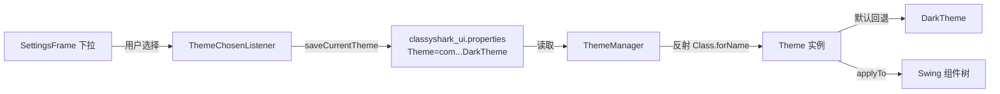
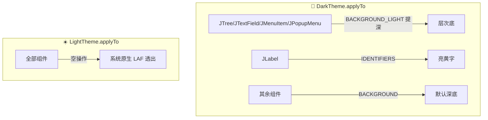

# 🎨 主题系统

<Badge type="tip" text="GUI" />
<Badge type="info" text="Dark / Light" />

> ClassyShark GUI 内置两套主题——深色 [`DarkTheme`](/reference/modules/DarkTheme)（默认）与浅色 [`LightTheme`](/reference/modules/LightTheme)。主题通过 [`ThemeManager`](/reference/modules/ThemeManager) 在 `classyshark_ui.properties` 中按类名持久化，启动时反射重建实例。

## 设计概览



主题切换在 [`SettingsFrame`](/reference/modules/SettingsFrame) 设置窗的下拉框完成，由 [`ThemeChosenListener`](/reference/modules/ThemeChosenListener) 监听写入配置。⚠️ 设置窗标签明确提示：**下次启动 ClassyShark 时生效**——当前会话不会热切换，因为 LAF 与已构造组件需要重建。

## Theme 接口

[`Theme`](/reference/modules/Theme) 继承自 `SwingThemeApplier<Component>`，定义两类获取器：8 个图标 + 7 个语义颜色。

### 图标获取器（8 个 ImageIcon）

工具栏/树节点消费的 PNG 图标，按主题从 `DarkIconScheme` / `LightIconScheme` 资源路径加载。

| 获取器 | 资源文件 | 用途 |
|--------|----------|------|
| `getToggleIcon()` | `ic_menu.png` | ☰ 切换侧栏 |
| `getRecentIcon()` | `ic_history.png` | 🕘 最近归档 |
| `getBackIcon()` | `ic_back.png` | ◀ 后退历史 |
| `getForwardIcon()` | `ic_next.png` | ▶ 前进历史 |
| `getOpenIcon()` | `ic_open.png` | 📂 打开文件 |
| `getExportIcon()` | `ic_export.png` | 💾 导出存根 |
| `getMappingIcon()` | `ic_mappings.png` | 🔗 映射文件 |
| `getSettingsIcon()` | `ic_settings.png` | ⚙ 设置入口 |

### 颜色获取器（7 个语义角色 Color）

供 [`DisplayArea`](/reference/modules/DisplayArea) 语法高亮与组件上色使用。

| 获取器 | 语义角色 |
|--------|----------|
| `getDefaultColor()` | 默认文本 |
| `getKeyWordsColor()` | 关键字（`class`/`void` 等） |
| `getIdentifiersColor()` | 标识符/变量 |
| `getAnnotationsColor()` | 注解（`@Override`） |
| `getSelectionBgColor()` | 选中背景 |
| `getNamesColor()` | 类/方法名 |
| `getBackgroundColor()` | 主背景 |

## 调色板（Solarized 风格）

颜色由 `DarkColorScheme` / `LightColorScheme` 静态常量集中定义，取值贴近 Solarized 配色。

| 角色 | DarkTheme | LightTheme |
|------|-----------|------------|
| DEFAULT | `rgb(32,32,32)` 区 `rgb(216,216,216)` | `rgb(101,123,131)` |
| KEYWORDS | `rgb(133,153,0)` 🟢 | `rgb(181,137,0)` 🟡 |
| IDENTIFIERS | `rgb(255,255,128)` 🟨 | `rgb(133,153,0)` 🟢 |
| ANNOTATIONS | `rgb(108,113,196)` 🟣 | `rgb(108,113,196)` 🟣 |
| NAMES | `rgb(88,110,117)` | `rgb(147,161,161)` |
| SELECTION_BG | `rgb(7,56,66)` 🔷 | `rgb(7,56,66)` 🔷 |
| BACKGROUND | `rgb(32,32,32)` ⬛ | `Color.WHITE` ⬜ |
| BACKGROUND_LIGHT | `rgb(46,48,50)` | —（浅色无） |

🔑 **关键共用**：深浅两套的 `SELECTION_BG` 都是 `new Color(7, 56, 66)`——同一种 Solarized 蓝绿，无论深浅主题选中态视觉一致。

## 关键非对称：applyTo

`Theme.applyTo(Component)` 是深浅主题最大的行为分歧点。

### DarkTheme.applyTo —— 全覆盖

```java
if (shallBeLighter(component)) {
    component.setBackground(BACKGROUND_LIGHT);     // JTree/JTextField/JMenuItem/JPopupMenu
} else if (component instanceof JLabel) {
    component.setForeground(IDENTIFIERS);
} else {
    component.setBackground(BACKGROUND);           // 默认深底
}
if (component instanceof JTextField) {
    component.setForeground(IDENTIFIERS);         // 输入框亮黄字
}
```

`shallBeLighter()` 对 `JTree` / `JTextField` / `JMenuItem` / `JPopupMenu` 返回真——用稍亮的 `BACKGROUND_LIGHT`（`rgb(46,48,50)`）相对 `BACKGROUND`（`rgb(32,32,32)`）**提一档深度**，形成层次。构造期还注入 `UIManager.put("MenuItem.foreground", IDENTIFIERS)` 影响全局菜单前景。

### LightTheme.applyTo —— 空操作

```java
@Override
public void applyTo(Component component) {
    /** Do nothing as we don't want to override system defaults for the light theme */
}
```

🚫 浅色**故意不覆盖任何 Swing 组件**，让系统原生 Look & Feel（macOS Aqua / Windows / GTK）完全透出。这意味着浅色下的窗体、滚动条、按钮边框全部是 OS 原生样式，ClassyShark 只负责给 `DisplayArea` 文本区按 7 个颜色角色上色。



## ThemeManager 持久化

[`ThemeManager`](/reference/modules/ThemeManager) 用 `Properties` 在工作目录的 `classyshark_ui.properties` 持久化主题。

| 方法 | 行为 |
|------|------|
| `saveCurrentTheme(Theme)` | 写 `Theme=<全限定类名>` 到属性文件 |
| `getCurrentTheme()` | 读类名 → `Class.forName(...).newInstance()` 反射重建；异常回退 `new DarkTheme()` |
| `getThemes()` | 返回 `{"Light","Dark"}` 下拉选项 |
| `getThemeIndexFrom(Theme)` | `DarkTheme→1`，其余 `→0` |
| `getThemeFrom(int)` | `0→LightTheme`，`1/default→DarkTheme` |

```java
// 持久化：按全限定类名存储
properties.setProperty("Theme", theme.getClass().getName());

// 反序列化：反射 rehydrate
final String theme = properties.getProperty("Theme");
Class<Theme> c = (Class<Theme>) Class.forName(theme);
return c.newInstance();            // 失败 → new DarkTheme()
```

💡 因为按**类名**持久化+反射，自定义主题只要实现 `Theme` 接口、放进 classpath、配置文件指向其全限定名即可被加载，无需改源码。但 `ThemeManager` 内置索引只有 Light/Dark 两个。

## 设置窗 SettingsFrame

[`SettingsFrame`](/reference/modules/SettingsFrame) 是 200×80 的 `JFrame`，含一个 `Theme:` 标签 + `JComboBox`（选项来自 `ThemeManager.getThemes()`）。下拉默认选中当前主题索引，[`ThemeChosenListener`](/reference/modules/ThemeChosenListener) 监听选择事件：

```java
// 用户在下拉选择后触发
final Theme theme = ThemeManager.getThemeFrom(comboBox.getSelectedIndex());
ThemeManager.saveCurrentTheme(theme);   // 写入 properties
root.setVisible(false);
root.dispose();                          // 关闭设置窗
```

标签 `setToolTipText("It will be applied the next time ClassyShark is started")` 明确告知**下次启动生效**。这是反射重建机制决定的——当前已构造的组件树无法热替换，需重启进程。

## 速查

- 🎯 默认主题：`DarkTheme`（`getCurrentTheme()` 异常回退 + `getThemeFrom` default 分支）。
- 🔁 持久化文件：工作目录下 `classyshark_ui.properties`，键 `Theme` = 全限定类名。
- ⚡ 反射重建：`Class.forName(name).newInstance()`，失败静默回退深色。
- 🎨 共用选中色：深浅 `SELECTION_BG` 同为 `rgb(7,56,66)` 蓝绿。
- 🌑 深色 `applyTo` 覆盖全部 Swing 组件，`JTree/JTextField/JMenuItem/JPopupMenu` 用 `BACKGROUND_LIGHT` 提深度。
- ☀️ 浅色 `applyTo` 空操作，系统原生 LAF 透出。
- 🔄 切换在 [`SettingsFrame`](/reference/modules/SettingsFrame) 下拉，**下次启动生效**。

## 相关链接

- [`Theme`](/reference/modules/Theme) · [`ThemeManager`](/reference/modules/ThemeManager) · [`DarkTheme`](/reference/modules/DarkTheme) · [`LightTheme`](/reference/modules/LightTheme) · [`SettingsFrame`](/reference/modules/SettingsFrame)
- 上层：[GUI 参考](./index) · [快捷键](./shortcuts) · [面板布局](./panels)
