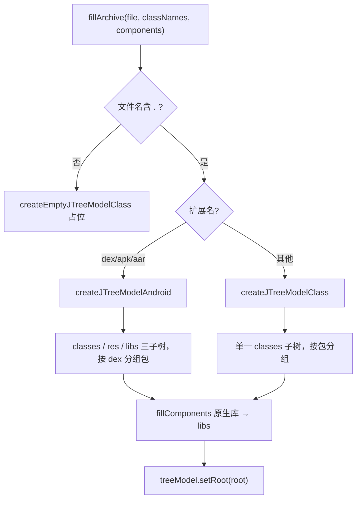
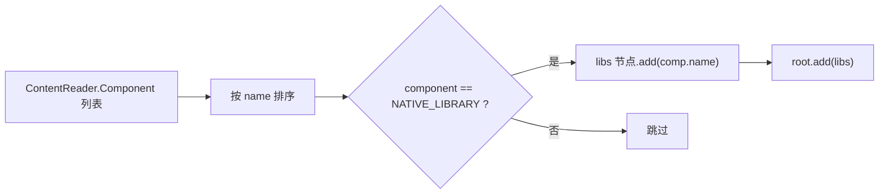
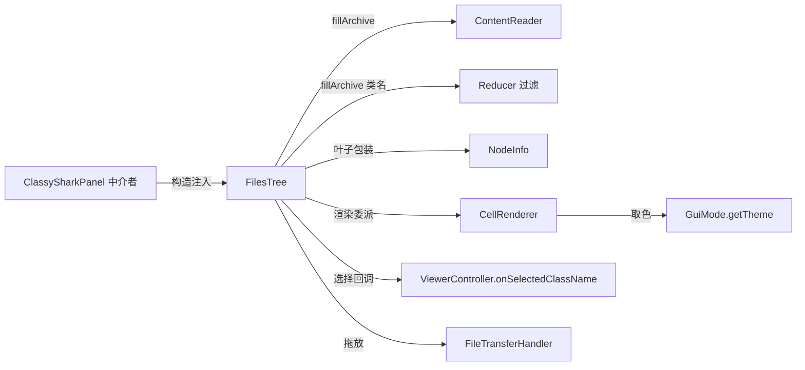

# 🌳 类树导航 FilesTree

<Badge type="tip" text="GUI 面板" /> <Badge type="info" text="JTree 构建器" />

> 左侧导航树。根据类名列表与组件列表构建 `JTree`，按存档扩展名在 Android 多 dex 布局与 Java 包分组布局之间自动切换，并把原生库归入 `libs` 子树。

详见模块参考 [FilesTree](/reference/modules/FilesTree)、[NodeInfo](/reference/modules/NodeInfo)、[CellRenderer](/reference/modules/CellRenderer)。

## 入口

[`FilesTree`](/reference/modules/FilesTree) 由 [`ClassySharkPanel`](/reference/modules/ClassySharkPanel) 中介者在初始化时构造，注入 [`ViewerController`](/reference/modules/ViewerController) 作为窄回调。宿主通过 `getJTree()` 拿到 `JTree` 组件放进 `JScrollPane`，并调用 `fillArchive(...)` 填充内容：

```java
FilesTree filesTree = new FilesTree(viewerController);
// ContentReader 加载 + Reducer 过滤后
filesTree.fillArchive(loadedFile,
                      reducer.getAllClassNames(),
                      loader.getAllComponents());
```

## 双布局策略 🎛️

`fillArchive(file, displayedClassNames, allComponents)` 先判断文件名是否含 `.`，无扩展名直接走 `createEmptyJTreeModelClass()` 错误占位；否则按扩展名分发：

| 扩展名 | 构建方法 | 子树结构 | 分组维度 |
|--------|----------|----------|----------|
| `.dex` / `.apk` / `.aar` | `createJTreeModelAndroid` | `classes` + `res` + `libs` | 按 **dex** 分组包，包内按包名聚合 |
| `.jar` / `.class` / 其他 | `createJTreeModelClass` | `classes` | 仅按 **包** 分组 |



### Android 风格 `createJTreeModelAndroid` 🤖

为多 dex 存档设计。根下挂三个固定子树：

- **`classes`** — 每遇到 `xxx.dex` 就新建一个 dex 节点挂到 `classes`，后续类按包聚合到「当前 dex 节点」下。包切换时（`pkg != lastPackage`）新建 `packageNode`。叶子用 `NodeInfo` 包装。
- **`res`** — `.xml` 资源按目录（`resName.lastIndexOf(File.separator)` 截取）聚合；无目录的直接挂根。
- **`libs`** — 由 `fillComponents` 填充。

```java
// 关键逻辑片段
if (resName.endsWith(".dex")) {
    currentClassesDex = new DefaultMutableTreeNode(resName);
    classes.add(currentClassesDex);
} else if (resName.lastIndexOf('.') >= 0) {
    String pkg = resName.substring(0, resName.lastIndexOf('.'));
    if (!pkg.equals(lastPackage)) { packageNode = new DefaultMutableTreeNode(pkg); currentClassesDex.add(packageNode); }
    packageNode.add(new DefaultMutableTreeNode(new NodeInfo(resName)));
}
```

> ⚠️ **剥离 APK hack** — 对手动瘦身、只剩一个扁平包的 APK，`packageNode != null && currentClassesDex.isLeaf()` 时会把 `packageNode` 补挂到空的 dex 节点，注释明确标注这是 workaround。

### Java 风格 `createJTreeModelClass` ☕

`jar`/`class` 不存在多 dex 概念，仅一个 `classes` 子树，按 `fullClassFileName` 截取到最后一个 `.` 得到包名，包名变化时新建 `packageNode`，叶子同样用 `NodeInfo` 包装。

## 原生库 `fillComponents` 📦

`fillComponents(root, allComponents)` 遍历 [`ContentReader`](/reference/modules/ContentReader) 产出的组件列表，按 `comp.name` 排序后筛选 `ARCHIVE_COMPONENT.NATIVE_LIBRARY`，统一挂到一个新建的 `libs` 节点下。仅当 `allComponents` 非空才创建 `libs` 子树，避免空节点污染树。



## NodeInfo 短名映射 🏷️

叶子节点用户对象是 [`NodeInfo`](/reference/modules/NodeInfo)，而非裸字符串。`NodeInfo` 持有 `fullname`（全限定名），`toString()` 返回正则 `.*?([^.]+)$` 提取的简单类名——树显示短名，选择时读回 fullname。这避免了长包名撑爆树列，又保留了精确路由所需的完整路径。

```java
public static String extractClassName(String fullname) {
    Pattern p = Pattern.compile(".*?([^.]+)$");
    Matcher m = p.matcher(fullname);
    return (m.find()) ? m.group(1) : "";
}
```

## 选择监听与扩展名路由 🖱️

`configureJTree` 注册 `TreeSelectionListener`，按节点 `toString()` 的扩展名与是否叶子路由点击：

| 节点类型 | 判定 | 回调参数 |
|----------|------|----------|
| `.dex` / `.jar` / `.apk` / `.so` | `endsWith` 扩展名 | `onSelectedClassName(用户对象字符串)` |
| 含 `NodeInfo` 叶子 | `isLeaf()` + `getUserObject() instanceof NodeInfo` | `onSelectedClassName(nodeInfo.fullname)` |
| 纯字符串叶子 | `isLeaf()` + `instanceof String` | `onSelectedClassName(字符串)` |
| 非叶子（包/dex 目录） | `!isLeaf()` 直接 return | — |

> 🔁 四个 `endsWith` 用独立 `if` 重复，可合并为正则或集合判定——参见 [FilesTree 已知问题](/reference/modules/FilesTree#已知问题-todo)。

单选模式（`SINGLE_TREE_SELECTION`），根默认不可见（`setRootVisible(false)`），`setVisibleRoot()` 可让根显出。

## CellRenderer 主题委派 🎨

[`CellRenderer`](/reference/modules/CellRenderer) 继承 `DefaultTreeCellRenderer`，把所有颜色决策委派给 [`GuiMode.getTheme()`](/reference/modules/GuiMode)：

| 方法 | 返回 |
|------|------|
| `getBackgroundSelectionColor()` | `theme.getSelectionBgColor()` |
| `getTextNonSelectionColor()` | `theme.getDefaultColor()` |
| `getBackground` / `getBackgroundNonSelectionColor` | `null`（透明，让宿主背景透出） |

`getTreeCellRendererComponent` 调 `super` 后 `setText(value.toString())`，从而让 `NodeInfo.toString()` 的短名正确显示。构造时还设了 Monospaced 20 号字体，并通过 `GuiMode.getTheme().applyTo(jTree)` 让整树跟随主题切换。`FilesTree` 与方法计数树 `MethodsCountPanel` 共享同一渲染器实例风格。

## 协作关系



## 相关文档

- [GUI 总览](./index)
- [面板布局](./panels)
- 模块参考：[FilesTree](/reference/modules/FilesTree) · [NodeInfo](/reference/modules/NodeInfo) · [CellRenderer](/reference/modules/CellRenderer) · [ViewerController](/reference/modules/ViewerController) · [ContentReader](/reference/modules/ContentReader)
