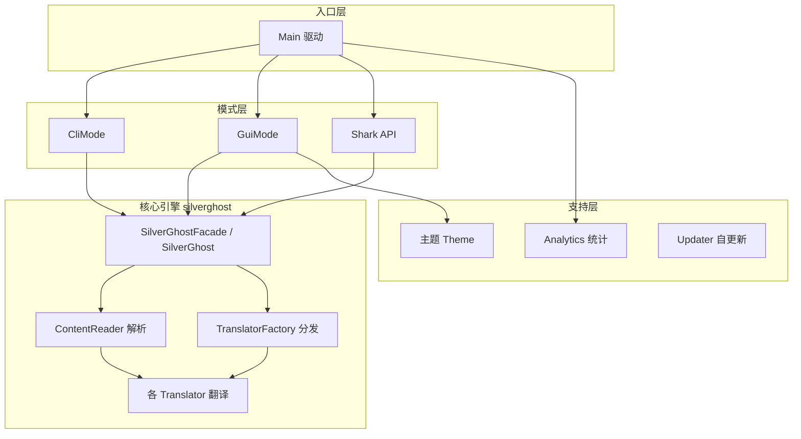

# 🏗️ 架构总览

<Badge type="tip" text="指南" /> <Badge type="info" text="架构" />

> ClassyShark 采用分层架构：入口分发 → 核心引擎（解析 + 翻译）→ 支持（GUI/CLI/API + 主题/统计/更新）。

## 三层架构

## 1. 入口层

`Main`（[模块](/reference/modules/Main)）是 JAR 入口。它判断参数：无参或 `-open` → GUI，其他 → CLI。`Shark`（[模块](/reference/modules/Shark)）是独立的编程 API facade，供工具链调用。

## 2. 核心引擎（`silverghost` 包）

这是 ClassyShark 的心脏，分两个阶段：

### 阶段 A：解析（ContentReader）

`ContentReader`（[模块](/reference/modules/ContentReader)）按归档扩展名路由到对应 reader：

| 扩展名 | Reader | 底层库 |
|--------|--------|--------|
| `.apk` | ApkReader → MultidexReader | dexlib2 |
| `.dex` | DexReader → DexlibLoader | dexlib2 |
| `.jar` | JarReader | java.util.jar |
| `.aar` | AarReader → JarReader（提取内嵌 jar） | java.util.jar |
| `.class` | ClazzReader → ClassNameVisitor | ASM |

统一输出：**类名列表** + **归档组件**（native 库、manifest 等）。

### 阶段 B：翻译（Translator）

`TranslatorFactory`（[模块](/reference/modules/TranslatorFactory)）按**元素扩展名**选择翻译器：

| 元素 | Translator | 产出 |
|------|-----------|------|
| `.xml` | AndroidXmlTranslator | 二进制 XML → 文本（`XmlDecompressor`） |
| `.dex` | DexInfoTranslator | dex 摘要（计数 + 原生方法类） |
| `.apk` | ApkTranslator → ApkDashboard | 依赖检查仪表盘 |
| `.so` | ElfTranslator | native 依赖 + 动态符号 |
| `.jar` | JarInfoTranslator | 类计数 + 文件大小 |
| class | JavaTranslator | 类源码存根（字段/构造器/方法） |

`JavaTranslator` 是主力——把任意类渲染成类 Java 源码存根。它依赖 `MetaObject` 抽象，由 `MetaObjectFactory` 在**反射 / ASM / dexlib2** 三路策略间自动选择，见 [反射 vs ASM vs dexlib2](/guide/concepts/reflect-vs-asm-vs-dexlib)。

### 通用货币：`Translator.ELEMENT` + `TAG`

所有翻译器产出统一的 `ELEMENT{text, TAG}` 列表。`TAG` 枚举区分语义角色（MODIFIER / IDENTIFIER / ANNOTATION / XML_TAG / XML_ATTR_VALUE / SELECTION …）。GUI 的 `DisplayArea` 消费它做语法高亮——这是连接翻译层与展示层的关键契约，见 [Translator 模块](/reference/modules/Translator)。

## 3. 支持层

- 🎨 **主题**（`gui/theme`）— 深色/浅色主题，深色覆盖全部 Swing 组件，浅色让系统 LAF 透出（刻意非对称），见 [主题](/gui/themes)。
- 📊 **方法计数**（`methodscounter`）— `RootBuilder` 按包建树，`RingChart` 环形图可视化。
- 📈 **统计**（`analytics`）— 基于 jgoogleanalytics 的匿名使用上报。
- 🔄 **自更新**（`updater`）— Retrofit 查 GitHub release，CLI/GUI 两种下载交互。
- 🤖 **Android 端**（`ClassySharkAndroid`）— 用反射在设备上重建类源码，见 [Android 端](/reference/architecture/android-port)。

## SPI 扩展点

ClassyShark 提供两个插件插槽：

- **`TokensMapper`**（[模块](/reference/modules/TokensMapper)）— 符号重映射，默认 `IdentityMapper`，可接入 ProGuard 反混淆。
- **`FullArchiveReader`**（[模块](/reference/modules/FullArchiveReader)）— 自定义归档读取，默认 `EmptyFullArchiveReader`。

详见 [Plugins SPI](/reference/architecture/plugins-spi) 与 [编程 API](/api/index)。

## 进一步阅读

- 🧩 [ContentReader 架构](/reference/architecture/contentreader)
- 🧩 [Translator 架构](/reference/architecture/translator)
- 🧩 [SilverGhost 引擎](/reference/architecture/silverghost-engine)
- 📋 [支持的格式](./supported-formats)
