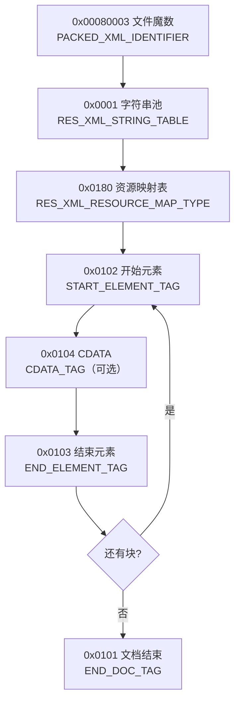

# 📄 二进制 XML

<Badge type="tip" text="指南" />
<Badge type="info" text="概念" />

> Android 构建时会把 `AndroidManifest.xml` 和 `res/` 下的所有 XML 编译成一种**二进制格式**，ClassyShark 的 `XmlDecompressor` 是独立于 AOSP `aapt` 的自研解码器。

## 🤔 为什么是"二进制"

在源码工程里，`AndroidManifest.xml` 是人可读的文本；但打进 APK 之后，它变成一串字节，文本编辑器打开是一堆乱码 ❌。原因有二：

1. 📦 **省空间**：把标签名、属性名集中到字符串池，用整数索引代替重复字面量，并支持 UTF-8 / UTF-16LE 双编码。
2. 🚀 **加速解析**：解析器直接按块读小端整数，跳过词法/语法分析，启动时加载更快。

这套格式由 AOSP 的 `ResourceTypes.h` / `ResourceTypes.cpp` 定义。`aapt`/`aapt2` 在打包时负责把文本 XML 编译进去，运行时由 `AssetManager` 反向解析。ClassyShark 需要在 PC 端离线还原它，于是有了 `XmlDecompressor`。

## 🧩 文件块结构

二进制 XML 是一连串带类型标记的 **chunk**，小端序（Little-Endian）排列：



| 块类型常量 | 值 | 含义 |
|---|---|---|
| `PACKED_XML_IDENTIFIER` | `0x00080003` | 文件头魔数，校验是否合法二进制 XML |
| `RES_XML_STRING_TABLE` | `0x0001` | 字符串池块 |
| `RES_XML_RESOURCE_MAP_TYPE` | `0x0180` | 资源 ID 映射表 |
| `START_ELEMENT_TAG` | `0x0102` | 开始标签 `<foo>` |
| `END_ELEMENT_TAG` | `0x0103` | 结束标签 `</foo>` |
| `CDATA_TAG` | `0x0104` | CDATA 文本块 |
| `END_DOC_TAG` | `0x0101` | 文档结束 |

解析器入口先用 `LittleEndianDataInputStream` 读首 4 字节，校验 `PACKED_XML_IDENTIFIER`，不匹配则抛 `IOException("Invalid packed XML identifier...")`。

## 📚 字符串池解码

字符串池是整个格式的核心——后续所有标签名、属性名、属性值都是对它的索引。`XmlDecompressor.parseStrings()` 处理流程：

1. 读 `stringMarker`，校验是否为 `RES_XML_STRING_TABLE`。
2. 读 `chunkSize` / `numStrings` / `numStyles` / `flags` / `stringStart` / `stylesStart`。
3. 根据 `flags & 0x100` 判断编码：
   - ✅ 置位 → **UTF-8**，每字形 1 字节。
   - ❌ 未置位 → **UTF-16LE**，每字形 2 字节。
4. 用 `ByteBuffer`（小端）批量读入数据，按偏移数组逐个取出字符串。

> 💡 这一步是 `XmlDecompressor` 自研实现的关键难点：AOSP 用 C++ 原生指针操作，这里用 `ByteBuffer` + 偏移数组在 Java 侧复现。

## ⚙️ 类型化属性值

开始标签内嵌一组属性，每组属性带一个 `attrValueType` 字节指明数据类型。`XmlDecompressor.parseAttributes()` 用一个 `marker` `0x00140014`（`ATTRS_MARKER`）定位属性区起点，然后按下表解码：

| 类型常量 | 值 | 解码结果示例 |
|---|---|---|
| `RES_TYPE_NULL` | `0x00` | `<empty>` / `<undefined>` |
| `RES_TYPE_REFERENCE` | `0x01` | `@res/0x7F08007E` |
| `RES_TYPE_ATTRIBUTE` | `0x02` | `@attr/0x...` |
| `RES_TYPE_STRING` | `0x03` | 直接查字符串池 |
| `RES_TYPE_FLOAT` | `0x04` | `Float.intBitsToFloat` 转浮点 |
| `RES_TYPE_DIMENSION` | `0x05` | 数值 + 单位 `px/dp/sp/pt/in/mm` |
| `RES_TYPE_FRACTION` | `0x06` | 数值 + `%%` / `%%p` |
| `RES_TYPE_DYNAMIC_REFERENCE` | `0x07` | `@dyn/0x...` |
| `RES_TYPE_INT_DEC` | `0x10` | 十进制整数 |
| `RES_TYPE_INT_HEX` | `0x11` | `0x...` |
| `RES_TYPE_INT_BOOLEAN` | `0x12` | `true` / `false` |

维度和分数的数值由尾数（mantissa）+ 基数（radix）+ 单位共同编码，`resValue()` 按 `COMPLEX_MANTISSA_MASK`、`RADIX_MULTS[]` 还原浮点，`getDimensionType()` / `getFractionType()` 还原单位后缀。这块位运算正是 AOSP `ResourceTypes.cpp` 的 Java 端复刻。

## 🦈 ClassyShark 的处理链路

```
.apk / .aar / .xml
        │
        ▼
AndroidXmlTranslator.apply()   从 ZipEntry 取出原始字节
        │ .aar 走文本直读，否则走二进制解码
        ▼
XmlDecompressor.decompressXml() 小端读块、解字符串池、遍历标签
        │
        ▼
getElementsList() ── XmlHighlighter.getElements()  正则分词做语法高亮
        │
        ▼
GUI / CLI 文本展示
```

- [`AndroidXmlTranslator`](/reference/modules/AndroidXmlTranslator)：实现 `Translator` 接口，负责从 APK/ZIP/AAR 或裸文件取出二进制 XML 字节，`.aar` 是纯文本直接 `toString()`，其余交给 `XmlDecompressor`。
- [`XmlDecompressor`](/reference/modules/XmlDecompressor)：核心解码器，自研、不依赖 `aapt`。支持开关 `appendNamespaces` / `appendCData`，输出带缩进的文本 XML。
- [`XmlHighlighter`](/reference/modules/XmlHighlighter)：对解码后的文本 XML 用一组预编译正则（`TAG_PATTERN` / `TAG_ATTRIBUTE_PATTERN` / `TAG_CDATA_START` 等）分词，产出带 `TagType` 的 `Element` 列表供 GUI 着色。

## ⚠️ 为什么强调"独立实现"

> 🛠️ `XmlDecompressor` **不调用** AOSP 的 `aapt`，也不依赖 Android SDK 的二进制工具。它在纯 Java 侧用 `LittleEndianDataInputStream` + `ByteBuffer` 复现 `ResourceTypes.h` 的二进制布局，是 ClassyShark 中技术含量最高的自研组件之一。

这意味着 ClassyShark 可以在任意 JDK 环境下离线解码任意 APK 的 manifest 与资源 XML，无需安装 Android SDK 或 NDK。其源头可追溯到 StackOverflow 上 Ribo 的解法，后续针对 CDATA、命名空间、字符串池编码做了修正，并直接对照 AOSP 源码完成位运算层面的对齐。

## 📖 进一步阅读

- 🧩 [APK 结构](./apk)
- 🧩 [DEX 与 Dalvik](./dex)
- 🖥️ [CLI 参考：`-inspect`](/cli/index)
