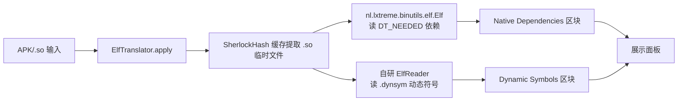

# 🧩 ELF 与 .so

<Badge type="tip" text="指南" /> <Badge type="info" text="Native 库" />

> ELF（Executable and Linkable Format）是 Android native 库 `.so` 的底层格式。ClassyShark 用专门的 Translator 链读取动态符号与依赖关系，帮你审计 APK 内的 C/C++ 代码面。

## 📦 什么是 ELF

ELF 是 Unix 系通用的二进制容器格式，既可表示可执行文件、目标文件（`.o`），也可表示**共享库**（shared object）。Android 的 native 库 `.so` 本质就是 ELF **共享库**，由 NDK 工具链从 C/C++ 源码编译而来，运行时由动态链接器 `linker` 加载到进程地址空间。

一个 `.so` 内部由若干 **节（section）** 与 **段（segment）** 组成，对 ClassyShark 而言最关键的有：

| 结构 | 含义 | ClassyShark 用途 |
|------|------|------------------|
| `.dynsym` | 动态符号表，导出/导入的函数与变量符号 | 🔍 列出 native 函数名 |
| `.dynstr` | 动态字符串表，存放 `.dynsym` 中的名字 | 配合 `.dynsym` 还原符号名 |
| `.dynamic` | 动态段，记录依赖、SONAME、重定位等元信息 | 读取 `DT_NEEDED` 依赖 |
| `.symtab` | 完整符号表（常被 strip 删除） | 备选符号来源 |
| `PT_LOAD` | 可加载段 | 判定 PIE（位置无关） |

## 🔗 三个关键概念

### DT_NEEDED 依赖

`.dynamic` 段里每条 `DT_NEEDED` 条目记录该 `.so` **运行时依赖的其他共享库**名称（如 `liblog.so`、`libc++_shared.so`）。动态链接器据此递归加载依赖链。ClassyShark 通过它画出 native 依赖图。

### SONAME

`DT_SONAME` 条目定义共享库的「正式名」（如 `libsqlcipher_android.so`）。SONAME 用于版本化兼容性，链接时被嵌入 ELF，运行时让动态链接器按 SONAME 而非文件名匹配。**缺少 SONAME** 是 Android 早期 NDK 构建的一个常见隐患。

### Text Relocation

`text relocations` 指需要对**只读代码段**做运行时重定位修改——这要求把代码段映射为可写，既破坏 W^X 安全模型，又在 Android 5.0+（API 21+）被直接拒绝加载。出现 text relocation 的 `.so` 在新设备上会崩溃。

## 🛠️ ClassyShark 如何读 ELF

`.so` 是 ClassyShark 支持的 native 格式之一，由 [TranslatorFactory](/reference/modules/TranslatorFactory) 按扩展名分发到 [ElfTranslator](/reference/modules/ElfTranslator)。其内部走「双引擎」策略：



为什么用两个引擎？因为 `nl.lxtreme.binutils.elf.Elf`（binutils 封装）能读 `DT_NEEDED` 共享依赖，却**不暴露动态符号表**；而自研的 [ElfReader](/reference/modules/ElfReader)（注释自称「a poor man's readelf」）能直接解析 `.dynsym`/`.dynstr` 节，补上符号导出。两者职责互补。

### SherlockHash 缓存提取

APK 里的 `.so` 是 zip 条目，需先解压到临时文件再交给 ELF 解析器。[SherlockHash](/reference/modules/SherlockHash) 是单例缓存：按「宿主文件路径 + lastModified 时间戳」做二级 Map，命中即复用已解压的临时 `.so`，避免重复 IO。详见模块文档。

## 🖥️ 检查动态符号健康度

[DynamicSymbolsInspector](/reference/modules/DynamicSymbolsInspector) 在 APK 仪表盘生成时对每个 `.so` 做合规体检，依托 `nl.lxtreme.binutils.elf.Elf`：

| 检查项 | 判定方法 | 异常信息 |
|--------|----------|----------|
| 缺 SONAME | `elf.isSoname()` 为 false | `missing SONAME` |
| Text 重定位 | `elf.isTextRel()` 为 true | `text relocations found` |

任一不通过即标记 `areErrors`，错误字符串汇入 dashboard 提示开发者修复 NDK 构建配置。

## ⚠️ 已知限制：仅 32 位

[ElfReader](/reference/modules/ElfReader) 在 `readIdent()` 中强制 `mClass == ELFCLASS32`（值 `1`），遇到 64 位 ELF（`ELFCLASS64 = 2`）直接抛：

```
IOException: Invalid executable type 2: not ELFCLASS32!
```

由于 `ElfTranslator.apply()` 用 `try/catch (Exception)` 吞掉异常，64 位 `.so` 不会让程序崩溃，但 **Dynamic Symbols 区块会为空**。实际影响：

| ABI | ELF 类 | 动态符号可读 | 依赖（DT_NEEDED）可读 |
|-----|--------|--------------|----------------------|
| `armeabi` / `armeabi-v7a` | ELFCLASS32 | ✅ | ✅ |
| `x86` | ELFCLASS32 | ✅ | ✅ |
| `arm64-v8a` | ELFCLASS64 | ❌ 抛 ELFCLASS64 | ✅（走 binutils `Elf`，不受限） |
| `x86_64` | ELFCLASS64 | ❌ 抛 ELFCLASS64 | ✅（同上） |

> 注意：DT_NEEDED 依赖来自 binutils 的 `Elf`，**不受 32 位限制**，故 64 位 `.so` 的 Native Dependencies 仍能正常展示；只有 Dynamic Symbols 受限。

## 🔍 实操：查看一个 .so

```bash
# 用 ClassyShark CLI 打开 APK 并选中 lib/<abi>/libfoo.so
java -jar classyshark.jar -open app.apk -inspect lib/armeabi-v7a/libfoo.so
```

输出会包含文件大小、Native Dependencies（DT_NEEDED 列表）与 Dynamic Symbols（导出/导入符号列表）。若发现 `missing SONAME` 或 `text relocations found` 警告，需回 NDK 构建脚本补 `LOCAL_MODULE` 命名或修正重定位。

## 📚 进一步阅读

- 🧩 [ElfTranslator 模块](/reference/modules/ElfTranslator) — ELF 翻译器主入口
- 🧩 [ElfReader 模块](/reference/modules/ElfReader) — 穷人版 readelf 实现细节
- 🧩 [SherlockHash 模块](/reference/modules/SherlockHash) — native 条目解压缓存
- 🧩 [DynamicSymbolsInspector 模块](/reference/modules/DynamicSymbolsInspector) — SONAME/text-rel 体检器
- 📦 [APK 结构](./apk) — `.so` 在 APK 中的 `lib/` 布局
- 🛠️ [支持格式](/guide/supported-formats)
