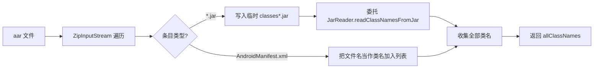

# 📦 JAR 与 AAR

<Badge type="tip" text="指南" /> <Badge type="info" text="Java/Android 归档" />

> JAR 与 AAR 是 Java/Android 生态最通用的库分发格式，二者本质都是 ZIP。ClassyShark 把它们当作"类容器"流式扫描，提取类名与 native 库信息。

## 🫙 什么是 JAR

**JAR**（**J**ava **AR**chive）是 Java 类与资源的标准打包格式，本质是一个 ZIP，里面全是编译后的 `.class` 字节码：

```
library.jar
├── com/
│   └── foo/
│       ├── Bar.class         ☕ JVM 字节码
│       └── Baz.class
├── META-INF/
│   └── MANIFEST.MF           📋 清单（入口类、版本等）
└── resources/                📦 资源（可能含 .so native 库）
```

## 🤖 什么是 AAR

**AAR**（**A**ndroid **AR**chive）是 Android 库的发布格式，同样是个 ZIP，但内容更丰富——把字节码、清单、资源、native 库都塞在一起：

| 条目 | 说明 |
|------|------|
| `classes.jar` | 🫙 内嵌的 JAR，真正的 `.class` 都在这里 |
| `AndroidManifest.xml` | 📄 库的清单（权限、组件声明） |
| `res/` | 📄 编译后的资源 |
| `R.txt` | 🏷️ 资源 ID 清单（供引用方合并） |
| `assets/` | 📦 原始资源 |
| `libs/*.jar` | 🫙 可选的额外依赖 JAR |
| `jni/**/*.so` | 🐚 可选的 native 库 |

## 🛠️ ClassyShark 如何处理 JAR

[`JarReader`](/reference/modules/JarReader) 实现了 `BinaryContentReader`，用 `JarInputStream` **流式遍历**每一个 `JarEntry`，不一次性加载到内存：

- 遇到 `*.class` 条目 → 把 `com/foo/Bar.class` 的路径分隔符 `/` 换成 `.`，去掉 `.class` 后缀，得到点分类名 `com.foo.Bar` 加入列表 🧩
- 遇到 `resources` 前缀且为 `.so` 的条目 → 记为 `NATIVE_LIBRARY` 组件 🐚（用于 native 库检测）
- 遍历完按字典序排序后返回类名列表

```java
// JarReader 核心逻辑（简化）
while ((jarEntry = jarFileStream.getNextJarEntry()) != null) {
    if (jarEntry.getName().endsWith(".class")) {
        // com/foo/Bar.class  →  com.foo.Bar
        classes.add(toDotName(jarEntry.getName()));
    }
    if (jarEntry.getName().startsWith("resources")
            && jarEntry.getName().startsWith(".so")) {
        components.add(new Component(name, NATIVE_LIBRARY));
    }
}
```

> ⚠️ 注意：源码里 native 库检测用 `startsWith("resources")` 同时 `startsWith(".so")`，两个条件永远不会同时满足（一个名字不可能既以 `resources` 开头又以 `.so` 开头），这是仓库中已知未完成的 TODO。所以实际上 JAR 内的 native 库目前不会被检出。

## 🤖 ClassyShark 如何处理 AAR

[`AarReader`](/reference/modules/AarReader) 把 AAR 当成普通 ZIP 解压遍历，对每个条目分别处理：



关键设计点：

1. **临时文件** 📂：AarReader 用 `File.createTempFile("classes", "jar")` 创建临时文件并 `deleteOnExit()`，把 AAR 内找到的内嵌 `*.jar`（通常是 `classes.jar`）字节流拷出来。
2. **委托 JarReader** 🤝：拿到临时 `.jar` 后调用 `JarReader.readClassNamesFromJar(...)` 复用 JAR 的类名提取逻辑，native 库组件也会一并累积。
3. **Manifest 当类名** 📄：当遇到名为 `AndroidManifest.xml` 的条目时，直接把字符串 `"AndroidManifest.xml"` 加进 `allClassNames` 列表——这样左侧文件树会出现一个伪"类"条目，选中后由 XML 翻译器渲染清单内容。

## 📊 JAR vs AAR 处理对比

| 维度 | JAR | AAR |
|------|-----|-----|
| 读取器 | `JarReader` | `AarReader` |
| 解析方式 | `JarInputStream` 流式 | `ZipInputStream` 解压 |
| 字节码来源 | 直接是 `.class` | 内嵌的 `classes.jar` |
| 需要临时文件 | ❌ 否 | ✅ 是（写出 `classes.jar`） |
| Manifest 处理 | 不单独列出 | ✅ 作为伪类名加入列表 |
| 复用关系 | 基础 | 委托给 `JarReader` |

## 🖥️ 选中 JAR 时的展示

在 GUI/CLI 中选中某个 `.jar` 条目时，[`TranslatorFactory`](/reference/modules/TranslatorFactory) 按 `className.endsWith(".jar")` 分发到 [`JarInfoTranslator`](/reference/modules/JarInfoTranslator)，它会输出归档摘要：

- 📊 `classes: N` —— 类总数
- 📏 `size: X.X KB/MB` —— 归档文件大小（经 `readableFileSize` 格式化）

`getClassName()` 返回归档文件名本身，`getDependencies()` 返回空列表（JAR 层级不分析依赖）。

## 🔍 相关概念

- 🧩 [APK 结构](./apk) —— APK 内同样可能含 `.jar`
- 🧩 [DEX 与 Dalvik](./dex) —— `.class` 最终要转成 `.dex`
- 🛠️ [架构总览](../architecture-overview) —— ContentReader + TranslatorFactory 的分层
- 📚 [TranslatorFactory 模块](/reference/modules/TranslatorFactory)
- 📚 [JarReader 模块](/reference/modules/JarReader)
- 📚 [AarReader 模块](/reference/modules/AarReader)
- 📚 [JarInfoTranslator 模块](/reference/modules/JarInfoTranslator)
