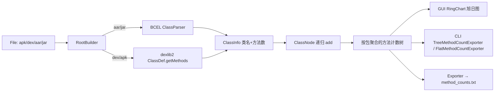

# 📊 方法数 65k 限制

<Badge type="tip" text="指南" />
<Badge type="info" text="方法计数" />

> 单个 DEX 的方法 ID 用 16 位索引，上限 **65535**。一旦应用加依赖方法数超限，构建系统就得拆出多个 DEX（multidex）。这是 Android 早期最著名的痛点，也是 ClassyShark 方法数统计功能要解决的核心问题。

## ⚠️ 65k 是怎么来的

DEX 文件的方法表里，每个方法用一个 **16 位无符号整数** 作为索引（method id）。16 位能表达的最大值是 `0xFFFF = 65535`，所以一个 DEX 最多容纳 **65535 个方法**（外加字段同理共享同一套 ID 空间）。

应用自己的代码加上引入的库（support 库、Gson、RxJava、OkHttp 等）方法数一旦突破这个上限，旧版 Dalvik 在加载 `classes.dex` 时会直接抛 `Unable to execute dex: method ID not in [0, 0xffff]`。解决办法就是 **multidex**：把多余的方法塞进 `classes2.dex`、`classes3.dex`。详见 [Multidex 概念](./multidex) 与 [DEX 概念](./dex)。

| 维度 | 数值 | 说明 |
|------|------|------|
| 方法 ID 宽度 | 16 bit | `0x0000`–`0xFFFF` |
| 单 DEX 方法上限 | 65,535 | 含自身代码 + 全部依赖 |
| 超限后果 | 💥 加载失败 | Dalvik 抛 `method ID not in [0, 0xffff]` |
| 解决方案 | 📦 multidex | 拆成 `classes2.dex`、`classes3.dex` |

## 🦈 ClassyShark 怎么帮你算

方法数统计的完整链路见 [架构总览](/guide/architecture-overview)：先按输入格式抽取每个类的方法数，再按包路径递归累加成一棵计数树，最后在 GUI 用旭日图、在 CLI 用树形/扁平文本呈现。



### 🛠️ RootBuilder：按格式分发解析

[`RootBuilder`](/reference/modules/RootBuilder) 是统计入口，根据文件扩展名走不同解析器：

| 输入格式 | 解析方式 | 关键 API |
|----------|----------|----------|
| `.aar` | 先解压出内嵌 `classes.jar`，再按 jar 处理 | `ZipInputStream` 找 `.jar` entry → 落临时文件 |
| `.jar` | Apache **BCEL** 解析每个 `.class` | `ClassParser.parse()` → `JavaClass.getMethods().length` |
| `.dex` | **smali/dexlib2** 加载 dex | `DexlibLoader.loadDexFile()` → `ClassDef.getMethods()` 逐个计数 |
| `.apk` | 扫描 zip 内所有 `.dex`，逐个落盘按 dex 解析 | 遍历 `*.dex` entry → `fillFromDex` |

> 💡 `.jar`/`.aar` 走 BCEL 读 `.class`；`.dex`/`.apk` 走 dexlib2 读 DEX 的 `ClassDef`。两条路径殊途同归：都产出一个 `ClassInfo(类名, 方法数)` 喂给 `ClassNode`。

### 🧩 ClassNode：递归累加成包聚合树

[`ClassNode`](/reference/modules/ClassNode) 是一棵前缀树（trie）。每收到一个 `ClassInfo`，就按包名 `com.google.foo.Bar` 切成段，沿 `com → google → foo` 逐级建子节点，并把方法数**累加到路径上每一级**。结果是一棵「按包聚合计数」的树：根节点是总方法数，每个子包是其下所有类方法数之和。

```
com - 4231
├── google - 3900
│   └── foo - 3900
└── example - 331
    └── bar - 331
```

这样一眼就能看出「哪个包贡献了最多方法」——这是定位 multidex 元凶的关键。

## 🖥️ GUI：RingChart 旭日图可视化

GUI 模式下，[`MethodsCountPanel`](/reference/modules/MethodsCountPanel) 用后台 `SwingWorker` 调 `RootBuilder.fillClassesWithMethods()`，把整棵树灌进 `JTree`。选中节点后，右侧 [`RingChart`](/reference/modules/RingChart) 画一张 **旭日图（sunburst）**：

- 🍩 同心圆分层：内环=顶层包，外环=子包，每段角度按方法数占比分配
- 🎨 同色系子包共享调色板，方法数最少的若干包合并成灰色 "Others"
- 🖱️ 像素取色命中节点：`getClassNodeAt(x,y)` 通过颜色反查 `colorClassNodeMap`

[`RingChartPanel`](/reference/modules/RingChartPanel) 负责承载图表并与选择联动。GUI 用法见 [GUI 参考](/gui/index)。

## 🔍 CLI：-methodcounts 与 -flat

命令行直接出文本报告，无需打开 GUI。

```bash
# 树形输出（默认，Unicode box-drawing）
java -jar ClassyShark.jar -methodcounts app.apk

# 扁平输出：全限定名 + 方法数，一行一个包
java -jar ClassyShark.jar -methodcounts app.apk -flat
```

`-methodcounts` 由 [`CliMode`](/reference/modules/CliMode) 路由到 [`SilverGhostFacade.inspectPackages`](/reference/modules/SilverGhostFacade)，按是否追加 `-flat` 切换两个导出器：

| 模式 | 导出器 | 输出形态 | 用途 |
|------|--------|----------|------|
| `-methodcounts` | [`TreeMethodCountExporter`](/reference/modules/TreeMethodCountExporter) | 树形 + Unicode 框线 `╚ ╠ ║ ═` | 👀 人工看包结构 |
| `-methodcounts -flat` | [`FlatMethodCountExporter`](/reference/modules/FlatMethodCountExporter) | `com.google.foo - 3900` 一行一条 | 🤖 脚本/grep 处理 |

### 树形输出示例

```
app.apk - 4231
 ╚═ com - 4231
    ╠═ google - 3900
    ║  ╚═ foo - 3900
    ╚═ example - 331
       ╚═ bar - 331
```

`TreeMethodCountExporter` 用 `boolean[]` 记录每层是否为末子节点，据此在 `╚`（末节点）和 `╠`（非末节点）之间切换，画出经典目录树样式。

## 📦 导出 method_counts.txt

[`Exporter`](/reference/modules/Exporter).`writeMethodCounts(archive)` 把 `RootBuilder` 算出的树用 `TreeMethodCountExporter` 写入当前目录下的 **`method_counts.txt`**：

```java
File outputFile = new File("method_counts.txt");
RootBuilder rootBuilder = new RootBuilder();
ClassNode classNode = rootBuilder.fillClassesWithMethods(archive);
new TreeMethodCountExporter(pw).exportMethodCounts(classNode);
```

这是 `-export` 命令导出产物之一（与 `manifest.txt`、`classnames.txt`、`methods.txt`、`strings.txt` 并列），便于离线存档方法数快照。

## ✅ 典型排查流程

1. 📥 拿到出问题的 APK
2. 🖥️ `java -jar ClassyShark.jar -open app.apk` 看右下环形图，锁定方法数占比最大的包
3. 🔍 `java -jar ClassyShark.jar -methodcounts app.apk -flat | sort -t- -k2 -rn` 按方法数排序找元凶
4. 🧩 针对性瘦身：换更轻的库、用 ProGuard/R8 裁剪、或正式引入 multidex

## 📚 进一步阅读

- 🧩 [DEX 与 Dalvik](./dex) — 65k 限制的底层来源
- 🧩 [Multidex](./multidex) — 超限后的拆分策略
- 🛠️ [RootBuilder](/reference/modules/RootBuilder) · [ClassNode](/reference/modules/ClassNode) · [RingChart](/reference/modules/RingChart) · [RingChartPanel](/reference/modules/RingChartPanel)
- 📦 [TreeMethodCountExporter](/reference/modules/TreeMethodCountExporter) · [FlatMethodCountExporter](/reference/modules/FlatMethodCountExporter) · [Exporter](/reference/modules/Exporter)
- 🔍 [CLI 参考](/cli/index) — `-methodcounts` / `-export` 完整参数
