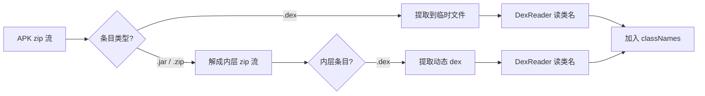

# 🧩 Multidex

<Badge type="tip" text="指南" />
<Badge type="info" text="DEX 拆分" />

> 当一个 Android 应用方法数超过单个 DEX 上限时，需要把代码拆分到多个 `.dex` 文件中——这就是 **Multidex**。

## 📊 65535 方法 ID 上限

单个 DEX 文件的方法表用 **16 位整数**（`method_ids`）做索引，**理论上限 65535 个方法**（含第三方依赖、AndroidX、Kotlin 标准库等全部方法）。一旦超限，`d8`/`dx` 会报错并中止构建：

```
Error: The number of method references in a .dex file exceeds 64K (65536).
```

解决方案是把方法分散到多个 DEX 文件中：

| 文件名 | 含义 | 备注 |
|--------|------|------|
| `classes.dex` | 主 dex（首启类 + 常用依赖） | ART 直接加载 |
| `classes2.dex` | 第二个 dex | 启动时由 multidex 库加载 |
| `classes3.dex` … | 后续 dex | 依次追加 |

数字编号严格连续递增（`classes` → `classes2` → `classes3`），缺号会导致加载失败。

## 🛠️ 两种 Multidex 方式

### ✅ 方式一：自动 Multidex（官方）

由 **Android Gradle 插件** 自动生成，开启 `multiDexEnabled true` 即可：

```gradle
android {
    defaultConfig {
        multiDexEnabled true
    }
}
```

插件会在 `minSdkVersion >= 21`（ART 原生支持）时直接输出 `classes.dex`、`classes2.dex`……；低版本需引入 `androidx.multidex:multidex` 兜底库在运行时合并。

特征：**文件名一定是 `classes.dex` / `classes2.dex` / `classes3.dex`**，前缀固定为 `classes`。

### ⚙️ 方式二：自定义 DEX 加载

应用在**运行时**动态下载/解压 `.dex` 文件并自行 `DexClassLoader` 加载，常见于插件化、热修复、动态下发场景。这类 dex 文件名不遵循 `classesN.dex` 规范，可能：

- 命名为 `classes1.dex`（注意是 `1` 不是 `2`，跳过了主 dex 编号约定）
- 完全不用 `classes` 前缀，如 `patch.dex`、`hotfix.dex`
- 藏在 APK 内嵌的 jar/zip 中动态释放

## 🔍 ClassyShark 如何识别 Multidex

ClassyShark 的 [`SilverGhostFacade`](/reference/modules/SilverGhostFacade) 提供两个判定 API，二者配合可区分“官方 multidex”与“自定义 dex 加载”。

### `isMultiDex` —— 是否多 dex

源码逻辑（节选自 [`SilverGhostFacade.java`](https://github.com/google/android-classyshark/blob/master/ClassySharkWS/src/com/google/classyshark/silverghost/SilverGhostFacade.java)）：

```java
for (String classEntry : allClassNames) {
    if (classEntry.endsWith(".dex")) {
        numDexes++;
        if (numDexes == 2) {   // 达到 2 个 dex 即返回 true
            return true;
        }
    }
}
return false;
```

判定规则：遍历 [`ContentReader`](/reference/modules/ContentReader) 收集到的全部条目名，**只要存在 ≥2 个 `.dex` 条目即视为 multidex**。它不关心命名规范，只看数量。

### `isCustomMultiDex` —— 是否自定义 dex 加载

在 `isMultiDex` 为 `true` 的前提下进一步检测，命中以下任一条件即返回 `true`：

1. **含 `classes1.dex`** —— 编号跳过 `classes`→`classes2` 的官方约定，说明是手动塞进去的自定义 dex
2. **存在不以 `classes` 开头的 `.dex` 条目** —— 如 `patch.dex`、`hotfix.dex`

```java
if (allClassNames.contains("classes1.dex")) {
    return true;
}
for (String classEntry : allDexNames) {
    if (!classEntry.startsWith("classes")) {
        return true;
    }
}
return false;
```

### 判定矩阵

| APK 内 dex 条目 | `isMultiDex` | `isCustomMultiDex` | 解读 |
|-----------------|:---:|:---:|------|
| 仅 `classes.dex` | ❌ | ❌ | 单 dex，未超限 |
| `classes.dex` + `classes2.dex` | ✅ | ❌ | 官方自动 multidex |
| `classes.dex` + `classes1.dex` | ✅ | ✅ | 含自定义 dex |
| `classes.dex` + `patch.dex` | ✅ | ✅ | 自定义 dex 加载 |
| `classes.dex` + 内嵌 zip 内的 `foo.dex` | ✅ | ✅ | 动态 dex |

## 📦 MultidexReader 的全量扫描

[`MultidexReader`](/reference/modules/MultidexReader) 负责穷举 APK 内**所有** dex，包括隐藏在嵌套 jar/zip 中的动态 dex，供 `ApkDashboard` 展示每个 dex 的方法数分布。



### 内外条目命名用 `###` 连接

对于嵌套在 jar/zip 内的动态 dex，ClassyShark 在 `readClassNamesFromMultidex` 中用 **`###`** 把外层条目名与内层 dex 名拼接，作为一个复合条目加入类名列表：

```java
String name = zipEntry.getName() + "###" + innerZipEntry.getName();
classNames.add(name);          // 例：assets/patch.jar###patch.dex
classNames.addAll(classesAtDex);
```

这样既保留了来源归属，又能被 [`extractClassesDexWithClass`](/reference/modules/MultidexReader) 定位到具体 dex 文件。

## 🚦 哨兵索引：99 与 999

[`ApkDashboard`](/reference/modules/ApkDashboard) 给每个 dex 分配一个索引以便排序与展示，约定两类**哨兵值**标识非标准 dex：

| 索引 | 含义 | 赋值位置 |
|:---:|------|------|
| `0` | `classes.dex`（主 dex） | 字符 `classes.dex` 倒数第 5 位为 `.`（`Character.getNumericValue('.') == -1`，特判为 0） |
| `2`/`3`… | `classes2.dex`/`classes3.dex` | 取文件名倒数第 5 位的数字 |
| `99` | 嵌套 jar/zip 内的动态 dex | `customClassesDexEntries` 分支 |
| `999` | 顶层非 `classes` 前缀的自定义 dex | `customClassesDexEntries` 分支 |

源码节选（[`MultidexReader.java`](/reference/modules/MultidexReader)）：

```java
if (zipEntry.getName().equals("classes.dex") ||
    (zipEntry.getName().startsWith("classes") && zipEntry.getName().endsWith(".dex"))) {
    to.classesDexEntries.add(fillAnalysisPerClassesDexIndex(dexIndex, file));
} else {
    to.customClassesDexEntries.add(fillAnalysisPerClassesDexIndex(999, file));   // 顶层自定义
}
// …内层 zip 的 dex
to.customClassesDexEntries.add(fillAnalysisPerClassesDexIndex(99, file));        // 嵌套动态
```

哨兵值刻意取大数（99/999），确保自定义 dex 在 dashboard 列表中**排在所有官方 classes dex 之后**，视觉上与正常 multidex 区分开。

## 🦈 实战：用 ClassyShark 检查 multidex

### 命令行 `-inspect`

```bash
java -jar ClassyShark.jar -inspect app.apk
```

仪表盘会列出每个 dex 的方法数与 native 库依赖，自定义 dex 标记为 `99`/`999` 索引。

### 作为库

```java
import com.google.classyshark.Shark;
import java.io.File;

Shark shark = Shark.with(new File("app.apk"));
if (shark.isMultiDex()) {
    System.out.println("✅ 多 dex，自定义加载：" + shark.isCustomMultiDex());
}
```

`Shark.isMultiDex()` / `isCustomMultiDex()` 内部委托给 [`SilverGhostFacade`](/reference/modules/SilverGhostFacade)，详见 [Shark API](/api/shark-class)。

## 进一步阅读

- 🧩 [DEX 与 Dalvik](./dex)
- 📦 [APK 结构](./apk)
- 🛠️ [SilverGhostFacade 模块](/reference/modules/SilverGhostFacade)
- 🛠️ [MultidexReader 模块](/reference/modules/MultidexReader)
- 🛠️ [DexReader 模块](/reference/modules/DexReader)
- 📊 [统计方法数教程](/tutorials/count-methods)
