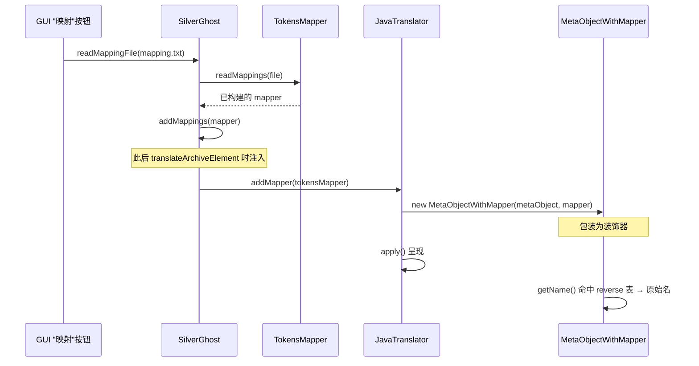

# 🦈 ProGuard 映射与反混淆

<Badge type="tip" text="概念" />
<Badge type="info" text="反混淆" />
<Badge type="info" text="ProGuard / R8" />

> 发布版 Android 应用普遍经过 **ProGuard / R8** 混淆，类名、方法名被压缩成无意义短名（`com.foo.Bar` → `a.b.c`）。ClassyShark 通过 `TokensMapper` SPI 加载 `mapping.txt`，在呈现层把短名"反混淆"回原始符号名。

## 为什么需要反混淆

🛡️ 混淆是 Android 安全加固的第一道防线。ProGuard / R8 在构建 release 包时做四件事：

| 操作 | 作用 | 效果 |
|------|------|------|
| 🗜️ 压缩（shrink） | 移除未使用的代码 | 包体变小 |
| ✂️ 优化（optimize） | 内联、死代码消除 | 字节码更精简 |
| 🔀 混淆（obfuscate） | 类/方法/字段名替换为短名 | `com.foo.Bar` → `a.b.c` |
| 📦 输出 mapping.txt | 记录"原始名 → 混淆名"映射 | 用于反混淆与崩溃栈还原 |

⚠️ 逆向分析混淆后的二进制时，看到的全是 `a`、`b`、`c` 这种无意义符号，几乎无法理解调用关系。`mapping.txt` 是把符号还原回可读名称的唯一钥匙。

## mapping.txt 长什么样

标准 ProGuard/R8 输出，每行一条映射，`->` 左侧为**原始名**，右侧为**混淆名**：

```text
com.foo.bar.MainActivity -> a.b.c
com.foo.bar.MainActivity$1 -> a.b.c$a
com.foo.bar.NetworkClient -> a.b.d
    void fetchProfile() -> a
    java.lang.String buildUrl() -> b
com.foo.bar.Util -> a.b.e
```

🔍 关键点：方向是 **原始 → 混淆**。而逆向时要查的反方向 **混淆 → 原始**，所以反混淆器必须构建一张反向表。

## ClassyShark 的反混淆 SPI

ClassyShark 把"加载映射 + 提供反查表"抽象成一个最小 SPI——[`TokensMapper`](/reference/modules/TokensMapper)：

```java
public interface TokensMapper {
    TokensMapper readMappings(File file);
    Map<String, String> getReverseClasses();
}
```

| 方法 | 职责 | 方向 |
|------|------|------|
| `readMappings(File)` | 读取 `mapping.txt`，构建内部映射器，返回 `this` | 原始 → 混淆（输入） |
| `getReverseClasses()` | 返回 **混淆名 → 原始类名** 的反查表 | 混淆 → 原始（输出） |

🧩 `TokensMapper` 是纯 SPI 接口：默认实现是"什么都不做"的 [`IdentityMapper`](/reference/modules/IdentityMapper)。

## 默认实现：IdentityMapper

[`IdentityMapper`](/reference/modules/IdentityMapper) 是 ClassyShark 内置的空操作实现：

```java
public class IdentityMapper implements TokensMapper {
    private Map<String, String> identityMap = new TreeMap<>();

    @Override
    public TokensMapper readMappings(File file) {
        return this;          // 不读取任何内容
    }

    @Override
    public Map<String, String> getReverseClasses() {
        return this.identityMap;  // 永远空表
    }
}
```

✅ `SilverGhost` 在 `static` 初始化块和 `setBinaryArchive()` 里都把它设为默认值——即"不加载映射就显示原始（混淆）名"。这意味着不带 `mapping.txt` 也能正常用 ClassyShark，反混淆是可选增强。

## 反混淆如何注入翻译流水线

SilverGhost 是映射分发的中枢。相关入口：

```java
// 步骤 2：读取映射文件
public TokensMapper readMappingFile(File mappingFile) {
    tokensMapper.readMappings(mappingFile);
    return tokensMapper;
}

public void addMappings(TokensMapper tokensMapper) {
    this.tokensMapper = tokensMapper;
}

// 步骤 3：把映射器交给翻译器
public void translateArchiveElement(String elementName) {
    translator = TranslatorFactory.createTranslator(...);
    translator.addMapper(tokensMapper);   // 注入
    translator.apply();
}
```

调用时序如下：



## 装饰器：MetaObjectWithMapper

`JavaTranslator` 收到 `addMapper()` 后，并不修改 `MetaObject`，而是把它**包进**装饰器 [`MetaObjectWithMapper`](/reference/modules/MetaObjectWithMapper)：

```java
@Override
public void addMapper(TokensMapper reverseMappings) {
    this.metaObject =
        new MetaObjectWithMapper(this.metaObject, reverseMappings);
}
```

[`MetaObjectWithMapper`](/reference/modules/MetaObjectWithMapper) 继承 `MetaObject`，仅重写 `getName()`，其余方法（字段、方法、注解、父类、接口）全部**透传**给被包装的原对象：

```java
@Override
public String getName() {
    if (reverseMappingClasses == null) {
        reverseMappingClasses = new TreeMap<>();
    }
    if (reverseMappingClasses.containsKey(metaObject.getName())) {
        return reverseMappingClasses.get(metaObject.getName());  // 反混淆
    }
    return metaObject.getName();  // 表里没有 → 保持原名
}
```

✅ 这种装饰器模式让反混淆只影响**呈现层**，不触碰解析逻辑，安全可插拔。**未命中映射表的符号原样返回**，所以混合（部分混淆/部分未混淆）的产物也能正常显示。

## GUI 触发：映射按钮

GUI 工具栏有专门的映射按钮，tooltip 为 `Import Proguard mapping file`：

- 🖥️ [`Toolbar`](/reference/modules/Toolbar) 的 `buildMappingsButton()` 创建按钮，点击回调 `toolbarController.onMappingsButtonPressed()`
- 📂 [`ClassySharkPanel`](/reference/modules/ClassySharkPanel) 的 `readMappingFile(File)` 在后台 `SwingWorker` 里执行：先 `silverGhost.readMappingFile(file)`（IO 在后台线程），完成后在 `done()` 回调 `silverGhost.addMappings(reverseMappings)`（注入主对象）
- 🔄 之后每次 `translateArchiveElement` 都自动带上新映射，**无需重新打开 APK**

⚠️ 因为读取映射涉及文件 IO，`SilverGhost` 类注释明确警告："never call readXXX method from UI thread"——必须放后台线程。

## SPI 扩展点

`TokensMapper` 是公开扩展点。想接入自定义混淆方案（如非 ProGuard 的商业加固器）只需：

1. 实现 [`TokensMapper`](/reference/modules/TokensMapper) 的 `readMappings` 与 `getReverseClasses`
2. 通过 [`SilverGhost.addMappings()`](/reference/modules/SilverGhost) 注入
3. `JavaTranslator` 会自动把它包成 [`MetaObjectWithMapper`](/reference/modules/MetaObjectWithMapper)

## 局限与提示

| 项 | 说明 |
|----|------|
| 🚫 方法/字段名 | 当前 `getReverseClasses()` 只反查**类名**，方法字段仍显示混淆名 |
| 📋 mapping 版本 | 必须与分析的二进制**同一次构建**产出的 `mapping.txt`，否则反查错位 |
| 🔁 非线性映射 | 某些 R8 配置会让一个原始名映射到多个混淆名（重打包），`Map` 单值结构会丢信息 |
| ✅ 默认安全 | 不加载映射时走 `IdentityMapper`，行为等价于"无反混淆" |

## 相关链接

- 🦈 [架构总览](/guide/architecture-overview) — SilverGhost 在整体流水线中的位置
- 📚 [DEX 概念](./dex) — 混淆名最常见的载体
- 🧩 [`TokensMapper`](/reference/modules/TokensMapper) · [`IdentityMapper`](/reference/modules/IdentityMapper) · [`MetaObjectWithMapper`](/reference/modules/MetaObjectWithMapper) · [`SilverGhost`](/reference/modules/SilverGhost) · [`JavaTranslator`](/reference/modules/JavaTranslator)
- 🖥️ [`Toolbar`](/reference/modules/Toolbar) · [`ClassySharkPanel`](/reference/modules/ClassySharkPanel) — GUI 映射按钮触发链
