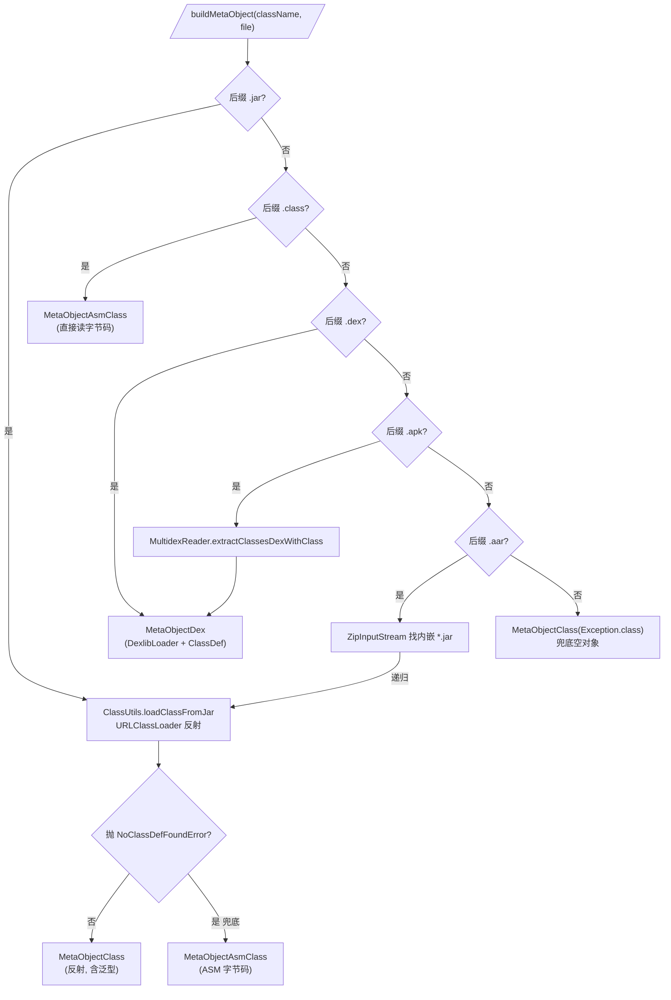

# 🧩 反射 vs ASM vs dexlib2：三路 MetaObject 策略

<Badge type="tip" text="指南" /> <Badge type="info" text="MetaObject 抽象" />

> ClassyShark 把任意二进制里的类"渲染"成可读的 Java 源码存根（source stub）。一个 `class Foo<T> extends Bar<List<T>>` 到底该怎么还原？答案取决于这个类能不能被加载、能不能读到字节码、还是只能从 DEX 里抠出来——这就是 [`MetaObjectFactory`](/reference/modules/MetaObjectFactory) 在三路策略间自动切换的由来。

## 🦈 为什么需要三路策略

[`JavaTranslator`](/reference/modules/JavaTranslator) 本身不关心类的来源，它只对着一个 [`MetaObject`](/reference/modules/MetaObject) 抽象问问题：类名、修饰符、父类、接口、字段、构造器、方法、注解、泛型签名……`apply()` 把这些 token 拼成源码。

问题是，`MetaObject` 的数据从哪来？

| 输入形态 | 能做什么 | 不能做什么 |
|---------|---------|-----------|
| 📦 jar 里的 `.class` | 用 `URLClassLoader` 反射加载 → 拿到运行时 `Class<?>` | 依赖缺失时 `NoClassDefFoundError` |
| 🗂️ 裸 `.class` 文件 | 直接读字节码 | 不在 classpath 上，无法反射 |
| 🤖 `.dex` / `.apk` | dexlib2 拿到 `ClassDef` | DEX 不保留泛型签名 |
| 📚 `.aar` | 压缩包内嵌 `classes.jar` | 需先解压再走 jar 分支 |

没有哪一路能单独兜住所有场景。于是 `MetaObjectFactory` 按 **文件扩展名** + **运行时异常** 两层判定，在三路实现里挑一个：

| 实现 | 底层引擎 | 触发条件 | 泛型支持 | 始终可用 |
|------|---------|---------|---------|---------|
| ✅ [`MetaObjectClass`](/reference/modules/MetaObjectClass) | JDK 反射 `java.lang.reflect` | jar、类可加载 | ✅ 唯一发出 `<T,U>` | ❌ 依赖缺失即崩 |
| 🛠️ [`MetaObjectAsmClass`](/reference/modules/MetaObjectAsmClass) | ASM `ClassReader` + `ClassVisitor` | `.class` 文件、jar 反射失败兜底 | ❌ 无（签名留待 `signature` 字段） | ✅ 只要字节码在 |
| 📦 [`MetaObjectDex`](/reference/modules/MetaObjectDex) | dexlib2 `ClassDef` | `.dex` / `.apk` | ❌ 无（DEX 不存泛型） | ✅ 只要 dex 在 |

## 🚀 分发决策流程

`MetaObjectFactory.buildMetaObject(className, archiveFile)` 的分发逻辑（见源码 `MetaObjectFactory.java:44`）：



核心判定有两层：

1. **外层按扩展名**：`.jar` / `.class` / `.dex` / `.apk` / `.aar` 五个分支。
2. **内层按运行时异常**：jar 分支里反射若抛 `NoClassDefFoundError`（依赖类缺失），立刻降级为 ASM 兜底——见 `getMetaObjectFromJar` 与 `verifyLoadedClassAndBuildASMFallback`。

## 🛠️ 路线一：MetaObjectClass（反射，泛型最全）

```java
// MetaObjectFactory.getMetaObjectFromJar()
clazz = ClassUtils.loadClassFromJar(archiveFile.getPath(), className); // URLClassLoader
// 若没崩：
result = new MetaObjectClass(clazz);
```

[`ClassUtils.loadClassFromJar`](/reference/modules/ClassUtils) 用 `URLClassLoader` 指向 jar 的 `file:` URL，再 `loadClass()` 拿到 `Class<?>`。一旦成功，[`MetaObjectClass`](/reference/modules/MetaObjectClass) 调用的全是反射 API：

- `clazz.getTypeParameters()` → 类的 `<T,U>` 形参（`getClassGenerics`）
- `clazz.getSuperclass().getTypeParameters()` → 父类泛型（`getSuperclassGenerics`）
- `field.getGenericType()` → `ParameterizedType`，拆出 `List<T>` 的实参（`getDeclaredFields`）
- `method.getGenericParameterTypes()` / `getGenericReturnType()` → 方法泛型参数与返回值

这是 **唯一会发出泛型签名** 的一路，因为只有运行时反射能拿到 `Type`、`ParameterizedType`、`TypeVariable` 这些带泛型信息的对象。ASM 字节码虽也有 `signature`，但 `ClassDetailsFiller` 当前并未解析它。

⚠️ 代价：反射要求被加载类及其全部依赖都在 classpath 上。jar 里若引用了 `android.support.*` 这类不可用类，`loadClass` 本身不抛，但访问 `getFields()`/`getMethods()` 触发解析时炸成 `NoClassDefFoundError`——这正是 `verifyLoadedClassAndBuildASMFallback` 二次校验的用意。

## 🚀 路线二：MetaObjectAsmClass（ASM 字节码兜底）

```java
// NoClassDefFoundError 触发：
result = new MetaObjectAsmClass(className, archiveFile);
// 或裸 .class 文件：
result = new MetaObjectAsmClass(archiveFile);
```

[`MetaObjectAsmClass`](/reference/modules/MetaObjectAsmClass) 不加载类，只读字节：

1. 用 [`ClassBytesFromJarExtractor`](/reference/modules/ClassBytesFromJarExtractor) 从 jar 里抠出 `Foo.class` 的 `byte[]`；裸 `.class` 直接 `Files.readAllBytes`。
2. `new ClassReader(bytes)` → `cr.accept(classDetailsFiller, 0)`，把字节码事件喂给 [`ClassDetailsFiller`](/reference/modules/ClassDetailsFiller)。
3. `ClassDetailsFiller` 是个 ASM `ClassVisitor`（`Opcodes.ASM5`），在 `visit` / `visitField` / `visitMethod` 回调里把数据塞进 `MetaObject` 的 `FieldInfo`/`MethodInfo` 数组。

✅ 优势：不需要任何依赖在 classpath 上，只要字节码本身在就能解析，是反射失败后的可靠兜底。

❌ 局限：当前 `ClassDetailsFiller` 不解析 `signature`（泛型签名属性），所以 `getSuperclassGenerics()` / 字段 `genericStr` 基本是空串。`MetaObjectAsmClass` 的方法签名靠 `Type.getArgumentTypes()` 从描述符还原，能拿到类型，但拿不到形参名和泛型实参。

## 📦 路线三：MetaObjectDex（dexlib2，DEX 专用）

```java
// MetaObjectFactory.getMetaObjectFromDex()
DexFile dexFile = DexlibLoader.loadDexFile(archiveFile);
ClassDef classDef = DexlibAdapter.getClassDefByName(className, dexFile);
result = new MetaObjectDex(classDef);
```

`.dex` / `.apk` 走 dexlib2。[`MetaObjectDex`](/reference/modules/MetaObjectDex) 包一个 `org.jf.dexlib2.iface.ClassDef`，从 `classDef.getMethods()` / `getFields()` / `getAnnotations()` / `getInterfaces()` 取数，经 [`DexlibAdapter`](/reference/modules/DexlibAdapter) 把 VM 签名 `Lcom/foo/Bar;` 转成点分类型名。

apk 分支先经 [`MultidexReader.extractClassesDexWithClass`](/reference/modules/MultidexReader) 定位含目标类的那个 `classes*.dex`，再复用 dex 分支。

✅ 优势：DEX 是 Android 应用的真实形态，这一路是分析 APK 的主力，不依赖任何 JVM 加载。

❌ 局限：DEX 格式本身不保留泛型签名，`getClassGenerics` / `getSuperclassGenerics` 直接 `return ""`。

🛡️ 防御式设计：构造器里检查 `classDef == null`，若是则替换成内部类 `EmptyClassDef`——一个实现了 `ClassDef` 全接口的空对象（`getMethods` 返回空迭代器、`getAccessFlags` 返回 0）。这样即使类名在 dex 里查不到，后续 `JavaTranslator` 遍历也不会 NPE，而是渲染出一个空存根。

```java
public MetaObjectDex(ClassDef classDef) {
    this.classDef = classDef;
    if (this.classDef == null) {
        this.classDef = new EmptyClassDef();  // 防空指针
    }
}
```

## 📚 aar 分支：解包递归

`.aar` 是个 zip，内含 `classes.jar`。`getMetaObjectFromAar` 用 `ZipInputStream` 扫到第一个 `.jar` 条目，写到临时文件，再 **递归调用** `getMetaObjectFromJar`——于是 aar 落进 jar 分支，继续走反射优先 / ASM 兜底的逻辑。任何环节异常都降级为 `MetaObjectClass(Exception.class)` 兜底空对象。

## 🔍 三路对比一览

| 维度 | MetaObjectClass（反射） | MetaObjectAsmClass（ASM） | MetaObjectDex（dexlib2） |
|------|------------------------|--------------------------|--------------------------|
| 数据源 | 运行时 `Class<?>` | `.class` 字节码 `byte[]` | dexlib2 `ClassDef` |
| 入口 | `URLClassLoader.loadClass` | `ClassReader.accept` | `DexlibLoader.loadDexFile` |
| 触发场景 | jar 中可加载类 | 裸 class / jar 反射失败兜底 | dex / apk |
| 类泛型 `<T,U>` | ✅ `TypeVariable` | ❌ 未解析 signature | ❌ DEX 无泛型 |
| 父类泛型 | ✅ | ❌ | ❌ |
| 字段/方法泛型实参 | ✅ `ParameterizedType` | ❌ | ❌ |
| 形参名 | ❌（仅 `argN`） | ❌ | ❌（DEX 无 LocalVariableTable 暴露） |
| 依赖 classpath | ✅ 必需 | ❌ 不需要 | ❌ 不需要 |
| 空对象防护 | `Exception.class` 兜底 | `printStackTrace` 后空 filler | `EmptyClassDef` 兜底 |
| 关键协作类 | [`ClassUtils`](/reference/modules/ClassUtils) | [`ClassDetailsFiller`](/reference/modules/ClassDetailsFiller)、[`ClassBytesFromJarExtractor`](/reference/modules/ClassBytesFromJarExtractor) | [`DexlibLoader`](/reference/modules/DexlibLoader)、[`DexlibAdapter`](/reference/modules/DexlibAdapter)、[`MultidexReader`](/reference/modules/MultidexReader) |

## ✅ 设计要点回顾

- 🧩 **抽象统一**：[`MetaObject`](/reference/modules/MetaObject) 定义 11 个抽象方法 + 6 个数据内部类，三路实现各自填充，`JavaTranslator` 对底层无感。
- 🛡️ **多层兜底**：jar→反射失败→ASM；apk→找不到 dex→`Exception.class`；dex→找不到 ClassDef→`EmptyClassDef`。任何一路崩都不让上层 NPE。
- 🎯 **泛型优先**：反射能拿泛型就拿，拿不到降级 ASM/DEX，存根退化为无泛型签名但仍有完整结构。
- 📦 **递归解包**：aar 不单独建模，解压出内嵌 jar 后复用 jar 分支，策略集中。

## 进一步阅读

- [架构总览](/guide/architecture-overview) — MetaObject 在 `Translator` 体系中的位置
- [DEX 概念](./dex) — 为什么 DEX 不带泛型
- [`JavaTranslator`](/reference/modules/JavaTranslator) — 如何把 `MetaObject` 渲染成源码存根
- [`TranslatorFactory`](/reference/modules/TranslatorFactory) — 上层按扩展名分发 `Translator`
