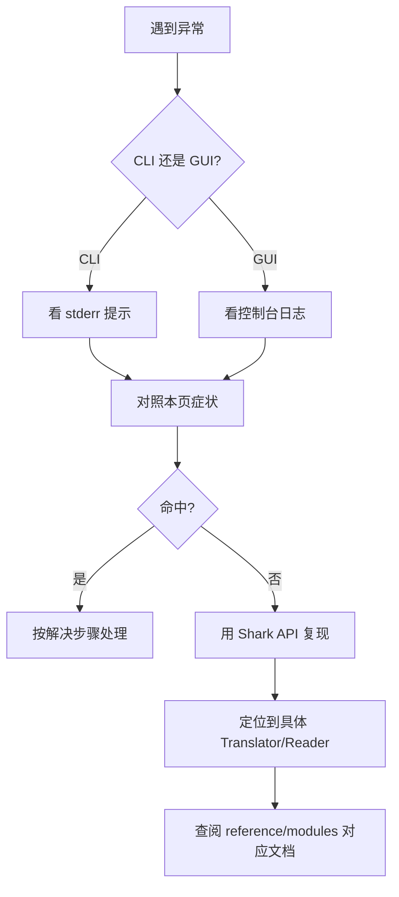

# 🦈 故障排查

<Badge type="tip" text="指南" />
<Badge type="info" text="Troubleshooting" />

ClassyShark 在解析 APK/JAR/DEX/ELF 等二进制时偶有"水土不服"。本页汇总 8 个高频故障场景，每个场景给出 **原因 🔍 → 解决 ✅ → 相关模块 🧩**，帮你快速定位。

> 💡 阅读前建议先看 [快速开始](/guide/quick-start) 与 [架构总览](/guide/architecture-overview)，理解 `Main → CliMode/GuiMode → SilverGhostFacade → ContentReader + TranslatorFactory` 的调用链后再排查会更顺手。

## 📋 故障速查表

| # | 症状 | 根因 | 关键模块 |
|---|------|------|----------|
| 1 | `java -jar` 报 `NoClassDefFoundError` | Java 版本 < 8 | [Main](/reference/modules/Main) |
| 2 | 打开 APK 后内容空白 | 仅剩 manifest 的损坏包 | [SilverGhost](/reference/modules/SilverGhost) |
| 3 | `-export` 报 `couldn't write file` | 写入路径无权限/被占用 | [SilverGhostFacade](/reference/modules/SilverGhostFacade) |
| 4 | native `.so` 显示不全 | 不支持 64 位 ELF | [ElfReader](/reference/modules/ElfReader) |
| 5 | GUI 打开大 APK 卡顿 | 后台加载，>50 类走快路径 | [DisplayArea](/reference/modules/DisplayArea) |
| 6 | 主题切换不生效 | 需下次启动应用 | [SettingsFrame](/reference/modules/SettingsFrame) |
| 7 | 反射加载类失败 | 自动回退 ASM | [MetaObjectFactory](/reference/modules/MetaObjectFactory) |
| 8 | 最近文件顺序混乱 | 按字典序而非 LRU | [RecentArchivesConfig](/reference/modules/RecentArchivesConfig) |

---

## 1️⃣ `java -jar` 报 `NoClassDefFoundError` 🚀

**症状**：命令行运行报错，类找不到。

```bash
java -jar classyshark.jar
# Exception in thread "main" java.lang.NoClassDefFoundError: ...
```

**原因 🔍**：ClassyShark 编译目标为 Java 8 字节码。若本地 `JAVA_HOME` 指向 Java 7 或更低，JVM 无法识别新版字节码（`major version 52`），加载入口类 [Main](/reference/modules/Main) 即失败。

**解决 ✅**：

```bash
# 检查版本（需 ≥ 1.8）
java -version

# 切换到 Java 8+（示例）
export JAVA_HOME=/usr/lib/jvm/java-8-openjdk-amd64
java -jar classyshark.jar
```

> ⚠️ 详见 [安装指南](/guide/installation) 的 Java 环境要求。

---

## 2️⃣ 打开 APK 后内容空白 📦

**症状**：GUI/CLI 加载 APK 后类列表为空，只显示 `AndroidManifest.xml`。

**原因 🔍**：[SilverGhost](/reference/modules/SilverGhost) 的 `isArchiveError()` 判定逻辑为——当 `getAllClassNames()` 为空，**或**仅含 `AndroidManifest.xml` 一个条目时，即视为"归档损坏"。常见于被裁剪/损坏的 APK（classes.dex 缺失或被剥离）。

```java
// SilverGhost.java
public boolean isArchiveError() {
    boolean noJavaClasses = contentReader.getAllClassNames().isEmpty();
    boolean noAndroidClasses = ...size() == 1
            && ...contains("AndroidManifest.xml");
    return noJavaClasses || noAndroidClasses;
}
```

**解决 ✅**：

- 用 `unzip -l app.apk` 确认 `classes*.dex` 是否存在；
- 若为多 dex 包，确认 `classes2.dex` 等未被误删；
- 重新签名/重打包后再用 [Shark API](/guide/quick-start#shark-api) 的 `isMultiDex()` 校验。

---

## 3️⃣ `-export` 报 `couldn't write file` 🛠️

**症状**：导出类或归档时控制台输出 `Internal error - couldn't write file`。

**原因 🔍**：[SilverGhostFacade](/reference/modules/SilverGhostFacade) 的 `exportClassFromApk` / `exportArchive` 在捕获通用 `Exception` 时打印该提示，根因通常是**目标目录无写权限、路径不存在或文件被占用**。

```java
// SilverGhostFacade.java
} catch (Exception e) {
    System.err.println("Internal error - couldn't write file");
}
```

另：当指定类不存在时抛 `NullPointerException`，提示 `Class doesn't exist in the writeArchive`。

**解决 ✅**：

```bash
# 1. 确认输出目录可写
mkdir -p ./out && chmod 755 ./out

# 2. 指定绝对路径导出
java -jar classyshark.jar -export com.example.Foo /abs/path/out/ app.apk

# 3. 类名需为全限定名（含包路径），否则命中 NPE 分支
```

> 参见 [CLI 参考](/cli/index) 的 `-export` 一节。

---

## 4️⃣ native `.so` 库显示不全 🧩

**症状**：APK 内 ARM64 的 `.so` 无法解析，符号表为空或抛 `not ELFCLASS32!`。

**原因 🔍**：[ElfReader](/reference/modules/ElfReader) 在 `readIdent()` 中只接受 `ELFCLASS32`（32 位），遇到 64 位 ELF 直接抛异常：

```java
// ElfReader.java
if (mClass == ELFCLASS32) { mWordSize = 4; ... }
else { throw new IOException("Invalid executable type " + mClass + ": not ELFCLASS32!"); }
```

**解决 ✅**：

- 这是**已知限制**，非配置问题；64 位 `.so` 暂不支持完整解析；
- 查看引用库时优先用 `armeabi-v7a` 下的 32 位 `.so`；
- 需 64 位分析可借助 `readelf` / `nm` 等系统工具补充。

---

## 5️⃣ GUI 打开大 APK 卡顿 🖥️

**症状**：拖入数百 MB 的 APK 后界面短暂"假死"。

**原因 🔍**：**属正常现象**。[ClassySharkPanel](/reference/modules/ClassySharkPanel) 用 `SwingWorker` 在后台线程执行加载，避免阻塞 EDT。当类名数量 > 50 时，[DisplayArea](/reference/modules/DisplayArea) 走 [BatchDocument](/reference/modules/BatchDocument) 快速路径批量插入，降低 Swing 文档事件开销。

```java
// DisplayArea.java
int displayedClassLimit = 50;
if (classNamesToShow.size() > 50) { /* 走 BatchDocument 批量路径 */ }
```

**解决 ✅**：

- ✅ 等待状态栏加载完成，勿强行关闭；
- 大包优先用 CLI `-inspect` / `-methodcounts` 离线分析；
- 可先用 `-export` 导出文本再用编辑器检索。

---

## 6️⃣ 主题切换不生效 🎨

**症状**：在设置里切到 Dark 主题，当前窗口仍为 Light。

**原因 🔍**：[SettingsFrame](/reference/modules/SettingsFrame) 中主题标签的 Tooltip 明确写道：*"It will be applied the next time ClassyShark is started"*。主题选择由 [ThemeManager](/reference/modules/ThemeManager) 持久化，但当前 JVM 实例不会热重载 L&F。

**解决 ✅**：

```text
1. 设置中选择 Dark / Light
2. 关闭并重新启动 ClassyShark
3. 新主题在启动时由 SwingThemeApplier 应用
```

> ⚠️ 修改后未重启就切别的主题，最终生效以**最后一次保存**为准。

---

## 7️⃣ 反射加载类失败 ⚠️

**症状**：查看某 `.class` 时方法/字段为空，或日志出现 `NoClassDefFoundError`。

**原因 🔍**：[MetaObjectFactory](/reference/modules/MetaObjectFactory) 默认用反射（`MetaObjectClass`）加载类；当反射因依赖缺失抛 `NoClassDefFoundError` 时，**自动回退到 ASM 静态分析**（`MetaObjectAsmClass`），保证至少能读到结构。

```java
// MetaObjectFactory.java
} catch (NoClassDefFoundError e) {
    // the fallback to ASM case
    result = new MetaObjectAsmClass(className, archiveFile);
    return result;
}
```

**解决 ✅**：

- ✅ 通常无需干预，回退后仍可查看类结构；
- 若需完整运行时行为，把被分析包的依赖 JAR 一并加入 classpath；
- 反复失败可改用 `-inspect` 走纯 ASM 路径。

---

## 8️⃣ 最近文件顺序"奇怪" 📚

**症状**：工具栏"最近打开"列表顺序与使用时间不符。

**原因 🔍**：[RecentArchivesConfig](/reference/modules/RecentArchivesConfig) 从 `classyshark_recents.properties` 读取后直接 `Collections.sort(result)`，即**按字典序**展示，并非按最近使用时间（LRU）排序。这是已知设计问题。

```java
// RecentArchivesConfig.java
while (e.hasMoreElements()) { result.add((String) key); }
Collections.sort(result);   // 字典序，非时间序
```

**解决 ✅**：

- ❌ 目前无配置项可改为 LRU；
- 如需固定顺序，可手动编辑用户目录下的 `classyshark_recents.properties`；
- 想精确管理历史建议配合 [Shark API](/guide/quick-start#shark-api) 脚本化处理。

---

## 🔁 通用排查流程



## 📚 延伸阅读

- [快速开始](/guide/quick-start) — 基本用法与 Shark API
- [架构总览](/guide/architecture-overview) — 调用链全景
- [CLI 参考](/cli/index) — 五大命令详解
- [模块文档](/reference/modules/Main) — 逐类源码剖析

> 遇到本页未覆盖的问题？欢迎在仓库提 issue 并附上 `java -version`、文件类型与完整报错。🦈
