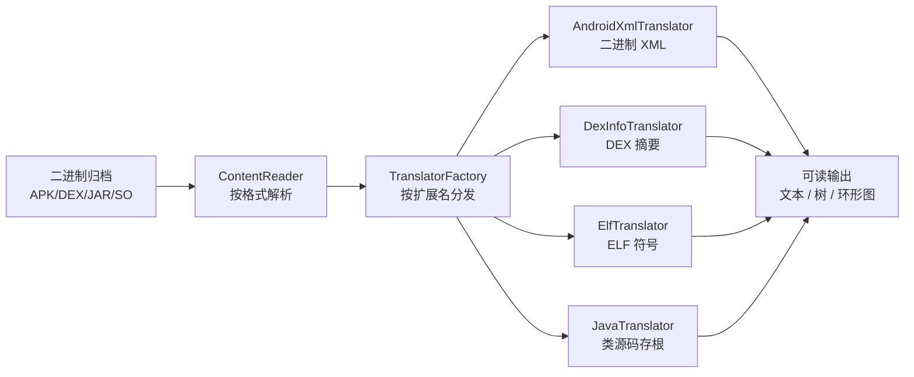

# 🦈 什么是 ClassyShark

<Badge type="tip" text="指南" /> <Badge type="info" text="概念" />

> ClassyShark 是 Google 开源的 **Android 二进制检查工具**，可浏览任意 Android 可执行文件并展示类接口、成员、方法数与依赖关系。

## 它解决什么问题？

Android 应用编译后是一堆 **二进制格式**，开发者无法直接阅读。当你需要排查以下问题时，就会遇到这些格式带来的障碍：

| 格式 | 内容 | 常见痛点 |
|------|------|----------|
| 📦 APK | 完整应用包 | 不知包含哪些第三方库、native 库是否违规 |
| 🧩 DEX | Dalvik 字节码 | 不知方法数是否逼近 65k 上限 |
| ☕ JAR / AAR | Java / Android 库 | 不知依赖来源、是否重复引入 |
| 🐚 SO | native 共享库 | 不知动态符号、native 依赖、是否有 text relocation |
| 📄 二进制 XML | Manifest / 布局 / 资源 | 编译成二进制后无法用文本编辑器打开 |

传统的 `unzip` + `javap` 流程碎片化、不友好，尤其对二进制 XML 和 native 库无能为力。ClassyShark 把这些能力整合进**一个工具**，提供 GUI 浏览、CLI 自动化、编程 API 三种入口。

## 它如何解决？

ClassyShark 采用 **分层翻译架构**：先按格式解析归档，再按扩展名分发到对应的翻译器，把二进制翻译成可读的、带语法高亮的文本/树/图表。

三个关键设计：

- **ContentReader** — 按扩展名路由到 `ApkReader` / `DexReader` / `JarReader` / `AarReader` / `ClazzReader`，统一返回类名列表与归档组件。
- **TranslatorFactory** — 按元素扩展名（`.xml` / `.dex` / `.jar` / `.apk` / `.so` / class）选择翻译器，见 [TranslatorFactory 模块文档](/reference/modules/TranslatorFactory)。
- **MetaObject 三路策略** — 类的元数据可来自反射（`MetaObjectClass`，泛型信息最全）、ASM 字节码（`MetaObjectAsmClass`，依赖缺失时兜底）、dexlib2（`MetaObjectDex`，用于 dex/apk），由 `MetaObjectFactory` 自动选择，见 [反射 vs ASM vs dexlib2](/guide/concepts/reflect-vs-asm-vs-dexlib)。

## 三种入口

| 入口 | 命令 | 适用场景 |
|------|------|----------|
| 🖥️ GUI | `java -jar ClassyShark.jar -open app.apk` | 交互式浏览、定位问题 |
| 🛠️ CLI | `java -jar ClassyShark.jar -inspect app.apk` | CI/CD 自动化、批量分析 |
| 📚 API | `Shark.with(apk).getAllMethods()` | 作为库嵌入构建工具链 |

## 进一步阅读

- 🚀 [快速开始](./quick-start) — 3 分钟跑通
- 🏗️ [架构总览](./architecture-overview) — 分层架构详解
- 📋 [支持的格式](./supported-formats) — 完整格式矩阵
- 🧩 [Main 模块文档](/reference/modules/Main) — 程序入口
