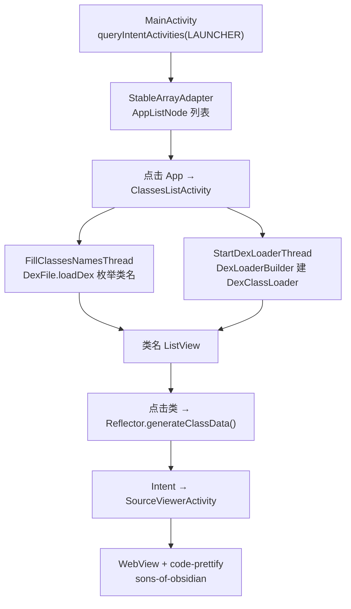

# 📱 Android 移植版架构

<Badge type="tip" text="架构" /> <Badge type="info" text="ClassySharkAndroid" />

> `ClassySharkAndroid` 是把 ClassyShark 能力搬进 Android 设备/模拟器的独立 App：先枚举系统已安装 App，用 `DexClassLoader` 加载目标 APK，再用反射重建类源码，最后在 WebView 里高亮展示。核心是 [`Reflector`](/reference/modules/Reflector) + [`ClassTypeAlgorithm`](/reference/modules/ClassTypeAlgorithm) 的"运行期反射反编译"。

## 页面导航



## MainActivity：应用清单

[`MainActivity`](/reference/modules/MainActivity) 用 `PackageManager` 列系统已装 App：`onStart` 里构造 `ACTION_MAIN + CATEGORY_LAUNCHER` 的 intent，`queryIntentActivities(mainIntent, 0)` 返回带启动入口的 Activity 列表，包装成 `AppListNode`（`name` = 进程名，`file` = `new File(publicSourceDir)`），按 name 排序后喂给 [`StableArrayAdapter`](/reference/modules/StableArrayAdapter)。

> 🎯 不读手机上的 APK 文件系统，而是走 PackageManager 语义查询——这是"浏览设备上所有可启动 App"的最稳做法，免 root、免存储权限。

## ClassesListActivity：双线程加载

[`ClassesListActivity`](/reference/modules/ClassesListActivity) 是核心页，同时跑两个 `MAX_PRIORITY` 线程，**一个读名字、一个建类加载器**：

| 线程 | 关键代码 | 产物 |
|------|---------|------|
| `FillClassesNamesThread` | `File.createTempFile("classy", ".dex")` + `DexFile.loadDex(...)` + `entries()` 枚举 | 类名列表（无类体的名字流） |
| `StartDexLoaderThread` | `DexLoaderBuilder.fromBytes` → `DexClassLoader` | 可 `loadClass` 的运行时类加载器 |

`FillClassesNamesThread` 结束时 `runOnUiThread` 设置 adapter、dismiss 对话框；ODEX 失败时 Toast `Sorry don't support ODEX`。用户点击某类 → `loader.loadClass(name)` + `new Reflector(clazz).generateClassData()` → 塞进 Intent 跳 `SourceViewerActivity`。

> 💡 两个线程并行是刻意的：类名枚举走 `DexFile`（只读 dex），类加载走 `DexClassLoader`（建 dexopt），互不阻塞。

## DexLoaderBuilder：把 dex 落盘再加载

[`DexLoaderBuilder`](/reference/modules/DexLoaderBuilder) 的 `fromBytes` 解决"Android 无法直接 `loadClass` 字节数组"的约束：先把字节写进 `context.getDir("dex", Context.MODE_PRIVATE)` 下的 `internal.dex`，再建类加载器：

```java
DexClassLoader cl = new DexClassLoader(dexPath,
        context.getCodeCacheDir().getAbsolutePath(),
        null, context.getClassLoader().getParent());
```

加载完 `dexInternalStoragePath.delete()` 清理。父加载器取 `context.getClassLoader().getParent()`，避免与应用自身类冲突。

## Reflector：反射重建源码

[`Reflector`](/reference/modules/Reflector) 不用字节码解析，而是**纯反射**重建类骨架：`generateClassData()` 产出包名 + `generateDependencies()`（字段/构造器/方法的类型依赖）+ `fillTaggedText()`。输出是一串 `TaggedWord`（`text` 带 `TAG`：`MODIFIER` / `IDENTIFIER` / `DOCUMENT`）供高亮，详见 [Reflector 模块](/reference/modules/Reflector)：

| 片段 | 内容 |
|------|------|
| imports | 依赖类型逐一 `import` |
| 声明头 | 修饰符 + 类名 + `extends` |
| `/* Field Definitions. */` | 反射出的字段 |
| `/* Declared Constructors. */` | 反射出的构造器 |
| 方法体 | `) { ... }` + `throws` 块 |

## ClassTypeAlgorithm：类型签名解码

[`ClassTypeAlgorithm`](/reference/modules/ClassTypeAlgorithm) 把 JVM 类型签名还原成 Java 类型名——这是反射结果"人类可读化"的关键。处理 `[` 数组与原始类型：

| 签名 | 解码 |
|:----:|------|
| 无 `[` | `lastIndexAfter(".")` 取简单类名 |
| `[...]` | 数组，元素类型递归 |
| `L...;` | 取 `L` 与 `;` 之间的内层类型 |
| `I` / `V` / `C` | `int` / `void` / `char` |
| `D` / `F` / `J` | `double` / `float` / `long` |
| `S` / `Z` / `B` | `short` / `boolean` / `byte` |
| 其他 | `BOGUS:` 前缀兜底 |

> ⚠️ 类型无法识别时输出 `BOGUS:` + 原签名——宁可显式露馅，也不猜错。

## SourceViewerActivity：WebView 高亮

[`SourceViewerActivity`](/reference/modules/SourceViewerActivity) 把重建源码放进 WebView：黑色背景，`HtmlEscapers.htmlEscaper().escape()` 防注入，`loadDataWithBaseURL` 加载 `run_prettify.js?skin=sons-of-obsidian`（code-prettify）脚本，正文包进 `<pre class="prettyprint ">`。`setJavaScriptEnabled(true)` 允许 prettify 执行，主题即 Sons of Obsidian 深色。

## StableArrayAdapter：稳定 ID 适配器

[`StableArrayAdapter`](/reference/modules/StableArrayAdapter) 继承 `ArrayAdapter<String>`，用 `HashMap<String, Integer>` 维护 item→id 映射，`getItemId` 返回映射值、`hasStableIds()` 恒 `true`——保证 ListView 刷新时行位置稳定。

## 设计要点

- 🧭 **运行时反射，非字节码** — 设备端没有 dexlib2/ASM，`Reflector` 用 `java.lang.reflect` 重建骨架，规避 APK 解析依赖。
- 🧵 **双线程并行** — 名字流与加载器流同时推进，类名枚举对 UX 最敏感的部分独立完成。
- 🗃️ **私有目录落盘** — dex 写 `getDir("dex", MODE_PRIVATE)`，用完即删，不污染存储。
- 🌐 **WebView 高亮** — 源码高亮复用了 web 生态的 code-prettify，而非重写 UI 渲染。
- ⚠️ **显式失败** — ODEX 不支持、类型解码失败都直接告知，不静默产出错误结果。

## 进一步阅读

- 🧩 [MainActivity](/reference/modules/MainActivity) · [ClassesListActivity](/reference/modules/ClassesListActivity) · [DexLoaderBuilder](/reference/modules/DexLoaderBuilder) · [Reflector](/reference/modules/Reflector) · [ClassTypeAlgorithm](/reference/modules/ClassTypeAlgorithm) · [SourceViewerActivity](/reference/modules/SourceViewerActivity) · [StableArrayAdapter](/reference/modules/StableArrayAdapter)
- 🏗️ [架构总览](/guide/architecture-overview) · [APK 仪表盘](/reference/architecture/apk-dashboard)
- 🛠️ [CLI 导出](/cli/export) · [分析 APK 体积教程](/tutorials/analyze-apk-size)