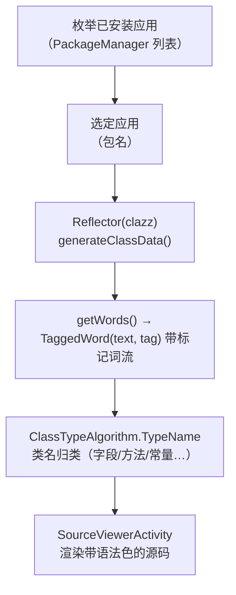

# 🤖 Android 端架构（ClassySharkAndroid）

<Badge type="tip" text="架构" /> <Badge type="info" text="设备端" />

> [`ClassySharkAndroid`](/reference/architecture/android-port) 是跑在**安卓设备上**的姊妹应用：自动枚举已安装应用，选一个后调 [`Reflector`](/reference/modules/Reflector) 用 Java 反射重建其类源码并在 [`SourceViewerActivity`](/reference/modules/SourceViewerActivity) 里浏览——不读你的 APK、不依赖反编译工具链，它反射的是**运行时活的类**。

## 一句话

PC 端 ClassyShark 分析的是**静态二进制**；设备端分析的是**设备上已装的应用本体**。APK 里存的是字节码，而设备端 App 本身就能 `Class.forName` 拿到这些类——于是反射重建源码代替了解释器。

## 核心链路

| 环节 | 组件 | 作用 |
|------|------|------|
| 应用枚举 | 主列表页 | `PackageManager` 拉全部已装应用，用户点选 |
| 反射重建 | [`Reflector`](/reference/modules/Reflector) | 构造器注入 `Class`，`generateClassData()` 走 `java.lang.reflect` 遍历字段/方法/构造器/注解/枚举常量，产出带 `TAG` 标记的词序列 |
| 类型判定 | [`ClassTypeAlgorithm`](/reference/modules/ClassTypeAlgorithm) | `TypeName(String, Hashtable)` 给定类名返回其类别（类/接口/枚举/注解…），驱动词的着色与归类 |
| 源码查看 | [`SourceViewerActivity`](/reference/modules/SourceViewerActivity) | `AppCompatActivity`，把 `Reflector.toString()` 渲染进 Activity |

## 反射 vs 静态分析

| 维度 | 设备端（反射） | PC 端（static） |
|------|----------------|------------------|
| 数据来源 | 运行时 `Class` 对象 | APK/JAR 二进制字节 |
| 反混淆 | 无——运行时类名已还原 | 依赖 TokensMapper 映射 |
| 执行环境 | Android 设备 | JVM（`ClassyShark.jar`） |
| 覆盖范围 | 已安装应用 | 任意归档文件 |

## 设计要点

- 🪞 **反射即反编译** — 运行时元数据天然是"源码形态"，免去字节码解析。
- 🏷️ **标记词流** — `TaggedWord(text, TAG)` 让 UI 着色与跳转与解析解耦。
- 📱 **设备原生能力** — 复用 `PackageManager` 枚举，不脱机即可浏览任意已装应用。

## 进一步阅读

- 🏗️ [Android 端移植纵览](/reference/architecture/android-port)
- 🧩 [Reflector](/reference/modules/Reflector) · [ClassTypeAlgorithm](/reference/modules/ClassTypeAlgorithm) · [SourceViewerActivity](/reference/modules/SourceViewerActivity)
- ⚖️ 对比：[反射 vs ASM vs dexlib](/guide/concepts/reflect-vs-asm-vs-dexlib)