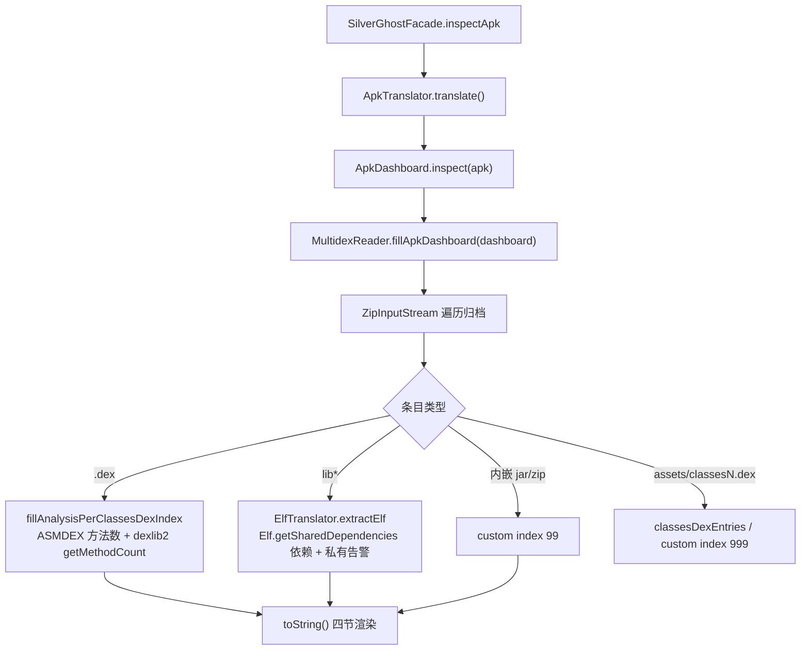

# 📊 APK 仪表盘架构

<Badge type="tip" text="架构" /> <Badge type="info" text="-inspect" />

> APK 仪表盘是 `-inspect` 命令背后的分析器：一次扫描产出 dex 方法数、Java 依赖告警、manifest 接收器、原生库四大板块。[`ApkTranslator`](/reference/modules/ApkTranslator) 触发 [`ApkDashboard.inspect`](/reference/modules/ApkDashboard)，后者委托 [`MultidexReader.fillApkDashboard`](/reference/modules/MultidexReader) 用 ZipInputStream 一次遍历归档完成全部填充。

## 四板块输出



## 入口：ApkTranslator → ApkDashboard

[`SilverGhostFacade.inspectApk`](/reference/modules/SilverGhostFacade) 创建 [`ApkTranslator`](/reference/modules/ApkTranslator)（按后缀选择器之一）翻译 APK，产出的 [`ApkDashboard`](/reference/modules/ApkDashboard) 是持有全部分析结果的容器。`inspect()` 拿到 apk 后立即调 `MultidexReader.fillApkDashboard(this)`，后者对归档做一次完整遍历。

> 🎯 **一次遍历全部填充**：不按板块多次解压 APK，所有 inspector 的数据来源都在同一趟 `ZipInputStream` 循环里收集。

## 四大分析板块

`ApkDashboard.toString()` 输出的四个 section（表头带 `--` 与 `+-` 花括号样式）由不同数据源组装：

| 板块 | 数据源 | 产出 |
|------|--------|------|
| DEX 方法数 | `classes*.dex` + 内嵌 jar/zip | 每个 dex 的名称 + `methods` 数量 |
| Java 依赖 | [`JavaDependenciesInspector`](/reference/modules/JavaDependenciesInspector) | 三方库存在性告警 |
| Manifest 接收器 | [`ManifestInspector`](/reference/modules/ManifestInspector) + [`ReceiverActionsBL`](/reference/modules/ReceiverActionsBL) | 未白名单的 receiver action 清单 |
| 原生库 | [`ElfTranslator`](/reference/modules/ElfTranslator) + [`PrivateNativeLibsInspector`](/reference/modules/PrivateNativeLibsInspector) | 共享库依赖 + 私有 lib 告警 |

## dex 方法数统计

`fillAnalysisPerClassesDexIndex(dexIndex, file)` 是每个 dex 的分析入口，双引擎取数：

```java
ClassVisitor classVisitor = new ApkNativeMethodsVisitor(...); // ASMDEX 遍历
new ApplicationReader(Opcodes.ASM4, is).accept(classVisitor, 0);

int methodCount = ((DexBackedDexFile)
        DexlibLoader.loadDexFile(classesDex)).getMethodCount();
```

- `classes*.dex` 按 `classesDexEntries` 收集，索引即 dex 序号；`assets/classesN.dex` 进 `customClassesDexEntries`（索引 999）；内嵌 `jar`/`zip` 进 `customClassesDexEntries`（索引 99）。
- 方法数经 dexlib2 `DexBackedDexFile.getMethodCount()` 一锤定音。

> 💡 ASMDEX `ApkNativeMethodsVisitor` 与 dexlib2 双引擎并存：前者遍历原生方法调用形态，后者出总方法数。

## 纯子串匹配的 inspectors

四个 Java/原生 inspector 全部用 `contains(...)` 子串匹配，不做语义解析：

| Inspector | 匹配串 | 规则 |
|-----------|--------|------|
| [`JavaDependenciesInspector`](/reference/modules/JavaDependenciesInspector) | `glide`/`picasso`/`fresco`、`okhttp`/`volley`/`loopj`、`fasterxml.jackson`/`google.code.gson`/`squareup.moshi` | 命中即告警；同库多次命中去重提示；`google.common`→Guava、`apache.http`→deprecated、`actionbarsherlock`、`chrisbanes.pulltorefresh`、`com.viewpagerindicator` |
| [`PrivateNativeLibsInspector`](/reference/modules/PrivateNativeLibsInspector) | 静态 `apiLibs`（`libz`/`libvulkan`/`libstdc++`/`libm`/`liblog`/`libjnigraphics`/`libdl`/`libc`/`libandroid`/`libOpenSLES`/`libOpenMAXAL`/`libGLESv3/v2/v1_CM`/`libEGL`、`crt*.o`、`lsOutput.log`） | 不在 API 白名单且不在包内依赖名列表 → ` -- private api!` |

```java
private static boolean isPrivate(String nativeLib) {
    return !APIS_LIB_LIST.contains(nativeLib)
        && !nativeLibNames.contains(nativeLib);
}
```

> ⚠️ 子串匹配是启发式的：正常库名碰巧含 `glide` 等片段也会误报。对告警类输出可接受，因为只服务"提醒"，不阻断。

## Manifest 接收器检查

[`ManifestInspector`](/reference/modules/ManifestInspector) 经 `SilverGhostFacade.getManifest(apk)` → [`AndroidManifestPlainTextReader`](/reference/modules/AndroidManifestPlainTextReader) 取 `getActionsWithReceivers()`，交 [`ReceiverActionsBL`](/reference/modules/ReceiverActionsBL) 过滤：`approvedActions` 是系统安全动作白名单（`BOOT_COMPLETED`、`LOCKED_BOOT_COMPLETED`、`TIME_SET`、`USB_*`、`DEVICE_STORAGE_LOW/OK`、`HEADSET_PLUG` 等）。`filterBGActions` 只保留**未白名单**且 `startsWith("com.google.") || startsWith("android.")` 的动作，放 `TreeMap` 里排序，输出 `"action ==> receiver"` 行。

> 🛡️ 白名单 + 前缀双筛：只标记"知名命名空间里可疑的广播动作"，降低误报面。

## 设计要点

- 📦 **一次遍历多路产出** — `ZipInputStream` 单趟循环喂四个板块，IO 成本最小化。
- 🧰 **双字节码引擎** — ASMDEX 管原生方法形态，dexlib2 管总方法数，各司其职。
- 🔍 **启发式子串匹配** — 三方库与私有 lib 全走 `contains`，以误报换零漏报（告警场景可接受）。
- 📑 **白名单双向过滤** — manifest 走 approved 白名单，原生 lib 走 API 白名单，两道防线都要求"出界才告警"。
- 🗂️ **索引区分 dex 来源** — 常规 dex 按序号、`assets` 类 999、内嵌归档 99，来源可追溯。

## 进一步阅读

- 🧩 [ApkDashboard](/reference/modules/ApkDashboard) · [MultidexReader](/reference/modules/MultidexReader) · [ApkTranslator](/reference/modules/ApkTranslator) · [JavaDependenciesInspector](/reference/modules/JavaDependenciesInspector) · [PrivateNativeLibsInspector](/reference/modules/PrivateNativeLibsInspector) · [ManifestInspector](/reference/modules/ManifestInspector) · [ReceiverActionsBL](/reference/modules/ReceiverActionsBL)
- 🛠️ [CLI 检查](/cli/inspect) · [分析 APK 体积教程](/tutorials/analyze-apk-size)
- 🏗️ [架构总览](/guide/architecture-overview) · [翻译器层](/reference/architecture/translator)