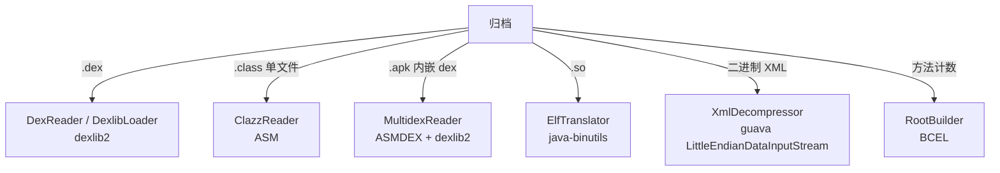
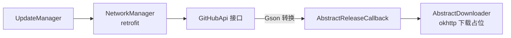

# 📚 依赖架构

<Badge type="tip" text="架构" /> <Badge type="info" text="依赖清单" />

> ClassyShark 的第三方依赖撑起三类职责：**二进制解析**（dex / class / ELF）、**网络**（GitHub API 自更新）、**JSON 序列化**。源码树内还维护一个 `third_party/` 目录存放闭源/遗留 jar。

## 依赖总览

`ClassySharkWS/build.gradle` 中的完整依赖（见 [构建系统架构](/reference/architecture/build-system)）：

| 第三方库 | 组织/仓库 | 用途 | 使用模块 |
|----------|-----------|------|----------|
| **dexlib2** 2.2.7 | org.smali · Maven | 解析 dex：类结构、smali、字符串、方法盘点多走它 | [DexReader](/reference/modules/DexReader) · [DexlibLoader](/reference/modules/DexlibLoader) · [DexlibAdapter](/reference/modules/DexlibAdapter) · [MetaObjectDex](/reference/modules/MetaObjectDex) · [DexInfoTranslator](/reference/modules/DexInfoTranslator) · [DexStringsDumper](/reference/modules/DexStringsDumper) · [ApkDashboard](/reference/modules/ApkDashboard) |
| **ASM** asm-all 5.2 | org.ow2 · Maven | 解析 class 字节码（含 ClassVisitor 提类名） | [ClazzReader](/reference/modules/ClazzReader) · [ClassNameVisitor](/reference/modules/ClassNameVisitor) · [MetaObjectAsmClass](/reference/modules/MetaObjectAsmClass) · [ClassDetailsFiller](/reference/modules/ClassDetailsFiller) |
| **ASMDEX** 1.0 | org.ow2 · third_party | OW2 的 dex 字节码 API，访问 dex 方法 | [DexMethodsDumper](/reference/modules/DexMethodsDumper) · [ApkNativeMethodsVisitor](/reference/modules/ApkNativeMethodsVisitor) · [ApkDashboard](/reference/modules/ApkDashboard) |
| **java-binutils** | nl.lxtreme · third_party | ELF 解析（CMake 风格 binutils 的 Java 移植），读 .so 符号/依赖 | [ElfReader](/reference/modules/ElfReader) · [ElfTranslator](/reference/modules/ElfTranslator) · [DynamicSymbolsInspector](/reference/modules/DynamicSymbolsInspector) · [MultidexReader](/reference/modules/MultidexReader) |
| **util-2.0.6** | third_party | 配套工具库（供 java-binutils / 若干辅助类使用） | — |
| **guava** 31.1-jre | com.google · Maven | 通用集合/IO 工具，XML 反序列化用 `LittleEndianDataInputStream`（小端 AXML 字序） | [XmlDecompressor](/reference/modules/XmlDecompressor) 等 |
| **BCEL** 6.5.0 | org.apache.bcel · Maven | 解析 jar/class 元数据，方法计数按 BCEL 常量池统计 | [RootBuilder](/reference/modules/RootBuilder) · [MethodCountExporter](/reference/modules/MethodCountExporter) |
| **okhttp** 4.10.0 | com.squareup · Maven | HTTP 客户端，Retrofit 默认引擎 | [GitHubApi](/reference/modules/GitHubApi) · [NetworkManager](/reference/modules/NetworkManager) |
| **okio** 3.2.0 | com.squareup · Maven | okhttp 底层 IO 缓冲库 | [GitHubApi](/reference/modules/GitHubApi) 等 |
| **retrofit** 2.9.0 | com.squareup · Maven | 声明式 REST 客户端，封装 GitHub releases 查询 | [NetworkManager](/reference/modules/NetworkManager) · [UpdateManager](/reference/modules/UpdateManager) · [AbstractReleaseCallback](/reference/modules/AbstractReleaseCallback) |
| **converter-gson** 2.9.0 | com.squareup.retrofit2 · Maven | Retrofit 的 Gson 转换器（响应 JSON → 模型） | [AbstractReleaseCallback](/reference/modules/AbstractReleaseCallback) 等 |
| **gson** 2.9.0 | com.google.code.gson · Maven | JSON 序列化/反序列化（Agent 协议报文 + release 模型注解绑定） | [Agent 协议](/api/agent) · [Release](/reference/modules/Release) · [ReleaseDownloadData](/reference/modules/ReleaseDownloadData) |

## 解析器分工

- **dexlib2** 是 dex 主解析器，几乎覆盖 dex 相关全部模块；**ASMDEX** 只做方法级访问（native 方法扫描、方法转储），两库并存互补。
- **java-binutils**（`nl.lxtreme.binutils.elf.Elf`）负责 `.so` 的 ELF 文法，统一被 [DynamicSymbolsInspector](/reference/modules/DynamicSymbolsInspector)、[MultidexReader](/reference/modules/MultidexReader)、[ElfTranslator](/reference/modules/ElfTranslator) 引用。
- 二进制 Android XML 是小端序，guava 的 `LittleEndianDataInputStream`（`com.google.common.io`）正好按小端逐字段读出 AXML 头与字符串池，是 [XmlDecompressor](/reference/modules/XmlDecompressor) 的关键基座。

## third_party 目录

仓库根目录 `third_party/` 存放无法从 Maven Central 获得的闭源/遗留 jar，由 `flatDir` 仓库挂载：

| 文件 | 内容 |
|------|------|
| `asmdex-1.0.jar` | ASMDEX 库本体 |
| `util-2.0.6.jar` | 配套工具库 |
| `java-binutils.jar` | ELF 解析库本体 |
| `ASMDEX.LICENSE` | ASMDEX 的 Apache-2.0 许可文本 |
| `java-binutils.LICENSE` | java-binutils 的许可文本 |

> 📌 加依赖时若构件来自第三方，优先 Maven Central；只有获取不到源码/坐标的才落 `third_party/` 并附 LICENSE。

## 网络与更新链路

自更新（updater）模块是依赖最齐全的子模块，链路如下：

## 设计要点

- 🧩 **按能力分层** — 解析类（dexlib2/ASM/ASMDEX/binutils/BCEL/guava）与网络类（okhttp/okio/retrofit/gson）职责互不重叠。
- 🖇️ **同一格式两套 API** — dex 既有 dexlib2（高层对象模型）又有 ASMDEX（字节码级低层），按场景取用。
- 📦 **本地化依赖** — 闭源落地 `third_party/` 与 LICENSE，保证可复现构建。
- 🔗 **更新链单一出口** — 对外网络只发生在 updater 子模块，其余核心解析保持无网络。

## 进一步阅读

- 🔗 [构建系统架构](/reference/architecture/build-system) · [从源码构建教程](/tutorials/build-from-source)
- 🏗️ [架构总览](/guide/architecture-overview) · 🧩 [Translator](/reference/modules/Translator)