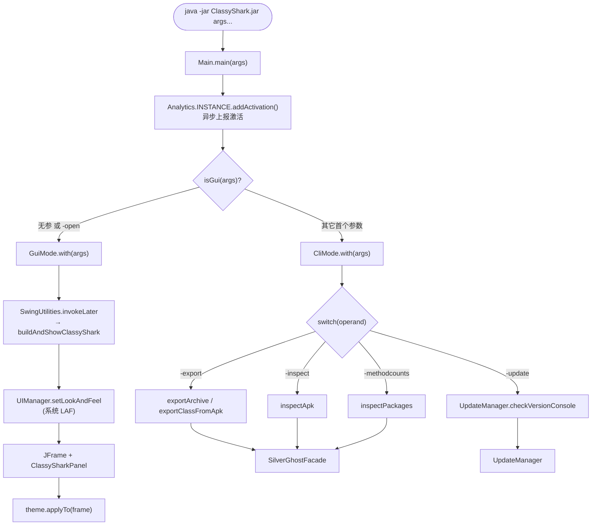
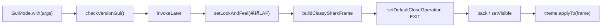

# 🚪 入口层架构

<Badge type="tip" text="架构" /> <Badge type="info" text="入口层" />

> 入口层是 ClassyShark 的"门卫"：[`Main`](/reference/modules/Main) 解析命令行参数，把控制流分发给 GUI、CLI 或 Shark API 三条路径，并统一上报激活事件。

## 整体分发流程



入口层只做**分发**，真正的解析与翻译都在 [SilverGhostFacade](/reference/modules/SilverGhostFacade) 之下的 silverghost 层完成。

## Main：驱动类

[`Main`](/reference/modules/Main) 是 jar 的 `Main-Class`，私有无参构造，仅暴露 `main`。它做三件事：

| 步骤 | 代码 | 作用 |
|------|------|------|
| 1️⃣ 转列表 | `Arrays.asList(args)` | 把 `String[]` 转成 `List<String>` 便于按索引取参 |
| 2️⃣ 上报 | `Analytics.INSTANCE.addActivation()` | 异步发一次 Google Analytics 激活事件 |
| 3️⃣ 分发 | `isGui(args) ? GuiMode.with : CliMode.with` | 二选一路由 |

`isGui` 判定极简：参数为空 **或** 首参等于 `-open`（忽略大小写）即走 GUI，否则走 CLI。

```java
private static boolean isGui(List<String> argsAsArray) {
    return argsAsArray.isEmpty()
        || argsAsArray.get(0).equalsIgnoreCase("-open");
}
```

> 💡 `-open` 之后即便带归档路径仍走 GUI——`GuiMode` 会读取第二个参数作为初始文件。Shark API 不经 `Main`：它由构建工具链直接 `Shark.with(file)` 调用，是独立的库入口。

## CliMode：命令分发

[`CliMode`](/reference/modules/CliMode) 接到非 GUI 参数后做参数校验，再按首参 `operand`（`.toLowerCase()`）走 `switch`：

| 分支 | 委托目标 | 参数约定 |
|------|----------|----------|
| `-export` | `SilverGhostFacade.exportArchive` / `exportClassFromApk` | 2 参导出整包，3 参导出指定类 |
| `-inspect` | `SilverGhostFacade.inspectApk` | 打印 APK 分析仪表盘 |
| `-methodcounts` | `SilverGhostFacade.inspectPackages` | 按包统计方法数，支持 `-flat` |
| `-update` | `UpdateManager.getInstance().checkVersionConsole()` | 自更新，第二参仅占位 |
| `default` | 打印 `ERROR_MESSAGE` | 未知 operand |

校验顺序很关键，先校验**数量**再校验**文件存在性**：

```java
if (args.size() < 2) { /* missing args */ return; }
File archiveFile = new File(args.get(1));
if (!archiveFile.exists()) { /* File doesn't exist */ return; }
```

> ⚠️ 因要求 `args.size() >= 2`，`-update` 也需第二个参数占位（可传任意路径，但该路径必须**真实存在**才会进入 switch）。详见 [CLI 参考](/cli/index) 与 [退出码](/cli/exit-codes)。

## GuiMode：Swing 窗口构建

[`GuiMode`](/reference/modules/GuiMode) 把窗口构建包进 EDT（事件分发线程），保证 Swing 线程安全：

1. **版本检查** — `UpdateManager.getInstance().checkVersionGui()` 后台探测新版。
2. **切到 EDT** — `SwingUtilities.invokeLater` → `buildAndShowClassyShark`。
3. **设系统 LAF** — `UIManager.setLookAndFeel(getSystemLookAndFeelClassName())`，让浅色主题透出原生观感。
4. **建窗** — `buildClassySharkFrame` 按参数数量选择 `ClassySharkPanel` 构造器（0/2/3 参三种）。
5. **应用主题** — `theme.applyTo(frame)`，对深色主题会覆盖所有组件 UI。



主题对象在类加载期取得：`private static Theme theme = ThemeManager.getCurrentTheme()`，深色（`DarkTheme`，默认）覆盖全部 Swing 组件，浅色让系统 LAF 透出——这是刻意的非对称设计。详见 [GUI 主题](/gui/themes) 与 [Theme 模块](/reference/modules/Theme)。

## Shark：库 facade

[`Shark`](/reference/modules/Shark) 是给构建/CI 工具链用的编程入口，不经 `Main`，直接 `Shark.with(file)` 拿到 facade：

| API | 委托 | 用途 |
|-----|------|------|
| `with(File)` | `new Shark(file)` | 工厂入口，存归档 |
| `getGeneratedClass(name)` | `SilverGhostFacade.getGeneratedClassString` | 生成类源码存根 |
| `getAllClassNames()` | `SilverGhostFacade.getAllClassNames` | 全部类名 |
| `getManifest()` | `SilverGhostFacade.getManifest` | AndroidManifest 文本 |
| `getAllMethods()` | `SilverGhostFacade.getAllMethods` | 全部方法签名 |
| `getAllStrings()` | `SilverGhostFacade.getAllStrings` | 全部字符串表 |
| `isMultiDex()` / `isCustomMultiDex()` | 同名委托 | 多 dex 判定 |

Shark 自身不持有解析逻辑，全部委托 [SilverGhostFacade](/reference/modules/SilverGhostFacade)，与 CLI 路径共用同一套 silverghost 能力——这是保证 GUI/CLI/API 三入口行为一致的关键。

## Analytics：激活上报

[`Analytics`](/reference/modules/Analytics) 是单例枚举（`enum Analytics { INSTANCE; }`），`Main` 在分发前调一次 `addActivation()`：用 `JGoogleAnalyticsTracker` 把 `ClassyShark-Activation` / 版本号 / `UA-91889970-1` 异步发往 Google Analytics。`trackAsynchronously` 不阻塞主线程，失败静默——不影响任何后续分发。

## 设计要点

- 🎯 **单一分发点** — `Main` 是唯一 `main`，便于打包与单一入口。
- 🧱 **薄入口 / 厚下层** — 入口层只路由与校验，解析翻译集中在 silverghost。
- 🔁 **三入口共用 facade** — CLI 与 Shark 都委托 `SilverGhostFacade`，行为天然一致。
- 🧵 **EDT 隔离** — 所有 Swing 构建包进 `invokeLater`，避免线程违规。
- 📊 **非阻塞上报** — Analytics 异步、静默，零运行时开销。

## 进一步阅读

- 🧩 [Main 模块](/reference/modules/Main) · [CliMode](/reference/modules/CliMode) · [GuiMode](/reference/modules/GuiMode) · [Shark](/reference/modules/Shark) · [Analytics](/reference/modules/Analytics)
- 🏗️ [架构总览](/guide/architecture-overview) · [SilverGhostFacade](/reference/modules/SilverGhostFacade)
- 🖥️ [GUI 参考](/gui/index) · 🛠️ [CLI 参考](/cli/index)
