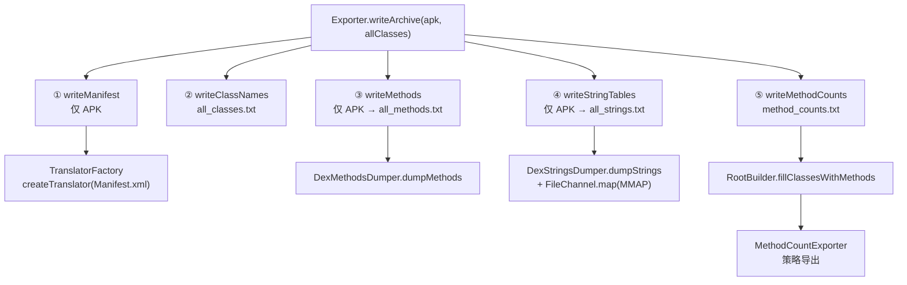

# 📤 Exporter 架构

<Badge type="tip" text="架构" /> <Badge type="info" text="导出器" />

> 导出子系统把归档的元数据与内容拆写成一组文本文件。[`Exporter`](/reference/modules/Exporter) 是纯静态工具门面，`writeArchive` 串联 manifest、类名表、方法表、字符串表、方法计数树五个步骤，只对 APK 的步骤用 `endsWith(".apk")` 守卫。

## 五步导出流水线



`writeArchive` 的六个方法全部 `static`，构造器私有——没有任何实例状态，调用一次即出全部产物。

## 各步骤输出与守卫

| 步骤 | 方法 | 仅 APK？ | 产物 | 底层 |
|------|------|:-------:|------|------|
| ① Manifest | `writeManifest` | ✅ | `<getClassName>_dump` | `TranslatorFactory` 翻译 `AndroidManifest.xml` |
| ② 类名 | `writeClassNames` | — | `all_classes.txt` | `FileWriter` 逐行写 |
| ③ 方法 | `writeMethods` | ✅ | `all_methods.txt` | `DexMethodsDumper.dumpMethods` |
| ④ 字符串 | `writeStringTables` | ✅ | `all_strings.txt` | `DexStringsDumper` + mmap |
| ⑤ 方法计数 | `writeMethodCounts` | — | `method_counts.txt` | `RootBuilder` + `TreeMethodCountExporter` |

> 🔒 **APK 守卫**：`writeMethods` / `writeStringTables` / `writeManifest` 都以 `if (!archiveFile.getName().endsWith(".apk")) return;` 开头，对 dex/jar 等归档静默跳过——导出方法表与字符串表在技术上依赖 dexlib2，只对 DEX 内容有意义。

## writeMethodCounts 与策略接口

`writeMethodCounts` 先构建树，再经策略接口渲染，输出到了 stdout（先打一行文件路径）与文件：

```java
RootBuilder rootBuilder = new RootBuilder();
ClassNode classNode = rootBuilder.fillClassesWithMethods(archive);
MethodCountExporter exporter = new TreeMethodCountExporter(pw);
exporter.exportMethodCounts(classNode);
```

[`RootBuilder`](/reference/modules/RootBuilder) 按后缀分发解析（aar/jar/dex/apk），产出一棵按包聚合的 `ClassNode` 树。[`MethodCountExporter`](/reference/modules/MethodCountExporter) 是仅含 `exportMethodCounts(ClassNode)` 的单方法策略接口，两个实现可互换：

| 实现 | 输出形态 | 实现要点 |
|------|---------|---------|
| [`TreeMethodCountExporter`](/reference/modules/TreeMethodCountExporter) | 树形 | 递归 `printNode`，以 `╚/╠/║/═`（`╚`/`╠`/`║`/`═`）画树线，输出 `key - count` |
| [`FlatMethodCountExporter`](/reference/modules/FlatMethodCountExporter) | 扁平 | 递归时把父级 key 拼进 `String[] path`，以 `.` 连接成包路径 |

> 💡 策略模式让"方法数产出形态"成为可替换维度：CLI 用 `-methodcounts [-flat]` 时（见 [CLI 方法计数](/cli/methodcounts)），GUI 的 [MethodsCountPanel](/reference/modules/MethodsCountPanel) 也可以用同一棵树喂 `RingChart`。见 [方法计数子系统](/reference/architecture/methodscounter)。

## writeStringTables：mmap 写大字符串表

`writeStringTables` 委托 `writeListStringsChannel`，用 NIO 内存映射一次写入：

```java
byte[] buffer = ("                                                     " + "  \n").getBytes();
FileChannel rwChannel = new RandomAccessFile(to, "rw").getChannel();
ByteBuffer wrBuf = rwChannel.map(MapMode.READ_WRITE, 0,
        allStrings.size() * buffer.length);
for (int i = 0; i < allStrings.size(); i++) {
    wrBuf.put(allStrings.get(i).getBytes());
}
rwChannel.close();
```

::: warning mmap 的三处坑
1. **定长估算** — 映射长度按"固定空白行模板 `buffer.length` × 字符串数量"推算，超长字符串会写穿 `allStrings.size()` 行后的地址。
2. **异常静默** — `catch (IOException ioe) {}` 空块吞掉失败，文件可能半截却无告警。
3. **零填充** — 实际内容短于模板时按 `0` 字节填充，落盘仍占满映射区。
:::

## 设计要点

- 📦 **纯静态门面** — 私有构造 + 全 `static` 方法，`writeArchive` 是唯一编排入口，调用方零状态。
- 🧱 **策略注入** — 计数渲染走 `MethodCountExporter` 接口，树形/扁平可互换，渲染与解析解耦。
- 🛡️ **APK 专属守卫** — 依赖 dex 内容的步骤全部按扩展名短路，非 APK 静默跳过。
- ⚡ **针对性优化** — 普通列表用 `FileWriter` 逐行写，大字符串表单独走 mmap，按规模选择 IO 策略。

## 进一步阅读

- 🧩 [Exporter](/reference/modules/Exporter) · [MethodCountExporter](/reference/modules/MethodCountExporter) · [TreeMethodCountExporter](/reference/modules/TreeMethodCountExporter) · [FlatMethodCountExporter](/reference/modules/FlatMethodCountExporter) · [RootBuilder](/reference/modules/RootBuilder)
- 🛠️ [CLI 导出](/cli/export) · [CLI 方法计数](/cli/methodcounts) · [导出数据教程](/tutorials/export-data)
- 🏗️ [架构总览](/guide/architecture-overview) · [方法计数子系统](/reference/architecture/methodscounter)