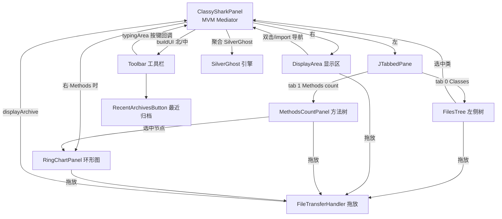

# 🖥️ GUI 层架构

<Badge type="tip" text="架构" /> <Badge type="info" text="GUI 层" />

> ClassyShark 的桌面端是一个 Swing 应用，核心是 MVM（Model-View-**Mediator**）模式：[`ClassySharkPanel`](/reference/modules/ClassySharkPanel) 同时扮演 `ToolbarController`、`ViewerController`、`KeyListener` 三个角色，把所有子组件串成一张交互网，重活全部丢给 `SwingWorker` 以不阻塞 EDT。

## 组件关系



`ClassySharkPanel` 与 `SilverGhost` 的 M-V 关系：GUI 提问（选中类、按键过滤、导出），引擎回给 `List<Translator.ELEMENT>` 或类名列表，UI 只负责渲染。

## ClassySharkPanel：中介者

[`ClassySharkPanel`](/reference/modules/ClassySharkPanel) 继承 `JPanel` 并**同时实现**三个接口：

| 接口 | 扮演 | 典型回调 |
|------|------|----------|
| `ToolbarController` | 工具栏动作的目标 | `openArchive` / `onGoBackPressed` / `onExportButtonPressed` / `onSettingsButtonPressed` / `onChangeLeftPaneVisibility` |
| `ViewerController` | 显示区/树的导航入口 | `onSelectedClassName` / `onSelectedImportFromMouseClick` / `onSelectedTypeClassFromMouseClick` / `onSelectedMethodCount` |
| `KeyListener` | 全局打字过滤 | `keyPressed` 驱动 `fillDisplayArea` 增量过滤 |

构造函数三个重载（`0/2/3` 参）对应 [入参场景](/gui/index)：三参带初始类名、两参仅归档、零参空白启动。类体内直接组合所有子面板：

```java
// buildUI 的骨架 —— BorderLayout：北=Toolbar，中=JSplitPane
toolbar        = new Toolbar(this);                    // 北
jTabbedPane    = new JTabbedPane();                    // 左：Classes + Methods count 两标签
filesTree      = new FilesTree(this);                  // tab 0
methodsCountPanel = new MethodsCountPanel(this);       // tab 1
displayArea    = new DisplayArea(this);                // 右默认
ringChartPanel = new RingChartPanel(this);             // 切到 tab 1 时换到右侧
jSplitPane     = new JSplitPane(HORIZONTAL_SPLIT, jTabbedPane, rightScrollPane);
add(toolbar, BorderLayout.NORTH);
add(jSplitPane, BorderLayout.CENTER);
```

`JTabbedPane` 换页监听的关键副作用：切到 **Methods count** 时右侧从 `rightScrollPane`（显示区）换成 `ringChartPanel`（环形图），并记住 divider 位置。

## 左区一：FilesTree

[`FilesTree`](/reference/modules/FilesTree) 是三态树的实现者：

- 按归档类型建树——`.apk/.dex/.aar` 走 Android 分支（`classes` + `res` + `libs`），其余走 class 分支（按包聚合）。
- 节点用 [`NodeInfo`](/reference/modules/NodeInfo) 包邮箱名（去扩展名、去重复段），再配 [`CellRenderer`](/reference/modules/CellRenderer) 渲染图标与颜色。
- 隐掉 root，单击 `.dex/.jar/.apk/.so` 或叶子节点即回调 `ViewerController.onSelectedClassName`。
- 设置 `DragEnabled(true)` + [`FileTransferHandler`](/reference/modules/FileTransferHandler) 支持 OS 级拖入归档。

## 左区二：MethodsCountPanel

[`MethodsCountPanel`](/reference/modules/MethodsCountPanel) 方法计数树：

- `loadFile` 启动内部 `NodeWorker`（`SwingWorker`）后台用 `RootBuilder.fillClassesWithMethods(file)` 算好 `ClassNode` 树。
- `done()` 里把 `ClassNode` 树映射为 `DefaultMutableTreeNode` 树挂进 `JTree`，并回调 `onSelectedMethodCount`。
- 选中节点 → `ClassySharkPanel.onSelectedMethodCount` → [`RingChartPanel.setRootNode`](/reference/modules/RingChartPanel) 重绘。

## 右区：DisplayArea

[`DisplayArea`](/reference/modules/DisplayArea) 是只读 `JTextPane` 上的"五状态渲染器"，内部 `DisplayDataState` 枚举记录 `SHARKEY / CLASSES_LIST / INSIDE_CLASS / ERROR`：

| 状态 | 展示内容 | 触发 |
|------|----------|------|
| `SHARKEY` | 启动 Doodle 吉祥物 | 空启动 |
| `CLASSES_LIST` | 过滤后的类名列表（小端高亮、上限 50 → `BatchDocument`） | 打字过滤 |
| `INSIDE_CLASS` | `Translator.ELEMENT` 流按 `TAG` 上色 | 选中类 |
| `ERROR` | 错误提示 + Doodle | 归档解析失败 |

语法高亮的关键在 [对 `ELEMENT.tag → theme.getXxxColor()` 的 switch](/guide/architecture-overview)：`MODIFIER→KEYWORDS`、`IDENTIFIER→IDENTIFIERS`、`ANNOTATION→ANNOTATIONS`、`SELECTION→SELECTION_BG`……这是翻译层到展示层的统一契约。双击导航由 `MouseAdapter` 实现（行首 import → `onSelectedImportFromMouseClick`，词 → `onSelectedTypeClassFromMouseClick`）。

## 北区：Toolbar 全家

[`Toolbar`](/reference/modules/Toolbar) 是 `JToolBar`：图标按钮 + 中央 `JTextField` 打字区。

| 按钮 | 图标来源 | 动作 |
|------|----------|------|
| 左树显隐 | `getToggleIcon` | `onChangeLeftPaneVisibility` |
| Open | `getOpenIcon` | `openArchive`（`JFileChooser` + 记住当前目录/最近归档） |
| Back | `getBackIcon` | `onGoBackPressed`（回类名列表） |
| Forward | `getForwardIcon` | `onViewTopClassPressed` |
| 打字区 | — | 按键直接驱动过滤 |
| Mappings | `getMappingIcon` | `onMappingsButtonPressed`（读 ProGuard mapping） |
| Export | `getExportIcon` | 后台 `SwingWorker` 导出当前类 + 整包 |
| 最近归档 | `getRecentIcon` | [`RecentArchivesButton`](/reference/modules/RecentArchivesButton) |
| Settings | `getSettingsIcon` | `onSettingsButtonPressed` → [`SettingsFrame`](/reference/modules/SettingsFrame) |

[`RecentArchivesButton`](/reference/modules/RecentArchivesButton) 用 `JPopupMenu` 列出 `RecentArchivesConfig.INSTANCE` 的归档历史，点击即 `displayArchive`，另有 "Clear" 清空入口。

## 拖放：FileTransferHandler

[`FileTransferHandler`](/reference/modules/FileTransferHandler) 继承 `TransferHandler`，被 `JTree`、`JTextPane`、`MethodsCountPanel`、`RingChartPanel` 共享：

1. `canImport` 只接受 `javaFileListFlavor`（文件列表）。
2. `importData` 逐个校验 `FileChooserUtils.isSupportedArchiveFile`。
3. 通过则更新 `CurrentFolderConfig` + 登记 `RecentArchivesConfig`，最后 `archiveDisplayer.displayArchive(file)` 交给中介者开闸。

## SwingWorker：EDT 保护

所有重活都在 `SwingWorker` 的 `doInBackground` 中跑，UI 更新放 `done()`：

| 场景 | 后台任务 | 完成后 |
|------|----------|--------|
| 打开归档 | `silverGhost.readContents()` | 填充 `FilesTree`、显示 Sharkey/错误 |
| 打字过滤 | `silverGhost.filter` / `translateArchiveElement` | `displayArea.displayClass/searchResults` |
| 导出 | `Exporter.writeCurrentClass/writeArchive` | 空 `done()` |
| 读 mapping | `silverGhost.readMappingFile` | `addMappings` |
| 方法计数 | `RootBuilder.fillClassesWithMethods` | 挂树 + 环形图回调 |

> 📌 这层及时响应性是本体感关键：解析大 APK 时窗口不冻结。`GesturePanel` 与 [Agent GUI 控制](/api/agent) 的 `GuiBridge` 也挂在 `ClassySharkPanel` 上（`agentOpenArchive`、`agentNavigateTo` 等统一 `invokeLater` 入 EDT）。

## 设计要点

- 🧭 **单一中介者** — 一个 `ClassySharkPanel` 包揽三个接口，组件间零直接耦合，全部过中介者的回调。
- 🧵 **EDT 纪律** — 读与译永不进 UI 线程，`SwingWorker` 双层割裂"后台算/前台画"。
- 🔗 **契约式的展示** — 翻译层只交 `ELEMENT` 流，展示层按 `TAG` 上色，两层面彻底解耦。
- 🧲 **全平台拖放** — 一个 `TransferHandler` 被四处复用，开档统一收口到 `displayArchive`。

## 进一步阅读

- 🧩 [ClassySharkPanel](/reference/modules/ClassySharkPanel) · [FilesTree](/reference/modules/FilesTree) · [MethodsCountPanel](/reference/modules/MethodsCountPanel) · [DisplayArea](/reference/modules/DisplayArea) · [RingChartPanel](/reference/modules/RingChartPanel) · [Toolbar](/reference/modules/Toolbar) · [FileTransferHandler](/reference/modules/FileTransferHandler) · [RecentArchivesButton](/reference/modules/RecentArchivesButton)
- 🖥️ [GUI 参考](/gui/panels) · [GUI 主页](/gui/index) · 🎨 [GUI 主题](/gui/themes)
- 🏗️ [架构总览](/guide/architecture-overview) · [入口层架构](/reference/architecture/entry-layer) · [Theme 架构](/reference/architecture/theme)