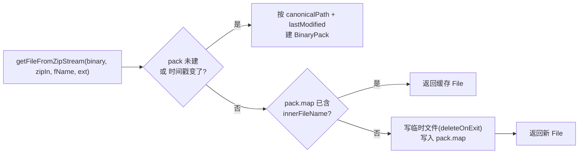

# ⚙️ IO 层架构

<Badge type="tip" text="架构" /> <Badge type="info" text="IO 层" />

> IO 层负责**从归档里取字节**：`ContentReader.load` 做类名列表缓存，`SherlockHash` 做 zip 条目提取缓存，`ClassBytesFromJarExtractor` 从 jar 里抽取单个 class 的字节。三者是 silverghost 层最底部的数据供给方。

## 职责划分

| 组件 | 输入 → 输出 | 缓存 |
|------|------------|------|
| [`ContentReader.load`](/reference/modules/ContentReader) | `File` → 类名列表 + 组件列表 | 一次性：`allClassNames.isEmpty()` 判空，读后只读返回 |
| [`SherlockHash`](/reference/modules/SherlockHash) | `(二进制, ZipInputStream, 内部名) → File` | **提取缓存**：按归档路径 + `lastModified` 时间戳分桶，同名条目二次取直接返回 |
| [`ClassBytesFromJarExtractor`](/reference/modules/ClassBytesFromJarExtractor) | `(类全名, jar路径) → byte[]` | 无：每次全量遍历 jar 条目 |
| [`IOUtils`](/reference/modules/IOUtils) | 通用流/字节工具 | 视调用方 |

## SherlockHash：按注解驱动的提取缓存

[`SherlockHash`](/reference/modules/SherlockHash) 是单例枚举（`enum SherlockHash { INSTANCE; }`），`Extractor` 系列按 `@SherlockHash(...)` 注解生成 key 或直接调用 `getFileFromZipStream`：

要点：
- **失效策略**是 zip 包级的 `lastModified`，而非单条目级——整个归档一改，内部缓存全失效。
- 临时文件 `deleteOnExit`，进程退出自动清理。
- 同一归档 + 时间戳 + 条目名 → 永远命中同一对象，避免重复解压。

## ContentReader.load：类名列表缓存

[`ContentReader`](/reference/modules/ContentReader) 是"`(二进制文件) → {类名, 组件}`"的函数。`load()` 只在 `allClassNames` 为空时真正读盘，之后 `getAllClassNames()` 返回 `Collections.unmodifiableList`——**每实例只读一次**，外层 [SilverGhost](/reference/architecture/silverghost) 复用同一实例复用结果。

## ClassBytesFromJarExtractor：单类字节抽取

[`ClassBytesFromJarExtractor.getBytes(fullClassName, jar)`](/reference/modules/ClassBytesFromJarExtractor) 打开 `JarFile`，遍历 `.class` 条目，把 `/` 替换成 `.` 后与全名做 `equalsIgnoreCase` 匹配，命中即整读输入流为 `byte[]`；无命中抛 `IOException("File not found")`。无缓存、逐次全扫——是 IO 层中最"重"的一环，被 `ClassFileRecord`/ZXing 辅助分析路径使用。

## 设计要点

- 📦 **分层缓存** — 类名列表（ContentReader 实例级）与文件提取（SherlockHash 归档级）两级，读一次顶一次。
- 🧊 **不可变暴露** — 类名列表只读返回，杜绝外层误改。
- 🧹 **自动清理** — 提取出的临时文件注册 `deleteOnExit`，不留残留。

## 进一步阅读

- 📄 [ContentReader](/reference/modules/ContentReader) · [SherlockHash](/reference/modules/SherlockHash) · [ClassBytesFromJarExtractor](/reference/modules/ClassBytesFromJarExtractor) · [IOUtils](/reference/modules/IOUtils)
- 🏗️ [内容读取子系统](/reference/architecture/content-reader) · [SilverGhost 编排](/reference/architecture/silverghost)