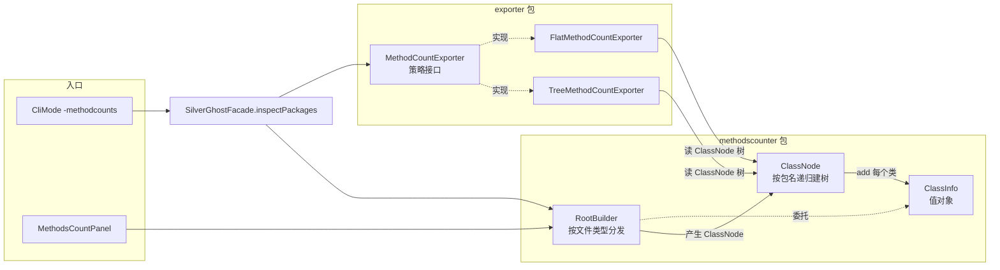
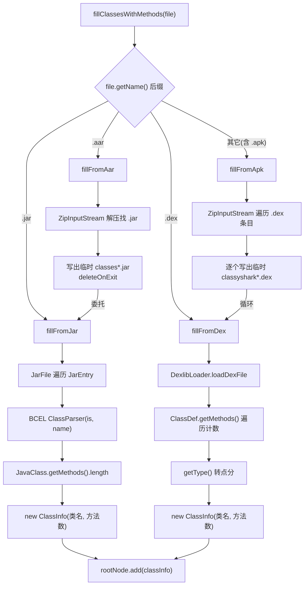
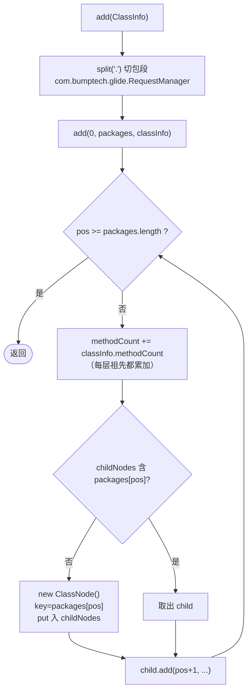
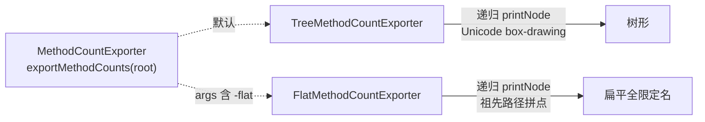

# 🌳 MethodsCounter 架构

<Badge type="tip" text="架构" /> <Badge type="info" text="方法数按包聚合" />

> MethodsCounter 是 ClassyShark 的方法数统计子系统：把任意归档（`.aar/.jar/.dex/.apk`）里的每个类的方法数读出来，按包名递归聚合成一棵多叉树，再以树形或扁平两种策略输出。是 [`-methodcounts`](/cli/methodcounts) 命令与 GUI [`MethodsCountPanel`](/reference/modules/MethodsCountPanel) 的共同后端。

## 🧩 组件全景



入口 [`SilverGhostFacade.inspectPackages(args)`](/reference/modules/SilverGhostFacade) 构造 [`RootBuilder`](/reference/modules/RootBuilder) 与一个 exporter，前者建树、后者遍历输出。

## 🔀 RootBuilder：按文件类型分发

[`RootBuilder`](/reference/modules/RootBuilder).`fillClassesWithMethods(File)` 用文件名后缀分发到四条解析路径，统一产出一棵以文件名为根的 [`ClassNode`](/reference/modules/ClassNode)：



| 扩展名 | 方法 | 解析库 | 方法计数来源 | 委托关系 |
|--------|------|--------|--------------|----------|
| `.aar` | `fillFromAar` | 先解 zip 取内嵌 `.jar` | BCEL | 委托给 `fillFromJar` |
| `.jar` | `fillFromJar` | Apache BCEL `ClassParser` | `JavaClass.getMethods().length` | 终点 |
| `.dex` | `fillFromDex` | dexlib2（`DexlibLoader.loadDexFile`） | 遍历 `ClassDef.getMethods()` 计数 | 终点 |
| `.apk` | `fillFromApk` | Zip 流遍历每个 `.dex` | dexlib2 | 循环委托给 `fillFromDex` |

> 📦 **APK 多 dex 处理**：`fillFromApk` 用 `ZipInputStream` 逐条找 `.dex`，每个写出临时文件（`File.createTempFile("classyshark","dex")` + `deleteOnExit()`）并打印 `Parsing <name>`，全部喂给 `fillFromDex(file, rootNode)` 共享同一根。多 dex 的方法数因此汇总到一棵树。
>
> 📦 **AAR 内嵌 jar 委托**：`fillFromAar` 同样解压取首个 `.jar` 条目写出临时文件，再 `return fillFromJar(tempFile)`——AAR 复用 JAR 的 BCEL 路径。
>
> ⚠️ 分发只看后缀字符串，`else` 分支兜底走 `fillFromApk`，故未识别扩展名会被当 APK 解 zip。

## 🌲 ClassNode：按包名点分递归建树

[`ClassNode`](/reference/modules/ClassNode) 是多叉树节点，持有 `Map<String,ClassNode> childNodes`、`String key`、`int methodCount`。建树逻辑核心是 `add`：



关键性质：

1. **切段建树**：`com.bumptech.glide.RequestManager` 切成 `[com, bumptech, glide, RequestManager]`，逐段造子节点。
2. **逐层累加**：`methodCount = methodCount + classInfo.getMethodCount()` 在每一层都执行——因此**父包方法数 = 其下所有类方法数之和**（同一类的方法数被加到全部祖先）。
3. **末端是类**：[`ClassInfo`](/reference/modules/ClassInfo).`packageName` 实际存全限定类名（jar 用 `jc.getClassName()`，dex 用 `o.getType()` 去斜杠与首尾字符转点分），切段后最后一段即类名。
4. 根节点 `key` = 文件名，`methodCount` = 全量方法数。

### ClassInfo 值对象

[`ClassInfo`](/reference/modules/ClassInfo) 是不可变值对象，仅两个字段：

```java
public ClassInfo(String packageName, int methodCount)
public String getPackageName()   // 实为全限定类名
public int getMethodCount()
```

> 📝 它是 RootBuilder 与 ClassNode 之间的数据载体——解析层负责填充，[`ClassNode`](/reference/modules/ClassNode) 负责消费建树，二者解耦。

## 📤 MethodCountExporter：输出策略

输出走策略模式，接口 [`MethodCountExporter`](/reference/modules/MethodCountExporter) 只一个方法 `exportMethodCounts(ClassNode rootNode)`，两个实现共享同一棵已建好的树：



| 策略 | 类 | 遍历方式 | 行格式 | 适用 |
|------|----|----------|--------|------|
| 树形 | [`TreeMethodCountExporter`](/reference/modules/TreeMethodCountExporter) | DFS + `boolean[] isFinalLevel` 维护分支符号 | `╠ key - n` / `╚ key - n` | 人读 |
| 扁平 | [`FlatMethodCountExporter`](/reference/modules/FlatMethodCountExporter) | DFS + `String[] path` 维护祖先路径 | `app.apk.com.pkg - n` | 管道 `grep`/`sort` |

> 🔧 两者都把 `PrintWriter` 注入构造函数，`SilverGhostFacade` 传 `new PrintWriter(System.out)`，故输出即标准输出。`inspectPackages` 默认选 Tree；若 `args.size() > 2` 扫描后续参数遇 `-flat` 切换 Flat（后写者覆盖）。

## 🧪 数据流示例

输入 `app.apk` 含类 `com.example.ui.MainActivity`（440 方法）、`androidx.core.AppCompat`（1111 方法）：

```
RootBuilder.fillFromApk
  → 解出 classes.dex 临时文件
  → fillFromDex: DexlibLoader.loadDexFile
  → 遍历 ClassDef，ClassDef.getMethods() 计数 440 / 1111
  → ClassInfo("com.example.ui.MainActivity", 440) → rootNode.add
  → ClassInfo("androidx.core.AppCompat", 1111)    → rootNode.add
↓
ClassNode 树:
  app.apk(1551)
    com(440)
      example(440)
        ui(440)
          MainActivity(440)
    androidx(1111)
      core(1111)
        AppCompat(1111)
↓
TreeMethodCountExporter → app.apk - 1551 ...
FlatMethodCountExporter → app.apk.com.example.ui.MainActivity - 440 ...
```

## 🔗 相关链接

- 构建与聚合：[`RootBuilder`](/reference/modules/RootBuilder) · [`ClassNode`](/reference/modules/ClassNode) · [`ClassInfo`](/reference/modules/ClassInfo)
- 输出策略：[`MethodCountExporter`](/reference/modules/MethodCountExporter) · [`TreeMethodCountExporter`](/reference/modules/TreeMethodCountExporter) · [`FlatMethodCountExporter`](/reference/modules/FlatMethodCountExporter)
- 入口与调用方：[`SilverGhostFacade`](/reference/modules/SilverGhostFacade) · [`CliMode`](/reference/modules/CliMode) · [`MethodsCountPanel`](/reference/modules/MethodsCountPanel)
- CLI 命令：[`-methodcounts`](/cli/methodcounts)
