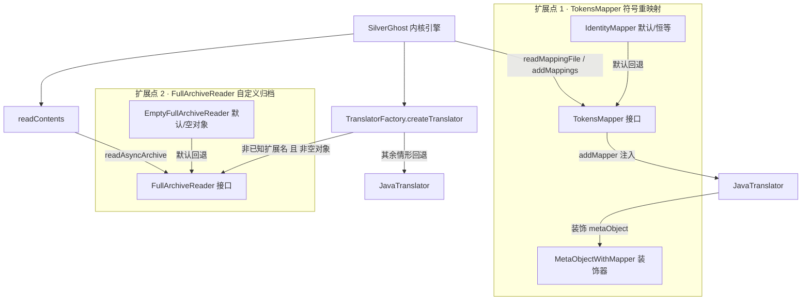

# 🔌 Plugins SPI · 扩展点架构

<Badge type="tip" text="架构" /> <Badge type="info" text="Plugins SPI" />

> ClassyShark 的内核（silverghost）不是封闭的：它通过 `TokensMapper`（符号重映射）与 `FullArchiveReader`（自定义归档读取）两个接口对外开槽。默认实现满足"零插件也能跑"，真正的插件只需实现这两个接口再注入 [SilverGhost](/reference/modules/SilverGhost)。

## 两个扩展点的总览



> ✅ 设计取向：**两个扩展点都有"标品"**——[`IdentityMapper`](/reference/modules/IdentityMapper) 恒等映射、[`EmptyFullArchiveReader`](/reference/modules/EmptyFullArchiveReader) 空操作（Null Object 模式），因此默认构建完全可运行，插件是纯增量。

## 扩展点 1：TokensMapper

[`TokensMapper`](/reference/modules/TokensMapper) 负责**把混淆名还原成原始名**（反混淆），接口只有两个方法：

| 方法 | 返回 | 语义 |
|------|------|------|
| `readMappings(File file)` | `TokensMapper` | 解析 ProGuard mapping 文件，构建**混淆名 → 原始名**表，返回 `this`（链式） |
| `getReverseClasses()` | `Map<String,String>` | 暴露反向映射表 |

`IdentityMapper` 是默认实现：`getReverseClasses()` 返回一个空 `TreeMap`，`readMappings` 直接返回 `this`——不存在映射时恒等，即不重写任何名字。

### 注入链路

`SilverGhost` 在 `static {}` 块默认 `tokensMapper = new IdentityMapper()`，每次 `setBinaryArchive` 还会重置回 `IdentityMapper`。接入点如下：

1. GUI 层点映射按钮 → [`SilverGhost.readMappingFile`](/reference/modules/SilverGhost) 解析 mapping 文件、`addMappings` 换入新 mapper。
2. `translateArchiveElement` 在构造 translator 后调用 `translator.addMapper(tokensMapper)`。
3. [JavaTranslator](/reference/modules/JavaTranslator) 的 `addMapper` 用 [`MetaObjectWithMapper`](/reference/modules/MetaObjectWithMapper) **装饰**当前 `metaObject`。
4. 此后所有取名操作（`getName()` 等）都先查反查表，命中就返回原始名——即翻译结果的类名、引用处全部被还原。

```java
// JavaTranslator.addMapper —— 装饰而非继承
public void addMapper(TokensMapper reverseMappings) {
    this.metaObject = new MetaObjectWithMapper(this.metaObject, reverseMappings);
}
```

```java
// MetaObjectWithMapper.getName() —— 核心反混淆逻辑
public String getName() {
    if (reverseMappingClasses == null) { reverseMappingClasses = new TreeMap<>(); }
    if (reverseMappingClasses.containsKey(metaObject.getName())) {
        return reverseMappingClasses.get(metaObject.getName()); // 混淆名 → 原始名
    }
    return metaObject.getName();
}
```

> 🔗 编程用法见 [TokensMapper SPI API](/api/tokensmapper) 与实战教程 [reverse-proguard](/tutorials/reverse-proguard)。

## 扩展点 2：FullArchiveReader

[`FullArchiveReader`](/reference/modules/FullArchiveReader) 让外部提供"整包读取"能力，也两个方法：

| 方法 | 语义 |
|------|------|
| `readAsyncArchive(File file)` | 在 `readContents()` 阶段被调，异步预读整个归档（可为空实现） |
| `buildTranslator(String className, File archiveFile)` | 按元素类名构造该归档的专属 [`Translator`](/reference/modules/Translator) |

默认 [`EmptyFullArchiveReader`](/reference/modules/EmptyFullArchiveReader) 是典范的 Null Object：`readAsyncArchive` 空操作，`buildTranslator` 返回一个全空 `Translator` 匿名实现（类名 `"Empty"`、空元素列表）。

### TranslatorFactory 的回退规则

[`TranslatorFactory.createTranslator`](/reference/modules/TranslatorFactory) 先按**元素扩展名**硬编码分派 `.xml` / `.dex` / `.jar` / `.apk` / `.so`，只有未命中已知类型时才会考虑自定义 reader：

```java
if (fullArchiveReader != null &&
        !(fullArchiveReader instanceof EmptyFullArchiveReader)) {
    return fullArchiveReader.buildTranslator(className, archiveFile);
}
return new JavaTranslator(className, archiveFile);
```

> ⚠️ 注意 `instanceof EmptyFullArchiveReader` 检查：即便外部显式注入 `EmptyFullArchiveReader`，仍走默认 `JavaTranslator`——空对象被当作"没接插件"处理，保证行为不回退退化。

## 实现自定义插件

两个槽位的骨架，编译进 classpath 后按相应方式注入：

```java
// 骨架 1：自定义符号映射（ProGuard 之外的自定义混淆协议）
public class MyMapper implements TokensMapper {
    private final Map<String, String> reverse = new HashMap<>();
    @Override
    public TokensMapper readMappings(File file) {
        // 解析自己的 mapping 格式，写满 reverse: 混淆名 -> 原始名
        return this;
    }
    @Override
    public Map<String, String> getReverseClasses() { return reverse; }
}

// 骨架 2：自定义归档（如 .jfr 飞书 RPC 契约包）
public class JfrArchiveReader implements FullArchiveReader {
    @Override
    public void readAsyncArchive(File file) { /* 后台预读：索引、缓存 */ }
    @Override
    public Translator buildTranslator(String className, File archiveFile) {
        return new JfrTranslator(className, archiveFile);
    }
}
```

```java
// 注入方式（GUI 中映射按钮已走前一条链；程序化接入如下）
SilverGhost ghost = new SilverGhost();
ghost.setBinaryArchive(new File("contracts.jfr"));
ghost.addMappings(new MyMapper().readMappings(new File("my.map")));
ghost.readContents();       // 内部会调用 fullArchiveReader.readAsyncArchive
ghost.translateArchiveElement("com.example.Api"); // 走自定义构建
```

## 设计要点

- 🎯 **接口极简** — 每个 SPI 只两个方法，实现成本低，插件是纯增量。
- 🧊 **双默认可回退** — `IdentityMapper` 恒等 + `EmptyFullArchiveReader` 空对象，保证无插件可用。
- 🪞 **装饰而非继承** — 反混淆经 `MetaObjectWithMapper` 透明包裹，不动原 `MetaObject` 族。
- 🛡️ **`instanceof` 哨兵** — 工厂显式排除空对象，避免插件槽静默吞掉默认路径。

## 进一步阅读

- 🧩 [TokensMapper](/reference/modules/TokensMapper) · [IdentityMapper](/reference/modules/IdentityMapper) · [FullArchiveReader](/reference/modules/FullArchiveReader) · [EmptyFullArchiveReader](/reference/modules/EmptyFullArchiveReader) · [MetaObjectWithMapper](/reference/modules/MetaObjectWithMapper) · [TranslatorFactory](/reference/modules/TranslatorFactory)
- 🔗 [TokensMapper API](/api/tokensmapper) · [FullArchiveReader API](/api/fullarchivereader)
- 🏗️ [架构总览](/guide/architecture-overview) · 🧪 [Translator](/reference/modules/Translator)